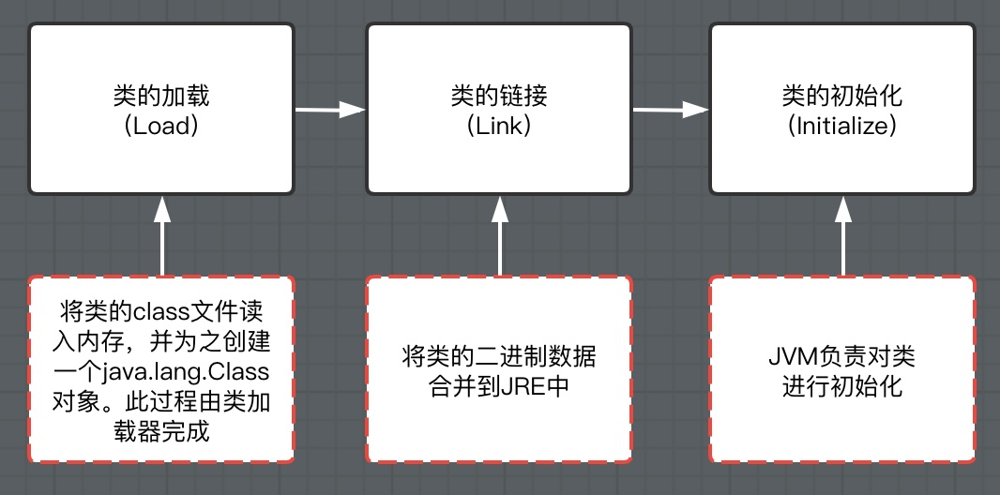

# 注解和反射

## 1. 注解

### 1.1 什么是注解

Annotation是从JDK5.0开始引入的新技术

**Annotation的作用：**

* 不是程序本身，可以对程序作出解释（这一点和注释 (comment) 没有区别）
* **==可以被其他程序（比如：编译器等）读取==**

**Annotation的格式：**

* 注解是以“@注释名”在代码中存在的，还可以添加一些参数值，例如：@SuppressWarning(value="unchecked").

**Annotation在哪里使用：**

* 可以附加在package, class, method, field等上面，相当于给他们添加了额外的辅助信息，我们可以通过反射机制编程实现对这些元数据的访问

### 1.2 内置注解

* **@Override**：定义在java.lang.Override中，此注解只适用于修辞方法，表示一个方法声明打算重写超类中的另一个方法声明
* **@Deprecated**：定义在java.lang.Deprecated中，此注解可以适用于修辞方法，属性，类，表示不鼓励程序员使用这样的元素，通常是因为它很危险或者存在更好的选择，现已被淘汰（很讽刺啊）
* **@SuppressWarnings**：定义在java.lang.SuppressWarning中，用来抑制编译时的警号信息
  * 与前两个注释有所不同，你需要添加一个参数才能正确使用，这些参数都是已经定义好了的，我们选择性使用就好了
  * @SuppressWarnings("all")
  * @SuppressWarnings("unchecked")
  * @SuppressWarnings(value={"unchecked","deprecation"})
  * ...

### 1.3 元注解

* 元注解的作用就是负责注解其他注解，Java定义了4个标准的meta-annotation类型，他们被用来提供对其他annotation类型作说明
* 这些类型和它们所支持的类在java.lang.annotation包中可以找到 (**@Target, @Retention, @Documented, @Inherited**)
  * **@Target**：用于描述注解的使用范围（即：被描述的注解可以用于什么地方）
    * @Target(value={ElementType.METHOD, ElementType.TYPE})
  * **@Retention**：表示需要在什么级别保存该注释信息，用于描述注解的生命周期
    * (SOURCE < CLASS < **RUNTIME**)
    * @Retention(value= RetentionPolicy.RUNTIME)
  * @Documented：说明该注解将被包含在javadoc中
  * @Inherited：说明子类可以**继承**父类中的该注解

### 1.4 自定义注解

* 使用**@interface**自定义注解时，自动继承了java.lang.annotation.Annotation接口
* **分析**：
  * @interface用来声明一个注解，格式：public @interface 注解名 {定义内容}
  * 其中的每一个方法实际上是声明了一个配置函数
  * 方法的名称就是参数的名称
  * 返回值类型就是参数的类型（返回值只能是基本类型，Class, String, enum）
    * 注解的参数 ：参数类型 + 参数名()；
    * 举例：String name(); 
  * 可以通过default来声明参数的默认值
    * 举例：String name() default "";
    * 如果没有默认值，我们就必须给参数赋值
  * 如果只有一个参数成员，一般参数名为value
  * 注解元素必须要有值，我们定义注解元素时，经常使用空字符串，0作为默认值
    * 如果默认值为-1，代表不存在

## 2. 反射

### 2.1 静态语言 vs. 动态语言

##### 动态语言

* 是一类在运行时可以改变其结构的语言：例如新的函数，对象，甚至代码可以被引进，已有的函数可以被删除或事其他结构上的变化。通俗点说就是在运行时代码可以根据某些条件改变自身结构。
* 主要动态语言：Object-C, C#, JavaScript, PHP, Python等

##### 静态语言

* 与动态语言相对应的，运行时结构不可变的语言就是静态语言。如Java, C, C++。
* Java不是动态语言，但Java可以称之为“准动态语言”。即Java有一定的动态性，我们可以利用反射机制获得类似动态语言的特性。Java的动态性让编程的时候更加灵活！

理解静态与动态之别，我们要从变量赋值这个操作为切入点。静态类型语言中，变量的类型必须先声明，即在创建的那一刻就已经确定好变量的类型，而后的使用中，你只能将这一指定类型的数据赋值给变量。如果强行将其他不相干类型的数据赋值给它，就会引发错误。

在静态语言中，一旦声明一个变量是int类型，之后就只能将int类型的数据赋值给它，否则就会引发错误，而动态类型则没有这样的限制，你将什么类型的数据赋值给变量，这个变量就是什么类型

Static typing when possible, dynamic typing when needed。

拓展：

```tex
强类型 VS 弱类型

强弱之分，体现在对类型的检查严格程度上，弱类型语言对于变量类型的检查比较宽松，容忍隐式类型转换这种事情的发生。何为隐式类型转换，一般有两种形式：
1. 相关类型之间隐式转换
2. 不相关类型之隐式间转换
举例子来说，一个int类型的数据与一个float类型的数据相加，最终的结果是一个float类型的数据，这个过程就发生了隐式类型转换，int类型数据首先被转成float类型，然后与另一个float进行操作，这便是相相关类型之间隐式转换。
一个int类型数据与一个字符串类型数据相加，竟然没有发生错误，得到的结果是一个字符串，int类型数据隐式转换为字符串，可他们原本是两个不相干的数据类型，这种就是第二种隐式转换。
在弱类型语言中，变量可以隐式强制转换为不相关类型，而在强类型语言中则不可以。按照这种概念定义来划分，PHP，Perl都属于弱类型语言，其他编程语言，你所常见的，比如java, C, C++, Python皆属于强类型语言。`
```

### 2.2 Java 反射概述

* Reflection (反射) 是Java被视为动态语言的关键，反射机制允许程序在执行期借助于Reflection API取得任何类的内部信息，并能直接操作任意对象的内部属性及方法。

  ```java
  Class c = Class.forName("Java.lang.String")
  ```

* 加载完类之后，在堆内存的方法区中就产生了一个Class类型的对象（一个类只有一个Class对象），这个对象就包含了完整的类的结构信息。我们可以通过这个对象看到类的结构。这个对象就像一面镜子，透过过这个镜子看到类的结构，所以，我们形象的称之为：反射


##### **Java反射机制研究及应用**

Java反射机制提供的功能

* 在运行时判断任意一个对象所属的类
* 在运行时构造任意一个类的对象
* 在运行时判断任意一个类所具有的成员变量和方法
* 在运行时获取泛型信息
* 在运行时调用任意一个对象的成员变量和方法
* 在运行时处理注解
* 生成动态代理
* ......

##### Java反射的优点和缺点

* 优点：
  * 可以实现动态创建对象和编译，体现出很大的灵活性
* 缺点：
  * 对性能有影响。使用反射基本上是一种解释操作，我们可以告诉JVM，我们希望做什么并且让它满足我们的要求。这类操作总是慢于直接执行相同的操作。

##### 反射相关的主要API

* java.lang.Class: 代表一个类
* java.lang.reflect.Method: 代表类的方法
* java.lang,reflect.Field: 代表类的成员变量
* java.lang.reflect.Constructor: 代表类的构造器
* ...

### 2.3 Class类

##### Class类简介

在Object类中定义了以下的方法，此方法将被所有子类继承

``public final Class getClass()``

* 以上的方法返回值的类型是一个Class类，此类是Java反射的源头，实际上所谓反射从程序的运行结果来看也很好理解，即：可以通过对象反射求出类的名称。

对象照镜子后可以得到的信息：某个类的属性，方法和构造器，某个类到底实现了哪些接口。

对于每个类而言，JRE都为其保留一个不变的Class类型的对象。一个Class对象包含了特定某个结构 (class/interface/enum/annotation/primitive type/void/[]) 的有关信息。

* Class本身也是一个类
* Class对象只能由系统建立对象
* 一个加载的类在JVM中只会有一个Class实例
* 一个Class对象对应的是一个加载到JVM中的一个.class文件
* 每个类的实例都会记得自己是由哪个Class实例所生成
* 通过Class可以完整地得到一个类中的所有被加载的结构
* Class类是Reflection的根源，针对任何你想动态加载，运行的类，唯有先获得相应的Class对象。

##### Class类的常用方法

| 方法名                                   | 功能说明                                                    |
| ---------------------------------------- | ----------------------------------------------------------- |
| static ClassForName(String name)         | 返回指定类名name的Class对象                                 |
| Object newInstance()                     | 调用缺省构造函数，返回Class对象的一个实例                   |
| getName()                                | 返回此Class对象所表示的实体（类，接口，数组类或void）的名称 |
| Class getSuperClass()                    | 返回当前Class对象的父类的Class对象                          |
| Class[] getInterfaces()                  | 获取当前CLass对象的接口                                     |
| ClassLoader getClassLoader()             | 返回该类的类加载器                                          |
| Constructor[] getConstructor()           | 返回一个包含某些Constructor对象的数组                       |
| Method getMethod(String name, Class...T) | 返回一个Method对象，此对象的形参类型为paramType             |
| Field[] getDeclaredFields()              | 返回Field对象的一个数组                                     |

##### 获取Class类的实例

* 若已知具体的类，通过类的class属性获取，该方法最为安全可靠，程序性能最高

  ```java
  Class clazz = Person.class;
  ```

* 已知某个类的实例，调用该实力的getClass()方法获取Class对象

  ```java
  Class clazz = person.getClass();
  ```

* 已知一个类的全类名，且该类在类路径下，可通过Class类的静态方法forName()获取，可能抛出ClassNotFoundException

  ```java
  Class clazz = Class.forName("demo01.Student")
  ```

* 内置基本数据类型可以直接用类名.Type

* 还可以利用ClassLoader，之后讲解

##### 哪些类型可以有Class对象？

* class：外部类，成员（成员内部类，静态内部类），局部内部类，匿名内部类
* interface：接口
* []：数组
* enum：枚举
* annotation：注解@interface
* primitive type：基本数据类型
* void

### 2.4 Java内存分析

##### **Java内存：**

* 堆
  * 存放new的对象和数组
  * 可以被所有的线程共享，不会存放别的对象引用
* 栈
  * 存放基本变量类型（会包含这个基本类型的具体数值）
  * 引用对象的变量（会存放这个引用在堆里面的具体地址）
* 方法区
  * 可以被所有线程共享
  * 包含了所有的class和static变量

##### **了解：类的加载过程**

当程序主动使用某个类时，如果该类还未被加载到内存中，则系统会通过如下三个步骤来对该类进行初始化。



##### 类的加载与ClassLoader的理解

* 加载：将class文件字节码内容加载到内存中，并将这些静态数据转换成方法区的运行时数据结构，然后生成一个代表这个类的java.lang.Class对象
* 链接：将Java类的二进制代码合并到JVM的运行状态之中的过程
  * 验证：确保加载的类信息符合JVM规范，没有安全方面的问题
  * 准备：正式为类变量(static)分配内存并设置类变量默认初始值的阶段，这些内存都将在方法区中进行匹配
  * 解析：虚拟机常量池内的符号引用（常量名）替换为直接引用（地址）的过程
* 初始化：
  * 执行类构造器``<clinit>()``方法的过程。类构造器``<clinit>()``方法是由编译器自动收集类中所有类变量的赋值动作和静态代码块中的语句合并产生的。（类构造器是构造类信息的，不是构造该类对象的构造器）。
  * 当初始化一个类的时候，如果发现其父类还没有进行初始化，则需要先触发其父类的初始化。
  * 虚拟机会保证一个类的``<clinit>()``方法在多线程环境中被正确加锁和同步。