# JVM探究

* 请你谈谈对JVM的理解？java8虚拟机和之前的变化更新？
* 什么是OOM，什么是栈溢出StackOverFlow？怎么分析？
* JVM的常用调优参数有哪些？
* 内存快照如何抓取，怎么分析Dump文件？
* 谈谈JVM中，类加载器你的认识？


## 1. JVM的位置

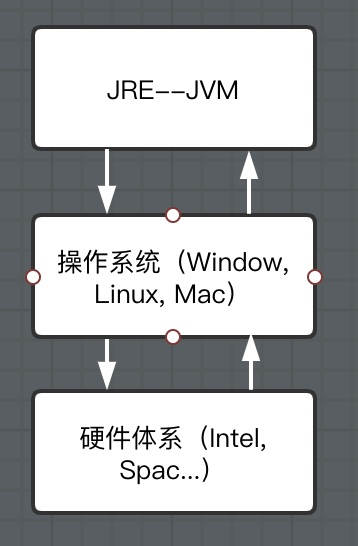

## 2. JVM的体系结构

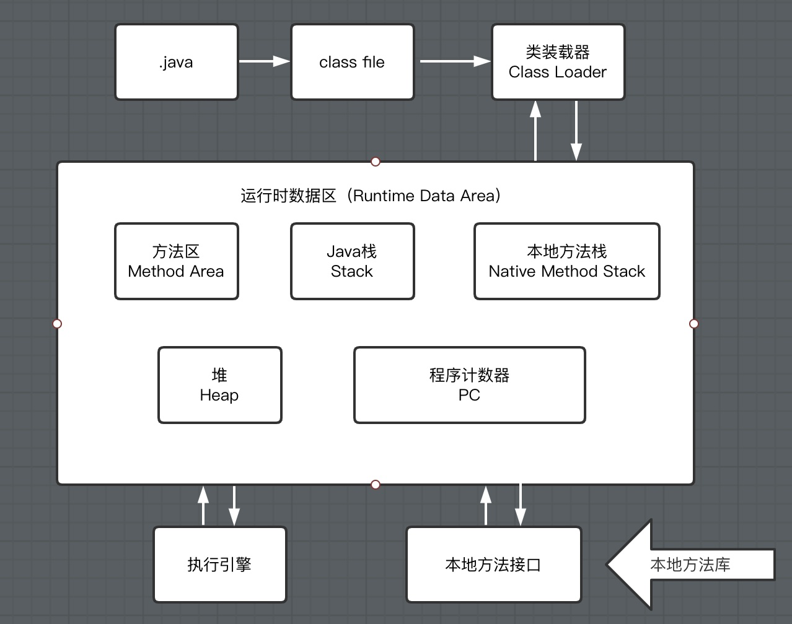

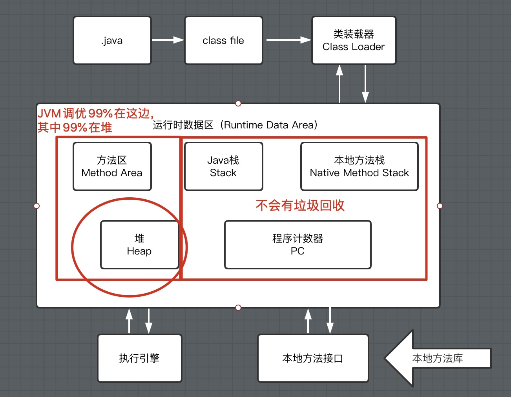


## 3. 类加载器

​	作用：加载Class文件~

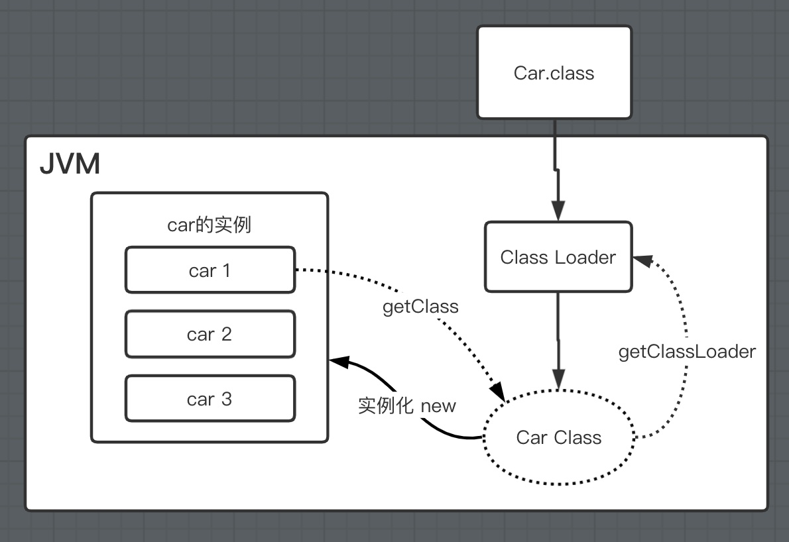

1. 虚拟器自带的加载器
2. 启动类（根）加载器
3. 扩展类加载器
4. 应用程序（系统类）加载器
5. 百度==双亲委派机制==

## 4. 双亲委派机制

Bootstrap classLoader:主要负责加载核心的类库(java.lang.*等)，构造ExtClassLoader和APPClassLoader。

ExtClassLoader：主要负责加载jre/lib/ext目录下的一些扩展的jar。

AppClassLoader：主要负责加载应用程序的主函数类


1. 类加载器收到类加载的请求
2. 将这个请求向上委托给父类加载器去完成，一直向上委托，直到启动类加载器
3. 启动加载器检查是否能够加载当前这个类，能加载就结束，使用当前的加载器，否则，抛出异常，通知子加载器进行加载
4. 重复步骤3

==**为什么要设计这种机制**==
这种设计有个好处是，如果有人想替换系统级别的类：String.java。篡改它的实现，在这种机制下这些系统的类已经被Bootstrap classLoader加载过了（为什么？因为当一个类需要加载的时候，最先去尝试加载的就是BootstrapClassLoader），所以其他类加载器并没有机会再去加载，从一定程度上防止了危险代码的植入。


## 5. 沙箱安全机制

##### 什么是沙箱？

Java安全模型的核心就是Java沙箱（sandbox），什么是沙箱？沙箱是一个限制程序运行的环境。沙箱机制就是将 Java 代码限定在虚拟机(JVM)特定的运行范围中，并且严格限制代码对本地系统资源访问，通过这样的措施来保证对代码的有效隔离，防止对本地系统造成破坏。沙箱**主要限制系统资源访问**，那系统资源包括什么？——`CPU、内存、文件系统、网络`。不同级别的沙箱对这些资源访问的限制也可以不一样。

所有的Java程序运行都可以指定沙箱，可以定制安全策略。

##### Java中的安全模型

在Java中将执行程序分成本地代码和远程代码两种，本地代码默认视为可信任的，而远程代码则被看作是不受信的。对于授信的本地代码，可以访问一切本地资源。而对于非授信的远程代码在早期的Java实现中，安全依赖于沙箱 (Sandbox) 机制。如下图所示 JDK1.0安全模型

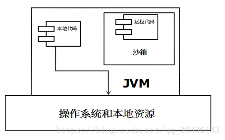

但如此严格的安全机制也给程序的功能扩展带来障碍，比如当用户希望远程代码访问本地系统的文件时候，就无法实现。因此在后续的 Java1.1 版本中，针对安全机制做了改进，增加了`安全策略`，允许用户指定代码对本地资源的访问权限。如下图所示 JDK1.1安全模型

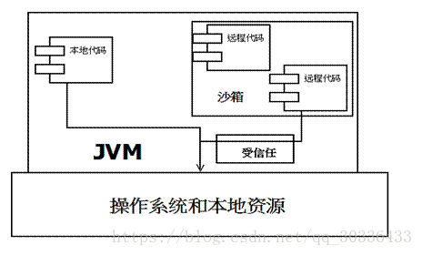

在 Java1.2 版本中，再次改进了安全机制，增加了`代码签名`。不论本地代码或是远程代码，都会按照用户的安全策略设定，由类加载器加载到虚拟机中权限不同的运行空间，来实现差异化的代码执行权限控制。如下图所示 JDK1.2安全模型

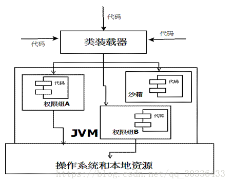

当前最新的安全机制实现，则引入了域 (Domain) 的概念。虚拟机会把所有代码加载到不同的系统域和应用域，系统域部分专门负责与关键资源进行交互，而各个应用域部分则通过系统域的部分代理来对各种需要的资源进行访问。虚拟机中不同的受保护域 (Protected Domain)，对应不一样的权限 (Permission)。存在于不同域中的类文件就具有了当前域的全部权限，如下图所示 最新的安全模型(jdk 1.6)

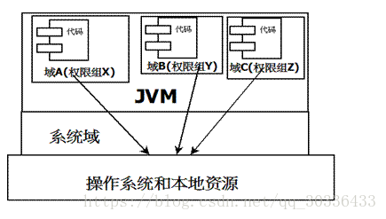

 以上提到的都是基本的`Java 安全模型概念`，在应用开发中还有一些`关于安全的复杂用法`，其中最常用到的 API 就是 doPrivileged。`doPrivileged 方法能够使一段受信任代码获得更大的权限，甚至比调用它的应用程序还要多，可做到临时访问更多的资源`。有时候这是非常必要的，可以应付一些特殊的应用场景。例如，应用程序可能无法直接访问某些系统资源，但这样的应用程序必须得到这些资源才能够完成功能。

##### 组成沙箱的基本组件

- `字节码校验器`（bytecode verifier）：确保Java类文件遵循Java语言规范。这样可以帮助Java程序实现内存保护。但并不是所有的类文件都会经过字节码校验，比如核心类。
- ``类装载器``（class loader）：其中类装载器在3个方面对Java沙箱起作用
  - 它防止恶意代码去干涉善意的代码；
  - 它守护了被信任的类库边界；
  - 它将代码归入保护域，确定了代码可以进行哪些操作。

  虚拟机为不同的类加载器载入的类提供不同的命名空间，命名空间由一系列唯一的名称组成，每一个被装载的类将有一个名字，这个命名空间是由Java虚拟机为每一个类装载器维护的，它们互相之间甚至不可见。

  类装载器采用的机制是双亲委派模式。

1. 从最内层JVM自带类加载器开始加载，外层恶意同名类得不到加载从而无法使用；
2. 由于严格通过包来区分了访问域，外层恶意的类通过内置代码也无法获得权限访问到内层类，破坏代码就自然无法生效。

- `存取控制器`（access controller）：存取控制器可以控制核心API对操作系统的存取权限，而这个控制的策略设定，可以由用户指定。
- `安全管理器`（security manager）：是核心API和操作系统之间的主要接口。实现权限控制，比存取控制器优先级高。
- `安全软件包`（security package）：java.security下的类和扩展包下的类，允许用户为自己的应用增加新的安全特性，包括：
  - 安全提供者
  - 消息摘要
  - 数字签名
  - 加密
  - 鉴别

## 6. Native

编写一个多线程类启动

```java
public static void main(String[] args) {
        new Thread(()->{

        },"my thread namne").start();
    }
```

点进去看start方法的源码

```java
public synchronized void start() {

    if (threadStatus != 0)
        throw new IllegalThreadStateException();

    group.add(this);

    boolean started = false;
    try {
        start0();
        started = true;
    } finally {
        try {
            if (!started) {
                group.threadStartFailed(this);
            }
        } catch (Throwable ignore) {
 
        }
    }
}
```

凡是带了native关键字的，说明java的作用范围达不到，去调用底层C语言的库！

**JNI：Java Native Interface （Java本地方法接口）**

```java
/**
     * native : 凡是带了native关键字的，说明java的作用范围达不到了，回去调用底层C语言的库！
     *     会进入本地方法栈
     *     调用本地方法接口 JNI
     *     JNI作用：扩展Java的使用，融合不同的编程语言为Java所用！最初：C, C++
     *     Java诞生的时候C, C++横行，想要立足，必须要能调用C,C++的程序
     *     它在内存区域中专门开辟类一块标记区域：Native Method Stack，登记native方法
     *     在最终执行的时候，加载本地方法库中的方法通过JNI
     */
    // Java程序驱动打印机，管理系统，掌握即可，在企业级应用中较为少见
    private native void start0();

    //调用其他接口： Socket, WebService~ http~
```

**Native Method Stack**

它的具体做法是Native Method Stack中登记native方法，在（Execution Engine）执行引擎执行的时候加载Native Libraries【本地库】

## 7. PC寄存器

程序计数器： Program Counter Register

每个线程都有一个程序计数器，是线程私有的，就是一个指针，指向方法区中的方法字节码（用来存储指向下一条指令的地址，也就是即将要执行的指令代码），在执行引擎读取下一条指令，是一个非常小的内存空间，几乎可以忽略不计。


## 8. 方法区

Method Area 方法区

方法区是被所用线程共享，所有字段和方法字节码，以及一些特殊方法，如构造函数，接口代码也在此定义，简单说，所有定义的方法的信息都保存在该区域，**此区域属于共享区间**；

==静态变量，常量，类信息（构造方法，接口定义），运行时的常量池存在方法区中，但是实例变量存在堆内存中，和方法区无关。==

Static, final, Class, 常量池

## 9. 栈

栈内存，主管程序的运行，生命周期和线程同步；

线程结束，栈内存也就释放，对于栈来说，==不存在垃圾回收问题。==

一旦线程结束，栈就Over！

栈：8大基本类型 + 对象引用 + 实例的方法

**栈运行原理：**栈帧

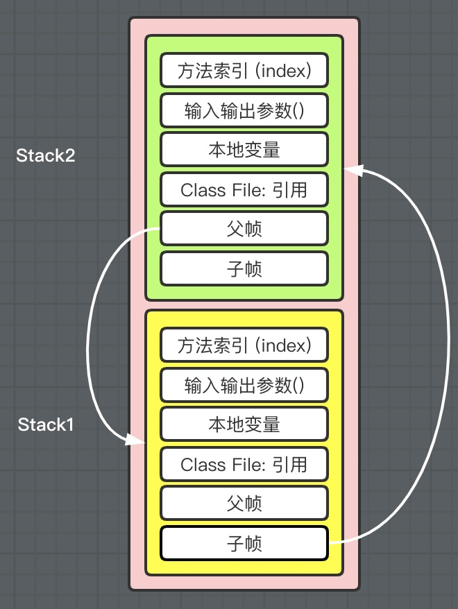

栈满了： StackOverflowError

栈，堆，方法区： 交互关系

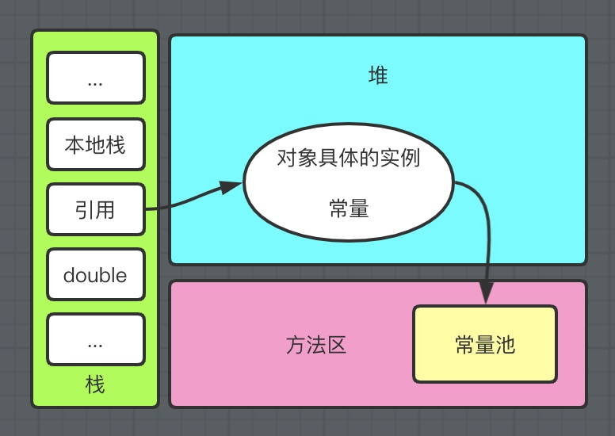

## 10. 三种JVM

* Sun公司 HotSpot ``Java HotSpot(TM) 64-Bit Server VM (build 13.0.2+8, mixed mode, sharing)``
* BEA JRockit
* IBM J9VM

我们学习都是：HotSpot

## 11. 堆

Heap，一个JVM只有一个堆内存，堆内存的大小是可以调节的。

类加载器读取了类文件后，一般会把什么东西放到堆中？ 类，方法，常量，变量！

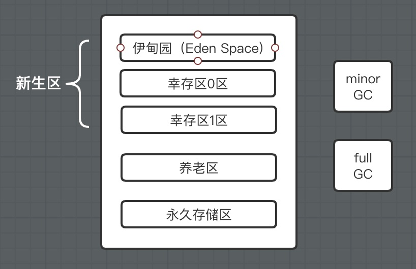

GC垃圾回收，主要是在伊甸园区和养老区～

假设内存满了，OOM，堆内存不够！java.lang.OutOfMemoryError: Java heap space

在JDK8以后，永久存储区改了一个名字（元空间）

##### 新生区

* 类：诞生和成长的地方，甚至死亡
* 伊甸园，所有的对象都是在伊甸园区 new 出来的
* 幸存者区（0，1）

##### 老年区

真理：经过研究，99%的对象都是临时对象！

##### 永久区

这个区域常驻内存的。用来存放JDK自身携带的Class对象。interface元数据，存储的是Java运行时的一些环境或类信息～这个区域不存在垃圾回收！关闭VM虚拟机就会释放这个区域的内存。

一个启动类，加载了大量的第三方jar包。Tomcat部署了太多的应用，大量动态生成的反射类。不断地被加载，直到内存满，就会出现OOM；

* Jdk1.6以前：永久代，常量池在是在方法区；
* jdk1.7 ：永久代，但是慢慢退化了，`去永久代`，常量池在堆中
* Jdk1.8以后： 无永久代，常量池在元空间

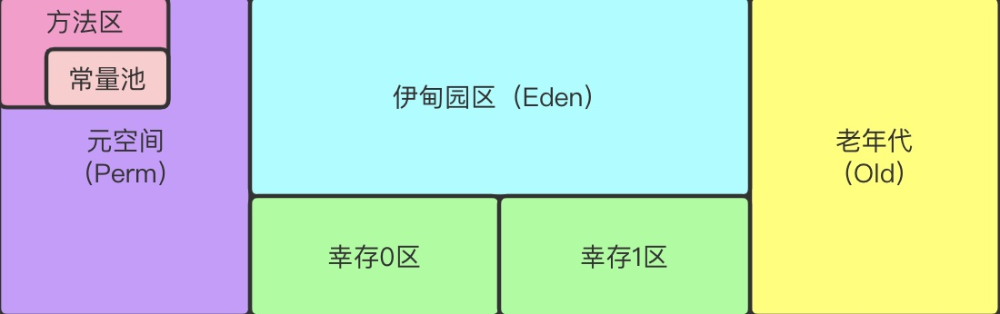

逻辑上存在，物理上不存在

##### 堆内存调优

在一个项目中，突然出现了OOM故障，那么该如何排除？研究为什么出错～

* 能够看到代码第几行出错：内存快照分析工具，MAT，Jprofiler
* Debug，一行行分析代码（大型项目不推荐）

##### VM potions:

* -Xms：设置初始化内存分配大小  1/64
* -Xmx：设置最大分配内存 默认 1/4
* -XX:+PrintGCDetails       //打印GC垃圾回收信息
* -XX:+HeapDumpOnOutOfMemoryError   //OOM DUMP

##### **MAT, Jprofiler 作用：**

* 分析Dump内存文件，快速定位内存泄漏；
* 获得堆中的数据
* 获得大的对象
* ...

## 12. GC

**GC作用区：方法区和堆**

JVM在进行GC时，并不是对以下三个区域统一回收。大部分时候，回收都是新生代～

* 新生代
* 幸存区（from, to）
* 老年区

GC两种类型： 轻GC（Partial GC），重GC（full GC）

**题目：**

* JVM的内存模型和分区～详细到每个区放什么？
* 堆里面的分区有哪些？Eden, from, to 老年区，说说它们的特点
* GC的算法有哪些？标记清除算法，标记整理算法，复制算法，引用计数法
* Partial GC 和 Full GC 分别在什么时候发生？

#### 引用计数法

##### **算法思想：**

每个对象在创建的时候，就给这个对象绑定一个计数器。每当有一个引用指向该对象时，计数器加一；每当有一个指向它的引用被删除时，计数器减一。这样，当没有引用指向该对象时，该对象死亡，计数器为0，这时就应该对这个对象进行垃圾回收操作。

##### **核心思想：**

为每个对象额外存储一个计数器 RC ，根据 RC 的值来判断对象是否死亡，从而判断是否执行 GC 操作。

##### **优点：**

* 简单
* 计算代价分散
* “幽灵时间”短（幽灵时间指对象死亡到回收的这段时间，处于幽灵状态）

##### **缺点：**

* 不全面（容易漏掉循环引用的对象）
* 并发支持较弱
* 占用额外内存空间

#### 复制算法

##### 算法思想

该算法将内存平均分成两部分，然后每次只使用其中的一部分，当这部分内存满的时候，将内存中所有存活的对象复制到另一个内存中，然后将之前的内存清空，只使用这部分内存，循环下去。

谁空谁是to：

* 每次GC都会将Eden的对象移到幸存区中：一旦Eden区被GC后，就会是空的！
* 当一个对象经历了15次GC还没死，会进入老年区
  * 通过-XX:MaxTenuringThreshold=9999，这个参数可以设定进入老年区的时间

##### 核心：

这个算法与标记-整理算法的区别在于，该算法不是在同一个区域复制，而是将所有存活的对象复制到另一个区域内。

##### **最佳使用场景**

* 对象存活度较低的时候：新生区

##### 优点

* 实现简单
* 不产生内存碎片

##### 缺点

* 每次运行，总有一半内存是空的，导致可使用的内存空间只有原来的一半。


13. JMM
14. 总结

####  标记清除算法

##### 算法思想：

为每个对象存储一个标记位，记录对象的状态（活着或是死亡）。分为两个阶段，一个是标记阶段，这个阶段内，为每个对象更新标记位，检查对象是否死亡；第二个阶段是清除阶段，该阶段对死亡的对象进行清除，执行 GC 操作。

##### 优点

* 最大的优点是，相比于引用计数法，标记—清除算法中每个活着的对象的引用只需要找到一个即可，找到一个就可以判断它为活的。
* 此外，这个算法相比于引用计数法更全面，在指针操作上也没有太多的花销。更重要的是，这个算法并不移动对象的位置（后面俩算法涉及到移动位置的问题）。

##### 缺点

* 很长的幽灵时间，判断对象已经死亡，消耗了很多时间，这样从对象死亡到对象被回收之间的时间过长。
* 每个活着的对象都要在标记阶段遍历一遍；所有对象都要在清除阶段扫描一遍，因此算法复杂度较高。
* 没有移动对象，导致可能出现很多碎片空间无法利用的情况。

##### 例子

这个图中，圆圈内灰色的对象就是已经死亡的对象，被标记为死亡，等待清除。

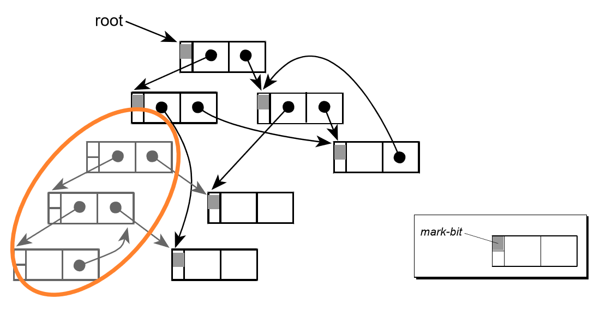

#### 标记整理算法

##### 算法思想

标记-整理法是标记-清除法的一个改进版。同样，在标记阶段，该算法也将所有对象标记为存活和死亡两种状态；不同的是，在第二个阶段，该算法并没有直接对死亡的对象进行清理，而是将所有存活的对象整理一下，放到另一处空间，然后把剩下的所有对象全部清除。这样就达到了标记-整理的目的。

##### 优点

* 该算法不会像标记-清除算法那样产生大量的碎片空间。

##### 缺点

* 如果存活的对象过多，整理阶段将会执行较多复制操作，导致算法效率降低。

##### 例子

上面是标记阶段，下面是整理之后的状态。可以看到，该算法不会产生大量碎片内存空间。

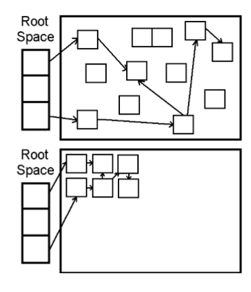

## 13. GC总结

内存效率：复制算法 > 标记清除算法 > 标记压缩算法 （时间复杂度）

内存整齐度：复制算法 = 标记压缩算法 > 标记清除算法

内存利用率：标记压缩算法 = 标记清除算法 > 复制算法


思考：难道没有最优的算法吗？

没有最好的算法  GC-->分代收集算法


年轻代：

* 存活率低
* 复制算法

老年代：

* 区域大：存活率
* 标记清除（内存碎片不是太多） + 标记压缩混合 实现


《深入理解JVM》

## 14. JMM

1. 什么是JMM？
   * JMM：Java Memory Model    java内存模型
2. 干什么的？
   * 作用：缓存一致性协议，用于定义数据读写的规则（遵守，找到这个规则）
   * JMM定义了线程和主内存之间的抽象关系：线程之间的共享变量存储在主内存中（Main Memory）中，每个线程都有一个私有的本地内存（Local Memory）
   * 解决共享对象可见性这个问题：volatile
3. 如何学习？
   * JMM是抽象的概念
   * 搜volatile

