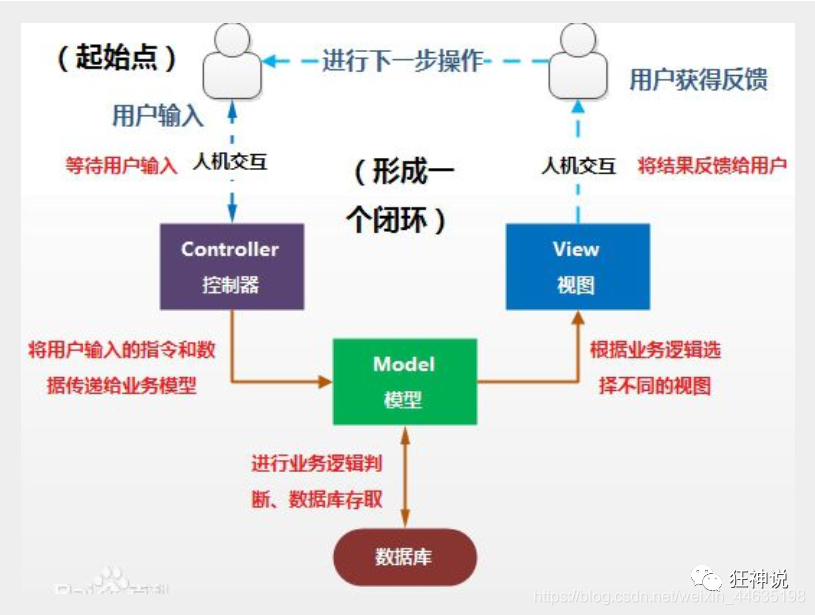
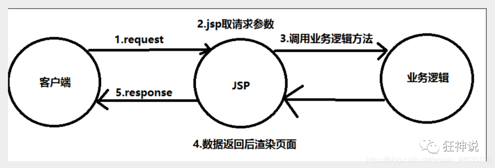
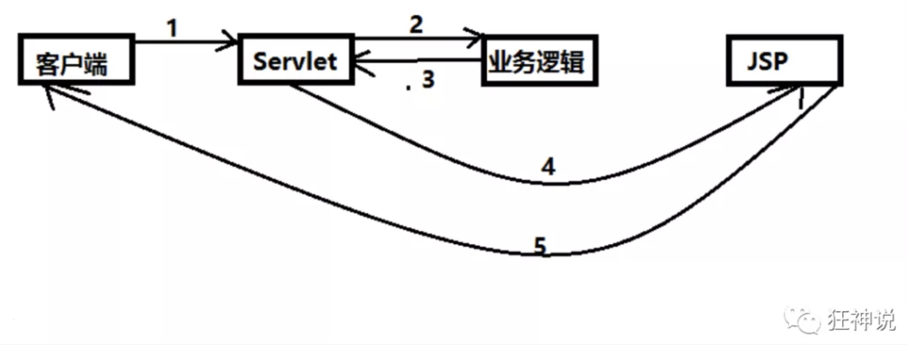
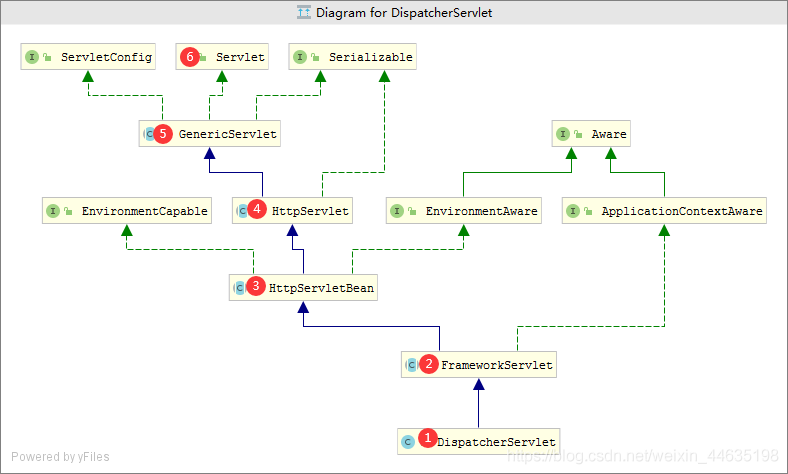
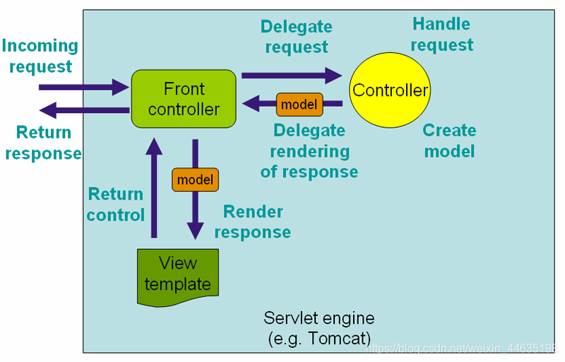
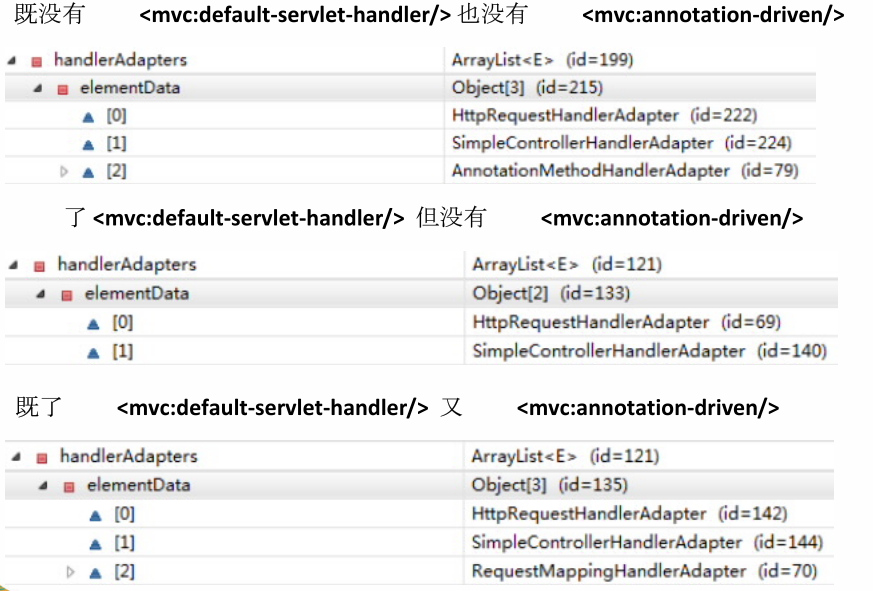

# SpringMVC

ssm: MyBatis + Spring + SpringMVC  **MVC三层架构**

* JavaSE:	认真学习，老师带，入门快
* JavaWeb: 	认真学习，老师带，入门快
* SSM框架:	研究官方文档，锻炼自学能力，锻炼笔记能力，锻炼项目能力

SpringMVC + Vue + SpringBoot + SpringCloud + Linux

SpringMVC : SpringMVC的执行流程！SSM框架整合！


## 1. MVC 回顾

### 1.1 什么是MVC

* MVC: 模型（dao, service）视图（jsp）控制器（Servlet）的简写，是一种软件设计规范
* 是将业务逻辑、数据、显示分离的方法来组织代码。
* MVC主要作用是**降低了视图与业务逻辑间的双向偶合**。
* MVC不是一种设计模式，**MVC是一种架构模式**。当然不同的MVC存在差异。

**Model（模型）**： 数据模型，提供要展示的数据，因此包含数据和行为，可以认为是领域模型或JavaBean组件（包含数据和行为），不过现在一般都分离开来：Value Object（数据Dao） 和 服务层（行为Service）。也就是模型提供了模型数据查询和模型数据的状态更新等功能，包括数据和业务。

**View（视图）**：负责进行模型的展示，一般就是我们见到的用户界面，客户想看到的东西。

**Controller（控制器）**：接收用户请求，委托给模型进行处理（状态改变），处理完毕后把返回的模型数据返回给视图，由视图负责展示。也就是说控制器做了个调度员的工作。

**最典型的MVC就是JSP + servlet + javabean的模式。**



### 1.2 Model1时代

- 在web早期的开发中，通常采用的都是Model1。
- Model1中，主要分为两层，视图层和模型层。



Model1优点：架构简单，比较适合小型项目开发；

Model1缺点：JSP职责不单一，职责过重，不便于维护；

### 1.3 Model2时代

Model2把一个项目分成三部分，包括**视图、控制、模型。**



1. 用户发请求
2. Servlet接收请求数据，并调用对应的业务逻辑方法
3. 业务处理完毕，返回更新后的数据给servlet
4. servlet转向到JSP，由JSP来渲染页面
5. 响应给前端更新后的页面

**职责分析：**

**Controller：控制器**

1. 取得表单数据
2. 调用业务逻辑
3. 转向指定的页面

**Model：模型**

1. 业务逻辑
2. 保存数据的状态

**View：视图**

1. 显示页面

Model2这样不仅提高的代码的复用率与项目的扩展性，且大大降低了项目的维护成本。Model 1模式的实现比较简单，适用于快速开发小规模项目，Model1中JSP页面身兼View和Controller两种角色，将控制逻辑和表现逻辑混杂在一起，从而导致代码的重用性非常低，增加了应用的扩展性和维护的难度。Model2消除了Model1的缺点。

### 1.4 回顾Servlet

1. 新建一个Maven工程当做父工程！pom依赖！

   ```xml
   <dependencies>
       <dependency>
           <groupId>junit</groupId>
           <artifactId>junit</artifactId>
           <version>4.13</version>
       </dependency>
       <dependency>
           <groupId>org.springframework</groupId>
           <artifactId>spring-webmvc</artifactId>
           <version>5.2.14.RELEASE</version>
       </dependency>
       <dependency>
           <groupId>javax.servlet</groupId>
           <artifactId>servlet-api</artifactId>
           <version>2.5</version>
       </dependency>
       <dependency>
           <groupId>javax.servlet.jsp</groupId>
           <artifactId>jsp-api</artifactId>
           <version>2.2</version>
       </dependency>
       <dependency>
           <groupId>javax.servlet</groupId>
           <artifactId>jstl</artifactId>
           <version>1.2</version>
       </dependency>
   </dependencies>
   ```

2. 建立一个Moudle：springmvc-01-servlet ， 添加Web app的支持！

3. 导入servlet 和 jsp 的 jar 依赖

   ```xml
   <dependency>
      <groupId>javax.servlet</groupId>
      <artifactId>servlet-api</artifactId>
      <version>2.5</version>
   </dependency>
   <dependency>
      <groupId>javax.servlet.jsp</groupId>
      <artifactId>jsp-api</artifactId>
      <version>2.2</version>
   </dependency>
   ```

4. 编写一个Servlet类，用来处理用户的请求

   ```java
   package nuc.ss.servlet;
   
   //实现Servlet接口
   public class HelloServlet extends HttpServlet {
      @Override
      protected void doGet(HttpServletRequest req, HttpServletResponse resp) throws ServletException, IOException {
          //取得参数
          String method = req.getParameter("method");
          if (method.equals("add")){
              req.getSession().setAttribute("msg","执行了add方法");
         }
          if (method.equals("delete")){
              req.getSession().setAttribute("msg","执行了delete方法");
         }
          //业务逻辑
          //视图跳转
          req.getRequestDispatcher("/WEB-INF/jsp/hello.jsp").forward(req,resp);
     }
   
      @Override
      protected void doPost(HttpServletRequest req, HttpServletResponse resp) throws ServletException, IOException {
          doGet(req,resp);
     }
   }
   ```

5. 编写Hello.jsp，在WEB-INF目录下新建一个jsp的文件夹，新建test.jsp

   ```html
   <%@ page contentType="text/html;charset=UTF-8" language="java" %>
   <html>
   <head>
       <title>Title</title>
   </head>
   <body>
   ${msg}
   </body>
   </html>
   ```

6. 在web.xml中注册Servlet

   ```xml
   <?xml version="1.0" encoding="UTF-8"?>
   <web-app xmlns="http://xmlns.jcp.org/xml/ns/javaee"
            xmlns:xsi="http://www.w3.org/2001/XMLSchema-instance"
            xsi:schemaLocation="http://xmlns.jcp.org/xml/ns/javaee http://xmlns.jcp.org/xml/ns/javaee/web-app_4_0.xsd"
            version="4.0">
   
       <servlet>
           <servlet-name>hello</servlet-name>
           <servlet-class>com.jin.servlet.HelloServlet</servlet-class>
       </servlet>
       <servlet-mapping>
           <servlet-name>hello</servlet-name>
           <url-pattern>/hello</url-pattern>
       </servlet-mapping>
   
   <!--    <session-config>-->
   <!--        <session-timeout>15</session-timeout>-->
   <!--    </session-config>-->
   
   <!--    <welcome-file-list>-->
   <!--        <welcome-file>index.jsp</welcome-file>-->
   <!--    </welcome-file-list>-->
   </web-app>
   ```

7. 配置Tomcat，并启动测试

   - localhost:8080/user?method=add
   - localhost:8080/user?method=delete

**MVC框架要做哪些事情**

1. 将url映射到java类或java类的方法 .
2. 封装用户提交的数据 .
3. 处理请求–调用相关的业务处理–封装响应数据 .
4. 将响应的数据进行渲染 . jsp / html 等表示层数据 .

**说明：**

 常见的服务器端MVC框架有：Struts、Spring MVC、ASP.NET MVC、Zend Framework、JSF；常见前端MVC框架：vue、angularjs、react、backbone；由MVC演化出了另外一些模式如：MVP、MVVM 等等…


## 2 什么是SpringMVC

### 2.1 概述


==Spring MVC是Spring Framework的一部分，是基于Java实现MVC的轻量级Web框架。==

查看官方文档：https://docs.spring.io/spring/docs/5.2.0.RELEASE/spring-framework-reference/web.html#spring-web

**我们为什么要学习SpringMVC呢?**

Spring MVC的特点：

1. 轻量级，简单易学
2. 高效 , 基于请求响应的MVC框架
3. 与Spring兼容性好，无缝结合
4. 约定优于配置
5. 功能强大：RESTful、数据验证、格式化、本地化、主题等
6. 简洁灵活

Spring的web框架围绕**DispatcherServlet** [ 调度Servlet ] 设计。

DispatcherServlet的作用是将请求分发到不同的处理器。从Spring 2.5开始，使用Java 5或者以上版本的用户可以采用基于注解形式进行开发，十分简洁；

正因为SpringMVC好 , 简单 , 便捷 , 易学 , 天生和Spring无缝集成(使用SpringIoC和Aop) , 使用约定优于配置 . 能够进行简单的junit测试 . 支持Restful风格 .异常处理 , 本地化 , 国际化 , 数据验证 , 类型转换 , 拦截器 等等…所以我们要学习 .

**最重要的一点还是用的人多 , 使用的公司多 .**

### 2.2 中心控制器

- Spring的web框架围绕DispatcherServlet设计。DispatcherServlet的作用是将请求分发到不同的处理器。从Spring 2.5开始，使用Java 5或者以上版本的用户可以采用基于注解的controller声明方式。



Spring MVC框架像许多其他MVC框架一样, **以请求为驱动** , **围绕一个中心Servlet分派请求及提供其他功能**，**DispatcherServlet是一个实际的Servlet (它继承自HttpServlet 基类)**。

- SpringMVC的原理如下图所示：

  当发起请求时被前置的控制器拦截到请求，根据请求参数生成代理请求，找到请求对应的实际控制器，控制器处理请求，创建数据模型，访问数据库，将模型响应给中心控制器，控制器使用模型与视图渲染视图结果，将结果返回给中心控制器，再将结果返回给请求者。

  原图

  

  中文图

  

### 2.3 SpringMVC执行原理


图为SpringMVC的一个较完整的流程图，实线表示SpringMVC框架提供的技术，不需要开发者实现，虚线表示需要开发者实现。

**简要分析执行流程**

1. DispatcherServlet表示前置控制器，是整个SpringMVC的控制中心。用户发出请求，DispatcherServlet接收请求并拦截请求。
   - 我们假设请求的url为 : http://localhost:8080/SpringMVC/hello
   - **如上url拆分成三部分：**
   - http://localhost:8080 ------> 服务器域名
   - SpringMVC ------> 部署在服务器上的web站点
   - hello ------> 表示控制器
   - 通过分析，如上url表示为：请求位于服务器localhost:8080上的SpringMVC站点的hello控制器。
2. HandlerMapping为处理器映射。DispatcherServlet调用HandlerMapping,HandlerMapping根据请求url查找Handler。
3. HandlerExecution表示具体的Handler,其主要作用是根据url查找控制器，如上url被查找控制器为：hello。
4. HandlerExecution将解析后的信息传递给DispatcherServlet,如解析控制器映射等。
5. HandlerAdapter表示处理器适配器，其按照特定的规则去执行Handler。
6. Handler让具体的Controller执行。
7. Controller将具体的执行信息返回给HandlerAdapter,如ModelAndView。
8. HandlerAdapter将视图逻辑名或模型传递给DispatcherServlet。
9. DispatcherServlet调用视图解析器(ViewResolver)来解析HandlerAdapter传递的逻辑视图名。
10. 视图解析器将解析的逻辑视图名传给DispatcherServlet。
11. DispatcherServlet根据视图解析器解析的视图结果，调用具体的视图。
12. 最终视图呈现给用户。

## 3 第一个MVC程序

### 3.1 配置版

1. 新建一个Moudle ， springmvc-02-hello ， 添加web的支持！

2. 确定导入了SpringMVC 的依赖！（包括配置strucuture中artifact，确认里面含lib库）

3. 配置web.xml ， 注册DispatcherServlet

   ```xml
   <?xml version="1.0" encoding="UTF-8"?>
   <web-app xmlns="http://xmlns.jcp.org/xml/ns/javaee"
           xmlns:xsi="http://www.w3.org/2001/XMLSchema-instance"
           xsi:schemaLocation="http://xmlns.jcp.org/xml/ns/javaee http://xmlns.jcp.org/xml/ns/javaee/web-app_4_0.xsd"
           version="4.0">
   
      <!--1.注册DispatcherServlet-->
      <servlet>
          <servlet-name>springmvc</servlet-name>
          <servlet-class>org.springframework.web.servlet.DispatcherServlet</servlet-class>
          <!--关联一个springmvc的配置文件:【servlet-name】-servlet.xml-->
          <init-param>
              <param-name>contextConfigLocation</param-name>
              <param-value>classpath:springmvc-servlet.xml</param-value>
          </init-param>
          <!--启动级别-1-->
          <load-on-startup>1</load-on-startup>
      </servlet>
   
      <!--/ 匹配所有的请求；（不包括.jsp）-->
      <!--/* 匹配所有的请求；（包括.jsp） 如果不注意这点，过滤器重定向跳转就会无限跳转而报错
   											因为每次jsp都会再进入DispacherServlet-->
      <servlet-mapping>
          <servlet-name>springmvc</servlet-name>
          <url-pattern>/</url-pattern>
      </servlet-mapping>
   
   </web-app>
   ```

4. 编写SpringMVC 的 配置文件！名称：springmvc-servlet.xml : [servletname]-servlet.xml

   说明，这里的名称要求是按照官方来的

   ```xml
   <?xml version="1.0" encoding="UTF-8"?>
   <beans xmlns="http://www.springframework.org/schema/beans"
         xmlns:xsi="http://www.w3.org/2001/XMLSchema-instance"
         xsi:schemaLocation="http://www.springframework.org/schema/beans
          http://www.springframework.org/schema/beans/spring-beans.xsd">
   
   </beans>
   ```

5. 添加 处理器映射器（找Servlet）

   ```xml
   <bean class="org.springframework.web.servlet.handler.BeanNameUrlHandlerMapping"/>
   ```

6. 添加 处理器适配器（找Controller）

   ```xml
   <bean class="org.springframework.web.servlet.mvc.SimpleControllerHandlerAdapter"/>
   ```

7. 添加 视图解析器（之后会学  模板引擎： Thymeleaf FreeMarker...）

   ```xml
   <!--视图解析器:DispatcherServlet给他的ModelAndView
       1. 获取了ModelAndView的数据
       2. 解析ModelAndView的视图名字
       3. 拼接视图名字，找到对应的视图 /WEB-INF/jsp/hello.jsp
       -->
   <bean class="org.springframework.web.servlet.view.InternalResourceViewResolver" id="InternalResourceViewResolver">
      <!--前缀-->
      <property name="prefix" value="/WEB-INF/jsp/"/>
      <!--后缀-->
      <property name="suffix" value=".jsp"/>
   </bean>
   ```

8. 编写我们要操作业务Controller ，要么实现Controller接口，要么增加注解；需要返回一个ModelAndView，装数据，封视图；

   ```java
   package com.jin.controller;
   
   import org.springframework.web.servlet.ModelAndView;
   import org.springframework.web.servlet.mvc.Controller;
   
   import javax.servlet.http.HttpServletRequest;
   import javax.servlet.http.HttpServletResponse;
   
   //注意：这里我们先导入Controller接口
   public class HelloController implements Controller {
   
      public ModelAndView handleRequest(HttpServletRequest request, HttpServletResponse response) throws Exception {
          //ModelAndView 模型和视图
          ModelAndView mv = new ModelAndView();
   
          //封装对象，放在ModelAndView中。Model
          mv.addObject("msg","HelloSpringMVC!");
          //封装要跳转的视图，放在ModelAndView中
          mv.setViewName("hello"); //: /WEB-INF/jsp/hello.jsp
          return mv;
     }
   }
   ```

9. 将自己的类交给SpringIOC容器，注册bean

   ```xml
   <!--Handler-->
   <bean id="/hello" class="com.jin.controller.HelloController"/>
   ```

10. 写要跳转的jsp页面，显示ModelandView存放的数据，以及我们的正常页面；

    ```html
    <%@ page contentType="text/html;charset=UTF-8" language="java" %>
    <html>
    <head>
       <title>Title</title>
    </head>
    <body>
    ${msg}
    </body>
    </html>
    ```

11. 配置Tomcat 启动测试！


**可能遇到的问题：访问出现404，排查步骤：**

1. ==查看控制台输出，看一下是不是缺少了什么jar包。==
2. ==如果jar包存在，显示无法输出，就在IDEA的项目发布中，添加lib依赖！==
3. ==重启Tomcat 即可解决！==

小结：我们来看个注解版实现，这才是SpringMVC的精髓。

### 3.2 注解版

1. **新建一个Moudle，springmvc-03-hello-annotation 。添加web支持！**

2. 由于Maven可能存在资源过滤的问题，我们将配置完善

   ```xml
   <build>
      <resources>
          <resource>
              <directory>src/main/java</directory>
              <includes>
                  <include>**/*.properties</include>
                  <include>**/*.xml</include>
              </includes>
              <filtering>false</filtering>
          </resource>
          <resource>
              <directory>src/main/resources</directory>
              <includes>
                  <include>**/*.properties</include>
                  <include>**/*.xml</include>
              </includes>
              <filtering>false</filtering>
          </resource>
      </resources>
   </build>
   ```

3. 在pom.xml文件引入相关的依赖：主要有Spring框架核心库、Spring MVC、servlet , JSTL等。我们在父依赖中已经引入了！

4. **配置web.xml**

   注意点：

   ```xml
   <?xml version="1.0" encoding="UTF-8"?>
   <web-app xmlns="http://xmlns.jcp.org/xml/ns/javaee"
           xmlns:xsi="http://www.w3.org/2001/XMLSchema-instance"
           xsi:schemaLocation="http://xmlns.jcp.org/xml/ns/javaee http://xmlns.jcp.org/xml/ns/javaee/web-app_4_0.xsd"
           version="4.0">
   
      <!--1.注册servlet-->
      <servlet>
          <servlet-name>SpringMVC</servlet-name>
          <servlet-class>org.springframework.web.servlet.DispatcherServlet</servlet-class>
          <!--通过初始化参数指定SpringMVC配置文件的位置，进行关联-->
          <init-param>
              <param-name>contextConfigLocation</param-name>
              <param-value>classpath:springmvc-servlet.xml</param-value>
          </init-param>
          <!-- 启动顺序，数字越小，启动越早 -->
          <load-on-startup>1</load-on-startup>
      </servlet>
   
      <!--所有请求都会被springmvc拦截 -->
      <servlet-mapping>
          <servlet-name>SpringMVC</servlet-name>
          <url-pattern>/</url-pattern>
      </servlet-mapping>
   
   </web-app>
   ```

5. **/ 和 /\* 的区别：**

   - < url-pattern > / </ url-pattern > 不会匹配到.jsp， 只针对我们编写的请求；即：.jsp 不会进入spring的 DispatcherServlet类 。
   - < url-pattern > /* </ url-pattern > 会匹配 *.jsp，会出现返回 jsp视图 时再次进入spring的DispatcherServlet 类，导致找不到对应的controller所以报404错。

6. **添加Spring MVC配置文件**

   在resource目录下添加springmvc-servlet.xml配置文件，配置的形式与Spring容器配置基本类似，为了支持基于注解的IOC，设置了自动扫描包的功能，具体配置信息如下：

   ```xml
   <?xml version="1.0" encoding="UTF-8"?>
   <beans xmlns="http://www.springframework.org/schema/beans"
         xmlns:xsi="http://www.w3.org/2001/XMLSchema-instance"
         xmlns:context="http://www.springframework.org/schema/context"
         xmlns:mvc="http://www.springframework.org/schema/mvc"
         xsi:schemaLocation="http://www.springframework.org/schema/beans
          http://www.springframework.org/schema/beans/spring-beans.xsd
          http://www.springframework.org/schema/context
          https://www.springframework.org/schema/context/spring-context.xsd
          http://www.springframework.org/schema/mvc
          https://www.springframework.org/schema/mvc/spring-mvc.xsd">
   
      <!-- 自动扫描包，让指定包下的注解生效,由IOC容器统一管理 -->
      <context:component-scan base-package="com.jin.controller"/>
      <!-- 让Spring MVC不处理静态资源 -->
      <mvc:default-servlet-handler />
      <!--
      支持mvc注解驱动
          在spring中一般采用@RequestMapping注解来完成映射关系
          要想使@RequestMapping注解生效
          必须向上下文中注册DefaultAnnotationHandlerMapping
          和一个AnnotationMethodHandlerAdapter实例
          这两个实例分别在类级别和方法级别处理。
          而annotation-driven配置帮助我们自动完成上述两个实例的注入。
       -->
      <mvc:annotation-driven />
   
      <!-- 视图解析器 -->
      <bean class="org.springframework.web.servlet.view.InternalResourceViewResolver"
            id="internalResourceViewResolver">
          <!-- 前缀 -->
          <property name="prefix" value="/WEB-INF/jsp/" />
          <!-- 后缀 -->
          <property name="suffix" value=".jsp" />
      </bean>
   
   </beans>
   ```

在视图解析器中我们把所有的视图都存放在/WEB-INF/目录下，这样可以保证视图安全，因为这个目录下的文件，客户端不能直接访问。

- 让IOC的注解生效
- 静态资源过滤 ：HTML . JS . CSS . 图片 ， 视频 …
  - MVC的注解驱动
  - 配置视图解析器

1. **创建Controller**

   编写一个Java控制类：nuc.ss.controller.HelloController , 注意编码规范

   ```java
   @Controller
   @RequestMapping("/HelloController")
   public class HelloController {
   
      //真实访问地址 : 项目名/HelloController/hello
      @RequestMapping("/hello")
      public String sayHello(Model model){
          //向模型中添加属性msg与值，可以在JSP页面中取出并渲染
          model.addAttribute("msg","hello,SpringMVC");
          //web-inf/jsp/hello.jsp
          return "hello";
     }
   }
   ```

   - @Controller是为了让Spring IOC容器初始化时自动扫描到；
   - 被这个@Controller注解的类中的所有方法，如果返回值是String，并且有具体页面可以跳转，那么就会被视图解析器解析；
   - @RequestMapping是为了映射请求路径，这里因为类与方法上都有映射所以访问时应该是/HelloController/hello；
   - 方法中声明Model类型的参数是为了把Action中的数据带到视图中；
   - 方法返回的结果是视图的名称hello，加上配置文件中的前后缀变成WEB-INF/jsp/**hello**.jsp

2. **创建视图层**

   在WEB-INF/ jsp目录中创建hello.jsp ， 视图可以直接取出并展示从Controller带回的信息；

   可以通过EL表示取出Model中存放的值，或者对象；

   ```html
   <%@ page contentType="text/html;charset=UTF-8" language="java" %>
   <html>
   <head>
      <title>SpringMVC</title>
   </head>
   <body>
   ${msg}
   </body>
   </html>
   ```

3. **配置Tomcat运行**

   配置Tomcat ， 开启服务器 ， 访问 对应的请求路径！

   

   **OK，运行成功！**

### 3.3 关于控制器的配置

[两个主要配置的问题的原博地址](https://www.cnblogs.com/hujingwei/p/5349983.html)

在做项目的时候，我希望静态资源由WEB服务器默认的Servlet来处理，所以我在配置文件中添加了如下的语句：

​      <mvc:default-servlet-handler/>

但是我再次运行项目，并访问资源的时候，发现访问@RequestMapping("/path1/path2")都不能访问了，之前没有添加的时候是能够访问的。

解决方案是，在配置文件中再添加一句代码：

​      <mvc:annotation-driven/>

这样做的原因是：



当两种标签都没有的时候，框架默认注册的有AnnotationMethodHandlerAdapter这个bean，所以能够处理@RequestMapping这个注解，但是只配置了<mvc:default-servlet-handler/>时所注册的三个bean都不能处理@RequestMapping注解，因此无法找到相应的Controller，进而无法进行访问路径的映射，当两种标签都有的时候，<mvc:annotation-driven/>会注册一个RequestMappingHandlerAdapter的bean，这个bean能够处理@RequestMapping这个注解。

### 小结

实现步骤其实非常的简单：

1. 新建一个web项目
2. 导入相关jar包
3. 编写web.xml , 注册DispatcherServlet
4. 编写springmvc配置文件
5. 接下来就是去创建对应的控制类 , controller
6. 最后完善前端视图和controller之间的对应
7. 测试运行调试.

使用springMVC必须配置的三大件

**处理器映射器、处理器适配器、视图解析器**

通常，我们只需要**手动配置视图解析器**，而**处理器映射器**和**处理器适配器**只需要开启**注解驱动**即可，而省去了大段的xml配置


## 4. RestFul和控制器

### 4.1 控制器Controller

- 控制器复杂提供访问应用程序的行为，通常通过接口定义或注解定义两种方法实现。
- 控制器负责解析用户的请求并将其转换为一个模型。
- 在Spring MVC中一个控制器类可以包含多个方法
- 在Spring MVC中，对于Controller的配置方式有很多种

### 4.2 实现Controller接口

Controller是一个接口，在org.springframework.web.servlet.mvc包下，接口中只有一个方法；

```java
//实现该接口的类获得控制器功能
public interface Controller {
   //处理请求且返回一个模型与视图对象
   ModelAndView handleRequest(HttpServletRequest var1, HttpServletResponse var2) throws Exception;
}
```

**测试**

1. 新建一个Moudle，springmvc-04-controller！

2. - mvc的配置文件只留下 视图解析器！

3. 编写一个Controller类，ControllerTest1

   ```java
   //定义控制器
   //注意点：不要导错包，实现Controller接口，重写方法；
   public class ControllerTest1 implements Controller {
   
      public ModelAndView handleRequest(HttpServletRequest httpServletRequest, HttpServletResponse httpServletResponse) throws Exception {
          //返回一个模型视图对象
          ModelAndView mv = new ModelAndView();
          mv.addObject("msg","Test1Controller");
          mv.setViewName("test");
          return mv;
     }
   }
   ```

4. 编写完毕后，去Spring配置文件中注册请求的bean；name对应请求路径，class对应处理请求的类

   ```xml
   <bean name="/t1" class="nuc.ss.controller.ControllerTest1"/>
   ```

5. 编写前端test.jsp，注意在WEB-INF/jsp目录下编写，对应我们的视图解析器

   ```html
   <%@ page contentType="text/html;charset=UTF-8" language="java" %>
   <html>
   <head>
      <title>Kuangshen</title>
   </head>
   <body>
   ${msg}
   </body>
   </html>
   ```

6. 配置Tomcat运行测试，我这里没有项目发布名配置的就是一个 / ，所以请求不用加项目名，OK！

   

**说明：**

- 实现接口Controller定义控制器是较老的办法
- 缺点是：一个控制器中只有一个方法，如果要多个方法则需要定义多个Controller；定义的方式比较麻烦；

### 4.3 使用注解@Controller

- @Controller注解类型用于声明Spring类的实例是一个控制器（在讲IOC时还提到了另外3个注解）；

- Spring可以使用扫描机制来找到应用程序中所有基于注解的控制器类，为了保证Spring能找到你的控制器，需要在配置文件中声明组件扫描。

  ```xml
  <!-- 自动扫描指定的包，下面所有注解类交给IOC容器管理 -->
  <context:component-scan base-package="nuc.ss.controller"/>
  ```

- 增加一个ControllerTest2类，使用注解实现；

  ```java
  //@Controller注解的类会自动添加到Spring上下文中
  @Controller
  public class ControllerTest2{
  
     //映射访问路径
     @RequestMapping("/t2")
     public String index(Model model){
         //Spring MVC会自动实例化一个Model对象用于向视图中传值
         model.addAttribute("msg", "ControllerTest2");
         //返回视图位置
         return "test";
    }
  }
  ```

- 运行tomcat测试

  

**可以发现，我们的两个请求都可以指向一个视图(test)，但是页面结果的结果是不一样的，从这里可以看出视图是被复用的，而控制器与视图之间是弱偶合关系。**

**注解方式是平时使用的最多的方式！**

### 4.4 RequestMapping

**@RequestMapping**

- @RequestMapping注解用于映射url到控制器类或一个特定的处理程序方法。可用于类或方法上。用于类上，表示类中的所有响应请求的方法都是以该地址作为父路径。

- 为了测试结论更加准确，我们可以加上一个项目名测试 myweb

- 只注解在方法上面

  ```java
  @Controller
  public class TestController {
     @RequestMapping("/h1")
     public String test(){
         return "test";
    }
  }
  ```

  访问路径：http://localhost:8080 / 项目名 / h1

- 同时注解类与方法

  ```java
  @Controller
  @RequestMapping("/admin")
  public class TestController {
     @RequestMapping("/h1")
     public String test(){
         return "test";
    }
  }
  ```

  访问路径：http://localhost:8080 / 项目名/ admin /h1 , 需要先指定类的路径再指定方法的路径；

### 4.5 RestFul 风格

**概念**

Restful就是一个资源定位及资源操作的风格。不是标准也不是协议，只是一种风格。基于这个风格设计的软件可以更简洁，更有层次，更易于实现缓存等机制。

**功能**

资源：互联网所有的事物都可以被抽象为资源

资源操作：使用POST、DELETE、PUT、GET，使用不同方法对资源进行操作。

分别对应 添加、 删除、修改、查询。

**传统方式操作资源** ：通过不同的参数来实现不同的效果！方法单一，post 和 get

 http://127.0.0.1/item/queryItem.action?id=1 查询,GET

 http://127.0.0.1/item/saveItem.action 新增,POST

 http://127.0.0.1/item/updateItem.action 更新,POST

 http://127.0.0.1/item/deleteItem.action?id=1 删除,GET或POST

**使用RESTful操作资源** ：可以通过不同的请求方式来实现不同的效果！如下：请求地址一样，但是功能可以不同！

 http://127.0.0.1/item/1 查询,GET

 http://127.0.0.1/item 新增,POST

 http://127.0.0.1/item 更新,PUT

 http://127.0.0.1/item/1 删除,DELETE

==好处：安全！==

**学习测试**

1. 在新建一个类 RestFulController

   ```java
   @Controller
   public class RestFulController {}
   ```

2. 在Spring MVC中可以使用 @PathVariable 注解，让方法参数的值对应绑定到一个URI模板变量上。

   (可填可不填的参数，可以加上@PathVariable(required=false))

   ```java
   @Controller
   public class RestFulController {
   
      //映射访问路径
      @RequestMapping("/add/{p1}/{p2}")
      public String index(@PathVariable int p1, @PathVariable int p2, Model model){
          
          int result = p1+p2;
          //Spring MVC会自动实例化一个Model对象用于向视图中传值
          model.addAttribute("msg", "结果："+result);
          //返回视图位置
          return "test";     
     }
   }
   ```

3. 我们来测试请求查看下

   

4. 思考：使用路径变量的好处？

   - 使路径变得更加简洁；

   - 获得参数更加方便，框架会自动进行类型转换。

   - 通过路径变量的类型可以约束访问参数，如果类型不一样，则访问不到对应的请求方法，如这里访问是的路径是/add/1/a，则路径与方法不匹配，而不会是参数转换失败。

     

5. 我们来修改下对应的参数类型，再次测试

   ```java
   //映射访问路径
   @RequestMapping("/add/{p1}/{p2}")
   public String index(@PathVariable int p1, @PathVariable String p2, Model model){
   
      String result = p1+p2;
      //Spring MVC会自动实例化一个Model对象用于向视图中传值
      model.addAttribute("msg", "结果："+result);
      //返回视图位置
      return "test";
   
   }
   ```

、

**使用method属性指定请求类型**

用于约束请求的类型，可以收窄请求范围。指定请求谓词的类型如GET, POST, HEAD, OPTIONS, PUT, PATCH, DELETE, TRACE等

我们来测试一下：

- 增加一个方法

  ```java
  //映射访问路径,必须是POST请求
  @RequestMapping(value = "/hello",method = {RequestMethod.POST})
  public String index2(Model model){
     model.addAttribute("msg", "hello!");
     return "test";
  }
  ```

- 我们使用浏览器地址栏进行访问默认是Get请求，会报错405：

  

- 如果将POST修改为GET则正常了；

  ```java
  //映射访问路径,必须是Get请求
  @RequestMapping(value = "/hello",method = {RequestMethod.GET})
  public String index2(Model model){
     model.addAttribute("msg", "hello!");
     return "test";
  }
  ```

  

**小结：**

Spring MVC 的 @RequestMapping 注解能够处理 HTTP 请求的方法, 比如 GET, PUT, POST, DELETE 以及 PATCH。

**所有的地址栏请求默认都会是 HTTP GET 类型的。**

方法级别的注解变体有如下几个：组合注解

```
@GetMapping
@PostMapping
@PutMapping
@DeleteMapping
@PatchMapping
```

@GetMapping 是一个组合注解，平时使用的会比较多！

它所扮演的是 @RequestMapping(method =RequestMethod.GET) 的一个快捷方式。


## 5、结果跳转方式

### 5.1、ModelAndView

设置ModelAndView对象 , 根据view的名称 , 和视图解析器跳到指定的页面 .

页面 : {视图解析器前缀} + viewName +{视图解析器后缀}

```xml
<!-- 视图解析器 -->
<bean class="org.springframework.web.servlet.view.InternalResourceViewResolver"
     id="internalResourceViewResolver">
   <!-- 前缀 -->
   <property name="prefix" value="/WEB-INF/jsp/" />
   <!-- 后缀 -->
   <property name="suffix" value=".jsp" />
</bean>
```

对应的controller类

```java
public class ControllerTest1 implements Controller {

   public ModelAndView handleRequest(HttpServletRequest httpServletRequest, HttpServletResponse httpServletResponse) throws Exception {
       //返回一个模型视图对象
       ModelAndView mv = new ModelAndView();
       mv.addObject("msg","ControllerTest1");
       mv.setViewName("test");
       return mv;
  }
}
```

### 5.2、ServletAPI

ServletAPI

通过设置ServletAPI , 不需要视图解析器 .

1. 通过HttpServletResponse进行输出

2. 通过HttpServletResponse实现重定向

3. 通过HttpServletResponse实现转发

   ```java
   @Controller
   public class ResultGo {
   
      @RequestMapping("/result/t1")
      public void test1(HttpServletRequest req, HttpServletResponse rsp) throws IOException {
          rsp.getWriter().println("Hello,Spring BY servlet API");
     }
   
      @RequestMapping("/result/t2")
      public void test2(HttpServletRequest req, HttpServletResponse rsp) throws IOException {
          rsp.sendRedirect("/index.jsp");
     }
   
      @RequestMapping("/result/t3")
      public void test3(HttpServletRequest req, HttpServletResponse rsp) throws Exception {
          //转发
          req.setAttribute("msg","/result/t3");
          req.getRequestDispatcher("/WEB-INF/jsp/test.jsp").forward(req,rsp);
     }
   }
   ```

### 5.3、SpringMVC

**通过SpringMVC来实现转发和重定向 - 无需视图解析器；**

测试前，需要将视图解析器注释掉

- 默认为forward转发（也可以加上）
- redirect转发需特别加

```java
@Controller
public class ResultSpringMVC {
   @RequestMapping("/rsm/t1")
   public String test1(){
       //转发
       return "/index.jsp";
  }

   @RequestMapping("/rsm/t2")
   public String test2(){
       //转发二
       return "forward:/index.jsp";
  }

   @RequestMapping("/rsm/t3")
   public String test3(){
       //重定向
       return "redirect:/index.jsp";
  }
}
```

**通过SpringMVC来实现转发和重定向 - 有视图解析器；**

重定向 , 不需要视图解析器 , 本质就是重新请求一个新地方嘛 , 所以注意路径问题.

可以重定向到另外一个请求实现 .

- 默认为forward转发（不可以加上）
- redirect重定向需特别加

```java
@Controller
public class ResultSpringMVC2 {
   @RequestMapping("/rsm2/t1")
   public String test1(){
       //转发
       return "test";
  }

   @RequestMapping("/rsm2/t2")
   public String test2(){
       //重定向
       return "redirect:/index.jsp";
       //return "redirect:hello.do"; //hello.do为另一个请求/
  }
}
```


## 6、数据处理

### 6.1、处理提交数据

**1、提交的域名称和处理方法的参数名一致**

提交数据 : http://localhost:8080/hello?name=kuangshen

处理方法 :

```java
@RequestMapping("/hello")
public String hello(String name){
   System.out.println(name);
   return "hello";
}
```

后台输出 : kuangshen

**2、提交的域名称和处理方法的参数名不一致**

提交数据 : http://localhost:8080/hello?username=kuangshen

处理方法 :

```java
//@RequestParam("username") : username提交的域的名称 .@RequestMapping("/hello")public String hello(@RequestParam("username") String name){   System.out.println(name);   return "hello";}
```

后台输出 : kuangshen

**3、提交的是一个对象**

要求提交的表单域和对象的属性名一致 , 参数使用对象即可

1. 实体类

   ```java
   public class User {
      private int id;
      private String name;
      private int age;
      //构造
      //get/set
      //tostring()
   }
   ```

2. 提交数据 : http://localhost:8080/mvc04/user?name=kuangshen&id=1&age=15

3. 处理方法 :

   ```java
   @RequestMapping("/user")
   public String user(User user){
      System.out.println(user);
      return "hello";
   }
   ```

后台输出 : User { id=1, name=‘kuangshen’, age=15 }

说明：如果使用对象的话，前端传递的参数名和对象名必须一致，否则就是null。

### 6.2、数据显示到前端

**第一种 : 通过ModelAndView**

我们前面一直都是如此 . 就不过多解释

```java
public class ControllerTest1 implements Controller {

   public ModelAndView handleRequest(HttpServletRequest httpServletRequest, HttpServletResponse httpServletResponse) throws Exception {
       //返回一个模型视图对象
       ModelAndView mv = new ModelAndView();
       mv.addObject("msg","ControllerTest1");
       mv.setViewName("test");
       return mv;
  }
}
```

**第二种 : 通过ModelMap**

ModelMap

```java
@RequestMapping("/hello")
public String hello(@RequestParam("username") String name, ModelMap modelMap){
   //封装要显示到视图中的数据
   //相当于req.setAttribute("name",name);
   modelMap.addAttribute("name",name);
   System.out.println(name);
   return "hello";
}
```

**第三种 : 通过Model**

Model

```java
@RequestMapping("/ct2/hello")
public String hello(@RequestParam("username") String name, Model model){
   //封装要显示到视图中的数据
   //相当于req.setAttribute("name",name);
   model.addAttribute("msg",name);
   System.out.println(name);
   return "test";
}
```

### 6.3、对比

就对于新手而言简单来说使用区别就是：

```
Model 只有寥寥几个方法只适合用于储存数据，简化了新手对于Model对象的操作和理解；
ModelMap 继承了 LinkedMap ，除了实现了自身的一些方法，同样的继承 LinkedMap 的方法和特性；
ModelAndView 可以在储存数据的同时，可以进行设置返回的逻辑视图，进行控制展示层的跳转。
```

当然更多的以后开发考虑的更多的是性能和优化，就不能单单仅限于此的了解。

**请使用80%的时间打好扎实的基础，剩下18%的时间研究框架，2%的时间去学点英文，框架的官方文档永远是最好的教程。**

## 7、乱码问题

测试步骤：

1. 我们可以在首页编写一个提交的表单

   ```html
   <form action="/e/t" method="post">
    <input type="text" name="name">
    <input type="submit">
   </form>
   ```

2. 后台编写对应的处理类

   ```java
   @Controller
   public class Encoding {
      @RequestMapping("/e/t")
      public String test(Model model,String name){
          model.addAttribute("msg",name); //获取表单提交的值
          return "test"; //跳转到test页面显示输入的值
     }
   }
   ```

3. 输入中文测试，发现乱码

   

不得不说，乱码问题是在我们开发中十分常见的问题，也是让我们程序猿比较头大的问题！

以前乱码问题通过过滤器解决 , 而SpringMVC给我们提供了一个过滤器 , 可以在web.xml中配置 .

修改了xml文件需要重启服务器！

```xml
<filter>
   <filter-name>encoding</filter-name>
   <filter-class>org.springframework.web.filter.CharacterEncodingFilter</filter-class>
   <init-param>
       <param-name>encoding</param-name>
       <param-value>utf-8</param-value>
   </init-param>
</filter>
<filter-mapping>
   <filter-name>encoding</filter-name>
   <url-pattern>/*</url-pattern>
</filter-mapping>
```

注意：这里写/*，写/的话过滤不了jsp页面，不能解决乱码

但是我们发现 , 有些极端情况下.这个过滤器对get的支持不好 .

处理方法 :

1. 修改tomcat配置文件 ：设置编码！

   ```xml
   <Connector URIEncoding="utf-8" port="8080" protocol="HTTP/1.1"          connectionTimeout="20000"          redirectPort="8443" />
   ```

2. 自定义过滤器（万能解决）

   ```java
   package com.kuang.filter;
   
   import javax.servlet.*;
   import javax.servlet.http.HttpServletRequest;
   import javax.servlet.http.HttpServletRequestWrapper;
   import javax.servlet.http.HttpServletResponse;
   import java.io.IOException;
   import java.io.UnsupportedEncodingException;
   import java.util.Map;
   
   /**
   * 解决get和post请求 全部乱码的过滤器
   */
   public class GenericEncodingFilter implements Filter {
   
      @Override
      public void destroy() {
     }
   
      @Override
      public void doFilter(ServletRequest request, ServletResponse response, FilterChain chain) throws IOException, ServletException {
          //处理response的字符编码
          HttpServletResponse myResponse=(HttpServletResponse) response;
          myResponse.setContentType("text/html;charset=UTF-8");
   
          // 转型为与协议相关对象
          HttpServletRequest httpServletRequest = (HttpServletRequest) request;
          // 对request包装增强
          HttpServletRequest myrequest = new MyRequest(httpServletRequest);
          chain.doFilter(myrequest, response);
     }
   
      @Override
      public void init(FilterConfig filterConfig) throws ServletException {
     }
   
   }
   
   //自定义request对象，HttpServletRequest的包装类
   class MyRequest extends HttpServletRequestWrapper {
   
      private HttpServletRequest request;
      //是否编码的标记
      private boolean hasEncode;
      //定义一个可以传入HttpServletRequest对象的构造函数，以便对其进行装饰
      public MyRequest(HttpServletRequest request) {
          super(request);// super必须写
          this.request = request;
     }
   
      // 对需要增强方法 进行覆盖
      @Override
      public Map getParameterMap() {
          // 先获得请求方式
          String method = request.getMethod();
          if (method.equalsIgnoreCase("post")) {
              // post请求
              try {
                  // 处理post乱码
                  request.setCharacterEncoding("utf-8");
                  return request.getParameterMap();
             } catch (UnsupportedEncodingException e) {
                  e.printStackTrace();
             }
         } else if (method.equalsIgnoreCase("get")) {
              // get请求
              Map<String, String[]> parameterMap = request.getParameterMap();
              if (!hasEncode) { // 确保get手动编码逻辑只运行一次
                  for (String parameterName : parameterMap.keySet()) {
                      String[] values = parameterMap.get(parameterName);
                      if (values != null) {
                          for (int i = 0; i < values.length; i++) {
                              try {
                                  // 处理get乱码
                                  values[i] = new String(values[i]
                                         .getBytes("ISO-8859-1"), "utf-8");
                             } catch (UnsupportedEncodingException e) {
                                  e.printStackTrace();
                             }
                         }
                     }
                 }
                  hasEncode = true;
             }
              return parameterMap;
         }
          return super.getParameterMap();
     }
   
      //取一个值
      @Override
      public String getParameter(String name) {
          Map<String, String[]> parameterMap = getParameterMap();
          String[] values = parameterMap.get(name);
          if (values == null) {
              return null;
         }
          return values[0]; // 取回参数的第一个值
     }
   
      //取所有值
      @Override
      public String[] getParameterValues(String name) {
          Map<String, String[]> parameterMap = getParameterMap();
          String[] values = parameterMap.get(name);
          return values;
     }
   }
   ```

   一般情况下，SpringMVC默认的乱码处理就已经能够很好的解决了！

   **然后在web.xml中配置这个过滤器即可！**

   乱码问题，需要平时多注意，在尽可能能设置编码的地方，都设置为统一编码 UTF-8！


## 8、Json交互处理

前后端分离时代：后端部署后端，提供接口，前端独立部署，负责渲染后端的数据

### 8.1、什么是JSON？

- JSON(JavaScript Object Notation, JS 对象标记) 是一种轻量级的数据交换格式，目前使用特别广泛。
- 采用完全独立于编程语言的**文本格式**来存储和表示数据。
- 简洁和清晰的层次结构使得 JSON 成为理想的数据交换语言。
- 易于人阅读和编写，同时也易于机器解析和生成，并有效地提升网络传输效率。

在 JavaScript 语言中，一切都是对象。因此，任何JavaScript 支持的类型都可以通过 JSON 来表示，例如字符串、数字、对象、数组等。看看他的要求和语法格式：

- 对象表示为键值对，数据由逗号分隔
- 花括号保存对象
- 方括号保存数组

**JSON 键值对**是用来保存 JavaScript 对象的一种方式，和 JavaScript 对象的写法也大同小异，键/值对组合中的键名写在前面并用双引号 “” 包裹，使用冒号 : 分隔，然后紧接着值：

```javascript
{"name": "QinJiang"}
{"age": "3"}
{"sex": "男"}
```

很多人搞不清楚 JSON 和 JavaScript 对象的关系，甚至连谁是谁都不清楚。其实，可以这么理解：

JSON 是 JavaScript 对象的字符串表示法，它使用文本表示一个 JS 对象的信息，本质是一个字符串。

```javascript
var obj = {a: 'Hello', b: 'World'}; //这是一个对象，注意键名也是可以使用引号包裹的
var json = '{"a": "Hello", "b": "World"}'; //这是一个 JSON 字符串，本质是一个字符串
```

### 8.2、**JSON 和 JavaScript 对象互转**

要实现从JSON字符串转换为JavaScript 对象，使用 JSON.parse() 方法：

```javascript
var obj = JSON.parse('{"a": "Hello", "b": "World"}');
//结果是 {a: 'Hello', b: 'World'}
```

要实现从JavaScript 对象转换为JSON字符串，使用 JSON.stringify() 方法：

```javascript
var json = JSON.stringify({a: 'Hello', b: 'World'});//结果是 '{"a": "Hello", "b": "World"}'
```

**代码测试**

1. 新建一个module ，springmvc-05-json ， 添加web的支持

2. 在web目录下新建一个 json-1.html ， 编写测试内容

   ```html
   <!DOCTYPE html>
   <html lang="en">
   <head>
      <meta charset="UTF-8">
      <title>JSON_秦疆</title>
   </head>
   <body>
   
   <script type="text/javascript">
      //编写一个js的对象
      var user = {
          name:"秦疆",
          age:3,
          sex:"男"
     };
      //将js对象转换成json字符串
      var str = JSON.stringify(user);
      console.log(str);
      
      //将json字符串转换为js对象
      var user2 = JSON.parse(str);
      console.log(user2.age,user2.name,user2.sex);
   </script>
   </body>
   </html>
   ```

3. 在IDEA中使用浏览器打开，查看控制台输出！

### 8.3、Controller返回JSON数据

- Jackson应该是目前比较好的json解析工具了

- 当然工具不止这一个，比如还有阿里巴巴的 fastjson 等等。

- 我们这里使用Jackson，使用它需要导入它的jar包；

  ```xml
  <!-- https://mvnrepository.com/artifact/com.fasterxml.jackson.core/jackson-databind -->
  <dependency>
      <groupId>com.fasterxml.jackson.core</groupId>
      <artifactId>jackson-databind</artifactId>
      <version>2.12.3</version>
  </dependency>
  ```

- 配置SpringMVC需要的配置

  - （web.xml）

    ```xml
    <?xml version="1.0" encoding="UTF-8"?>
    <web-app xmlns="http://xmlns.jcp.org/xml/ns/javaee"
            xmlns:xsi="http://www.w3.org/2001/XMLSchema-instance"
            xsi:schemaLocation="http://xmlns.jcp.org/xml/ns/javaee http://xmlns.jcp.org/xml/ns/javaee/web-app_4_0.xsd"
            version="4.0">
    
       <!--1.注册servlet-->
       <servlet>
           <servlet-name>SpringMVC</servlet-name>
           <servlet-class>org.springframework.web.servlet.DispatcherServlet</servlet-class>
           <!--通过初始化参数指定SpringMVC配置文件的位置，进行关联-->
           <init-param>
               <param-name>contextConfigLocation</param-name>
               <param-value>classpath:springmvc-servlet.xml</param-value>
           </init-param>
           <!-- 启动顺序，数字越小，启动越早 -->
           <load-on-startup>1</load-on-startup>
       </servlet>
    
       <!--所有请求都会被springmvc拦截 -->
       <servlet-mapping>
           <servlet-name>SpringMVC</servlet-name>
           <url-pattern>/</url-pattern>
       </servlet-mapping>
    
       <filter>
           <filter-name>encoding</filter-name>
           <filter-class>org.springframework.web.filter.CharacterEncodingFilter</filter-class>
           <init-param>
               <param-name>encoding</param-name>
               <param-value>utf-8</param-value>
           </init-param>
       </filter>
       <filter-mapping>
           <filter-name>encoding</filter-name>
           <url-pattern>/</url-pattern>
       </filter-mapping>
    
    </web-app>
    ```

  - springmvc-servlet.xml

    ```xml
    <?xml version="1.0" encoding="UTF-8"?>
    <beans xmlns="http://www.springframework.org/schema/beans"
          xmlns:xsi="http://www.w3.org/2001/XMLSchema-instance"
          xmlns:context="http://www.springframework.org/schema/context"
          xmlns:mvc="http://www.springframework.org/schema/mvc"
          xsi:schemaLocation="http://www.springframework.org/schema/beans
           http://www.springframework.org/schema/beans/spring-beans.xsd
           http://www.springframework.org/schema/context
           https://www.springframework.org/schema/context/spring-context.xsd
           http://www.springframework.org/schema/mvc
           https://www.springframework.org/schema/mvc/spring-mvc.xsd">
    
       <!-- 自动扫描指定的包，下面所有注解类交给IOC容器管理 -->
       <context:component-scan base-package="com.kuang.controller"/>
    
       <!-- 视图解析器 -->
       <bean class="org.springframework.web.servlet.view.InternalResourceViewResolver"
             id="internalResourceViewResolver">
           <!-- 前缀 -->
           <property name="prefix" value="/WEB-INF/jsp/" />
           <!-- 后缀 -->
           <property name="suffix" value=".jsp" />
       </bean>
    </beans>
    ```

  - 我们随便编写一个User的实体类，然后我们去编写我们的测试Controller；

    ```java
    @Data
    @AllArgsConstructor
    @NoArgsConstructor
    public class User {
        private String name;
        private int age;
        private String gender;
    }
    ```

  - 这里我们需要两个新东西，一个是@ResponseBody，一个是ObjectMapper对象，我们看下具体的用法

    编写一个Controller；

    ```java
    @Controller
    public class UserController {
        @RequestMapping("/j1")
        @ResponseBody //它就不会走视图解析器，会直接返回一个字符串
        public String json1() throws JsonProcessingException {
            //jackson, ObjectMapper
            ObjectMapper mapper = new ObjectMapper();
            //创建一个对象
            User user = new User("关羽",3,"男");
    
            String str = mapper.writeValueAsString(user);
            return str;
        }
    }
    ```

- 此时输入中文会产生乱码

  ```java
    //produces:指定响应体返回类型和编码
    @RequestMapping(value = "/j1",produces = "application/json;charset=utf-8")
  ```

- 配置Tomcat ， 启动测试一下！http://localhost:8080/j1

  

【注意：使用json记得处理乱码问题】

### 8.4代码优化

**乱码统一解决**

上一种方法比较麻烦，如果项目中有许多请求则每一个都要添加，可以通过Spring配置统一指定，这样就不用每次都去处理了！

我们可以在springmvc的配置文件上添加一段消息StringHttpMessageConverter转换配置！

```xml
<mvc:annotation-driven>
   <mvc:message-converters register-defaults="true">
       <bean class="org.springframework.http.converter.StringHttpMessageConverter">
           <constructor-arg value="UTF-8"/>
       </bean>
       <bean class="org.springframework.http.converter.json.MappingJackson2HttpMessageConverter">
           <property name="objectMapper">
               <bean class="org.springframework.http.converter.json.Jackson2ObjectMapperFactoryBean">
                   <property name="failOnEmptyBeans" value="false"/>
               </bean>
           </property>
       </bean>
   </mvc:message-converters>
</mvc:annotation-driven>
```

**返回json字符串统一解决**

- @ResponseBody解决（每个方法都得加，不建议使用）

  ```java
  @Controller
  public class UserController {
     //produces:指定响应体返回类型和编码
     @RequestMapping(value = "/json1")
     @ResponseBody
     public String json1() throws JsonProcessingException {
         //创建一个jackson的对象映射器，用来解析数据
         ObjectMapper mapper = new ObjectMapper();
         //创建一个对象
         User user = new User(1, "秦疆一号", 12);
         //将我们的对象解析成为json格式
         String str = mapper.writeValueAsString(user);
         //由于@ResponseBody注解，这里会将str转成json格式返回；十分方便
         return str;
    }
  }
  ```

- **@RestController**（直接加到类上即可）

  ```java
  @RestController
  public class UserController {
     @RequestMapping(value = "/j1")
     public String json1() throws JsonProcessingException {
         //创建一个jackson的对象映射器，用来解析数据
         ObjectMapper mapper = new ObjectMapper();
         //创建一个对象
         User user = new User(1, "秦疆一号", 12);
         //将我们的对象解析成为json格式
         String str = mapper.writeValueAsString(user);
         return str;
    }
  
  }
  ```

### 8.5、测试集合输出

增加一个新的方法

```java
@RequestMapping("/j2")
public String json2() throws JsonProcessingException {

    //创建一个jackson的对象映射器，用来解析数据
    ObjectMapper mapper = new ObjectMapper();
    //创建一个对象
   	User user1 = new User(1, "秦疆1号", 12);
    User user2 = new User(2, "秦疆2号", 12);
    User user3 = new User(3, "秦疆3号", 12);
    User user4 = new User(4, "秦疆4号", 12);
    User user5 = new User(5, "秦疆5号", 12);
    List<User> list = new ArrayList<User>();
    list.add(user1);
    list.add(user2);
    list.add(user3);
    list.add(user4);
    list.add(user5);
    //将我们的对象解析成为json格式
    String str = mapper.writeValueAsString(list);
    return str;
}
```

运行结果 : 十分完美，没有任何问题！


### 8.6、输出时间对象

- 增加一个新的方法

  ```java
  @RequestMapping("/j3")
  public String json3() throws JsonProcessingException {
  
     ObjectMapper mapper = new ObjectMapper();
  
     //创建时间一个对象，java.util.Date
     Date date = new Date();
     //将我们的对象解析成为json格式
     String str = mapper.writeValueAsString(date);
     return str;
  }
  ```

- 运行结果 :

  

- 默认日期格式会变成一个数字，是1970年1月1日到当前日期的毫秒数！

- Jackson 默认是会把时间转成timestamps形式

**解决方案：取消timestamps形式 ， 自定义时间格式**

```java
@RequestMapping("/j3")
public String json4() throws JsonProcessingException {
   ObjectMapper mapper = new ObjectMapper();

   //不使用时间戳的方式
   mapper.configure(SerializationFeature.WRITE_DATES_AS_TIMESTAMPS, false);
   //自定义日期格式对象
   SimpleDateFormat sdf = new SimpleDateFormat("yyyy-MM-dd HH:mm:ss");
   //指定日期格式
   mapper.setDateFormat(sdf);

   Date date = new Date();
   String str = mapper.writeValueAsString(date);

   return str;
}
```

运行结果 : 成功的输出了时间！


**抽取为工具类**

**如果要经常使用的话，这样是比较麻烦的，我们可以将这些代码封装到一个工具类中；我们去编写下**

```java
public class JsonUtils {
    public static String getJson(Object object) {
        return getJson(object,"yyyy-MM-dd HH:mm:ss");
    }
    public static String getJson(Object object, String dateFormat) {
        ObjectMapper mapper = new ObjectMapper();

        //java自定义日期格式
        SimpleDateFormat sdf = new SimpleDateFormat(dateFormat);
        //sdf.format(date)

        // 使用ObjectMapper 来格式化输出
        mapper.configure(SerializationFeature.WRITE_DATES_AS_TIMESTAMPS,false);
        mapper.setDateFormat(sdf);

        try {
            //ObjectMapper,时间解析后的默认格式为：TImestamp.时间戳
            return mapper.writeValueAsString(object);
        } catch (JsonProcessingException e) {
            e.printStackTrace();
        }
        return null;
    }
}
```

我们使用工具类，代码就更加简洁了！

```java
@RequestMapping("/j3")
    public String json3(){

        Date date = new Date();

        return JsonUtils.getJson(date,"yyyy-MM-dd HH:mm:ss");
    }
}
```

大功告成！完美！

### 8.7、FastJson

- fastjson.jar是阿里开发的一款专门用于Java开发的包，
- 实现json对象与JavaBean对象的转换，
- 实现JavaBean对象与json字符串的转换，
- 实现json对象与json字符串的转换。
- 实现json的转换方法很多，最后的实现结果都是一样的。

fastjson 的 pom依赖！

```xml
<dependency>
   <groupId>com.alibaba</groupId>
   <artifactId>fastjson</artifactId>
   <version>1.2.60</version>
</dependency>
```

**fastjson 三个主要的类：**

1. JSONObject 代表 json 对象
   - JSONObject实现了Map接口, 猜想 JSONObject底层操作是由Map实现的。
   - JSONObject对应json对象，通过各种形式的get()方法可以获取json对象中的数据，也可利用诸如size()，isEmpty()等方法获取"键：值"对的个数和判断是否为空。其本质是通过实现Map接口并调用接口中的方法完成的。
2. JSONArray 代表 json 对象数组
   - 内部是有List接口中的方法来完成操作的。
3. JSON代表 JSONObject和JSONArray的转化
   - JSON类源码分析与使用
   - 仔细观察这些方法，主要是实现json对象，json对象数组，javabean对象，json字符串之间的相互转化。

**代码测试，我们新建一个FastJsonDemo 类**

```java
@RequestMapping("/j4")
    //@ResponseBody//他就不会走视图解析器，会直接返回一个 字符串
    public String json4(){

        User user1 = new User(1, "秦疆1号", 12);
        User user2 = new User(2, "秦疆2号", 12);
        User user3 = new User(3, "秦疆3号", 12);
        User user4 = new User(4, "秦疆4号", 12);
        User user5 = new User(5, "秦疆5号", 12);

        List<User> list = new ArrayList<User>();
        list.add(user1);
        list.add(user2);
        list.add(user3);
        list.add(user4);
        list.add(user5);

        System.out.println("*******Java对象 转 JSON字符串*******");
        String str1 = JSON.toJSONString(list);
        System.out.println("JSON.toJSONString(list)==>"+str1);
        String str2 = JSON.toJSONString(user1);
        System.out.println("JSON.toJSONString(user1)==>"+str2);

        System.out.println("\n****** JSON字符串 转 Java对象*******");
        User jp_user1=JSON.parseObject(str2,User.class);
        System.out.println("JSON.parseObject(str2,User.class)==>"+jp_user1);

        System.out.println("\n****** Java对象 转 JSON对象 ******");
        JSONObject jsonObject1 = (JSONObject) JSON.toJSON(user2);
        System.out.println("(JSONObject) JSON.toJSON(user2)==>"+jsonObject1.getString("name"));

        System.out.println("\n****** JSON对象 转 Java对象 ******");
        User to_java_user = JSON.toJavaObject(jsonObject1, User.class);
        System.out.println("JSON.toJavaObject(jsonObject1, User.class)==>"+to_java_user);

        return JSON.toJSONString(list);
    }
```

这种工具类，我们只需要掌握使用就好了，在使用的时候在根据具体的业务去找对应的实现。和以前的commons-io那种工具包一样，拿来用就好了！


## 9. 整合SSM框架

### 9.1 整合SSM环境要求

**环境：**

* IDEA
* MySQL 8.0
* Tomcat 9
* Maven 3.6

**要求：**

* 需要熟练掌握MySQL数据库，Spring，JavaWeb及MyBatis知识，简单的前端知识；

### 9.2 数据库环境

创建一个存放书籍数据的数据库表

``` mysql
CREATE DATABASE `ssmbuild`;

USE `ssmbuild`;

DROP TABLE IF EXISTS `books`;

CREATE TABLE `books` (
  `bookID` INT(10) NOT NULL AUTO_INCREMENT COMMENT '书id',
  `bookName` VARCHAR(100) NOT NULL COMMENT '书名',
  `bookCounts` INT(11) NOT NULL COMMENT '数量',
  `detail` VARCHAR(200) NOT NULL COMMENT '描述',
  KEY `bookID` (`bookID`)
) ENGINE=INNODB DEFAULT CHARSET=utf8;

INSERT  INTO `books`(`bookID`,`bookName`,`bookCounts`,`detail`)VALUES 
(1,'Java',1,'从入门到放弃'),
(2,'MySQL',10,'从删库到跑路'),
(3,'Linux',5,'从进门到进牢');
```

### 9.3 基本环境搭建

1. 新建一Maven项目！ssmbuild ， 添加web的支持

2. 导入相关的pom依赖！

   ```xml
   <!--依赖：junit，数据库驱动，连接池，servlet，jsp，mybatis，mybatis-spring，spring-->
   <dependencies>
       <!--Junit-->
       <dependency>
           <groupId>junit</groupId>
           <artifactId>junit</artifactId>
           <version>4.13</version>
           <scope>test</scope>
       </dependency>
       <!--数据库驱动-->
       <dependency>
           <groupId>mysql</groupId>
           <artifactId>mysql-connector-java</artifactId>
           <version>8.0.23</version>
       </dependency>
       <!--数据库连接池: c3p0-->
       <dependency>
           <groupId>com.mchange</groupId>
           <artifactId>c3p0</artifactId>
           <version>0.9.5.2</version>
       </dependency>
       <!--Servlet - JSP -->
       <dependency>
           <groupId>javax.servlet</groupId>
           <artifactId>servlet-api</artifactId>
           <version>2.5</version>
       </dependency>
       <dependency>
           <groupId>javax.servlet.jsp</groupId>
           <artifactId>jsp-api</artifactId>
           <version>2.2</version>
       </dependency>
       <dependency>
           <groupId>javax.servlet</groupId>
           <artifactId>jstl</artifactId>
           <version>1.2</version>
       </dependency>
       <!--Mybatis-->
       <dependency>
           <groupId>org.mybatis</groupId>
           <artifactId>mybatis</artifactId>
           <version>3.5.6</version>
       </dependency>
       <dependency>
           <groupId>org.mybatis</groupId>
           <artifactId>mybatis-spring</artifactId>
           <version>2.0.6</version>
       </dependency>
       <!--Spring-->
       <dependency>
           <groupId>org.springframework</groupId>
           <artifactId>spring-webmvc</artifactId>
           <version>5.2.14.RELEASE</version>
       </dependency>
       <dependency>
           <groupId>org.springframework</groupId>
           <artifactId>spring-jdbc</artifactId>
           <version>5.2.14.RELEASE</version>
       </dependency>
       <!--Lombok-->
       <dependency>
           <groupId>org.projectlombok</groupId>
           <artifactId>lombok</artifactId>
           <version>1.18.16</version>
       </dependency>
   </dependencies>
   ```

3. Maven资源过滤设置

   ```xml
   <build>
       <resources>
           <resource>
               <directory>src/main/java</directory>
               <includes>
                   <include>**/*.properties</include>
                   <include>**/*.xml</include>
               </includes>
               <filtering>false</filtering>
           </resource>
           <resource>
               <directory>src/main/resources</directory>
               <includes>
                   <include>**/*.properties</include>
                   <include>**/*.xml</include>
               </includes>
               <filtering>false</filtering>
           </resource>
       </resources>
   </build>
   ```

4. 建立基本结构和配置框架！

   - com.kuang.pojo
   - com.kuang.dao
   - com.kuang.service
   - com.kuang.controller
   - mybatis-config.xml

   ```xml
   <?xml version="1.0" encoding="UTF-8" ?>
   <!DOCTYPE configuration
           PUBLIC "-//mybatis.org//DTD Config 3.0//EN"
           "http://mybatis.org/dtd/mybatis-3-config.dtd">
   <configuration>
    
   </configuration>
   ```

   * applicationContext.xml
   
   ```xml
   <?xml version="1.0" encoding="UTF-8"?>
   <beans xmlns="http://www.springframework.org/schema/beans"
          xmlns:xsi="http://www.w3.org/2001/XMLSchema-instance"
          xsi:schemaLocation="http://www.springframework.org/schema/beans
           http://www.springframework.org/schema/beans/spring-beans.xsd">
    
   </beans>
   ```

### 9.4 Mybatis层编写

1. 数据库配置文件 **database.properties**

   ```properties
   jdbc.driver=com.mysql.cj.jdbc.Driver
   jdbc.url=jdbc:mysql://localhost:3306/ssmbuild?useSSL=true&useUnicode=true&characterEncoding=UTF-8
   jdbc.username=root
   jdbc.password=123456
   ```

2. IDEA关联数据库

3. 编写MyBatis的核心配置文件

   ```xml
   <?xml version="1.0" encoding="UTF-8" ?>
   <!DOCTYPE configuration
           PUBLIC "-//mybatis.org//DTD Config 3.0//EN"
           "http://mybatis.org/dtd/mybatis-3-config.dtd">
   <configuration>
       <!--配置数据源，交给Spring来做-->
       <typeAliases>
           <package name="com.kuang.pojo"/>
       </typeAliases>
       <mappers>
           <mapper resource="com/kuang/dao/BookMapper.xml"/>
       </mappers>
    
   </configuration>
   ```

4. 编写数据库对应的实体类 com.kuang.pojo.Books

   使用lombok插件！

   当然这里也可以使用[Intellij IDEA 逆向工程生成实体类 - 简书 (jianshu.com)](https://www.jianshu.com/p/54f932530046)

   **考虑序列化！**如果想要在多个电脑上运行，传输

   ```java
   @Data
   @AllArgsConstructor
   @NoArgsConstructor
   public class Books implements Serializable {   
       private int bookID;
       private String bookName;
       private int bookCounts;
       private String detail;  
   }
   ```

5. 编写Dao层的 Mapper接口！

   ```java
   public interface BookMapper {
       //增加一个Book
       int addBook(Books book);
   
       //根据id删除一个Book
       int deleteBookById(int id);
   
       //更新Book
       int updateBook(Books book);
   
       //根据id查询,返回一个Book
       Books queryBookById(int id);
   
       //查询全部Book,返回list集合
       List<Books> queryAllBook();
   }
   ```

6. 编写接口对应的 Mapper.xml 文件。需要导入MyBatis的包

   ```xml
   <?xml version="1.0" encoding="UTF-8" ?>
   <!DOCTYPE mapper
           PUBLIC "-//mybatis.org//DTD Mapper 3.0//EN"
           "http://mybatis.org/dtd/mybatis-3-mapper.dtd">
    
   <mapper namespace="com.jin.dao.BookMapper">
       <!--增加一个Book-->
       <insert id="addBook" parameterType="Books">
           insert into ssmbuild.books(bookName, bookCounts, detail)
           values (#{bookName}, #{bookCounts}, #{detail})
       </insert>
   
       <!--根据id删除一个Book-->
       <delete id="deleteBookById" parameterType="int">
           delete
           from ssmbuild.books
           where bookID = #{bookID}
       </delete>
   
       <!--更新Book-->
       <update id="updateBook" parameterType="Books">
           update ssmbuild.books
           set bookName   = #{bookName},
               bookCounts = #{bookCounts},
               detail     = #{detail}
           where bookID = #{bookID}
       </update>
   
       <!--根据id查询,返回一个Book-->
       <select id="queryBookById" resultType="Books">
           select *
           from ssmbuild.books
           where bookID = #{bookID}
       </select>
   
       <!--查询全部Book-->
       <select id="queryAllBook" resultType="Books">
           SELECT *
           from ssmbuild.books
       </select>
   </mapper>
   ```

7. 编写Service层的接口和实现类

   接口：

   ```java
   //BookService:底下需要去实现,调用dao层
   public interface BookService {
       //增加一个Book
       int addBook(Books book);
       //根据id删除一个Book
       int deleteBookById(int id);
       //更新Book
       int updateBook(Books book);
       //根据id查询,返回一个Book
       Books queryBookById(int id);
       //查询全部Book,返回list集合
       List<Books> queryAllBook();
   }
   ```

   实现类：

   ```java
   public class BookServiceImpl implements BookService {
    
       //调用dao层的操作，设置一个set接口，方便Spring管理
       private BookMapper bookMapper;
    
       public void setBookMapper(BookMapper bookMapper) {
           this.bookMapper = bookMapper;
       }
       
       public int addBook(Books book) {
           return bookMapper.addBook(book);
       }
       
       public int deleteBookById(int id) {
           return bookMapper.deleteBookById(id);
       }
       
       public int updateBook(Books book) {
           return bookMapper.updateBook(books);
       }
       
       public Books queryBookById(int id) {
           return bookMapper.queryBookById(id);
       }
       
       public List<Books> queryAllBook() {
           return bookMapper.queryAllBook();
       }
   }
   ```

   **OK，到此，底层需求操作编写完毕！**

### 9.5 Spring层编写

1. 配置**Spring整合MyBatis**，我们这里数据源使用c3p0连接池

2. 我们去编写Spring整合Mybatis的相关的配置文件；spring-dao.xml

   ```xml
   <?xml version="1.0" encoding="UTF-8"?>
   <beans xmlns="http://www.springframework.org/schema/beans"
          xmlns:xsi="http://www.w3.org/2001/XMLSchema-instance"
          xmlns:context="http://www.springframework.org/schema/context"
          xsi:schemaLocation="http://www.springframework.org/schema/beans
           http://www.springframework.org/schema/beans/spring-beans.xsd
           http://www.springframework.org/schema/context
           https://www.springframework.org/schema/context/spring-context.xsd">
    
       <!-- 配置整合mybatis -->
       <!-- 1.关联数据库文件 -->
       <context:property-placeholder location="classpath:database.properties"/>
    
       <!-- 2.数据库连接池 -->
       <!--数据库连接池
           dbcp  半自动化操作  不能自动连接
           c3p0  自动化操作（自动的加载配置文件 并且设置到对象里面）
       -->
       <bean id="dataSource" class="com.mchange.v2.c3p0.ComboPooledDataSource">
           <!-- 配置连接池属性 -->
           <property name="driverClass" value="${jdbc.driver}"/>
           <property name="jdbcUrl" value="${jdbc.url}"/>
           <property name="user" value="${jdbc.username}"/>
           <property name="password" value="${jdbc.password}"/>
           <!-- c3p0连接池的私有属性 -->
           <property name="maxPoolSize" value="30"/>
           <property name="minPoolSize" value="10"/>
           <!-- 关闭连接后不自动commit -->
           <property name="autoCommitOnClose" value="false"/>
           <!-- 获取连接超时时间 -->
           <property name="checkoutTimeout" value="10000"/>
           <!-- 当获取连接失败重试次数 -->
           <property name="acquireRetryAttempts" value="2"/>
       </bean>
       <!-- 3.配置SqlSessionFactory对象 -->
       <bean id="sqlSessionFactory" class="org.mybatis.spring.SqlSessionFactoryBean">
           <!-- 注入数据库连接池 -->
           <property name="dataSource" ref="dataSource"/>
           <!-- 配置MyBaties全局配置文件:mybatis-config.xml -->
           <property name="configLocation" value="classpath:mybatis-config.xml"/>
       </bean>
       <!-- 4.配置扫描Dao接口包，动态实现Dao接口注入到spring容器中 -->
       <!--解释 ：https://www.cnblogs.com/jpfss/p/7799806.html-->
       <bean class="org.mybatis.spring.mapper.MapperScannerConfigurer">
           <!-- 注入sqlSessionFactory -->
           <property name="sqlSessionFactoryBeanName" value="sqlSessionFactory"/>
           <!-- 给出需要扫描Dao接口包 -->
           <property name="basePackage" value="com.kuang.dao"/>
       </bean>
   </beans>
   ```

3. **Spring整合service层**

   ```xml
   <?xml version="1.0" encoding="UTF-8"?>
   <beans xmlns="http://www.springframework.org/schema/beans"
          xmlns:xsi="http://www.w3.org/2001/XMLSchema-instance"
          xmlns:context="http://www.springframework.org/schema/context"
          xsi:schemaLocation="http://www.springframework.org/schema/beans
       http://www.springframework.org/schema/beans/spring-beans.xsd
       http://www.springframework.org/schema/context
       http://www.springframework.org/schema/context/spring-context.xsd">
    
       <!-- 扫描service相关的bean -->
       <context:component-scan base-package="com.kuang.service" />
    
       <!--BookServiceImpl注入到IOC容器中-->
       <bean id="BookServiceImpl" class="com.kuang.service.BookServiceImpl">
           <property name="bookMapper" ref="bookMapper"/>
       </bean>
       <!-- 配置事务管理器 -->
       <bean id="transactionManager" class="org.springframework.jdbc.datasource.DataSourceTransactionManager">
           <!-- 注入数据库连接池 -->
           <property name="dataSource" ref="dataSource" />
       </bean>
   </beans>
   ```

4. 在applicationContext.xml里面进行关联

   ```xml
   <?xml version="1.0" encoding="UTF-8"?>
   <beans xmlns="http://www.springframework.org/schema/beans"
          xmlns:xsi="http://www.w3.org/2001/XMLSchema-instance"
          xsi:schemaLocation="http://www.springframework.org/schema/beans
          http://www.springframework.org/schema/beans/spring-beans.xsd">
   
       <!--导入dao层和service层配置-->  
       <import resource="classpath:spring-dao.xml"/>
       <import resource="classpath:spring-service.xml"/>
   
   </beans>
   ```

Spring层搞定！再次理解一下，Spring就是一个大杂烩，一个容器！对吧！

### 9.6 SpringMVC层编写

1. 添加web框架支持！

2. **web.xml**

   ```xml
   <?xml version="1.0" encoding="UTF-8"?>
   <web-app xmlns="http://xmlns.jcp.org/xml/ns/javaee"
            xmlns:xsi="http://www.w3.org/2001/XMLSchema-instance"
            xsi:schemaLocation="http://xmlns.jcp.org/xml/ns/javaee http://xmlns.jcp.org/xml/ns/javaee/web-app_4_0.xsd"
            version="4.0">
    
       <!--DispatcherServlet-->
       <servlet>
           <servlet-name>DispatcherServlet</servlet-name>
           <servlet-class>org.springframework.web.servlet.DispatcherServlet</servlet-class>
           <init-param>
               <param-name>contextConfigLocation</param-name>
               <!--一定要注意:我们这里加载的是总的配置文件，之前被这里坑了！-->  
               <param-value>classpath:applicationContext.xml</param-value>
           </init-param>
           <load-on-startup>1</load-on-startup>
       </servlet>
       <servlet-mapping>
           <servlet-name>DispatcherServlet</servlet-name>
           <url-pattern>/</url-pattern>
       </servlet-mapping>
       <!--encodingFilter-->
       <filter>
           <filter-name>encodingFilter</filter-name>
           <filter-class>
               org.springframework.web.filter.CharacterEncodingFilter
           </filter-class>
           <init-param>
               <param-name>encoding</param-name>
               <param-value>utf-8</param-value>
           </init-param>
       </filter>
       <filter-mapping>
           <filter-name>encodingFilter</filter-name>
           <url-pattern>/*</url-pattern>
       </filter-mapping>
       
       <!--Session过期时间-->
       <session-config>
           <session-timeout>15</session-timeout>
       </session-config>
       
   </web-app>
   ```

3. **spring-mvc.xml**

   ```xml
   <?xml version="1.0" encoding="UTF-8"?>
   <beans xmlns="http://www.springframework.org/schema/beans"
          xmlns:xsi="http://www.w3.org/2001/XMLSchema-instance"
          xmlns:context="http://www.springframework.org/schema/context"
          xmlns:mvc="http://www.springframework.org/schema/mvc"
          xsi:schemaLocation="http://www.springframework.org/schema/beans
       http://www.springframework.org/schema/beans/spring-beans.xsd
       http://www.springframework.org/schema/context
       http://www.springframework.org/schema/context/spring-context.xsd
       http://www.springframework.org/schema/mvc
       https://www.springframework.org/schema/mvc/spring-mvc.xsd">
    
       <!-- 配置SpringMVC -->
       <!-- 1.开启SpringMVC注解驱动 -->
       <mvc:annotation-driven />
       <!-- 2.静态资源默认servlet配置-->
       <mvc:default-servlet-handler/>
    
       <!-- 3.配置jsp 显示ViewResolver视图解析器 -->
       <bean class="org.springframework.web.servlet.view.InternalResourceViewResolver">
           <property name="viewClass" value="org.springframework.web.servlet.view.JstlView" />
           <property name="prefix" value="/WEB-INF/jsp/" />
           <property name="suffix" value=".jsp" />
       </bean>
       <!-- 4.扫描web相关的bean -->
       <context:component-scan base-package="com.kuang.controller" />
   </beans>	
   ```

4. **Spring配置整合文件，applicationContext.xml**

   ```xml
   <?xml version="1.0" encoding="UTF-8"?>
   <beans xmlns="http://www.springframework.org/schema/beans"
          xmlns:xsi="http://www.w3.org/2001/XMLSchema-instance"
          xsi:schemaLocation="http://www.springframework.org/schema/beans
           http://www.springframework.org/schema/beans/spring-beans.xsd">
       
    	<!--导入dao,service,mvc层配置-->
       <import resource="spring-dao.xml"/>
       <import resource="spring-service.xml"/>
       <import resource="spring-mvc.xml"/>
       
   </beans>
   ```

**配置文件，暂时结束！**

### 9.7 Controller 和 视图层编写

##### 方法一： 查询书籍功能

1. BookController 类编写

   ```java
   @Controller
   @RequestMapping("/book")
   public class BookController {
       //controller 调 service 层
       @Autowired
       @Qualifier("bookServiceImpl")
       private BookService bookService;
   
       //查询全部的书籍，并且返回到一个书籍展示页面
       @RequestMapping("/allBook")
       public String list(Model model) {
           List<Books> list = bookService.queryAllBook();
           model.addAttribute("list",list);
           return "allBook";
       }
   }
   ```

2. 编写首页 **index.jsp**

   ```jsp
   <%@ page contentType="text/html;charset=UTF-8" language="java" %>
   <html>
     <head>
       <title>首页</title>
       <style>
         a{
           text-decoration: none;
           color: black;
           font-size: 18px;
         }
         h3{
           width: 180px;
           height: 38px;
           margin: 100px auto;
           text-align: center;
           line-height: 38px;
           background: deepskyblue;
           border-radius: 5px;
         }
       </style>
     </head>
     <body>
     <h3>
       <a href="${pageContext.request.contextPath}/book/allBook">进入书籍界面</a>
     </h3>
     </body>
   </html>
   
   ```

3. 书籍列表页面 **allbook.jsp**

   ```jsp
   <%@ taglib prefix="c" uri="http://java.sun.com/jsp/jstl/core" %>
   <%@ page contentType="text/html;charset=UTF-8" language="java" %>
   <html>
   <head>
       <title>书籍展示</title>
       <%--BootStrap美化界面--%>
       <link href="https://cdn.staticfile.org/twitter-bootstrap/3.3.7/css/bootstrap.min.css" rel="stylesheet">
   </head>
   <body>
   <div class="container">
       <div class="row clearfix">
           <div class="col-md-12 column">
               <div class="page-header">
                   <h1>
                       <small>书籍列表 ———— 显示所有书籍</small>
                   </h1>
               </div>
           </div>
       </div>
       <div class="row clearfix">
           <div class="col-md-12 column">
               <table class="table table-hover table-striped">
                   <thead>
                       <tr>
                           <th>书籍编号</th>
                           <th>书籍名称</th>
                           <th>书籍数量</th>
                           <th>书籍详情</th>
                       </tr>
                   </thead>
                   <tbody>
                       <%--书籍从数据库中查询出来，从这个list中遍历出来--%>
                       <c:forEach var="book" items="${list}">
                           <tr>
                               <td>${book.bookID}</td>
                               <td>${book.bookName}</td>
                               <td>${book.bookCounts}</td>
                               <td>${book.detail}</td>
                           </tr>
                       </c:forEach>
                   </tbody>
               </table>
           </div>
       </div>
   </div>
   </body>
   </html>
   
   ```

##### 方法二：添加书籍

1. BookController类编写

   ```java
   @RequestMapping("/toAddBook")
   public String toAddPaper() {
       return "addBook";
   }
    
   @RequestMapping("/addBook")
   public String addPaper(Books books) {
       System.out.println(books);
       bookService.addBook(books);
       return "redirect:/book/allBook";
   }
   ```

2. 添加书籍页面：**addBook.jsp**

   ```jsp
   <%@ taglib prefix="c" uri="http://java.sun.com/jsp/jstl/core" %>
   <%@ page contentType="text/html;charset=UTF-8" language="java" %>
    
   <html>
   <head>
       <title>新增书籍</title>
       <meta name="viewport" content="width=device-width, initial-scale=1.0">
       <!-- 引入 Bootstrap -->
       <link href="https://cdn.bootcss.com/bootstrap/3.3.7/css/bootstrap.min.css" rel="stylesheet">
   </head>
   <body>
   <div class="container">
       <div class="row clearfix">
           <div class="col-md-12 column">
               <div class="page-header">
                   <h1>
                       <small>新增书籍</small>
                   </h1>
               </div>
           </div>
       </div>
       <form action="${pageContext.request.contextPath}/book/addBook" method="post">
           书籍名称：<input type="text" name="bookName"><br><br><br>
           书籍数量：<input type="text" name="bookCounts"><br><br><br>
           书籍详情：<input type="text" name="detail"><br><br><br>
           <input type="submit" value="添加">
       </form>
   </div>
   ```

   

##### 测试：如果bean不存在

1. 查看这个bean注入是否成功！

2. Junit单元测试，看我们的代码是否能够查询出来结构

   ```java
   @Test
       public void test() {
           ApplicationContext context = new ClassPathXmlApplicationContext("applicationContext.xml");
           BookService bookServiceImpl = context.getBean("bookServiceImpl", BookService.class);
           for (Books books : bookServiceImpl.queryAllBook()) {
               System.out.println(books);
           }
       }
   ```

   ``error: Cannot determine value type from string 'xxxxxx'``

   查出来原因是pojo中的类中varchar转换出了问题，应该将int 换为 String 

3. 问题一定不在我们的底层，而是Spring出了问题！

   ``error:jsp页面无法显示404``

   这个问题要么是project structure中的artifact中出了问题，要么是web.xml配置的时候出了问题

   我的问题在于web.xml的servlet-mapping中，``<url-pattern>/*</url-pattern>``导致DispatcherServlet匹配所有.jsp文件，从而引起了无限跳转导致404

4. SpringMVC，整合的时候没调用到我们的service层的bean

   由于@autowired也引起了问题，因此先不使用自动装配而将代码改为``private BookService bookService = new BookServiceImpl();``，来new一个对象，检测SpringMVC出现的问题

   ``Request processing failed; nested exception is java.lang.NullPointerException``

   1. applicationContext.xml没有注入bean（检测已整合）
   2. web.xml中，我们也绑定过配置文件！发现问题，我们配置的是Spring-mvc.xml，这里面确实没有service bean，所以报空指针异常

   

