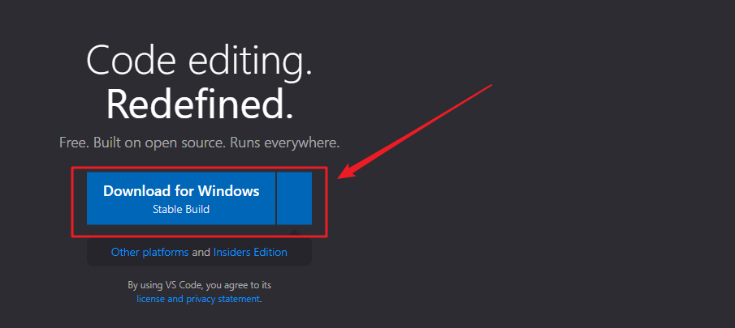
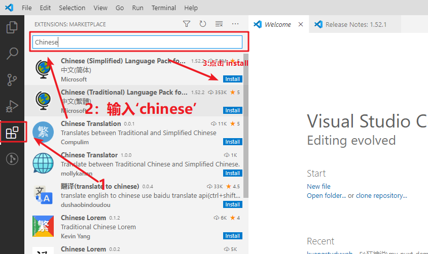
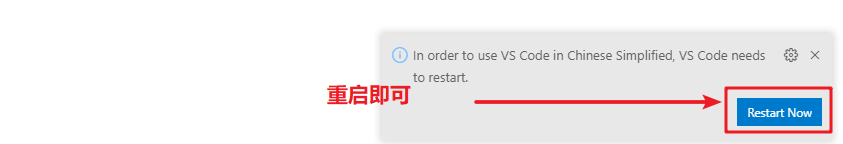
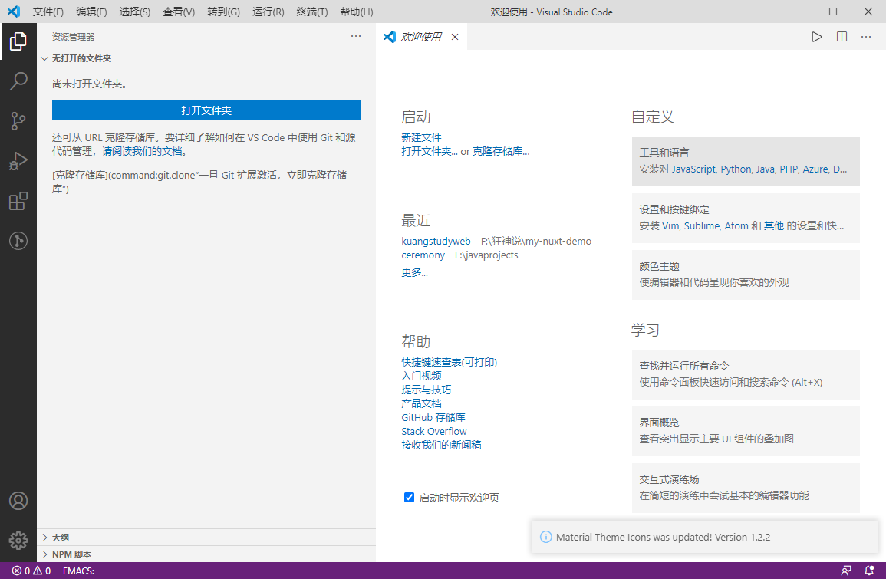
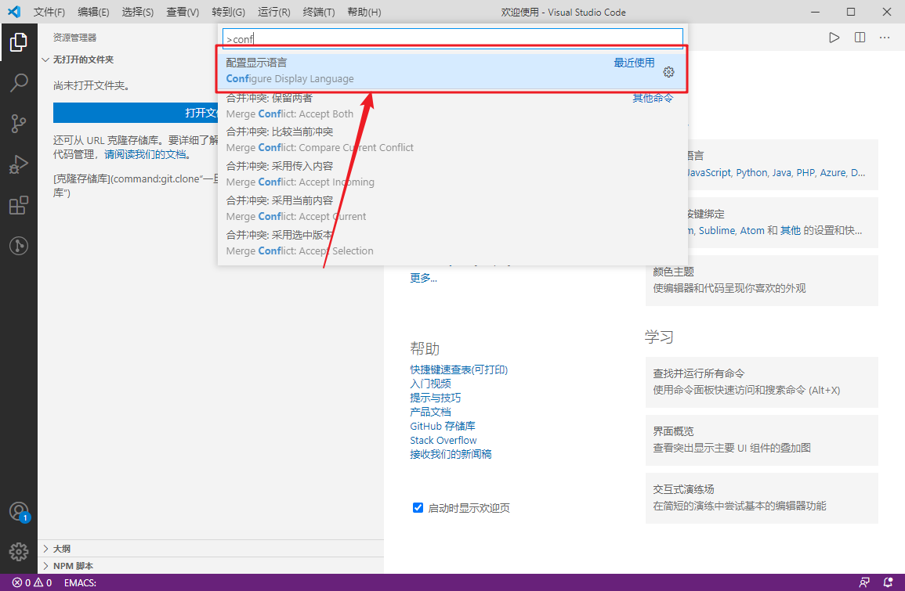
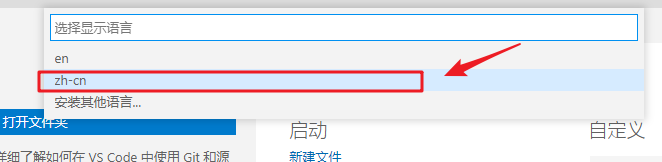
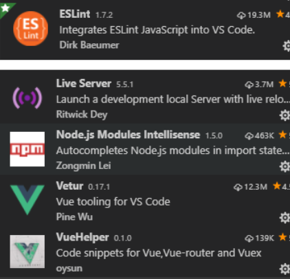

# 大前端进阶

## 课程目标

1、前端开发和前端开发工具
2、Nodejs安装及快速入门
3、Es6的新语法糖
4、Npm包管理器
5、Babel的安装作用
6、模块化管理
7、Webpack打包和编译
8、如何快速构建一个nodejs项目vue-element-admin

## 1. 概述和前端工具vscode安装

前端开发是创建Web页面或app等前端界面呈现给用户的过程，通过HTML，CSS及JavaScript以及衍生出来的各种技术、框架、解决方案，来实现互联网产品的用户界面交互 [1] 。它从网页制作演变而来，名称上有很明显的时代特征。在互联网的演化进程中，网页制作是Web1.0时代的产物，**==早期网站主要内容都是静态，以图片和文字为主==**，用户使用网站的行为也以浏览为主。随着互联网技术的发展和HTML5，CSS3的应用，现代网页更加美观，交互效果显著，功能更加强大。

移动互联网带来了大量高性能的移动终端设备以及快速的无线网络，HTML5，node.js的广泛应用，各类框架类库层出不穷。 

当下国内的大部分互联网公司只有前端工程师和后端工程师，中间层的工作有的由前端来完成，有的由后端来完成。

### 1.1 下载安装VScode

下载地址：https://code.visualstudio.com/

### 1.2 中文界面配置

1. 首先安装中文插件：Chinese (Simplified) Language Pack for Visual Studio Code
   

2. 右下角弹出是否重启vs，点击“yes”
   

   汉化成功

   

3. 有些机器重启后如果界面没有变化，则 点击 左边栏Manage -> Command Paletet…【Ctrl+Shift+p】
4. 在搜索框中输入“configure display language”，回车
   
5. 选择’zh-cn’
   

6. 重启vs

### 1.3 插件安装

为方便后续开发，建议安装如下插件

### 1.4 设置字体大小

左边栏Manage -> settings -> 搜索 “font” -> Font size

### 1.5 开启完整的Emmet语法支持

设置中搜索 Emmet：启用如下选项，必要时重启vs

### 1.1.5、视图

查看—> 外观—> 向左移动侧边栏