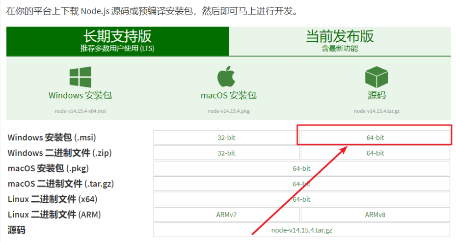
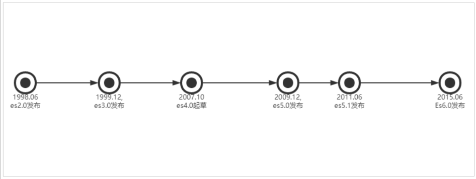
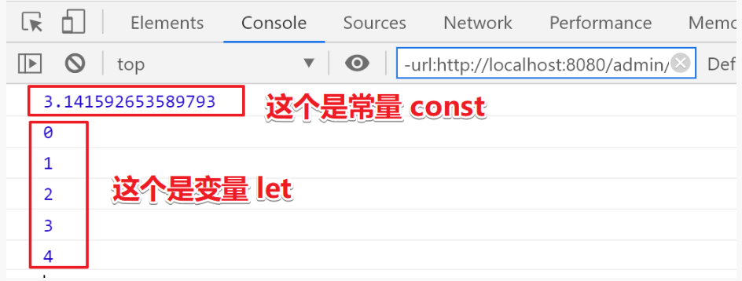

# 大前端进阶

## 课程目标

1、前端开发和前端开发工具
2、Nodejs安装及快速入门
3、Es6的新语法糖
4、Npm包管理器
5、Babel的安装作用
6、模块化管理
7、Webpack打包和编译
8、如何快速构建一个nodejs项目vue-element-admin

## 1. 概述和前端工具vscode安装

前端开发是创建Web页面或app等前端界面呈现给用户的过程，通过HTML，CSS及JavaScript以及衍生出来的各种技术、框架、解决方案，来实现互联网产品的用户界面交互 [1] 。它从网页制作演变而来，名称上有很明显的时代特征。在互联网的演化进程中，网页制作是Web1.0时代的产物，**==早期网站主要内容都是静态，以图片和文字为主==**，用户使用网站的行为也以浏览为主。随着互联网技术的发展和HTML5，CSS3的应用，现代网页更加美观，交互效果显著，功能更加强大。

移动互联网带来了大量高性能的移动终端设备以及快速的无线网络，HTML5，node.js的广泛应用，各类框架类库层出不穷。 

当下国内的大部分互联网公司只有前端工程师和后端工程师，中间层的工作有的由前端来完成，有的由后端来完成。

### 1.1 下载安装VScode

下载地址：https://code.visualstudio.com/


### 1.2 中文界面配置

1. 首先安装中文插件：Chinese (Simplified) Language Pack for Visual Studio Code
   

2. 右下角弹出是否重启vs，点击“yes”
   

   汉化成功

   

3. 有些机器重启后如果界面没有变化，则 点击 左边栏Manage -> Command Paletet…【Ctrl+Shift+p】
4. 在搜索框中输入“configure display language”，回车
   
5. 选择’zh-cn’
   

6. 重启vs

### 1.3 插件安装

为方便后续开发，建议安装如下插件


### 1.4 设置字体大小

左边栏Manage -> settings -> 搜索 “font” -> Font size

### 1.5 开启完整的Emmet语法支持

设置中搜索 Emmet：启用如下选项，必要时重启vs


### 1.1.5、视图

查看—> 外观—> 向左移动侧边栏


## 2. Node.js

### 2.1 Nodejs介绍与安装

目标： 了解nodejs、并且在本地安装好这个软件
官网： http://nodejs.cn/
介绍：

* Node 是一个让 JavaScript 运行在服务端的开发平台，它让 JavaScript 成为与PHP、Python、Perl、Ruby 等服务端语言平起平坐的脚本语言。  发布于2009年5月，由Ryan Dahl开发，实质是对Chrome V8引擎进行了封装。

* 简单的说 Node.js 就是运行在服务端的 JavaScript。 Node.js 是一个基于Chrome JavaScript 运行时建立的一个平台。底层架构是：javascript. 文件后缀：.js
* Node.js是一个事件驱动I/O服务端JavaScript环境，基于Google的V8引擎，V8引擎执行Javascript的速度非常快，性能非常好。


下载对应你系统的Node.js版本:
下载地址：https://nodejs.org/zh-cn/download
帮助文档：https://nodejs.org/zh-cn/docs
关于Nodejs：https://nodejs.org/zh-cn/about



安装默认安装即可，安装完成之后，查看是否安装成功：

```
node -v
```


**小结**

> Nodejs是一门计算机语言，运行在系统中的v8（jvm）引擎中。文件后缀是 `js` 运行的命令是：node

### 2.2 Nodejs入门

目标： 控制台输出字符串、使用函数、进行模块化编程

#### 1. 快速入门-Hello World

1. 创建文件夹 nodejs

2. 创建 helloworld.js

   * 类似于java中的`System.out.println("")`

     ```js
     console.log('Hello World!!!')
     ```

     运行：`node helloworld.js`

     结果：hello world!!!

3. 打开命令行终端：Ctrl + Shift + y

浏览器的内核包括两部分核心：

- DOM渲染引擎；
- java script 解析器（js引擎）
- js运行在浏览器内核中的js引擎内部

**小结**

==Node.js是脱离浏览器环境运行的JavaScript程序，基于V8 引擎==

#### 2. Node - 实现请求响应

1. 创建 httpserver.js ；

   ```js
   // 导入模块是require 就类似于import java.io 
   const http = require('http');
   // 1: 创建一个httpserver服务
   http.createServer(function(request,response){    
       // 浏览器怎么认识hello server!!!    
       
       //这句话的含义是：告诉浏览器将以text-plain去解析hello server 这段数据。  
       response.writeHead(200,{'Content-type':'text/plain'});   
       
       // 给浏览器输出内容    
       response.end("<strong>hello server!!!</strong>");
   }).listen(8888);
   console.log("你启动的服务是：http://localhpst:8888以启动成功!!");
   // 2: 监听一端口8888
   // 3: 启动运行服务 node httpserver.js
   // 4: 在浏览器访问http://localhost:8888
   ```

2. 运行服务器程序；

   ```bash
   node httpserver.js
   ```

3. 服务器启动成功后，在浏览器中输入：http://localhost:8888/ 查看webserver成功运行，并输出html页面
4. 停止服务：ctrl + c

#### 3. Node-操作MYSQL数据库

参考：https://www.npmjs.com/package/mysql

1. 安装mysql依赖

   ```bash
   npm install mysql
   ```

2. 定义db.js进行操作

   ```js
   //1: 导入mysql依赖包,  mysql属于第三方的模块就类似于 java.sql一样的道理
   var mysql = require("mysql");
   // 1: 创建一个mysql的Connection对象
   // 2: 配置数据连接的信息 
   var connection =mysql.createConnection({
       host:"127.0.0.1",
       port:3306,
       user:"root",
       password:"123456",
       database:"testdb"
   });
   // 3：开辟连接
   connection.connect();
   // 4: 执行curd
   connection.query("select * from kss_user",function(error,results,fields){
       // 如果查询出错，直接抛出
       if(error)throw error;
       // 查询成功
       console.log("results = ",results);
   });
   // 5: 关闭连接
   connection.end();
   // 最后一步：运行node db.js 查看效果
   ```

3. 新建数据库:`db_test`和表`kss_user`表

   ```mysql
   /*
    Navicat MySQL Data Transfer
    Source Server         : localhost
    Source Server Type    : MySQL
    Source Server Version : 60011
    Source Host           : localhost:3306
    Source Schema         : testdb
    Target Server Type    : MySQL
    Target Server Version : 60011
    File Encoding         : 65001
    Date: 20/01/2021 21:38:55
   */
   SET NAMES utf8mb4;
   SET FOREIGN_KEY_CHECKS = 0;
   -- ----------------------------
   -- Table structure for kss_user
   -- ----------------------------
   DROP TABLE IF EXISTS `kss_user`;
   CREATE TABLE `kss_user`  (
     `id` int(11) NOT NULL,
     `name` varchar(255) CHARACTER SET utf8 COLLATE utf8_general_ci NULL DEFAULT NULL,
     PRIMARY KEY (`id`) USING BTREE
   ) ENGINE = InnoDB CHARACTER SET = utf8 COLLATE = utf8_general_ci ROW_FORMAT = Compact;
   -- ----------------------------
   -- Records of kss_user
   -- ----------------------------
   INSERT INTO `kss_user` VALUES (1, '学相伴');
   INSERT INTO `kss_user` VALUES (2, '广东');
   SET FOREIGN_KEY_CHECKS = 1;
   ```

4. 运行db.js

   ```bash
   node db
   ```


> **如果想开发更复杂的基于Node.js的应用程序后台，需要进一步学习Node.js的Web开发相关框架 express，art-template、koa等**


## 3. Es6

### 3.1 ES6的概述

ECMAScript 6（简称ES6）是于2015年6月正式发布的JavaScript语言的标准，正式名为ECMAScript 2015（ES2015）。它的目标是使得JavaScript语言可以用来编写复杂的大型应用程序，成为企业级开发语言

**ECMAScript的快速发展：**



```tex
编程语言JavaScript是ECMAScript的实现和扩展 。ECMAScript是由ECMA（一个类似W3C的标准组织）参与进行标准化的语法规范。ECMAScript定义了：

[语言语法] – 语法解析规则、关键字、语句、声明、运算符等。

[类型]– 布尔型、数字、字符串、对象等。

[原型和继承]

内建对象和函数的

[标准库] – [JSON]、[Math]、[数组方法]、[对象自省方法]等。

ECMAScript标准不定义HTML或CSS的相关功能，也不定义类似DOM（文档对象模型）的[Web API]，这些都在独立的标准中进行定义。ECMAScript涵盖了各种环境中JS的使用场景，无论是浏览器环境还是类似[node.js]的非浏览器环境。

ECMAScript标准的历史版本分别是1、2、3、5。

那么为什么没有第4版？其实，在过去确实曾计划发布提出巨量新特性的第4版，但最终却因想法太过激进而惨遭废除（这一版标准中曾经有一个极其复杂的支持泛型和类型推断的内建静态类型系统）。

ES4饱受争议，当标准委员会最终停止开发ES4时，其成员同意发布一个相对谦和的ES5版本，随后继续制定一些更具实质性的新特性。这一明确的协商协议最终命名为“Harmony”，因此，ES5规范中包含这样两句话

ECMAScript是一门充满活力的语言，并在不断进化中。

未来版本的规范中将持续进行重要的技术改进

2009年发布的改进版本ES5，引入了[Object.create()]、[Object.defineProperty()]、[getters]和[setters]、[严格模式]以及[JSON]对象。

ES6: 是JavaScript语言的下一代标准，2015年6月正式发布。它的目标，是使得JavaScript语言可以用来编写复杂的大型应用程序，成为企业级开发语言。
```

**小结**：

ECMAScript是前端js的语法规范；可以应用在各种js环境中。如：浏览器或者node.js环境。
它有很多版本：es1/2/3/5/6，很多新特性，可以在js环境中使用这些新特性。

### 3.2 ES6的语法：let和const命令

> 变量和常量的严格区分。

**核心代码：**

```html
<!DOCTYPE html>
<html lang="en">
<head>
    <meta charset="UTF-8">
    <meta name="viewport" content="width=device-width, initial-scale=1.0">
    <meta http-equiv="X-UA-Compatible" content="ie=edge">
    <title>Document</title>
</head>
<body>
    <script>
         //传统定义变量和常量的方式 统一使用var
        var name = "学相伴";
        var link = "https://www.baidu.com";
        var PI = Math.PI;

        //ES6的定义方式
        let name2 = "关羽";
        let link2 = "https://www.baidu.com";
        //定义常量
        const PI2 = Math.PI;
        
         //let和const解决
        //1: var的变量穿透的问题
        for (var i=0; i<5; i++) {
            console.log(i);
        }
        //这里就造成了变量穿透,用let则不会
        console.log(i);
        
        //2: 常量修改的问题,const使常量无法修改
        const PI = Math.PI;
        PI = 100;
        console.log(PI);
        
        //在实际开发和生产中，如果是小程序，uniapp或者一些脚手架中，可以大胆的去使用let和const
        //但是如果是web开发，建议大家还是使用var,因为在一些低版本的浏览器中还是不支持let和const
    </script>
</body>
</html>
```



**小结**

* **let:** 可变变量
* **const:** 是常量
* **var:** 最原始。

### 3.3 ES6的语法：模板字符串

以前： 我们都是使用`` '   ``或者 ``"`` 来把字符串套起来

现在：``  ` `` 【反引号】

**第一个用途**：基本的字符串格式化。将表达式嵌入字符串中进行拼接。用${}来界定。

```js
//es5    
let name = 'itcast'    
console.log('hello ' + name)    //es6    
const name = 'itcast'    
console.log(`hello ${name}`) //hello itcast
```

**第二个用途**：在ES5时我们通过反斜杠``\``来做多行字符串或者字符串一行行拼接。ES6反引号``  ` `` 直接搞定。

```html
<script>
        //字符串会牵扯到动态部分
        var person = {
            name:"关羽",
            address:"家里",
            link:"https://www.baidu.com"
        };
        let string = "传统的: "+person.name + "正在" + person.address + "打开网站" + person.link;
        console.log(string);

        //es6的模板字符串
        let string2 = `ES6: ${person.name}正在${person.address}打开网站${person.link}`;
        console.log(string2);
    </script>
```

### 3.4 ES6的语法：函数默认参数与箭头函数

#### **函数默认参数**

在方法的参数后面加上一个默认值即可
**核心代码**
双击`espro6/demo03.html`运行如下：

```html
<script>
    //函数默认参数
    function sum(a=100,b=100) {
        return a + b;
    }
    var result = sum();
    console.log("result=",result);
</script>
```

#### ==**箭头函数lambda**==

箭头函数简化函数的定义，可以让我们不用使用function关键字

```js
/*
箭头函数最直观的三个特点。
    1不需要function关键字来创建函数
    2省略return关键字
    3继承当前上下文的 this 关键字
*/
```

<font color=red><b>核心代码</b></font>

```js
<script>
        //lambda,箭头函数-重点（在未来的项目开发中：比如小程序，uniapp，一些常见的脚手架大量使用）
        var sum = function(a,b) {
            return a + b;
        };
        //箭头函数 - 改进1
        var sum = (a,b) => {
            return a + b;
        }
        //箭头函数 - 改进2
        var sum = (a,b) => a + b;
        //如果逻辑代码仅有return可以直接省去，但有逻辑体则不行，比如：
        //如果只有一个参数可以省略括号
        var sum2 = (a,b) => {
            var num = a+b;
            return num;
        }
        
        var arr = [1,2,3,4,5,6];
        var newarr = arr.map(function(obj){
            return obj*2;
        });
        //改变
        var newarr = arr.map((obj)=>obj*2);
    </script>
```

### 3.5 ES6的语法：对象初始化简写

<font color=red><b>核心代码</b></font>

> 它是指：如果一个对象中的key和value的名字一样的情况下可以定义成一个。

```html
<script>
    var info = {
        title:"学相伴",
        link:"http://www.kuangstudy.com",
        go:function(){
            console.log("我骑着小黄车来上班");
        }
    };

    //es6简写
    //因为对象是key:value存在
    //1: 如果key和变量的名字一致，可以只定义一次即可
    //2: 如果value是一个函数，可以把`:function`全部去除，只剩下括号即可
    let title = "学相伴";
    let link = "http://www.kuangstudy.com";
    let info2 = {
        title,
        link,
        go(){
            console.log("我骑着小黄车来上班");
        }
    };
    console.log(info2);
</script>
```

案例：

```html
<body>
    <form action="">
        <p>账号：<input type="text" id="account"></p>
        <p>密码：<input type="text" id="password"></p>
        <p><input type="button" value="登录" id="loginbtn"></p>
    </form>

    <script>
        // document.getElementById("loginbtn").onclick = function() {}
        $("#loginbtn").on("click"),function(){
            let account = $("#account").val();
            let password = $("#password").val();
            //对象简写的应用场景
            let params = {account, password};
            //执行异步请求
            $.ajax({
                type:"post",
                url:"xxx",
                data:params,
                success(){}
            }) 
        }
    </script>
</body>
```

### 3.6 ES6的语法：对象解构

<font color=red><b>核心代码</b></font>

>  对象解构 —- es6提供一些获取快捷获取对象属性和行为方式

```html
<script>
    //对象是key:value存在，获取对象属性和方法的方式有两种
    //1:通过 .
    //2:通过 []
    let title = "学相伴";
    let link = "http://www.kuangstudy.com";
    let info2 = {
        title,
        link,
        go(){
            console.log("我骑着小黄车来上班");
        }
    };
    //通过.的方式
    console.log(info2.title);
    info2.go();

    //通过[]的方式
    console.log(info2["title"]);
    info2["go"]();

    //es6对象解构 - 其实就是快速获取属性和方法的一种形式
    let {title,link,go} = info2;
    //还原代码
    let title = info2.title;
    let link = info2.link;

    //在实际项目中一般使用点，会方便许多，
    //但是如果key是变量的话就不能使用点了，js会理解变量为对象的key值，造成混淆
    var v3 = obj[key];//key是一个变量
</script>
```

### 3.7 ES6的语法：传播操作符【…】

> 把一个对象的属性传播到另外一个对象中

**Spread Operator**

<font color=red><b>核心代码</b></font>

```html
<script>
    //对象传播操作符 ...
    let person = {
        name:"学相伴",
        address:"广东",
        link:"htpps://www.kuangstudy.com",
        phone:1234567,
        go(){
            console.log("开始上班了");
        }
    }
    //解构出来,剩余部分传给person2
    var {name,address,...person2} = person;
    console.log(name);
    console.log(address);
    console.log(person2);

    //java --后台
    //数据格式: var userPage = {page:10,users:[{},{}],pageNo:1,pageSize:100,total:100};
    //异步请求
    //$.post("/user/search",function(){res}{})
    //res = {page:10,users:[{},{}],pageNo:1,pageSize:100,total:100}
    var userPage = {page:10,users:[{},{}],pageNo:1,pageSize:100,total:100};
    var {users,...userPage2} = userPage;
</script>
```

### 3.8 ES6的语法：数组map和reduce方法使用(**了解**)

**目标**：数组中map方法的应用场景

**讲解**：

数组中新增了map和reduce方法。

<strong style="font-size:24px">map()</strong>

方法可以将原数组中的所有元素通过一个函数进行处理并放入到一个新数组中并返回该新数组。

举例：有一个字符串数组，希望转为int数组

```html
<script>
        //要对arr数组每个元素*2
        let arr = [1,2,3,4,5,6,7];
        //传统的方式
        let newarr = [];
        for (let i=0;i<arr.length;i++){
            newarr.push(arr[i]*2);
        }
        console.log(newarr);

        //map -- 自带的循环，并且会把处理的值回填对应的位置
        var newarr2 = arr.map(ele => ele * 2);
        console.log(newarr2);

        //map处理对象的数据
        var users = [{age:10,name:"小学"},{age:12,name:"小相"},{age:15,name:"小伴"}];
        var newusers = users.map(function(ele){
            ele.age += 1;
            return ele;
        })
    </script>
```

<strong style="font-size:24px">reduce()</strong>

reduce(function(),初始值（可选）) ：

接收一个函数（必须）和一个初始值（可选），该函数接收两个参数：

- 第一个参数是上一次reduce处理的结果
- 第二个参数是数组中要处理的下一个元素
  reduce() 会从左到右依次把数组中的元素用reduce处理，并把处理的结果作为下次reduce的第一个参数。如果是 第一次，会把前两个元素作为计算参数，或者把用户指定的初始值作为起始参数

```html
<script>
    /*********************************reduce*********************/
    //reduce 计算方法 
    let arr2 = [1, 2, 3, 4, 5, 6, 7, 8, 9, 10];
    // 箭头写法 -- 1到10相加 
    var result = arr2.reduce((a, b) => a + b);
    // 原始写法  -- 1到10相加
    //var result = arr2.reduce(function(a,b){
    //    return a+b;
    //})
    console.log(result);
    /*********************************end reduce*********************/
</script>
```

## 4. NPM包管理器

### 4.1 简介

官方网站：https://www.npmjs.com/
NPM全称Node Package Manager，是Node.js包管理工具，是全球最大的模块生态系统，里面所有的模块都是开源免费的；也是Node.js的包管理工具，相当于前端的Maven 。

```bash
#在命令提示符输入 npm -v 可查看当前npm版本
npm -v
```

### 4.2 使用npm管理项目

1、创建文件夹npm

2、项目初始化

```bash
#建立一个空文件夹，在命令提示符进入该文件夹  执行命令初始化
npm init
#按照提示输入相关信息，如果是用默认值则直接回车即可。
#package name: 项目名称
#version: 项目版本号
#description: 项目描述
#entry point: (index.js)入口函数
#test command:
#git repository
#keywords: {Array}关键词，便于用户搜索到我们的项目
#author
#license
#最后会生成package.json文件，这个是包的配置文件，相当于maven的pom.xml
#我们之后也可以根据需要进行修改。
```

```bash
#如果想直接生成 package.json 文件，那么可以使用命令
npm init -y
```

### 4.3 修改npm镜像

1. 修改npm镜像

> NPM官方的管理的包都是从 [http://npmjs.com下载的，但是这个网站在国内速度很慢。](http://npmjs.xn--com%2C-794fngl0fq9g8opjmak71erncc6ioqt1y1ddrow2r8u2ecpbg0b./)
>
> 这里推荐使用淘宝 NPM 镜像 http://npm.taobao.org/
>
> 淘宝 NPM 镜像是一个完整 npmjs.com 镜像，同步频率目前为 10分钟一次，以保证尽量与官方服务同步。

2. 设置镜像地址

```bash
#经过下面的配置，以后所有的 npm install 都会经过淘宝的镜像地址下载
npm config set registry https://registry.npm.taobao.org 
#查看npm配置信息npm 
config list
```

### 4.4 npm install

```bash
#使用 npm install 安装依赖包的最新版，
#模块安装的位置：项目目录\node_modules
#安装会自动在项目目录下添加 package-lock.json文件，这个文件帮助锁定安装包的版本
#同时package.json 文件中，依赖包会被添加到dependencies节点下，类似maven中的 <dependencies>
npm install jquery
#如果安装时想指定特定的版本
npm install jquery@2.1.x
#devDependencies节点：开发时的依赖包，项目打包到生产环境的时候不包含的依赖
#使用 -D参数将依赖添加到devDependencies节点
npm install --save-dev eslint
#或
npm install -D eslint
#全局安装
#Node.js全局安装的npm包和工具的位置：用户目录\AppData\Roaming\npm\node_modules
#一些命令行工具常使用全局安装的方式
npm install -g webpack
#npm管理的项目在备份和传输的时候一般不携带node_modules文件夹
npm install #根据package.json中的配置下载依赖，初始化项目

```

```json
//记录在package.json中的依赖
"dependencies":{
    "jquery":"^3.5.1",
    "mysql":"^2.18.1",
    "redis":"^3.0.2",
    "vue":"^2.6.12",
}
//通过npm install 可以直接把package.json所依赖的模块全部自动下载下来
//这样可以避免重复下载模块，很方便去集成第三方模块
//为什么不直接点拷贝：node_modules呢，当然可以，但下载模块的依赖过多文件过大，混乱不堪，一般几万到几十万的文件
```

```bash
#如何下载多个？
npm install jquery vue redis musql
#如何下载指定版本号 https://www.npmjs.com/package/redis
npm install xxx@版本号

#如何卸载模块
npm uninstall vue jquery
```

### 4.5 其他命令

```bash
#更新包（更新到最新版本）
npm update 包名
#全局更新
npm update -g 包名
#卸载包
npm uninstall 包名
#全局卸载
npm uninstall -g 包名
```