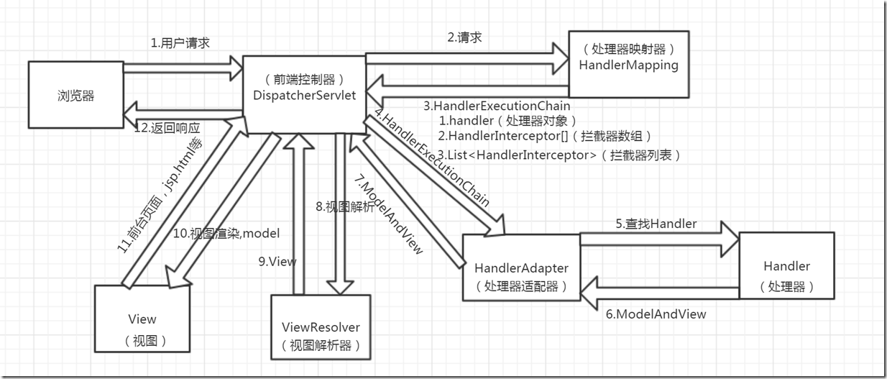
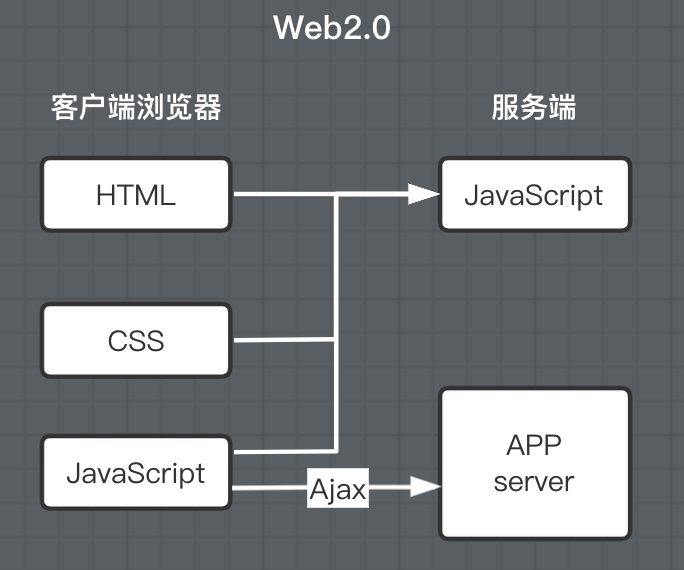
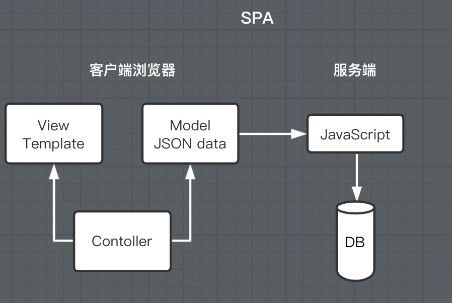
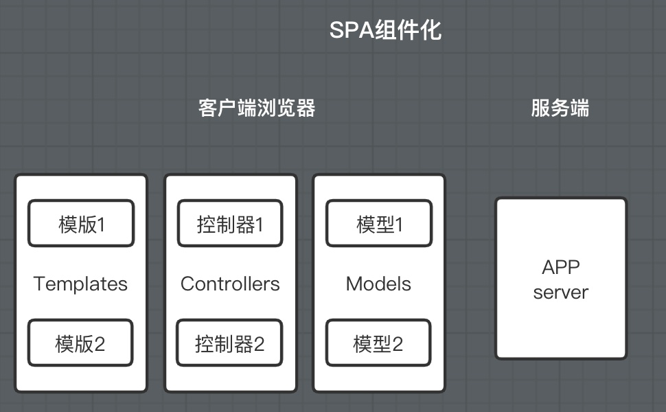
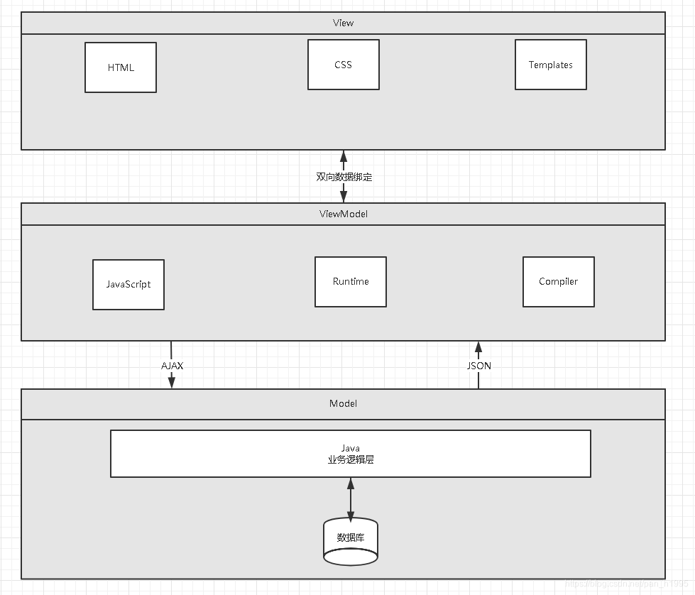

# Vue

## 前端概述

##### 前端四要素

* 逻辑
  * 判断
  * 循环
* 事件
  * 浏览器事件： window, document
  * Dom事件: 增，删，遍历，修改节点元素内容
  * jQuery
* 视图
  * html
  * css
* 通信
  * ajax

**前端化工程： SSM + Vue + BootStrap**


## 1. 前端核心分析

### 1.1 概述

Soc原则：关注点分离原则

Vue 的核心库只关注视图层，方便与第三方库或既有项目整合。

HTML + CSS + JS : 视图 ： 给用户看，刷新后台给的数据

网络通信 ： axios

页面跳转 ： vue-router

状态管理：vuex

Vue-UI : ICE , Element UI

**前端三大框架**：Angular、React、Vue

Vue (读音/vju/, 类似于view)是一套用于构建用户界面的渐进式框架，发布于2014年2月。与其它大型框架不同的是，Vue被设计为可以自底向上逐层应用。**Vue的核心库只关注视图层**，不仅易于上手，还便于与第三方库(如: vue-router: 跳转，vue-resource: 通信，vuex:管理)或既有项目整合

### **1.2 前端三要素**

- HTML（结构）：超文本标记语言（Hyper Text Markup Language），决定网页的结构和内容
- CSS（表现）：层叠样式表（Cascading Style Sheets），设定网页的表现样式。
- JavaScript（行为）：是一种弱类型脚本语言，其源码不需经过编译，而是由浏览器解释运行，用于控制网页的行为

### **1.3 结构层（HTML）**

太简单，略

### **1.4 表现层（CSS）**

CSS层叠样式表是一门标记语言，并不是编程语言，因此不可以自定义变量，不可以引用等，换句话说就是不具备任何语法支持，它主要缺陷如下：

- 语法不够强大，比如**无法嵌套书写**，导致模块化开发中需要书写很多重复的选择器；
- **没有变量和合理的样式复用机制**，使得逻辑上相关的属性值必须以字面量的形式重复输出，导致**难以维护**；这就导致了我们在工作中无端增加了许多工作量。为了解决这个问题，前端开发人员会使用一种称之为【CSS预处理器】的工具,提供CSS缺失的样式层复用机制、减少冗余代码，提高样式代码的可维护性。大大的提高了前端在样式上的开发效率。

什么是CSS预处理器:

CSS预处理器定义了一种新的语言，其基本思想是，用一种专门的编程语言，为CSS增加了一些编程的特性，将CSS作为目标生成文件，然后开发者就只需要使用这种语言进行CSS的编码工作。转化成通俗易懂的话来说就是“用一种专门的编程语言，进行Web页面样式设计，再通过编译器转化为正常的CSS文件，以供项目使用”。

常用的CSS预处理器有哪些

- **SASS**：基于Ruby ，通过服务端处理，功能强大。解析效率高。需要学习Ruby语言，上手难度高于LESS。
- **LESS**：基于NodeJS，通过客户端处理，使用简单。功能比SASS简单，解析效率也低于SASS，但在实际开发中足够了，所以如果我们后台人员如果需要的话，建议使用LESS。

### **1.5 行为层（JavaScript）**

JavaScript**一门弱类型脚本语言，其源代码在发往客户端运行之前不需要经过编译，而是将文本格式的字符代码发送给浏览器，由浏览器解释运行。**

Native 原生JS开发

原生JS开发，也就是让我们按照【ECMAScript】标准的开发方式，简称ES，特点是所有浏览器都支持。截至到当前，ES标准以发布如下版本：

- ES3
- ES4（内部，未正式发布）
- ES5（全浏览器支持）
- ES6（常用，当前主流版本：webpack打包成为ES5支持）
- ES7
- ES8
- ES9（草案阶段）

区别就是逐步增加新特性。
TypeScript 微软的标准
TypeScript是一种由微软开发的自由和开源的编程语言。它是JavaScript的一个超集， 而且本质上向这个语言添加了可选的静态类型和基于类的面向对象编程。由安德斯·海尔斯伯格(C#、Delphi、TypeScript之父； .NET创立者) 主导。该语言的特点就是除了具备ES的特性之外还纳入了许多不在标准范围内的新特性，所以会导致很多浏览器不能直接支持TypeScript语法， 需要编译后(编译成JS) 才能被浏览器正确执行。

**JavaScript框架**

- JQuery：大家熟知的JavaScript库，优点就是简化了DOM操作，缺点就是DOM操作太频繁，影响前端性能；在前端眼里使用它仅仅是为了兼容IE6，7，8；
- Angular：Google收购的前端框架，由一群Java程序员开发，其特点是将后台的MVC模式搬到了前端并增加了**模块化开发**的理念，与微软合作，采用了TypeScript语法开发；对后台程序员友好，对前端程序员不太友好；最大的缺点是版本迭代不合理（如1代–>2 代，除了名字，基本就是两个东西；截止发表博客时已推出了Angular6）
- React：Facebook 出品，一款高性能的JS前端框架；特点是提出了新概念 【**虚拟DOM**】用于减少真实 DOM 操作，在内存中模拟 DOM操作，有效的提升了前端渲染效率；缺点是使用复杂，因为需要额外学习一门【JSX】语言；
- **Vue**：一款渐进式 JavaScript 框架，所谓渐进式就是逐步实现新特性的意思，如实现模块化开发、路由、状态管理等新特性。其特点是综合了 Angular（模块化）和React(虚拟 DOM) 的优点；
- **Axios**：前端通信框架；因为 Vue 的边界很明确，就是为了处理 DOM，所以并不具备通信能力，此时就需要额外使用一个通信框架与服务器交互；当然也可以直接选择使用jQuery 提供的AJAX 通信功能；

## 2. 前端发展史

### **2.1 UI框架**

- Ant-Design：阿里巴巴出品，基于React的UI框架
- ElementUI、iview、ice：饿了么出品，基于Vue的UI框架
- BootStrap：Teitter推出的一个用于前端开发的开源工具包
- AmazeUI：又叫“妹子UI”，一款HTML5跨屏前端框架

### **2.2 JavaScript构建工具**

- Babel：JS编译工具，主要用于浏览器不支持的ES新特性，比如用于编译TypeScript
- WebPack：模块打包器，主要作用就是打包、压缩、合并及按序加载
- 注：以上知识点已将WebApp开发所需技能全部梳理完毕

### **2.3 三端同一**

**混合开发（Hybrid App）**

主要目的是实现一套代码三端统一（PC、Android：.apk、iOS：.ipa）并能够调用到设备底层硬件（如：传感器、GPS、摄像头等），打包方式主要有以下两种：

- 云打包：HBuild -> HBuildX，DCloud 出品；API Cloud
- 本地打包： Cordova（前身是 PhoneGap）

**微信小程序**

详见微信官网，这里就是介绍一个方便微信小程序UI开发的框架：WeUI

### **2.4 后端技术**

前端人员为了方便开发也需要掌握一定的后端技术但我们Java后台人员知道后台知识体系极其庞大复杂，所以为了方便前端人员开发后台应用，就出现了Node JS这样的技术。Node JS的作者已经声称放弃Node JS(说是架构做的不好再加上笨重的node modules，可能让作者不爽了吧)开始开发全新架构的De no
既然是后台技术，那肯定也需要框架和项目管理工具， Node JS框架及项目管理工具如下：

- Express：Node JS框架
- Koa：Express简化版
- NPM：项目综合管理工具，类似于Maven
- YARN：NPM的替代方案，类似于Maven和Gradle的关系

### **2.5 主流前端框架**

Vue.js

**iView**

iview是一个强大的基于Vue的UI库， 有很多实用的基础组件比element ui的组件更丰富， 主要服务于PC界面的中后台产品。使用单文件的Vue组件化开发模式基于npm+webpack+babel开发， 支持ES 2015高质量、功能丰富友好的API， 自由灵活地使用空间。

- 官网地址
- Github
- iview-admin

备注：属于前端主流框架，选型时可考虑使用，主要特点是移动端支持较多

**Element UI**

Element是饿了么前端开源维护的Vue UI组件库， 组件齐全， 基本涵盖后台所需的所有组件，文档讲解详细， 例子也很丰富。主要用于开发PC端的页面， 是一个质量比较高的Vue UI组件库。
·官网地址
·Git hub
·vue-element-admin
备注：属于前端主流框架，选型时可考虑使用，主要特点是桌面端支持较多

**ICE**

飞冰是阿里巴巴团队基于React/Angular/Vue的中后台应用解决方案， 在阿里巴巴内部， 已经有270多个来自几乎所有BU的项目在使用。飞冰包含了一条从设计端到开发端的完整链路，帮助用户快速搭建属于自己的中后台应用。

- 官网地址。
- Git hub

备注：主要组件还是以React为主， 截止2019年02月17日更新博客前对Vue的支持还不太完善，目前尚处于观望阶段

**VantUI**

Vant UI是有赞前端团队基于有赞统一的规范实现的Vue组件库， 提供了-整套UI基础组件和业务组件。通过Vant， 可以快速搭建出风格统一的页面，提升开发效率。

**AtUI**

at-ui是一款基于Vue 2.x的前端UI组件库， 主要用于快速开发PC网站产品。它提供了一套n pm+web pack+babel前端开发工作流程， CSS样式独立， 即使采用不同的框架实现都能保持统一的UI风格。
·官网地址
·Git hub

**Cube Ul**

cube-ui是滴滴团队开发的基于Vue js实现的精致移动端组件库。支持按需引入和后编译， 轻量灵活；扩展性强，可以方便地基于现有组件实现二次开发。

- 官网地址
- Github

混合开发

**Flutter**

Flutter是谷歌的移动端UI框架， 可在极短的时间内构建Android和iOS上高质量的原生级应用。Flutter可与现有代码一起工作， 它被世界各地的开发者和组织使用， 并且Flutter是免费和开源的。

- 官网地址

Github
备注：Google出品， 主要特点是快速构建原生APP应用程序， 如做混合应用该框架为必选框架
**lonic**

lonic既是一个CSS框架也是一个Javascript UI库， lonic是目前最有潜力的一款HTML 5手机应用开发框架。通过SASS构建应用程序， 它提供了很多UI组件来帮助开发者开发强大的应用。它使用JavaScript MV VM框架和Angular JS/Vue来增强应用。提供数据的双向绑定， 使用它成为Web和移动开发者的共同选择。

官网地址
·官网文档
·Git hub

- 微信小程序
- **mpvue**

mpvue是美团开发的一个使用Vue.js开发小程序的前端框架， 目前支持微信小程序、百度智能小程序，头条小程序和支付宝小程序。框架基于Vue.js， 修改了的运行时框架runtime和代码编译器compiler实现， 使其可运行在小程序环境中， 从而为小程序开发引入了Vue.js开发体验。
·官网地址
·Git hub
备注：完备的Vue开发体验， 井且支持多平台的小程序开发， 推荐使用

**WeUI**

WeUI是一套同微信原生视觉体验一致的基础样式库， 由微信官方设计团队为微信内网页和微信小程序量身设计， 令用户的使用感知更加统一。包含button、cell、dialog、toast、article、icon等各式元素。

- 官网地址
- Github


## 3. 了解前后分离的演变史

为什么需要前后分离

### **3.1 后端为主的MVC时代**

为了降低开发的复杂度， 以后端为出发点， 比如：Struts、Spring MVC等框架的使用， 就是后端的MVC时代；
以SpringMVC流程为例：



- 发起请求到前端控制器(Dispatcher Servlet)
- 前端控制器请求HandlerMapping查找Handler，可以根据xml配置、注解进行查找
- 处理器映射器HandlerMapping向前端控制器返回Handler
- 前端控制器调用处理器适配器去执行Handler
- 处理器适配器去执行Handler
- Handler执行完成给适配器返回ModelAndView
- 处理器适配器向前端控制器返回ModelAndView，ModelAndView是SpringMvc框架的一个底层对象，包括Model和View
- 前端控制器请求视图解析器去进行视图解析，根据逻辑视图名解析成真正的视图(JSP)
- 视图解析器向前端控制器返回View
- 前端控制器进行视图渲染，视图渲染将模型数据(在ModelAndView对象中)填充到request域
- 前端控制器向用户响应结果

优点

* MVC是一个非常好的协作模式， 能够有效降低代码的耦合度从架构上能够让开发者明白代码应该写在哪里。为了让View更纯粹， 还可以使用Thyme leaf、Frree marker等模板引擎， 使模板里无法写入Java代码， 让前后端分工更加清晰。

缺点

- 前端开发重度依赖开发环境，开发效率低，这种架构下，前后端协作有两种模式：
  - 第一种是前端写DEMO， 写好后， 让后端去套模板。好处是DEMO可以本地开发， 很高效。不足是还需要后端套模板，有可能套错，套完后还需要前端确定，来回沟通调整的成本比较大；
  - 另一种协作模式是前端负责浏览器端的所有开发和服务器端的View层模板开发。好处是UI相关的代码都是前端去写就好，后端不用太关注，不足就是前端开发重度绑定后端环境，环境成为影响前端开发效率的重要因素。
- 前后端职责纠缠不清：模板引擎功能强大，依旧可以通过拿到的上下文变量来实现各种业务逻辑。这样，只要前端弱势一点，往往就会被后端要求在模板层写出不少业务代码，还有一个很大的灰色地带是Controller， 页面路由等功能本应该是前端最关注的， 但却是由后端来实现。Controller本身与Model往往也会纠缠不清，看了让人咬牙的业务代码经常会出现在Controller层。这些问题不能全归结于程序员的素养， 否则JSP就够了。
- 对前端发挥的局限性：性能优化如果只在前端做空间非常有限，于是我们经常需要后端合作，但由于后端框架限制，我们很难使用[Comet】、【Big Pipe】等技术方案来优化性能。

注：在这期间(2005年以前) ， 包括早期的JSP、PHP可以称之为Web 1.0时代。在这里想说一句， 如果你是一名Java初学者， 请你不要再把一些陈旧的技术当回事了， 比如JSP， 因为时代在变、技术在变、什么都在变(引用扎克伯格的一句话：唯一不变的是变化本身)；当我们去给大学做实训时，有些同学会认为我们没有讲什么干货，其实不然，只能说是你认知里的干货对于市场来说早就过时了而已

### **3.2 基于AJAX带来的SPA时代**

时间回到2005年Ajax(Asynchronous JavaScript And XML， 异步JavaScript和XML，老技术新用法)被正式提出并开始使用CDN作为静态资源存储， 于是出现了JavaScript王者归来(在这之前JS都是用来在网页上贴狗皮膏药广告的) 的SPA(Single Page Application) 单页面应用时代。



优点
这种模式下， **前后端的分工非常清晰， 前后端的关键协作点是AJAX接口。**看起来是如此美妙， 但回过头来看看的话， 这与JSP时代区别不大。复杂度从服务端的JSP里移到了浏览器的JavaScript，浏览器端变得很复杂。类似Spring MVC， 这个时代开始出现浏览器端的分层架构：



缺点

- 前后端接口的约定：如果后端的接口一塌糊涂，如果后端的业务模型不够稳定，那么前端开发会很痛苦；不少团队也有类似尝试，通过接口规则、接口平台等方式来做。有了和后端一起沉淀的接口规则，还可以用来模拟数据，使得前后端可以在约定接口后实现高效并行开发。
- 前端开发的复杂度控制：SPA应用大多以功能交互型为主，JavaScript代码过十万行很正常。大量JS代码的组织，与View层的绑定等，都不是容易的事情。

### **3.3 前端为主的MV\*时代**

此处的MV*模式如下：

- MVC(同步通信为主) ：Model、View、Controller
- MVP(异步通信为主) ：Model、View、Presenter
- MVVM(异步通信为主)：Model、View、View Model为了降低前端开发复杂度，涌现了大量的前端框架，比如：Angular JS、React、Vue.js、Ember JS等， 这些框架总的原则是先按类型分层， 比如Templates、Controllers、Models， 然后再在层内做切分，如下图：




优点

- 前后端职责很清晰：前端工作在浏览器端，后端工作在服务端。清晰的分工，可以让开发并行，测试数据的模拟不难， 前端可以本地开发。后端则可以专注于业务逻辑的处理， 输出RESTful等接口。
- 前端开发的复杂度可控：前端代码很重，但合理的分层，让前端代码能各司其职。这一块蛮有意思的，简单如模板特性的选择，就有很多很多讲究。并非越强大越好，限制什么，留下哪些自由，代码应该如何组织，所有这一切设计，得花一本书的厚度去说明。
- 部署相对独立：可以快速改进产品体验

缺点
- 代码不能复用。比如后端依旧需要对数据做各种校验，校验逻辑无法复用浏览器端的代码。如果可以复用，那么后端的数据校验可以相对简单化。
- 全异步， 对SEO不利。往往还需要服务端做同步渲染的降级方案。
- 性能并非最佳，特别是移动互联网环境下。
- SPA不能满足所有需求， 依旧存在大量多页面应用。URL Design需要后端配合， 前端无法完全掌控。

### **3.4 Node JS带来的全栈时代**

前端为主的MV*模式解决了很多很多问题， 但如上所述， 依旧存在不少不足之处。随着Node JS的兴起， JavaScript开始有能力运行在服务端。这意味着可以有一种新的研发模式。

在这种研发模式下，前后端的职责很清晰。对前端来说，两个UI层各司其职：

- Front-end Ul layer处理浏览器层的展现逻辑。通过CSS渲染样式， 通过JavaScript添加交互功能， HTML的生成也可以放在这层， 具体看应用场景。
- Back-end Ul layer处理路由、模板、数据获取、Cookie等。通过路由， 前端终于可以自主把控URL Design， 这样无论是单页面应用还是多页面应用， 前端都可以自由调控。后端也终于可以摆脱对展现的强关注，转而可以专心于业务逻辑层的开发。通过Node， WebServer层也是JavaScript代码， 这意味着部分代码可前后复用， 需要SEO的场景可以在服务端同步渲染，由于异步请求太多导致的性能问题也可以通过服务端来缓解。前一种模式的不足，通过这种模式几乎都能完美解决掉。*与JSP模式相比， 全栈模式看起来是一种回归， 也的确是一种向原始开发模式的回归， 不过是一种螺旋上升式的回归。**基于Node JS的全栈模式， 依旧面临很多挑战：*
- 需要前端对服务端编程有更进一步的认识。比如TCP/IP等网络知识的掌握。
- Node JS层与Java层的高效通信。Node JS模式下， 都在服务器端， RESTful HTTP通信未必高效， 通过SOAP等方式通信更高效。一切需要在验证中前行。
- 对部著、运维层面的熟练了解，需要更多知识点和实操经验。
- 大量历史遗留问题如何过渡。这可能是最大最大的阻力。
- *注：看到这里，相信很多同学就可以理解，为什么我总在课堂上说：“前端想学后台很难，而我们后端程序员学任何东西都很简单”；就是因为我们后端程序员具备相对完善的知识体系。*

全栈!So Easy!

### **3.5 总结**

综上所述，模式也好，技术也罢，没有好坏优劣之分，只有适合不适合；前后分离的开发思想主要是基于Soc(关注度分离原则)，上面种种模式，都是让前后端的职责更清晰，分工更合理高效。


## **4. 第一个Vue程序**

### **4.1 什么是MVVM**

MVVM（Model-View-ViewModel）是一种软件设计模式，由微软WPF（用于替代WinForm，以前就是用这个技术开发桌面应用程序的）和Silverlight（类似于Java Applet，简单点说就是在浏览器上运行WPF）的架构师Ken Cooper和Ted Peters开发，是一种简化用户界面的**事件驱动编程方式**。由John Gossman（同样也是WPF和Sliverlight的架构师）与2005年在他的博客上发表。

MVVM源自于经典的MVC（Model-View-Controller）模式。MVVM的核心是ViewModel层，负责转换Model中的数据对象来让数据变得更容易管理和使用。其作用如下：

- 该层向上与视图层进行双向数据绑定
- 向下与Model层通过接口请求进行数据交互


MVVM已经相当成熟了，主要运用但不仅仅在网络应用程序开发中。当下流行的MVVM框架有Vue.js，Anfular JS

### **4.2 为什么要使用MVVM**

MVVM模式和MVC模式一样，主要目的是分离视图（View）和模型（Model），有几大好处

- **低耦合**：视图（View）可以独立于Model变化和修改，一个ViewModel可以绑定到不同的View上，当View变化的时候Model可以不变，当Model变化的时候View也可以不变。
- **可复用**：你可以把一些视图逻辑放在一个ViewModel里面，让很多View重用这段视图逻辑。
- **独立开发**：开发人员可以专注于业务逻辑和数据的开发（ViewMode），设计人员可以专注于页面设计。
- **可测试**：界面素来是比较难以测试的，而现在测试可以针对ViewModel来写。

 

**（1）View**

View是视图层， 也就是用户界面。前端主要由HTH L和csS来构建， 为了更方便地展现vi eu to del或者Hodel层的数据， 已经产生了各种各样的前后端模板语言， 比如FreeMarker，Thyme leaf等等， 各大MV VM框架如Vue.js.Angular JS， EJS等也都有自己用来构建用户界面的内置模板语言。

**（2）Model**

Model是指数据模型， 泛指后端进行的各种业务逻辑处理和数据操控， 主要围绕数据库系统展开。这里的难点主要在于需要和前端约定统一的接口规则

**（3）ViewModel**

ViewModel是由前端开发人员组织生成和维护的视图数据层。在这一层， 前端开发者对从后端获取的Model数据进行转换处理， 做二次封装， 以生成符合View层使用预期的视图数据模型。
  需要注意的是View Model所封装出来的数据模型包括视图的状态和行为两部分， 而Model层的数据模型是只包含状态的

- 比如页面的这一块展示什么，那一块展示什么这些都属于视图状态(展示)
- 页面加载进来时发生什么，点击这一块发生什么，这一块滚动时发生什么这些都属于视图行为(交互)

视图状态和行为都封装在了View Model里。这样的封装使得View Model可以完整地去描述View层。由于实现了双向绑定， View Model的内容会实时展现在View层， 这是激动人心的， 因为前端开发者再也不必低效又麻烦地通过操纵DOM去更新视图。
  MVVM框架已经把最脏最累的一块做好了， 我们开发者只需要处理和维护View Model， 更新数据视图就会自动得到相应更新，真正实现事件驱动编程。
  **View层展现的不是Model层的数据， 而是ViewModel的数据， 由ViewModel负责与Model层交互，获取和更新数据， 这就完全解耦了View层和Model层， 这个解耦是至关重要的， 它是前后端分离方案实施的重要一环。**

### **4.3 Vue**

Vue(读音/vju/， 类似于view) 是一套用于构建用户界面的渐进式框架， 发布于2014年2月。与其它大型框架不同的是， Vue被设计为可以自底向上逐层应用。Vue的核心库只关注视图层， 不仅易于上手， 还便于与第三方库(如：vue-router，vue-resource，vue x) 或既有项目整合。

（1）MVVM模式的实现者

- Model：模型层， 在这里表示JavaScript对象
- View：视图层， 在这里表示DOM(HTML操作的元素)
- ViewModel：连接视图和数据的中间件， Vue.js就是MVVM中的View Model层的实现者

在MVVM架构中， 是不允许数据和视图直接通信的， 只能通过ViewModel来通信， 而View Model就是定义了一个Observer观察者

- ViewModel能够观察到数据的变化， 并对视图对应的内容进行更新
- ViewModel能够监听到视图的变化， 并能够通知数据发生改变

至此， 我们就明白了， Vue.js就是一个MV VM的实现者， 他的核心就是实现了DOM监听与数据绑定

（2）为什么要使用Vue.js

- 轻量级， 体积小是一个重要指标。Vue.js压缩后有只有20多kb(Angular压缩后56kb+，React压缩后44kb+)
- 移动优先。更适合移动端， 比如移动端的Touch事件
- 易上手，学习曲线平稳，文档齐全
- 吸取了Angular(模块化) 和React(虚拟DOＭ) 的长处， 并拥有自己独特的功能，如：计算属性
- 开源，社区活跃度高

### 4.4 第一个Vue程序

【说明】IDEA可以安装Vue的插件!
  注意：Vue不支持IE 8及以下版本， 因为Vue使用了IE 8无法模拟的ECMAScript 5特性。但它支持所有兼容ECMAScript 5的浏览器。

（1）下载地址

开发版本

- 包含完整的警告和调试模式：https：//yuejs.org/js/vue.js
- 删除了警告， 30.96KB min+gzip：https：//vuejs.org/js/vue.min.js

CDN

```html
<script src="https://cdn.jsdelivr.net/npm/vue@2.5.21/dist/vue.js"></script>
<script src="https://cdn.jsdelivr.net/npm/vue@2.5.21/dist/vue.min.js"></script>
```

（2）代码编写

Vue.js的核心是实现了MVVM模式， 她扮演的角色就是View Model层， 那么所谓的第一个应用程序就是展示她的数据绑定功能，操作流程如下：

1. 创建一个HTML文件

```html
<!DOCTYPE html>
<html lang="en">
<head>
    <meta charset="UTF-8">
    <title>Title</title>
</head>
<body>

</body>
</html>
```

2. 引入Vue.js

```html
<!--1.导入Vue.js-->
<script src="https://cdn.jsdelivr.net/npm/vue@2.5.21/dist/vue.min.js"></script>

```

3. 创建一个Vue实例

```html
<script type="text/javascript">
    //view model
    var vm = new Vue({
        el:"#app",
        /*Model：数据*/
        data:{
            message:"hello,vue!"
        }
    });
</script>
```

说明：

- `el: '#vue'`：绑定元素的ID
- `data:{message:'Hello Vue!'}`：数据对象中有一个名为message的属性，并设置了初始值 Hello Vue！

4. 将数据绑定到页面元素

```html
<!--view层，模板-->
<div id="app">
    {{message}}
</div>
```

（3）完整的HTML

```html
<!DOCTYPE html>
<html lang="en">
<head>
    <meta charset="UTF-8">
    <title>Title</title>

</head>
<body>

<!--view层，模板-->
<div id="app">
    {{message}}
</div>

<!--1.导入Vue.js-->
<script src="https://cdn.jsdelivr.net/npm/vue@2.5.21/dist/vue.min.js"></script>
<script type="text/javascript">
    //view model
    var vm = new Vue({
        el:"#app",
        /*Model：数据*/
        data:{
            message:"hello,vue!"
        }
    });
</script>
</body>
</html>
```

（4）测试

为了能够更直观的体验Vue带来的数据绑定功能， 我们需要在浏览器测试一番， 操作流程如下：
  1、在浏览器上运行第一个Vue应用程序， 进入开发者工具
  2、在控制台输入vm.message=‘HelloWorld’, 然后回车, 你会发现浏览器中显示的内容会直接变成HelloWorld
  此时就可以在控制台直接输入vm.message来修改值， 中间是可以省略data的， 在这个操作中， 我并没有主动操作DOM， 就让页面的内容发生了变化， 这就是借助了Vue的数据绑定功能实现的； MV VM模式中要求View Model层就是使用观察者模式来实现数据的监听与绑定， 以做到数据与视图的快速响应。