# SpringCloud

**微服务四个问题：**

1. 服务很多，客户端该怎么访问？
2. 服务很多，服务之间如何通信？
3. 服务很多，如何治理？
4. 服务挂了怎么办？

**三种主流解决方案：**

Spring Cloud 生态！

1. Spring Cloud NetFlix 一站式解决方案
   * api网关，zuul组件
   * Feign --- HttpClient --- http通信方式，同步，阻塞
   * 服务注册发现：Eureka
   * 熔断机制：Hystrix
2. Apache Dubbo Zookeeper 半自动，需要整合别人的
   * API：没有，找第三方组件，或者自己实现
   * Dubbo
   * Zookeeper
   * 没有：借助Hystrix
   * Dubbo这个方案并不完善~
3. Spring Cloud Alibaba 最新的一站式解决方案，更简单

新概念：服务概念～ server Mesh

* istio

**万变不离其宗**

1. API（路由问题）
2. HTTP, RPC （通信问题）
3. 注册和发现 （高可用问题）
4. 熔断机制 （服务降级问题）

**网络不可靠！**

## 1. 常见面试题

1. 什么是微服务？

2. 微服务之间是如何独立通讯的？

3. SpringCloud和Dubbo有哪些区别？

4. SpringBoot和SpringCloud，请你谈谈对他们的理解

   > **SpringCloud：**
   >
   > SpringCloud, 基于SpringBoot提供了一套微服务解决方案，包括**服务注册于发现，配置中心，全链路监控,服务网关，负载均衡，熔断器**等组件，除了基于NetFlix的开源组件做高度抽象封装之外，还有一些选型中立的开源组件。
   >
   > **SpringBoot:**
   >
   > SpringBoot并没有重复早轮子，他只是将目前各家公司开发的比较成熟，经得起实际考验的服务框架组合起来，通过SpringBoot风格进行再封装，屏蔽掉了复杂的配置和实现原理，最终给开发者留出了一套简单易懂，易部署和易维护的分布式系统开发工具包。
   >
   > 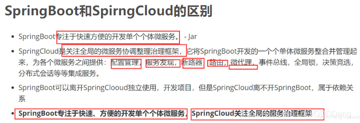

5. 什么是服务熔断？什么是服务降级？

6. 微服务的优缺点分别是什么？说下你在项目开发中遇到的坑

7. 你所知道的微服务技术栈由哪些？请列举一二

8. eureka和zookeeper都可以提供服务注册与发现的功能，请说说两者的区别？


## 2. 微服务概述

### 2.1 什么是微服务

**什么是微服务？**微服务(Microservice Architecture) 是近几年流行的一种架构思想，关于它的概念很难一言以蔽之。

究竟什么是微服务呢？我们在此引用ThoughtWorks 公司的首席科学家 Martin Fowler 于2014年提出的一段话：

原文：https://martinfowler.com/articles/microservices.html

汉化：https://www.cnblogs.com/liuning8023/p/4493156.html

就目前而言，对于微服务，业界并没有一个统一的，标准的定义。
但通常而言，微服务架构是一种架构模式，或者说是一种架构风格，**它提倡将单一的应用程序划分成一组小的服务**，每个服务运行在其独立的自己的进程内，服务之间互相协调，互相配置，为用户提供最终价值，服务之间采用轻量级的通信机制(HTTP)互相沟通，每个服务都围绕着具体的业务进行构建，并且能狗被独立的部署到生产环境中，另外，应尽量避免统一的，集中式的服务管理机制，对具体的一个服务而言，应该根据业务上下文，选择合适的语言，工具(Maven)对其进行构建，可以有一个非常轻量级的集中式管理来协调这些服务，可以使用不同的语言来编写服务，也可以使用不同的数据存储。

**我们从技术维度来理解下：**

- 微服务化的核心就是将传统的一站式应用，根据业务拆分成一个一个的服务，彻底地去耦合，每一个微服务提供单个业务功能的服务，一个服务做一件事情，从技术角度看就是一种小而独立的处理过程，类似进程的概念，能够自行单独启动或销毁，拥有自己独立的数据库。

### 2.2 微服务与微服务架构

**微服务**

强调的是服务的大小，它关注的是某一个点，是具体解决某一个问题/提供落地对应服务的一个服务应用，狭义的看，可以看作是IDEA中的一个个微服务工程，或者Model。

> IDEA 工具里面使用Maven开发的一个个独立的小Model，它具体是使用SpringBoot开发的一个小模块，专业的事情交给专业的模块来做，一个模块就做着一件事情。强调的是一个个的个体，每个个体完成一个具体的任务或者功能。

**微服务架构**

一种新的架构形式，Martin Fowler 于2014年提出。

微服务架构是一种架构模式，它提倡将单一应用程序划分成一组小的服务，服务之间相互协调，互相配合，为用户提供最终价值。每个服务运行在其独立的进程中，服务与服务之间采用轻量级的通信机制(如HTTP)互相协作，每个服务都围绕着具体的业务进行构建，并且能够被独立的部署到生产环境中，另外，应尽量避免统一的，集中式的服务管理机制，对具体的一个服务而言，应根据业务上下文，选择合适的语言、工具(如Maven)对其进行构建。


### 2.3 微服务优缺点

**优点**

* 单一职责原则；
* 每个服务足够内聚，足够小，代码容易理解，这样能聚焦一个指定的业务功能或业务需求；
* 开发简单，开发效率高，一个服务可能就是专一的只干一件事；
* 微服务能够被小团队单独开发，这个团队只需2-5个开发人员组成；
* 微服务是松耦合的，是有功能意义的服务，无论是在开发阶段或部署阶段都是独立的；
* 微服务能使用不同的语言开发；
* 易于和第三方集成，微服务允许容易且灵活的方式集成自动部署，通过持续集成工具，如jenkins，Hudson，bamboo；
* 微服务易于被一个开发人员理解，修改和维护，这样小团队能够更关注自己的工作成果，无需通过合作才能体现价值；
* 微服务允许利用和融合最新技术；
* **微服务只是业务逻辑的代码，不会和HTML，CSS，或其他的界面混合;**
* **每个微服务都有自己的存储能力，可以有自己的数据库，也可以有统一的数据库；**

**缺点**

* 开发人员要处理分布式系统的复杂性；
* 多服务运维难度，随着服务的增加，运维的压力也在增大；
* 系统部署依赖问题；
* 服务间通信成本问题；
* 数据一致性问题；
* 系统集成测试问题；
* 性能和监控问题；

### 2.4 微服务技术栈有那些？

| **微服务技术条目**                     | **落地技术**                                                 |
| -------------------------------------- | ------------------------------------------------------------ |
| 服务开发                               | SpringBoot、Spring、SpringMVC等                              |
| 服务配置与管理                         | Netfix公司的Archaius、阿里的Diamond等                        |
| 服务注册与发现                         | Eureka、Consul、Zookeeper等                                  |
| 服务调用                               | Rest、PRC、gRPC                                              |
| 服务熔断器                             | Hystrix、Envoy等                                             |
| 负载均衡                               | Ribbon、Nginx等                                              |
| 服务接口调用(客户端调用服务的简化工具) | Fegin等                                                      |
| 消息队列                               | Kafka、RabbitMQ、ActiveMQ等                                  |
| 服务配置中心管理                       | SpringCloudConfig、Chef等                                    |
| 服务路由(API网关)                      | Zuul等                                                       |
| 服务监控                               | Zabbix、Nagios、Metrics、Specatator等                        |
| 全链路追踪                             | Zipkin、Brave、Dapper等                                      |
| 数据流操作开发包                       | SpringCloud Stream(封装与Redis，Rabbit，Kafka等发送接收消息) |
| 时间消息总栈                           | SpringCloud Bus                                              |
| 服务部署                               | Docker、OpenStack、Kubernetes等                              |

### 2.5 为什么选择SpringCloud作为微服务架构

1. 选型依据
   1. 整体解决方案和框架成熟度
   2. 社区热度
   3. 可维护性
   4. 学习曲线

2. 当前各大IT公司用的微服务架构有那些？

   1. 阿里：dubbo+HFS

   2. 京东：JFS

   3. 新浪：Motan

   4. 当当网：DubboX

      …

3. 各微服务框架对比

| **功能点/服务框架** | Netflix/SpringCloud                                          | Motan                                                       | gRPC                      | Thri t   | Dubbo/DubboX                        |
| ------------------- | ------------------------------------------------------------ | ----------------------------------------------------------- | ------------------------- | -------- | ----------------------------------- |
| 功能定位            | 完整的微服务框架                                             | RPC框架，但整合了ZK或Consul，实现集群环境的基本服务注册发现 | RPC框架                   | RPC框架  | 服务框架                            |
| 支持Rest            | 是，Ribbon支持多种可拔插的序列号选择                         | 否                                                          | 否                        | 否       | 否                                  |
| 支持RPC             | 否                                                           | 是(Hession2)                                                | 是                        | 是       | 是                                  |
| 支持多语言          | 是(Rest形式)                                                 | 否                                                          | 是                        | 是       | 否                                  |
| 负载均衡            | 是(服务端zuul+客户端Ribbon)，zuul-服务，动态路由，云端负载均衡Eureka（针对中间层服务器） | 是(客户端)                                                  | 否                        | 否       | 是(客户端)                          |
| 配置服务            | Netfix Archaius，Spring Cloud Config Server 集中配置         | 是(Zookeeper提供)                                           | 否                        | 否       | 否                                  |
| 服务调用链监控      | 是(zuul)，zuul提供边缘服务，API网关                          | 否                                                          | 否                        | 否       | 否                                  |
| 高可用/容错         | 是(服务端Hystrix+客户端Ribbon)                               | 是(客户端)                                                  | 否                        | 否       | 是(客户端)                          |
| 典型应用案例        | Netflix                                                      | Sina                                                        | Google                    | Facebook |                                     |
| 社区活跃程度        | 高                                                           | 一般                                                        | 高                        | 一般     | 2017年后重新开始维护，之前中断了5年 |
| 学习难度            | 中等                                                         | 低                                                          | 高                        | 高       | 低                                  |
| 文档丰富程度        | 高                                                           | 一般                                                        | 一般                      | 一般     | 高                                  |
| 其他                | Spring Cloud Bus为我们的应用程序带来了更多管理端点           | 支持降级                                                    | Netflix内部在开发集成gRPC | IDL定义  | 实践的公司比较多                    |

## 3. SpringCloud入门概述

### 3.1 SpringCloud是什么？

Spring官网：https://spring.io/


SpringCloud，基于SpringBoot提供了一套微服务解决方案，包括服务注册与发现，全链路监控，服务网关，负载均衡，熔断器等组件，除了基于NetFlix的开源组件做高度抽象封装之外，还有一些选型中立的开源组件。

SpringCloud利用SpringBoot的开发便利性，巧妙地简化了分布式系统基础设施的开发，SpringCloud为开发人员提供了快速构建分布式系统的一些工具，**包括配置管理，服务发现，断路器，路由，微代理，事件总线，全局锁，决策竞选，分布式会话等等**，他们都可以用SpringBoot的开发风格做到一键启动和部署。

SpringBoot并没有重复造轮子，它只是将目前各家公司开发的比较成熟，经得起实际考验的服务框架组合起来，通过SpringBoot风格进行再封装，屏蔽掉了复杂的配置和实现原理，**最终给开发者留出了一套简单易懂，易部署和易维护的分布式系统开发工具包**。

SpingCloud是分布式微服务框架下的一站式解决方案，是各个微服务架构落地技术的集合体，俗称微服务全家桶。

### 3.2 SpringCloud和SpringBoot的关系

* SpringBoot专注于快速方便的开发单个个体微服务；jar包
* SpringCloud是关注全局的微服务协调整理治理框架，它将SpringBoot开发的一个个单体微服务，整合并管理起来，为各个微服务之间提供：配置管理、服务发现、断路器、路由、为代理、事件总栈、全局锁、决策竞选、分布式会话等等集成服务；
* SpringBoot可以离开SpringCloud独立使用，开发项目，但SpringCloud离不开SpringBoot，属于依赖关系；
* SpringBoot专注于快速、方便的开发单个个体微服务，SpringCloud关注全局的服务治理框架；

### 3.3 Dubbo 和 SpringCloud技术选型

1. **分布式+服务治理Dubbo**
    目前成熟的互联网架构，应用服务化拆分 + 消息中间件

  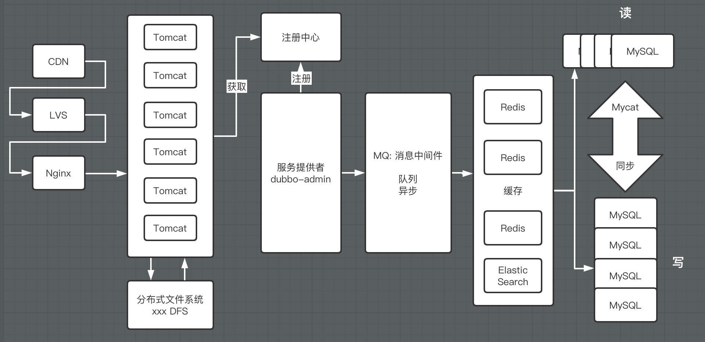

2. **Dubbo 和 SpringCloud对比**
    可以看一下社区活跃度：

  https://github.com/dubbo

  https://github.com/spring-cloud

对比结果：

|              | Dubbo         | SpringCloud                  |
| ------------ | ------------- | ---------------------------- |
| 服务注册中心 | Zookeeper     | Spring Cloud Netfilx Eureka  |
| 服务调用方式 | RPC           | REST API                     |
| 服务监控     | Dubbo-monitor | Spring Boot Admin            |
| 断路器       | 不完善        | Spring Cloud Netfilx Hystrix |
| 服务网关     | 无            | Spring Cloud Netfilx Zuul    |
| 分布式配置   | 无            | Spring Cloud Config          |
| 服务跟踪     | 无            | Spring Cloud Sleuth          |
| 消息总栈     | 无            | Spring Cloud Bus             |
| 数据流       | 无            | Spring Cloud Stream          |
| 批量任务     | 无            | Spring Cloud Task            |

**最大区别：Spring Cloud 抛弃了Dubbo的RPC通信，采用的是基于HTTP的REST方式**

严格来说，这两种方式各有优劣。虽然从一定程度上来说，后者牺牲了服务调用的性能，但也避免了上面提到的原生RPC带来的问题。而且REST相比RPC更为灵活，服务提供方和调用方的依赖只依靠一纸契约，不存在代码级别的强依赖，这个优点在当下强调快速演化的微服务环境下，显得更加合适。

**品牌机和组装机的区别**

**社区支持与更新力度的区别**

**总结：**二者解决的问题域不一样：Dubbo的定位是一款RPC框架，而SpringCloud的目标是微服务架构下的一站式解决方案。

### 3.4 SpringCloud能干嘛？

* Distributed/versioned configuration 分布式/版本控制配置
* Service registration and discovery 服务注册与发现
* Routing 路由
* Service-to-service calls 服务到服务的调用
* Load balancing 负载均衡配置
* Circuit Breakers 断路器
* Distributed messaging 分布式消息管理
  …

### 3.5 SpringCloud下载

官网：http://projects.spring.io/spring-cloud/

版本号有点特别：

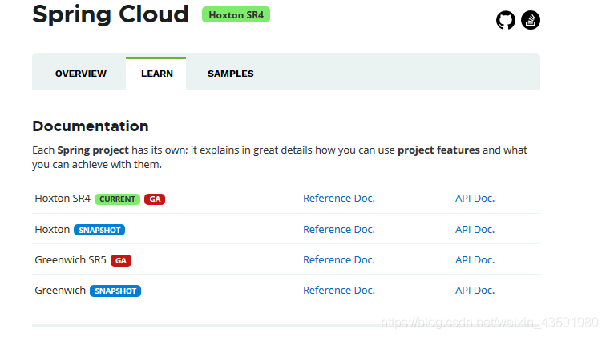

SpringCloud没有采用数字编号的方式命名版本号，而是采用了伦敦地铁站的名称，同时根据字母表的顺序来对应版本时间顺序，比如最早的Realse版本：Angel，第二个Realse版本：Brixton，然后是Camden、Dalston、Edgware，目前最新的是Hoxton SR4 CURRENT GA通用稳定版。

**自学参考书：**

* SpringCloud Netflix 中文文档：https://springcloud.cc/spring-cloud-netflix.html
* SpringCloud 中文API文档(官方文档翻译版)：https://springcloud.cc/spring-cloud-dalston.html
* SpringCloud中国社区：http://springcloud.cn/
* SpringCloud中文网：https://springcloud.cc

## 4. Rest学习环境搭建

### 4.1 介绍

- 我们会使用一个Dept部门模块做一个微服务通用案例**Consumer**消费者(**Client**)通过REST调用**Provider**提供者(**Server**)提供的服务。
- 回顾Spring，SpringMVC，Mybatis等以往学习的知识。
- Maven的分包分模块架构复习。

```
一个简单的Maven模块结构是这样的：

-- app-parent: 一个父项目(app-parent)聚合了很多子项目(app-util\app-dao\app-web...)
  |-- pom.xml
  |
  |-- app-core
  ||---- pom.xml
  |
  |-- app-web
  ||---- pom.xml
  ......
```

 一个父工程带着多个Moudule子模块

MicroServiceCloud父工程(Project)下初次带着3个子模块(Module)

* springcloud-api 【封装的整体entity/接口/公共配置等】
* springcloud-consumer-dept-80 【服务提供者】
* springcloud-provider-dept-8001 【服务消费者】

### 4.2 SpringCloud版本选择

大版本说明

| SpringBoot   | SpringCloud                                                  | 关系                                     |
| ------------ | ------------------------------------------------------------ | ---------------------------------------- |
| 1.2.x        | Angel版本(天使)                                              | 兼容SpringBoot1.2x                       |
| 1.3.x        | Brixton版本(布里克斯顿)                                      | 兼容SpringBoot1.3x，也兼容SpringBoot1.4x |
| 1.4.x        | Camden版本(卡姆登)                                           | 兼容SpringBoot1.4x，也兼容SpringBoot1.5x |
| 1.5.x        | Dalston版本(多尔斯顿)                                        | 兼容SpringBoot1.5x，不兼容SpringBoot2.0x |
| 1.5.x        | Edgware版本(埃奇韦尔)                                        | 兼容SpringBoot1.5x，不兼容SpringBoot2.0x |
| 2.0.x        | Finchley版本(芬奇利)                                         | 兼容SpringBoot2.0x，不兼容SpringBoot1.5x |
| 2.1.x        | Greenwich版本(格林威治)                                      |                                          |
| 2.2.x, 2.3.x | [Hoxton](https://github.com/spring-cloud/spring-cloud-release/wiki/Spring-Cloud-Hoxton-Release-Notes) |                                          |

**实际开发版本关系**

| spring-boot-starter-parent |              | spring-cloud-dependencles |              |
| -------------------------- | ------------ | ------------------------- | ------------ |
| **版本号**                 | **发布日期** | **版本号**                | **发布日期** |
| 1.5.2.RELEASE              | 2017-03      | Dalston.RC1               | 2017-x       |
| 1.5.9.RELEASE              | 2017-11      | Edgware.RELEASE           | 2017-11      |
| 1.5.16.RELEASE             | 2018-04      | Edgware.SR5               | 2018-10      |
| 1.5.20.RELEASE             | 2018-09      | Edgware.SR5               | 2018-10      |
| 2.0.2.RELEASE              | 2018-05      | Fomchiey.BULD-SNAPSHOT    | 2018-x       |
| 2.0.6.RELEASE              | 2018-10      | Fomchiey-SR2              | 2018-10      |
| 2.1.4.RELEASE              | 2019-04      | Greenwich.SR1             | 2019-03      |

**使用后两个**

### 4.3 创建父工程

- 新建父工程项目springcloud，切记**==Packaging是pom模式==**
- 主要是定义POM文件，将后续各个子模块公用的jar包等统一提取出来，类似一个抽象父类
  

**`pom.xml`**

```xml
<?xml version="1.0" encoding="UTF-8"?>
<project xmlns="http://maven.apache.org/POM/4.0.0"
         xmlns:xsi="http://www.w3.org/2001/XMLSchema-instance"
         xsi:schemaLocation="http://maven.apache.org/POM/4.0.0 http://maven.apache.org/xsd/maven-4.0.0.xsd">
    <modelVersion>4.0.0</modelVersion>

    <groupId>com.haust</groupId>
    <artifactId>springcloud</artifactId>
    <version>1.0-SNAPSHOT</version>
    <!--这部分module会慢慢补充上去的-->
    <modules>
        <module>springcloud-api</module>
        <module>springcloud-provider-dept-8001</module>
        <module>springcloud-consumer-dept-80</module>
        <module>springcloud-eureka-7001</module>
        <module>springcloud-eureka-7002</module>
        <module>springcloud-eureka-7003</module>
        <module>springcloud-provider-dept-8002</module>
        <module>springcloud-provider-dept-8003</module>
        <module>springcloud-consumer-dept-feign</module>
        <module>springcloud-provider-dept-hystrix-8001</module>
        <module>springcloud-consumer-hystrix-dashboard</module>
        <module>springcloud-zuul-9527</module>
        <module>springcloud-config-server-3344</module>
        <module>springcloud-config-client-3355</module>
        <module>springcloud-config-eureka-7001</module>
        <module>springcloud-config-dept-8001</module>
    </modules>

    <!--打包方式  pom-->
    <packaging>pom</packaging>

    <properties>
        <project.build.sourceEncoding>UTF-8</project.build.sourceEncoding>
        <maven.compiler.source>1.8</maven.compiler.source>
        <maven.compiler.target>1.8</maven.compiler.target>
        <junit.version>4.12</junit.version>
        <log4j.version>1.2.17</log4j.version>
        <lombok.version>1.16.18</lombok.version>
    </properties>

    <dependencyManagement>
        <dependencies>
            <!--springCloud的依赖-->
            <dependency>
                <groupId>org.springframework.cloud</groupId>
                <artifactId>spring-cloud-dependencies</artifactId>
                <version>Hoxton.SR1</version>
                <type>pom</type>
                <scope>import</scope>
            </dependency>
            <!--SpringBoot-->
            <dependency>
                <groupId>org.springframework.boot</groupId>
                <artifactId>spring-boot-dependencies</artifactId>
                <version>2.2.5.RELEASE</version>
                <type>pom</type>
                <scope>import</scope>
            </dependency>
            <!--数据库-->
            <dependency>
                <groupId>mysql</groupId>
                <artifactId>mysql-connector-java</artifactId>
                <version>8.0.23</version>
            </dependency>
            <dependency>
                <groupId>com.alibaba</groupId>
                <artifactId>druid</artifactId>
                <version>1.1.10</version>
            </dependency>
            <!--SpringBoot 启动器-->
            <dependency>
                <groupId>org.mybatis.spring.boot</groupId>
                <artifactId>mybatis-spring-boot-starter</artifactId>
                <version>1.3.2</version>
            </dependency>
            <!--日志测试~-->
            <dependency>
                <groupId>ch.qos.logback</groupId>
                <artifactId>logback-core</artifactId>
                <version>1.2.3</version>
            </dependency>
            <dependency>
                <groupId>junit</groupId>
                <artifactId>junit</artifactId>
                <version>${junit.version}</version>
            </dependency>
            <dependency>
                <groupId>log4j</groupId>
                <artifactId>log4j</artifactId>
                <version>${log4j.version}</version>
            </dependency>
            <dependency>
                <groupId>org.projectlombok</groupId>
                <artifactId>lombok</artifactId>
                <version>${lombok.version}</version>
            </dependency>
        </dependencies>
    </dependencyManagement>

</project>
```

父工程为springcloud，其下有多个子module，详情参考完整代码了解


### 4.4 创建子工程springcloud-api

创建module`springcloud-api`，添加依赖：

```xml
<!--当前的Module自己需要的依赖，如果父依赖中已经配置了版本，这里就不用写了-->
<dependencies>
    <dependency>
        <groupId>org.projectlombok</groupId>
        <artifactId>lombok</artifactId>
    </dependency>
</dependencies>
```

接下来创建数据库`db01`和表`dept`表示部门：

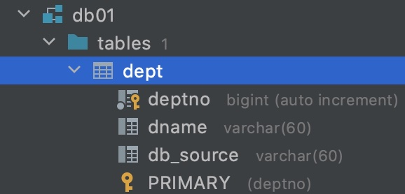

```mysql
insert into dept (dname, db_source) values ('开发部',DATABASE());
insert into dept (dname, db_source) values ('人事部',DATABASE());
insert into dept (dname, db_source) values ('财务部',DATABASE());
insert into dept (dname, db_source) values ('市场部',DATABASE());
insert into dept (dname, db_source) values ('运维部',DATABASE());
```

接下来创建实体类pojo `Dept`

```java
@Data
@NoArgsConstructor
@Accessors(chain = true) //链式写法
public class Dept implements Serializable { //Dept 实体类 orm 类表关系映射
    private Long deptno; //主键
    private String dname;
    //这个数据是存在那个数据库的字段～ 微服务，一个服务对应一个数据库，同一个信息可能存在不同的数据库
    private String db_source;

    public Dept(String dname) {
        this.dname = dname;
    }
    
    /*
        链式写法：
        Dept dept = new Dept();
        
        dept.setDeptNo(11).setDname('ss').setDb_source('001')
     */
}
```

`springcloud-api`就写完了，微服务差分化后只需要做这些事情

### 4.5 服务提供者：创建子工程springcloud-provider-dept-8001

#### 1. 基础配置

**导入依赖**

springcloud-provider-dept-8001的dao接口调用springcloud-api模块下的pojo，可使用在springcloud-provider-dept-8001的pom文件导入springcloud-api模块依赖的方式：

```xml
<dependencies>
    <!--我们需要拿到实体类，所以要配置api module-->
    <dependency>
        <groupId>com.jin</groupId>
        <artifactId>springcloud-api</artifactId>
        <version>1.0-SNAPSHOT</version>
    </dependency>
    <!--junit-->
    <dependency>
        <groupId>junit</groupId>
        <artifactId>junit</artifactId>
    </dependency>
    <dependency>
        <groupId>mysql</groupId>
        <artifactId>mysql-connector-java</artifactId>
    </dependency>
    <dependency>
        <groupId>com.alibaba</groupId>
        <artifactId>druid</artifactId>
    </dependency>
    <dependency>
        <groupId>ch.qos.logback</groupId>
        <artifactId>logback-core</artifactId>
    </dependency>
    <dependency>
        <groupId>org.mybatis.spring.boot</groupId>
        <artifactId>mybatis-spring-boot-starter</artifactId>
    </dependency>
    <!--test-->
    <dependency>
        <groupId>org.springframework.boot</groupId>
        <artifactId>spring-boot-test</artifactId>
    </dependency>
    <dependency>
        <groupId>org.springframework.boot</groupId>
        <artifactId>spring-boot-starter-web</artifactId>
    </dependency>
    <!--jetty,与tomcat类似的服务器-->
    <dependency>
        <groupId>org.springframework.boot</groupId>
        <artifactId>spring-boot-starter-jetty</artifactId>
    </dependency>
    <!--热部署工具-->
    <dependency>
        <groupId>org.springframework.boot</groupId>
        <artifactId>spring-boot-devtools</artifactId>
    </dependency>
</dependencies>
```

配置`application.yaml`

```yaml
server:
  port: 8001
  
#mybatis配置
mybatis:
  type-aliases-package: com.jin.springcloud.pojo
  config-location: classpath:mybatis/mybatis-config.xml
  mapper-locations: classpath:mybatis/mapper/*.xml
  
#spring配置
spring:
  application:
    name: springcloud-provider-dept
  datasource:
    type: com.alibaba.druid.pool.DruidDataSource #数据源
    driver-class-name: com.mysql.cj.jdbc.Driver
    url: jdbc:mysql://localhost:3306/db01?userSSL=true&useUnicode=true&characterEncoding=utf-8
    username: root
    password: 123456
```

*配置`mybatis-config.xml`(可省略)

```xml
<?xml version="1.0" encoding="UTF-8" ?>
<!DOCTYPE configuration
        PUBLIC "-//mybatis.org//DTD Config 3.0//EN"
        "http://mybatis.org/dtd/mybatis-3-config.dtd">

<configuration>
    <settings>
        <!--开启二级缓存-->
        <setting name="cacheEnabled" value="true"/>
    </settings>
</configuration>
```

#### 2. Mybatis连接

编写接口`DeptDao`

```java
@Mapper
@Repository
public interface DeptDao {
    boolean addDept(Dept dept);

    Dept queryById(Long id);
    
    List<Dept> queryAll();
}
```

编写`DeptMapper.xml`

```xml
<?xml version="1.0" encoding="UTF-8" ?>
<!DOCTYPE mapper
        PUBLIC "-//mybatis.org//DTD Config 3.0//EN"
        "http://mybatis.org/dtd/mybatis-3-mapper.dtd">

<mapper namespace="com.jin.springcloud.dao.DeptDao">
    <insert id="addDept" parameterType="dept">
        insert into dept (dname, db_source) 
        values (#{dname},DATABASE())
    </insert>
    
    <select id="queryById" resultType="dept" parameterType="Long">
        select * from dept where deptno = #{deptno}
    </select>

    <select id="queryAll" resultType="dept">
        select * from dept
    </select>
</mapper>
```

编写接口`DeptService`

```java
public interface DeptService {
    boolean addDept(Dept dept);

    Dept queryById(Long id);

    List<Dept> queryAll();
}
```

编写实现类`DeptServiceImpl`

```java
@Service
public class DeptServiceImpl implements DeptService{
    @Autowired
    private DeptDao deptDao;

    @Override
    public boolean addDept(Dept dept) {
        return deptDao.addDept(dept);
    }

    @Override
    public Dept queryById(Long id) {
        return deptDao.queryById(id);
    }

    @Override
    public List<Dept> queryAll() {
        return deptDao.queryAll();
    }
}
```

#### 3. RESTFul 服务 

编写`DeptController.java`

```java
//提供Restful服务！
@RestController
public class DeptController {
    @Autowired
    private DeptService deptService;

    @PostMapping("/dept/add")
    public boolean addDept(Dept dept) {
        return deptService.addDept(dept);
    }

    @GetMapping("/dept/get/{id}")
    public Dept get(@PathVariable("id") Long id) {
        return deptService.queryById(id);
    }

    @GetMapping("/dept/list")
    public List<Dept> addDept() {
        return deptService.queryAll();
    }
}
```

编写`DeptProvider_8001`启动类

```java
//启动类
@SpringBootApplication
public class DeptProvider_8001 {
    public static void main(String[] args) {
        SpringApplication.run(DeptProvider_8001.class,args);
    }
}
```

启动测试是否能通过端口8001进行各种操作的访问

### 4.6 服务消费者：创建子工程springcloud-consumer-dept-80

`Pom.xml`依赖

```xml
<!--实体类+web-->
<dependencies>
    <dependency>
        <groupId>com.jin</groupId>
        <artifactId>springcloud-api</artifactId>
        <version>1.0-SNAPSHOT</version>
    </dependency>
    <dependency>
        <groupId>org.springframework.boot</groupId>
        <artifactId>spring-boot-starter-web</artifactId>
    </dependency>
    <!--热部署工具-->
    <dependency>
        <groupId>org.springframework.boot</groupId>
        <artifactId>spring-boot-devtools</artifactId>
    </dependency>
</dependencies>
```

`application.yaml`配置端口

```yaml
server:
  port: 80
```

`ConfigBean`配置 RestTemplate

```java
@Configuration
public class ConfigBean { //@Configuration -- spring applicationContext.xml
    @Bean
    public RestTemplate getRestTemplate() {
        return new RestTemplate();
    }
}
```

`DeptComsumerController`

```java
@RestController
public class DeptConsumerController {
    //理解：消费者，不应该有service层
    // RestTemplate ... 供我们直接调用就可以了！注册到spring中
    // (url, 实体 Map,Class<T> responseType)
    @Autowired
    private RestTemplate restTemplate; //提供多种便捷访问远程http服务的方法，简单的Restful服务模板

    private static final String REST_URL_PREFIX = "http://localhost:8001";

    @RequestMapping("/consumer/dept/add")
    public  boolean add(Dept dept) {
        return restTemplate.postForObject(REST_URL_PREFIX + "/dept/add", dept, Boolean.class);
    }
    
    @RequestMapping("/consumer/dept/get/{id}")
    public Dept get(@PathVariable("id") Long id) {
        return restTemplate.getForObject(REST_URL_PREFIX + "/dept/get/" + id, Dept.class);
    }

    @RequestMapping("/consumer/dept/list")
    public List<Dept> list() {
        return restTemplate.getForObject(REST_URL_PREFIX + "/dept/list",List.class);
    }
}
```

`DeptConsumer_80`启动类

```java
@SpringBootApplication
public class DeptConsumer_80 {
    public static void main(String[] args) {
        SpringApplication.run(DeptConsumer_80.class, args);
    }
}
```

同时启动provider和consumer进行测试，观察是否能通过访问consumer端口从而访问provider

测试成功！

## 5. Eureka服务注册中心

### 5.1 什么是Eureka

* Netflix在涉及Eureka时，遵循的就是API原则.
* Eureka是Netflix的有个子模块，也是核心模块之一。Eureka是基于REST的服务，用于定位服务，以实现云端中间件层服务发现和故障转移，服务注册与发现对于微服务来说是非常重要的，有了服务注册与发现，只需要使用服务的标识符，就可以访问到服务，而不需要修改服务调用的配置文件了，功能类似于Dubbo的注册中心，比如Zookeeper.

### 5.2 原理理解

* **Eureka基本的架构**

  * Springcloud 封装了Netflix公司开发的Eureka模块来实现服务注册与发现 (对比Zookeeper).

  * Eureka采用了C-S的架构设计，EurekaServer作为服务注册功能的服务器，他是服务注册中心.

  * 而系统中的其他微服务，使用Eureka的客户端连接到EurekaServer并维持心跳连接。这样系统的维护人员就可以通过EurekaServer来监控系统中各个微服务是否正常运行，Springcloud 的一些其他模块 (比如Zuul) 就可以通过EurekaServer来发现系统中的其他微服务，并执行相关的逻辑.

    

* 和Dubbo架构对比.


* Eureka 包含两个组件：**`Eureka Server` 和`Eureka Client`.**
* Eureka Server 提供服务注册，各个节点启动后，回在EurekaServer中进行注册，这样Eureka Server中的服务注册表中将会储存所有课用服务节点的信息，服务节点的信息可以在界面中直观的看到.
* Eureka Client 是一个Java客户端，用于简化EurekaServer的交互，客户端同时也具备一个内置的，使用轮询负载算法的负载均衡器。在应用启动后，将会向EurekaServer发送心跳 (默认周期为30秒) 。如果Eureka Server在多个心跳周期内没有接收到某个节点的心跳，EurekaServer将会从服务注册表中把这个服务节点移除掉 (默认周期为90s).
* **三大角色**
  * Eureka Server：提供服务的注册与发现
  * Service Provider：服务生产方，将自身服务注册到Eureka中，从而使服务消费方能狗找到
  * Service Consumer：服务消费方，从Eureka中获取注册服务列表，从而找到消费服务

### 5.3 构建步骤

#### 1.  eureka-server

1. `springcloud-eureka-7001` 模块建立

2. `pom.xml` 配置

   ```xml
   <!--导包~-->
   <dependencies>
       <!-- https://mvnrepository.com/artifact/org.springframework.cloud/spring-cloud-starter-eureka-server -->
       <!--导入Eureka Server依赖-->
       <dependency>
           <groupId>org.springframework.cloud</groupId>
           <artifactId>spring-cloud-starter-eureka-server</artifactId>
           <version>1.4.6.RELEASE</version>
       </dependency>
       <!--热部署工具-->
       <dependency>
           <groupId>org.springframework.boot</groupId>
           <artifactId>spring-boot-devtools</artifactId>
       </dependency>
   </dependencies>
   ```

3. `application.yaml`

   ```yaml
   server:
     port: 7001
   
   # Eureka配置
   eureka:
     instance:
       hostname: localhost #Eureka服务端的实例名称
     client:
       # 表示是否向 Eureka 注册中心注册自己(这个模块本身是服务器,所以不需要)
       register-with-eureka: false
       # fetch-registry如果为false,则表示自己为注册中心,客户端的化为 true
       fetch-registry: false
       # Eureka监控页面~
       service-url:
         defaultZone: http://${eureka.instance.hostname}:${server.port}/eureka/
   ```

   源码中Eureka的默认端口以及访问路径:

   

4. 主启动类`EurekaServer_7001`

   ```java
   @SpringBootApplication
   @EnableEurekaServer // @EnableEurekaServer 服务端的启动类，可以接受别人注册进来~
   public class EurekaServer_7001 {
       public static void main(String[] args) {
           SpringApplication.run(EurekaServer_7001.class,args);
       }
   }
   ```

5. 启动成功后访问 http://localhost:7001/ 得到以下页面

   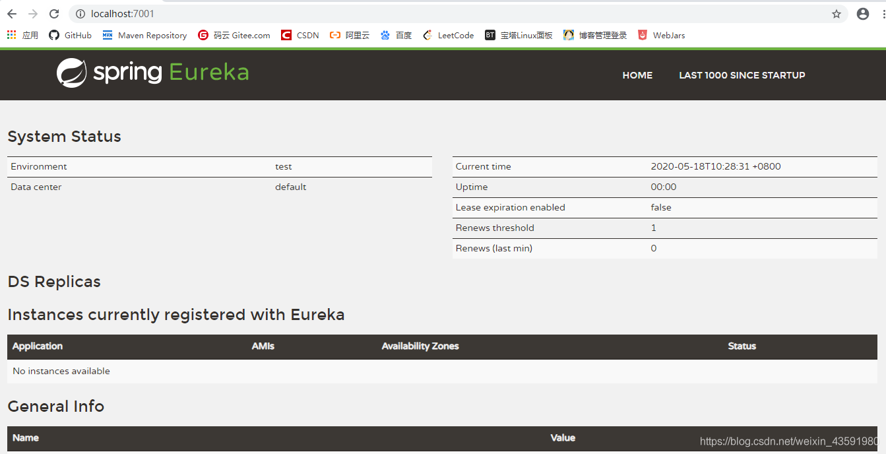

#### 2. eureka-client

​	**调整之前创建的springlouc-provider-dept-8001**

1. 导入Eureca依赖

   ```xml
   <!--Eureka依赖-->
   <!-- https://mvnrepository.com/artifact/org.springframework.cloud/spring-cloud-starter-eureka -->
   <dependency>
       <groupId>org.springframework.cloud</groupId>
       <artifactId>spring-cloud-starter-eureka</artifactId>
       <version>1.4.6.RELEASE</version>
   </dependency>
   ```

2. `application`中新增Eureca配置

   ```yaml
   # Eureka配置：配置服务注册中心地址
   eureka:
     client:
       service-url:
         defaultZone: http://localhost:7001/eureka/
   ```

3. 为主启动类添加`@EnableEurekaClient`注解

   ```java
   @SpringBootApplication
   // @EnableEurekaClient 开启Eureka客户端注解，在服务启动后自动向注册中心注册服务
   @EnableEurekaClient
   public class DeptProvider_8001 {
       public static void main(String[] args) {
           SpringApplication.run(DeptProvider_8001.class,args);
       }
   }
   ```

4. 先启动7001服务端后启动8001客户端进行测试，然后访问监控页http://localhost:7001/ 产看结果如图，成功

   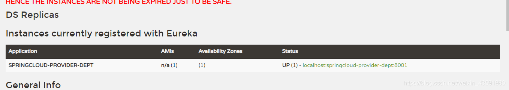

5. 修改Eureka上的默认描述信息

   ```yaml
   # Eureka配置：配置服务注册中心地址
   eureka:
     client:
       service-url:
         defaultZone: http://localhost:7001/eureka/
     instance:
       instance-id: springcloud-provider-dept-8001 #修改Eureka上的默认描述信息
   ```

   结果如图：

   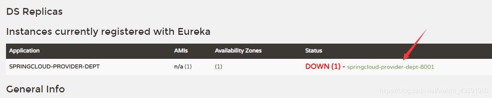

   如果此时停掉springcloud-provider-dept-8001 等**30s**后 监控会开启保护机制：

   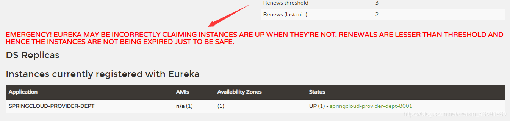

6. 配置关于服务加载的监控信息

   

   `pom.xml`中添加依赖

   ```xml
   <!--actuator完善监控信息-->
   <dependency>
    <groupId>org.springframework.boot</groupId>
    <artifactId>spring-boot-starter-actuator</artifactId>
   </dependency>
   ```

   `application.yaml`中添加配置

   ```yaml
   # info配置
   info:
   	# 项目的名称
   	app.name: kuangshen-springcloud
       # 公司的名称
       company.name: blog.kuangstudy.com
   ```

   此时刷新监控页，点击进入

   

   跳转新页面显示如下内容：

   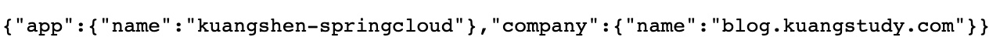

#### 3. EureKa自我保护机制：好死不如赖活着

一句话总结就是：某时刻某一个微服务不可用，eureka不会立即清理，依旧会对该微服务的信息进行保存！

* 默认情况下，当Eureka server在一定时间内没有收到实例的心跳，便会把该实例从注册表中删除（默认是90秒），但是，如果短时间内丢失大量的实例心跳，便会触发eureka server的自我保护机制，比如在开发测试时，需要频繁地重启微服务实例，但是我们很少会把eureka server一起重启（因为在开发过程中不会修改eureka注册中心），当一分钟内收到的心跳数大量减少时，会触发该保护机制。可以在eureka管理界面看到Renews threshold和Renews(last min)，当后者（最后一分钟收到的心跳数）小于前者（心跳阈值）的时候，触发保护机制，会出现红色的警告：==EMERGENCY!EUREKA MAY BE INCORRECTLY CLAIMING INSTANCES ARE UP WHEN THEY'RE NOT.RENEWALS ARE LESSER THAN THRESHOLD AND HENCE THE INSTANCES ARE NOT BEGING EXPIRED JUST TO BE SAFE.==从警告中可以看到，eureka认为虽然收不到实例的心跳，但它认为实例还是健康的，eureka会保护这些实例，不会把它们从注册表中删掉。
* 该保护机制的目的是避免网络连接故障，在发生网络故障时，微服务和注册中心之间无法正常通信，但服务本身是健康的，不应该注销该服务，如果eureka因网络故障而把微服务误删了，那即使网络恢复了，该微服务也不会重新注册到eureka server了，因为只有在微服务启动的时候才会发起注册请求，后面只会发送心跳和服务列表请求，这样的话，该实例虽然是运行着，但永远不会被其它服务所感知。所以，eureka server在短时间内丢失过多的客户端心跳时，会进入自我保护模式，该模式下，eureka会保护注册表中的信息，不在注销任何微服务，当网络故障恢复后，eureka会自动退出保护模式。自我保护模式可以让集群更加健壮。
* 但是我们在开发测试阶段，需要频繁地重启发布，如果触发了保护机制，则旧的服务实例没有被删除，这时请求有可能跑到旧的实例中，而该实例已经关闭了，这就导致请求错误，影响开发测试。所以，在开发测试阶段，我们可以把自我保护模式关闭，只需在eureka server配置文件中加上如下配置即可：eureka.server.enable-self-preservation=false【不推荐关闭自我保护机制】

详细内容可以参考下这篇博客内容：https://blog.csdn.net/wudiyong22/article/details/80827594

#### 4. 微服务消息获取

注册进来的微服务，获取一些消息（团队开发会用到）

**`DeptController.java`**新增方法

```java
import org.springframework.cloud.client.discovery.DiscoveryClient;

//DiscoveryClient 可以用来获取一些配置的信息，得到具体的微服务！
@Autowired
private DiscoveryClient client;

//获取一些注册进来的微服务的信息~
@GetMapping("/dept/discovery")
public Object discovery() {
    // 获取微服务列表的清单
    List<String> services = client.getServices();
    System.out.println("discovery=>services:" + services);
    // 得到一个具体的微服务信息,通过具体的微服务id，applicaioinName；
    List<ServiceInstance> instances = client.getInstances("SPRINGCLOUD-PROVIDER-DEPT");
    for (ServiceInstance instance : instances) {
        System.out.println(
                instance.getHost() + "\t" + // 主机名称
                        instance.getPort() + "\t" + // 端口号
                        instance.getUri() + "\t" + // uri
                        instance.getServiceId() // 服务id
        );
    }
    return this.client;
}
```

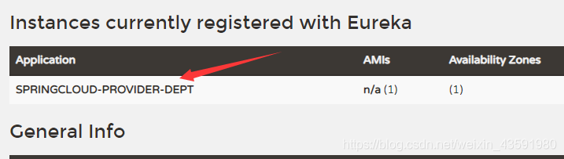

主启动类中加入`@EnableDiscoveryClient` 注解

```java
@SpringBootApplication
// @EnableEurekaClient 开启Eureka客户端注解，在服务启动后自动向注册中心注册服务
@EnableEurekaClient
// @EnableEurekaClient 开启服务发现客户端的注解，可以用来获取一些配置的信息，得到具体的微服务
@EnableDiscoveryClient
public class DeptProvider_8001 {
    ...
}
```

http://localhost:8001/dept/discovery

结果如图：


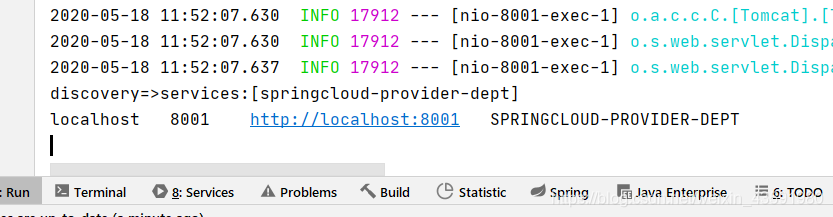

### 5.4 Eureka: 集群环境配置


#### 1.初始化

新建`springcloud-eureka-7002`, `springcloud-eureka-7003` 模块

1. 为`pom.xml`添加依赖 (与`springcloud-eureka-7001`相同)

   ```xml
   <!--导包~-->
   <dependencies>
       <!-- https://mvnrepository.com/artifact/org.springframework.cloud/spring-cloud-starter-eureka-server -->
       <!--导入Eureka Server依赖-->
       <dependency>
           <groupId>org.springframework.cloud</groupId>
           <artifactId>spring-cloud-starter-eureka-server</artifactId>
           <version>1.4.6.RELEASE</version>
       </dependency>
       <!--热部署工具-->
       <dependency>
           <groupId>org.springframework.boot</groupId>
           <artifactId>spring-boot-devtools</artifactId>
       </dependency>
   </dependencies>
   ```

2. `application.yaml`配置(与`springcloud-eureka-7001`相同)

   ```yaml
   server:
     port: 7003
   
   # Eureka配置
   eureka:
     instance:
       hostname: localhost # Eureka服务端的实例名字
     client:
       register-with-eureka: false # 表示是否向 Eureka 注册中心注册自己(这个模块本身是服务器,所以不需要)
       fetch-registry: false # fetch-registry如果为false,则表示自己为注册中心
       service-url: # 监控页面~
         # 重写Eureka的默认端口以及访问路径 --->http://localhost:7001/eureka/
         defaultZone: http://${eureka.instance.hostname}:${server.port}/eureka/
   ```

3. 主启动类(与`springcloud-eureka-7001`相同)

   ```java
   @SpringBootApplication
   // @EnableEurekaServer 服务端的启动类，可以接受别人注册进来~
   public class EurekaServer_7003 {
       public static void main(String[] args) {
           SpringApplication.run(EurekaServer_7003.class,args);
       }
   }
   ```

#### 2.集群成员相互关联

1. 配置一些自定义本机名字，找到本机hosts文件并打开(mac `shift+command+G`然后搜`/etc/hosts`)

2. 在hosts文件最后加上，要访问的本机名称，默认是localhost(**这里后面eureka后加上test，图中的网站被注册了。。。**)

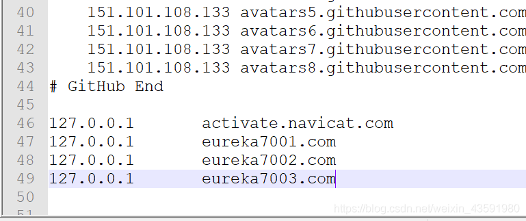

3. 修改`application.yml`的配置，如图为`springcloud-eureka-7001`配置，`springcloud-eureka-7002`/`springcloud-eureka-7003`同样分别修改为其对应的名称即可


4. 在集群中使`springcloud-eureka-7001`关联`springcloud-eureka-7002`、`springcloud-eureka-7003`

   完整的`springcloud-eureka-7001`下的`application.yaml`如下

   ```yaml
   server:
     port: 7001
   
   #Eureka配置
   eureka:
     instance:
       hostname: eurekatest7001.com #Eureka服务端的实例名字
     client:
       register-with-eureka: false #表示是否向 Eureka 注册中心注册自己(这个模块本身是服务器,所以不需要)
       fetch-registry: false #fetch-registry如果为false,则表示自己为注册中心
       service-url: #监控页面~
         #重写Eureka的默认端口以及访问路径 --->http://localhost:7001/eureka/
         # 单机： defaultZone: http://${eureka.instance.hostname}:${server.port}/eureka/
         # 集群（关联）：7001关联7002、7003
         defaultZone: http://eurekatest7002.com:7002/eureka/,http://eurekatest7003.com:7003/eureka/
   ```

5. 同时在集群中使`springcloud-eureka-7002`关联`springcloud-eureka-7001`、`springcloud-eureka-7003`

   完整的`springcloud-eureka-7002`下的`application.yaml`如下

   ```yaml
   server:
     port: 7002
   
   #Eureka配置
   eureka:
     instance:
       hostname: eurekatest7002.com #Eureka服务端的实例名字
     client:
       register-with-eureka: false #表示是否向 Eureka 注册中心注册自己(这个模块本身是服务器,所以不需要)
       fetch-registry: false #fetch-registry如果为false,则表示自己为注册中心
       service-url: #监控页面~
         #重写Eureka的默认端口以及访问路径 --->http://localhost:7001/eureka/
         # 单机： defaultZone: http://${eureka.instance.hostname}:${server.port}/eureka/
         # 集群（关联）：7002关联7001、7003
         defaultZone: http://eurekatest7001.com:7001/eureka/,http://eurekatest7003.com:7003/eureka/
   ```

   `springcloud-eureka-7003`配置方式同理可得.

6. 通过`springcloud-provider-dept-8001`下的yaml配置文件，修改**Eureka配置：配置服务注册中心地址**

   ```yaml
   # Eureka配置：配置服务注册中心地址
   eureka:
     client:
       service-url:
         # 注册中心地址7001-7003
         defaultZone: http://eurekatest7001.com:7001/eureka/,http://eurekatest7002.com:7002/eureka/,http://eurekatest003.com:7003/eureka/
     instance:
       instance-id: springcloud-provider-dept-8001 #修改Eureka上的默认描述信息
   ```

7. 这样模拟集群就搭建号了，就可以把一个项目挂载到三个服务器上了

   

### 5.5 CAP原则和对比Zookeeper区别

1. **回顾CAP原则**

  * RDBMS (MySQL\Oracle\sqlServer) ===> ACID

  * NoSQL (Redis\MongoDB) ===> CAP

2. **ACID是什么**？

  * A (Atomicity) 原子性
  * C (Consistency) 一致性
  * I (Isolation) 隔离性
  * D (Durability) 持久性
3. **CAP是什么?**

  * C (Consistency) 强一致性
  * A (Availability) 可用性
  * P (Partition tolerance) 分区容错性

  CAP的三进二：CA、AP、CP

4. **CAP理论的核心**

  * 一个分布式系统不可能同时很好的满足一致性，可用性和分区容错性这三个需求
  * 根据CAP原理，将NoSQL数据库分成了满足CA原则，满足CP原则和满足AP原则三大类
    * CA：单点集群，满足一致性，可用性的系统，通常可扩展性较差
    * CP：满足一致性，分区容错的系统，通常性能不是特别高
    * AP：满足可用性，分区容错的系统，通常可能对一致性要求低一些
5. **作为分布式服务注册中心，Eureka比Zookeeper好在哪里？**
    著名的CAP理论指出，一个分布式系统不可能同时满足C (一致性) 、A (可用性) 、P (容错性)，由于分区容错性P再分布式系统中是必须要保证的，因此我们只能再A和C之间进行权衡。

  * Zookeeper 保证的是 CP —> 满足一致性，分区容错的系统，通常性能不是特别高
  * Eureka 保证的是 AP —> 满足可用性，分区容错的系统，通常可能对一致性要求低一些

**Zookeeper保证的是CP**

 当向注册中心查询服务列表时，我们可以容忍注册中心返回的是几分钟以前的注册信息，但不能接收服务直接down掉不可用。也就是说，服务注册功能对可用性的要求要高于一致性。但zookeeper会出现这样一种情况，当master节点因为网络故障与其他节点失去联系时，剩余节点会重新进行leader选举。问题在于，选举leader的时间太长，30-120s，且选举期间整个zookeeper集群是不可用的，这就导致在选举期间注册服务瘫痪。在云部署的环境下，因为网络问题使得zookeeper集群失去master节点是较大概率发生的事件，虽然服务最终能够恢复，但是，漫长的选举时间导致注册长期不可用，是不可容忍的。

**Eureka保证的是AP**

 Eureka看明白了这一点，因此在设计时就优先保证可用性。Eureka各个节点都是平等的，几个节点挂掉不会影响正常节点的工作，剩余的节点依然可以提供注册和查询服务。而Eureka的客户端在向某个Eureka注册时，如果发现连接失败，则会自动切换至其他节点，只要有一台Eureka还在，就能保住注册服务的可用性，只不过查到的信息可能不是最新的，除此之外，Eureka还有之中自我保护机制，如果在15分钟内超过85%的节点都没有正常的心跳，那么Eureka就认为客户端与注册中心出现了网络故障，此时会出现以下几种情况：

* Eureka不在从注册列表中移除因为长时间没收到心跳而应该过期的服务
* Eureka仍然能够接受新服务的注册和查询请求，但是不会被同步到其他节点上 (即保证当前节点依然可用)
* 当网络稳定时，当前实例新的注册信息会被同步到其他节点中

==因此，Eureka可以很好的应对因网络故障导致部分节点失去联系的情况，而不会像zookeeper那样使整个注册服务瘫痪==


## 6. Ribbon：负载均衡(基于客户端)

### 6.1 负载均衡以及Ribbon

##### 1. Ribbon是什么？

* Spring Cloud Ribbon 是基于Netflix Ribbon 实现的一套**客户端负载均衡的工具**。
* 简单的说，Ribbon 是 Netflix 发布的开源项目，主要功能是提供客户端的软件负载均衡算法，将 Netflix 的中间层服务连接在一起。Ribbon 的客户端组件提供一系列完整的配置项，如：连接超时、重试等。简单的说，就是在配置文件中列出 LoadBalancer (简称LB：负载均衡) 后面所有的及其，Ribbon 会自动的帮助你基于某种规则 (如简单轮询，随机连接等等) 去连接这些机器。我们也容易使用 Ribbon 实现自定义的负载均衡算法！

##### 2. Ribbon能干嘛？

* 随机，轮询，权重


* LB，即负载均衡 (LoadBalancer) ，在微服务或分布式集群中经常用的一种应用。
* 负载均衡简单的说就是将用户的请求平摊的分配到多个服务上，从而达到系统的HA (高用)。
* 常见的负载均衡软件有 Nginx、Lvs 等等。
* Dubbo、SpringCloud 中均给我们提供了负载均衡，**SpringCloud 的负载均衡算法可以自定义**。
* 负载均衡简单分类：
  * **==集中式LB==**
    * 即在服务的提供方和消费方之间使用独立的LB设施，如**Nginx(反向代理服务器)**，由该设施负责把访问请求通过某种策略转发至服务的提供方！
  * ==**进程式 LB**==
    * 将LB逻辑集成到消费方，消费方从服务注册中心获知有哪些地址可用，然后自己再从这些地址中选出一个合适的服务器。
    * **Ribbon 就属于进程内LB**，它只是一个类库，集成于消费方进程，消费方通过它来获取到服务提供方的地址！

### 6.2 集成Ribbon

**`springcloud-consumer-dept-80`**

1. 向`pom.xml`中添加Ribbon和Eureka依赖

   ```xml
   <!--Ribbon-->
   <dependency>
       <groupId>org.springframework.cloud</groupId>
       <artifactId>spring-cloud-starter-ribbon</artifactId>
       <version>1.4.6.RELEASE</version>
   </dependency>
   <!--Eureka: Ribbon需要从Eureka服务中心获取要拿什么-->
   <dependency>
       <groupId>org.springframework.cloud</groupId>
       <artifactId>spring-cloud-starter-eureka</artifactId>
       <version>1.4.6.RELEASE</version>
   </dependency>
   ```

2. 在`application.yaml`文件中配置Eureka

   ```yaml
   # Eureka配置
   eureka:
     client:
       register-with-eureka: false # 不向 Eureka注册自己
       service-url: # 从三个注册中心中随机取一个去访问
         defaultZone: http://eurekatest7001.com:7001/eureka/,http://eurekatest7002.com:7002/eureka/,http://eurekatest7003.com:7003/eureka/
   ```

3. 主启动类加上`@EnableEurekaClient`注解，开启Eureka

   ```java
   //Ribbon 和 Eureka 整合以后，客户端可以直接调用，不用关心IP地址和端口号
   @SpringBootApplication
   @EnableEurekaClient //开启Eureka 客户端
   public class DeptConsumer_80 {
       public static void main(String[] args) {
           SpringApplication.run(DeptConsumer_80.class, args);
       }
   }
   ```

4. 自定义Spring配置类：`ConfigBean.java` 配置负载均衡实现RestTemplate

   ```java
   @Configuration
   public class ConfigBean {//@Configuration -- spring  applicationContext.xml
   
       @LoadBalanced //配置负载均衡实现RestTemplate
       @Bean
       public RestTemplate getRestTemplate() {
           return new RestTemplate();
       }
   }
   ```

5. 修改controller：`DeptConsumerController.java`

   ```java
   //Ribbon:我们这里的地址，应该是一个变量，通过服务名来访问
   //private static final String REST_URL_PREFIX = "http://localhost:8001";
   private static final String REST_URL_PREFIX = "http://SPRINGCLOUD-PROVIDER-DEPT";
   ```

6. 启动eureka-7001,7002,7003,provider-8001,consumer-80,测试`http://localhost/consumer/dept/list`

   **Ribbon和Eureka整合以后，客户端可以直接调用，不用关心IP地址和端口号～**

### 6.3 使用Ribbon实现负载均衡

流程图：


1. 新建数据库db02, db03，数据和结构与db01一致。
2. 新建两个服务提供者Moudle：`springcloud-provider-dept-8002`、`springcloud-provider-dept-8003`

2. 参照`springcloud-provider-dept-8001` 依次为另外两个Module添加`pom.xml`依赖 、resourece下的mybatis和`application.yml`配置，Java代码

   其中要保证3个服务名称一致

   ```yaml
   #spring配置
   spring:
     application:
       name: springcloud-provider-dept # 3个服务名称一致是前提～
   ```

3. 启动所有服务测试(根据自身电脑配置决定启动服务的个数)，访问http://eureka7001.com:7002/查看结果

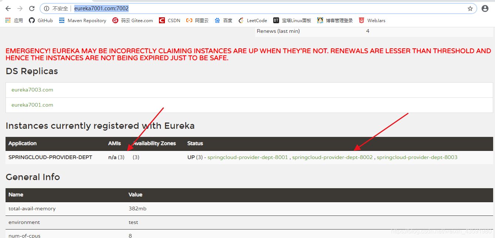

测试访问http://localhost/consumer/dept/list 这时候随机访问的是服务提供者8003

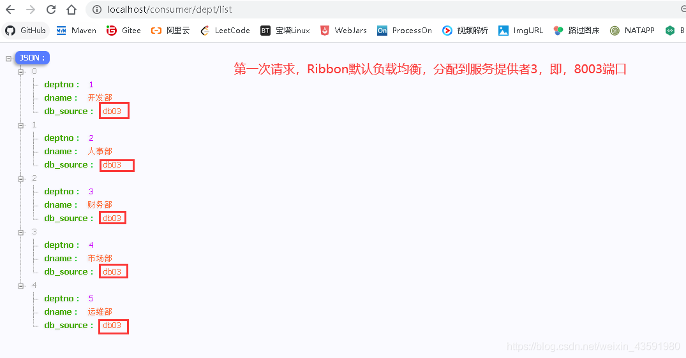

再次访问http://localhost/consumer/dept/list这时候随机的是服务提供者8001

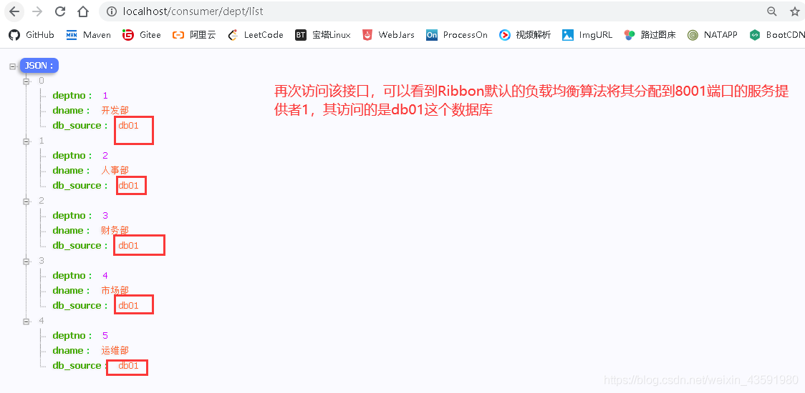

以上这种**每次访问http://localhost/consumer/dept/list随机访问集群中某个服务提供者，这种情况叫做轮询**，轮询算法在SpringCloud中可以自定义。

### 6.4 Ribbon自定义负载均衡算法

**如何切换或者自定义规则呢？**

1. 在`springcloud-consumer-dept-80`模块下的ConfigBean中进行配置，切换使用不同的规则

   ```java
   @Configuration
   public class ConfigBean {//@Configuration -- spring  applicationContext.xml
   
       /**
        * IRule:
        * RoundRobinRule 轮询策略
        * RandomRule 随机策略
        * AvailabilityFilteringRule ： 会先过滤掉，跳闸，访问故障的服务~，对剩下的进行轮询~
        * RetryRule ： 会先按照轮询获取服务~，如果服务获取失败，则会在指定的时间内进行，重试
        */
       @Bean
       public IRule myRule() {
           return new RandomRule();//使用随机策略
           //return new RoundRobinRule();//使用轮询策略
           //return new AvailabilityFilteringRule();//使用轮询策略
           //return new RetryRule();//使用轮询策略
       }
   }
   ```

2. 也可以自定义规则，在myRule包下自定义一个配置类MyRule.java，注意：**该包不要和主启动类所在的包同级，要跟启动类所在包同级**

   

   ​	

   `MyRule.java`

   ```java
   @Configuration
   public class KuangRule {
       @Bean
       public IRule myRule(){
           return new MyRandomRule();//默认是轮询RandomRule,现在自定义为自己的
       }
   }
   ```

3. 主启动类开启负载均衡并指定自定义的MyRule配置类

   ```java
   //Ribbon 和 Eureka 整合以后，客户端可以直接调用，不用关心IP地址和端口号
   @SpringBootApplication
   @EnableEurekaClient
   //在微服务启动的时候就能加载自定义的Ribbon类(自定义的规则会覆盖原有默认的规则)
   @RibbonClient(name = "SPRINGCLOUD-PROVIDER-DEPT",configuration = KuangRule.class)//开启负载均衡,并指定自定义的规则
   public class DeptConsumer_80 {
       public static void main(String[] args) {
           SpringApplication.run(DeptConsumer_80.class, args);
       }
   }
   ```

4. 自定义的规则(这里我们参考Ribbon中默认的规则代码自己稍微改动)：`MyRandomRule.java`

   ```java
   public class MyRandomRule extends AbstractLoadBalancerRule {
   
       /**
        * 每个服务访问5次则换下一个服务(总共3个服务)
        * <p>
        * total=0,默认=0,如果=5,指向下一个服务节点
        * index=0,默认=0,如果total=5,index+1
        */
       private int total = 0;//被调用的次数
       private int currentIndex = 0;//当前是谁在提供服务
   
       //@edu.umd.cs.findbugs.annotations.SuppressWarnings(value = "RCN_REDUNDANT_NULLCHECK_OF_NULL_VALUE")
       public Server choose(ILoadBalancer lb, Object key) {
           if (lb == null) {
               return null;
           }
           Server server = null;
   
           while (server == null) {
               if (Thread.interrupted()) {
                   return null;
               }
               List<Server> upList = lb.getReachableServers();//获得当前活着的服务
               List<Server> allList = lb.getAllServers();//获取所有的服务
   
               int serverCount = allList.size();
               if (serverCount == 0) {
                   /*
                    * No servers. End regardless of pass, because subsequent passes
                    * only get more restrictive.
                    */
                   return null;
               }
   
               //int index = chooseRandomInt(serverCount);//生成区间随机数
               //server = upList.get(index);//从或活着的服务中,随机获取一个
   
               //=====================自定义代码=========================
   
               if (total < 5) {
                   server = upList.get(currentIndex);
                   total++;
               } else {
                   total = 0;
                   currentIndex++;
                   if (currentIndex > upList.size()) {
                       currentIndex = 0;
                   }
                   server = upList.get(currentIndex);//从活着的服务中,获取指定的服务来进行操作
               }
               
               //======================================================
               
               if (server == null) {
                   /*
                    * The only time this should happen is if the server list were
                    * somehow trimmed. This is a transient condition. Retry after
                    * yielding.
                    */
                   Thread.yield();
                   continue;
               }
               if (server.isAlive()) {
                   return (server);
               }
               // Shouldn't actually happen.. but must be transient or a bug.
               server = null;
               Thread.yield();
           }
           return server;
       }
   
       protected int chooseRandomInt(int serverCount) {
           return ThreadLocalRandom.current().nextInt(serverCount);
       }
   
       @Override
       public Server choose(Object key) {
           return choose(getLoadBalancer(), key);
       }
   
       @Override
       public void initWithNiwsConfig(IClientConfig clientConfig) {
           // TODO Auto-generated method stub
       }
   }
   ```

   


## 7. Feign: 负载均衡(基于服务端)

### 7.1 Feign简介

Feign是声明式Web Service客户端，它让微服务之间的调用变得更简单，==类似controller调用service==。SpringCloud集成了Ribbon和Eureka，可以使用Feigin提供负载均衡的http客户端

**只需要创建一个接口，然后添加注解即可~**

Feign，主要是社区版，大家都习惯面向接口编程。这个是很多开发人员的规范。调用微服务访问两种方法

1. 微服务名字 【ribbon】
2. 接口和注解 【feign】

**Feign能干什么？**

* Feign旨在使编写Java Http客户端变得更容易
* 前面在使用**Ribbon + RestTemplate**时，利用**RestTemplate**对Http请求的封装处理，形成了一套模板化的调用方法。但是在实际开发中，由于对服务依赖的调用可能不止一处，往往一个接口会被多处调用，所以通常都会针对每个微服务自行封装一个客户端类来包装这些依赖服务的调用。所以，**Feign**在此基础上做了进一步的封装，由他来帮助我们定义和实现依赖服务接口的定义，==在Feign的实现下，我们只需要创建一个接口并使用注解的方式来配置它 (类似以前Dao接口上标注Mapper注解，现在是一个微服务接口上面标注一个Feign注解)，即可完成对服务提供方的接口绑定，简化了使用Spring Cloud Ribbon 时，自动封装服务调用客户端的开发量。==

**Feign默认集成了Ribbon**

* 利用**Ribbon**维护了MicroServiceCloud-Dept的服务列表信息，并且通过轮询实现了客户端的负载均衡，而与**Ribbon**不同的是，通过Feign只需要定义服务绑定接口且以声明式的方法，优雅而简单的实现了服务调用。

### 7.2 Feign的使用步骤

##### 1. **`springcloud-consumer-dept-feign`**

1. 创建`springcloud-consumer-dept-feign`模块

   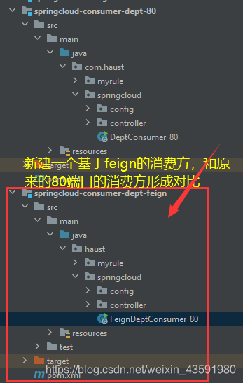

2. 拷贝`springcloud-consumer-dept-80`模块下的`pom.xml`，resource，以及java代码到`springcloud-consumer-feign`模块，并添加feign依赖。

   ```xml
   <!--Feign的依赖-->
   <dependency>
       <groupId>org.springframework.cloud</groupId>
       <artifactId>spring-cloud-starter-feign</artifactId>
       <version>1.4.6.RELEASE</version>
   </dependency>
   ```

3. 通过**Ribbon**实现：—原来的controller：**`DeptConsumerController.java`**

   ```java
   @RestController
   public class DeptConsumerController {
   
       /**
        * 理解：消费者，不应该有service层~
        * RestTemplate .... 供我们直接调用就可以了！ 注册到Spring中
        * (地址：url, 实体：Map ,Class<T> responseType)
        * <p>
        * 提供多种便捷访问远程http服务的方法，简单的Restful服务模板~
        */
       @Autowired
       private RestTemplate restTemplate;
   
       /**
        * 服务提供方地址前缀
        * <p>
        * Ribbon:我们这里的地址，应该是一个变量，通过服务名来访问
        */
   //    private static final String REST_URL_PREFIX = "http://localhost:8001";
       private static final String REST_URL_PREFIX = "http://SPRINGCLOUD-PROVIDER-DEPT";
   
       /**
        * 消费方添加部门信息
        * @param dept
        * @return
        */
       @RequestMapping("/consumer/dept/add")
       public boolean add(Dept dept) {
           // postForObject(服务提供方地址(接口),参数实体,返回类型.class)
           return restTemplate.postForObject(REST_URL_PREFIX + "/dept/add", dept, Boolean.class);
       }
   
       /**
        * 消费方根据id查询部门信息
        * @param id
        * @return
        */
       @RequestMapping("/consumer/dept/get/{id}")
       public Dept get(@PathVariable("id") Long id) {
           // getForObject(服务提供方地址(接口),返回类型.class)
           return restTemplate.getForObject(REST_URL_PREFIX + "/dept/get/" + id, Dept.class);
       }
   
       /**
        * 消费方查询部门信息列表
        * @return
        */
       @RequestMapping("/consumer/dept/list")
       public List<Dept> list() {
           return restTemplate.getForObject(REST_URL_PREFIX + "/dept/list", List.class);
       }
   }
   ```

4. 通过**Feign**实现：—改造后controller：**`DeptConsumerController.java`**

   ```java
   @RestController
   public class DeptConsumerController {
   
       @Autowired
       private DeptClientService deptClientService;
   
       /**
        * 消费方添加部门信息
        * @param dept
        * @return
        */
       @RequestMapping("/consumer/dept/add")
       public boolean add(Dept dept) {
           return deptClientService.addDept(dept);
       }
   
       /**
        * 消费方根据id查询部门信息
        * @param id
        * @return
        */
       @RequestMapping("/consumer/dept/get/{id}")
       public Dept get(@PathVariable("id") Long id) {
          return deptClientService.queryById(id);
       }
   
       /**
        * 消费方查询部门信息列表
        * @return
        */
       @RequestMapping("/consumer/dept/list")
       public List<Dept> list() {
           return deptClientService.queryAll();
       }
   }
   ```

   Feign和Ribbon二者对比，前者显现出面向接口编程特点，代码看起来更清爽，而且==Feign调用方式更符合我们之前在做SSM或者SprngBoot项目时，Controller层调用Service层的编程习惯！==

5. **主配置类**：

   ```java
   @SpringBootApplication
   @EnableEurekaClient
   // feign客户端注解,并指定要扫描的包以及配置接口DeptClientService
   @EnableFeignClients(basePackages = {"com.jin.springcloud"})
   // 切记不要加这个注解，不然会出现404访问不到
   //@ComponentScan("com.haust.springcloud")
   public class FeignDeptConsumer_80 {
       public static void main(String[] args) {
           SpringApplication.run(FeignDeptConsumer_80.class, args);
       }
   }
   ```

##### 2. 改造`springcloud-api`模块

将service包至于该模块下，以供所有模块使用

1. `pom.xml`添加feign依赖

   ```xml
   <!--Feign的依赖-->
   <dependency>
       <groupId>org.springframework.cloud</groupId>
       <artifactId>spring-cloud-starter-feign</artifactId>
       <version>1.4.6.RELEASE</version>
   </dependency>
   ```

2. 新建service包，并新建`DeptClientService.java`接口

   ```java
   // @FeignClient:微服务客户端注解,value:指定微服务的名字,这样就可以使Feign客户端直接找到对应的微服务
   @FeignClient(value = "SPRINGCLOUD-PROVIDER-DEPT")
   public interface DeptClientService {
   
       @GetMapping("/dept/get/{id}")
       Dept queryById(@PathVariable("id") Long id);
   
       @GetMapping("/dept/list")
       List<Dept> queryAll();
   
       @PostMapping("/dept/add")
       boolean addDept(Dept dept);
   }
   ```

### 7.3 Feign和Ribbon如何选择？

**根据个人习惯而定，如果喜欢REST风格使用Ribbon；如果喜欢社区版的面向接口风格使用Feign.**

Feign 本质上也是实现了 Ribbon，只不过后者是在调用方式上，为了满足一些开发者习惯的接口调用习惯！

我们关闭`springcloud-consumer-dept-80` 这个服务消费方，换用`springcloud-consumer-dept-feign`(端口还是80) 来代替：(依然可以正常访问，就是调用方式相比于Ribbon变化了)


## 8. Hystrix：服务熔断

**分布式系统面临的问题**

==复杂分布式体系结构中的应用程序有数十个依赖关系，每个依赖关系在某些时候将不可避免失败！==

### 8.1 服务雪崩

 多个微服务之间调用的时候，假设微服务A调用微服务B和微服务C，微服务B和微服务C又调用其他的微服务，这就是所谓的“扇出”，如果扇出的链路上**某个微服务的调用响应时间过长，或者不可用**，对微服务A的调用就会占用越来越多的系统资源，进而引起系统崩溃，所谓的“==雪崩效应==”。


对于高流量的应用来说，单一的后端依赖可能会导致所有服务器上的所有资源都在几十秒内饱和。比失败更糟糕的是，这些应用程序还可能导致服务之间的延迟增加，备份队列，线程和其他系统资源紧张，导致整个系统发生更多的级联故障，**这些都表示需要对故障和延迟进行隔离和管理，以达到单个依赖关系的失败而不影响整个应用程序或系统运行。**

 我们需要，**弃车保帅**！

### 8.2 什么是Hystrix？

**Hystrix**是一个应用于处理分布式系统的延迟和容错的开源库，在分布式系统里，许多依赖不可避免的会调用失败，比如超时，异常等，**Hystrix** ==能够保证在一个依赖出问题的情况下，不会导致整个体系服务失败，避免级联故障，以提高分布式系统的弹性。==

 **“断路器”**本身是一种开关装置，当某个服务单元发生故障之后，通过断路器的故障监控 (类似熔断保险丝) ，**向调用方返回一个服务预期的，可处理的备选响应 (FallBack) ，而不是长时间的等待或者抛出调用方法无法处理的异常，这样就可以保证了服务调用方的线程不会被长时间，不必要的占用**，从而避免了故障在分布式系统中的蔓延，乃至雪崩。


### 8.3 Hystrix能干嘛？

- 服务降级
- 服务熔断
- 服务限流
- 接近实时的监控
- …

当一切正常时，请求流可以如下所示：


当许多后端系统中有一个潜在阻塞服务时，它可以阻止整个用户请求：


随着大容量通信量的增加，单个后端依赖项的潜在性会导致所有服务器上的所有资源在几秒钟内饱和。

应用程序中通过网络或客户端库可能导致网络请求的每个点都是潜在故障的来源。比失败更糟糕的是，这些应用程序还可能导致服务之间的延迟增加，从而备份队列、线程和其他系统资源，从而导致更多跨系统的级联故障。


当使用**Hystrix**包装每个基础依赖项时，上面的图表中所示的体系结构会发生类似于以下关系图的变化。**每个依赖项是相互隔离的**，限制在延迟发生时它可以填充的资源中，并包含在回退逻辑中，该逻辑决定在依赖项中发生任何类型的故障时要做出什么样的响应：


**官网资料**：https://github.com/Netflix/Hystrix/wiki

### 8.4 服务熔断

#### 1. 什么是服务熔断?

 **熔断机制是应对雪崩效应的一种微服务链路保护机制。**

 当扇出链路的某个微服务不可用或者响应时间太长时，会进行服务的降级，进而熔断该节点微服务的调用，快速返回错误的响应信息。检测到该节点微服务调用响应正常后恢复调用链路。在SpringCloud框架里熔断机制通过Hystrix实现。Hystrix会监控微服务间调用的状况，当失败的调用到一定阀值缺省是5秒内20次调用失败，就会启动熔断机制。熔断机制的注解是：`@HystrixCommand`。

服务熔断解决如下问题：

* 当所依赖的对象不稳定时，能够起到快速失败的目的；
* 快速失败后，能够根据一定的算法动态试探所依赖对象是否恢复。

#### 2. 入门案例

新建`springcloud-provider-dept-hystrix-8001`模块并拷贝`springcloud-provider-dept–8001内`的**`pom.xml`、resource和Java**代码进行初始化并调整。

1. 导入hystrix依赖

   ```xml
   <!--导入Hystrix依赖-->
   <dependency>
       <groupId>org.springframework.cloud</groupId>
       <artifactId>spring-cloud-starter-hystrix</artifactId>
       <version>1.4.6.RELEASE</version>
   </dependency>
   ```

2. 调整yaml配置文件

   ```yaml
   server:
     port: 8001
   
   # mybatis配置
   mybatis:
     # springcloud-api 模块下的pojo包
     type-aliases-package: com.jin.springcloud.pojo
     # 本模块下的mybatis-config.xml核心配置文件类路径
     config-location: classpath:mybatis/mybatis-config.xml
     # 本模块下的mapper配置文件类路径
     mapper-locations: classpath:mybatis/mapper/*.xml
   
   # spring配置
   spring:
     application:
       #项目名
       name: springcloud-provider-dept
     datasource:
       # 德鲁伊数据源
       type: com.alibaba.druid.pool.DruidDataSource
       driver-class-name: com.mysql.jdbc.Driver
       url: jdbc:mysql://localhost:3306/db01?userSSL=true&useUnicode=true&characterEncoding=utf-8
       username: root
       password: 123456
   
   # Eureka配置：配置服务注册中心地址
   eureka:
     client:
       service-url:
         # 注册中心地址7001-7003
         defaultZone: http://eurekatest7001.com:7001/eureka/,http://eurekatest7002.com:7002/eureka/,http://eurekatest7003.com:7003/eureka/
     instance:
       instance-id: springcloud-provider-dept-hystrix-8001 #修改Eureka上的默认描述信息
       prefer-ip-address: true #改为true后默认显示的是ip地址而不再是localhost
   
   #info配置
   info:
     app.name: kuangshen-springcloud
     company.name: blog.kuangstudy.com
   ```

   **`prefer-ip-address`: false**:

   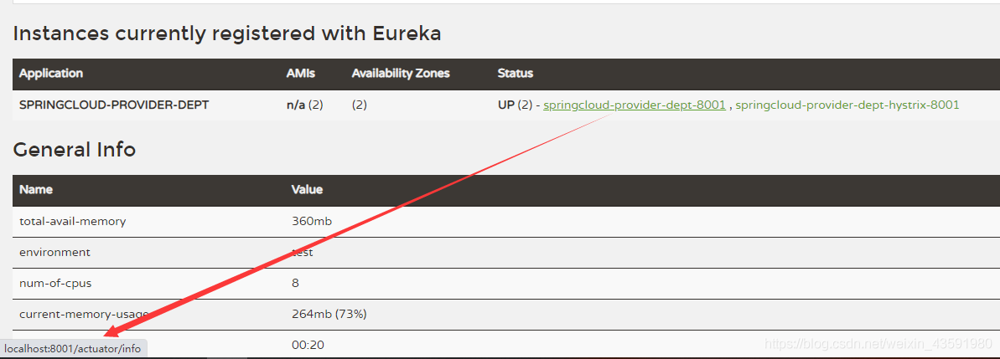

   **`prefer-ip-address`: true**：

   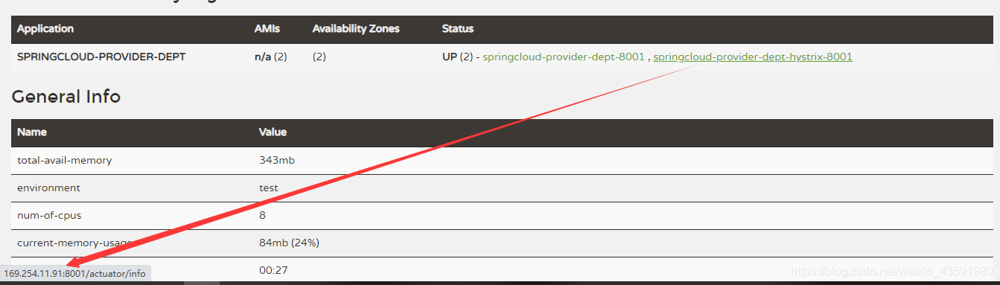

3. 修改controller

   ```java
   @RestController
   public class DeptController {
   
       @Autowired
       private DeptService deptService;
   
       /**
        * 根据id查询部门信息
        * 如果根据id查询出现异常,则走hystrixGet这段备选代码
        * @param id
        * @return
        */
       @HystrixCommand(fallbackMethod = "hystrixGet")
       @RequestMapping("/dept/get/{id}")//根据id查询
       public Dept get(@PathVariable("id") Long id){
           Dept dept = deptService.queryById(id);
           if (dept==null){
               throw new RuntimeException("这个id=>"+id+",不存在该用户，或信息无法找到~");
           }
           return dept;
       }
   
       /**
        * 根据id查询备选方案(熔断)
        * @param id
        * @return
        */
       public Dept hystrixGet(@PathVariable("id") Long id){
           return new Dept().setDeptno(id)
                   .setDname("这个id=>"+id+",没有对应的信息,null---@Hystrix~")
                   .setDb_source("在MySQL中没有这个数据库");
       }
   }
   ```

4. 为主启动类添加对熔断的支持注解`@EnableCircuitBreaker`

   ```java
   @SpringBootApplication
   @EnableEurekaClient // EnableEurekaClient 客户端的启动类，在服务启动后自动向注册中心注册服务
   @EnableDiscoveryClient // 服务发现~
   @EnableCircuitBreaker // 添加对熔断的支持注解
   //新版是@EnableHystrix
   public class HystrixDeptProvider_8001 {
       public static void main(String[] args) {
           SpringApplication.run(HystrixDeptProvider_8001.class,args);
       }
   }
   ```

5. **测试**：

   使用熔断后，当访问一个不存在的id时，前台页展示数据如下:

   

   而不使用熔断的`springcloud-provider-dept–8001`模块访问相同地址会出现下面状况:

   

   因此，**为了避免因某个微服务后台出现异常或错误而导致整个应用或网页报错，使用熔断是必要的**

### 8.5 服务降级

#### 1. 什么是服务降级?

服务降级是指 当服务器压力剧增的情况下，根据实际业务情况及流量，对一些服务和页面有策略的不处理，或换种简单的方式处理，从而释放服务器资源以保证核心业务正常运作或高效运作。说白了，就是尽可能的把系统资源让给优先级高的服务。

资源有限，而请求是无限的。如果在并发高峰期，不做服务降级处理，一方面肯定会影响整体服务的性能，严重的话可能会导致宕机某些重要的服务不可用。所以，一般在高峰期，为了保证核心功能服务的可用性，都要对某些服务降级处理。比如当双11活动时，把交易无关的服务统统降级，如查看蚂蚁深林，查看历史订单等等。

服务降级主要用于什么场景呢？当整个微服务架构整体的负载超出了预设的上限阈值或即将到来的流量预计将会超过预设的阈值时，为了保证重要或基本的服务能正常运行，可以将一些 不重要 或 不紧急 的服务或任务进行服务的 延迟使用 或 暂停使用。

降级的方式可以根据业务来，可以延迟服务，比如延迟给用户增加积分，只是放到一个缓存中，等服务平稳之后再执行 ；或者在粒度范围内关闭服务，比如关闭相关文章的推荐。


由上图可得，当某一时间内服务A的访问量暴增，而B和C的访问量较少，为了缓解A服务的压力，这时候需要B和C暂时关闭一些服务功能，去承担A的部分服务，从而为A分担压力，叫做服务降级。

#### 2. 服务降级需要考虑的问题

1. 那些服务是核心服务，哪些服务是非核心服务
2. 那些服务可以支持降级，那些服务不能支持降级，降级策略是什么
3. 除服务降级之外是否存在更复杂的业务放通场景，策略是什么？

#### 3. 自动降级分类

1. 超时降级：主要配置好超时时间和超时重试次数和机制，并使用异步机制探测回复情况
2. 失败次数降级：主要是一些不稳定的api，当失败调用次数达到一定阀值自动降级，同样要使用异步机制探测回复情况
3. 故障降级：比如要调用的远程服务挂掉了（网络故障、DNS故障、http服务返回错误的状态码、rpc服务抛出异常），则可以直接降级。降级后的处理方案有：默认值（比如库存服务挂了，返回默认现货）、兜底数据（比如广告挂了，返回提前准备好的一些静态页面）、缓存（之前暂存的一些缓存数据）
4. 限流降级：秒杀或者抢购一些限购商品时，此时可能会因为访问量太大而导致系统崩溃，此时会使用限流来进行限制访问量，当达到限流阀值，后续请求会被降级；降级后的处理方案可以是：排队页面（将用户导流到排队页面等一会重试）、无货（直接告知用户没货了）、错误页（如活动太火爆了，稍后重试）。

#### 4. 入门案例

1. 在`springcloud-api`模块下的service包中新建降级配置类`DeptClientServiceFallBackFactory.java`

   ```java
   @Component
   public class DeptClientServiceFallBackFactory implements FallbackFactory {
   
       @Override
       public DeptClientService create(Throwable cause) {
           return new DeptClientService() {
               @Override
               public Dept queryById(Long id) {
                   return new Dept()
                           .setDeptno(id)
                           .setDname("id=>" + id + "没有对应的信息，客户端提供了降级的信息，这个服务现在已经被关闭")
                           .setDb_source("没有数据~");
               }
               @Override
               public List<Dept> queryAll() {
                   return null;
               }
   
               @Override
               public Boolean addDept(Dept dept) {
                   return false;
               }
           };
       }
   }
   ```

2. 在`DeptClientService`中指定降级配置类`DeptClientServiceFallBackFactory`

   ```java
   //@FeignClient:微服务客户端注解,value:指定微服务的名字,这样就可以使Feign客户端直接找到对应的微服务
   @FeignClient(value = "SPRINGCLOUD-PROVIDER-DEPT",fallbackFactory = DeptClientServiceFallBackFactory.class)//fallbackFactory指定降级配置类
   public interface DeptClientService {
   
       @GetMapping("/dept/get/{id}")
       public Dept queryById(@PathVariable("id") Long id);
   
       @GetMapping("/dept/list")
       public List<Dept> queryAll();
   
       @GetMapping("/dept/add")
       public Boolean addDept(Dept dept);
   }
   ```

3. 在**`springcloud-consumer-dept-feign`**模块中开启降级：

   ```yaml
   server:
     port: 80
   
   # Eureka配置
   eureka:
     client:
       register-with-eureka: false # 不向 Eureka注册自己
       service-url: # 从三个注册中心中随机取一个去访问
         defaultZone: http://eureka7001.com:7001/eureka/,http://eureka7002.com:7002/eureka/,http://eureka7003.com:7003/eureka/
   
   # 开启降级feign.hystrix
   feign:
     hystrix:
       enabled: true
   ```

4. 测试，打卡eureka, provider, feign-consumer,测试http://localhost/consumer/dept/get/1，正常显示数据，关掉所有provider，显示如下数据，则表明服务已降级。

   ```json
   {"deptno":1,"dname":"id=>1没有对应信息，客户端提供了降级的信息，这个服务现在已经被关闭","db_source":"没有数据"}
   ```

### 8.6 服务熔断和降级的区别

* 服务熔断—>服务端：某个服务超时或异常，引起熔断~，类似于保险丝(自我熔断)
* 服务降级—>客户端：从整体网站请求负载考虑，当某个服务熔断或者关闭之后，服务将不再被调用，此时在客户端，我们可以准备一个 FallBackFactory ，返回一个默认的值(缺省值)。会导致整体的服务下降，但是好歹能用，比直接挂掉强。
* 触发原因不太一样，服务熔断一般是某个服务（下游服务）故障引起，而服务降级一般是从整体负荷考虑；管理目标的层次不太一样，熔断其实是一个框架级的处理，每个微服务都需要（无层级之分），而降级一般需要对业务有层级之分（比如降级一般是从最外围服务开始）
* 实现方式不太一样，服务降级具有代码侵入性(由控制器完成/或自动降级)，熔断一般称为自我熔断。

**熔断，降级，限流：**

* 限流：限制并发的请求访问量，超过阈值则拒绝；
* 降级：服务分优先级，牺牲非核心服务（不可用），保证核心服务稳定；从整体负荷考虑；
* 熔断：依赖的下游服务故障触发熔断，避免引发本系统崩溃；系统自动执行和恢复

### 8.7 Dashboard 流监控

新建`springcloud-consumer-hystrix-dashboard`模块,

1. 添加依赖

   ```xml
   <!--Hystrix依赖-->
   <dependency>
       <groupId>org.springframework.cloud</groupId>
       <artifactId>spring-cloud-starter-hystrix</artifactId>
       <version>1.4.6.RELEASE</version>
   </dependency>
   <!--dashboard依赖-->
   <dependency>
       <groupId>org.springframework.cloud</groupId>
       <artifactId>spring-cloud-starter-hystrix-dashboard</artifactId>
       <version>1.4.6.RELEASE</version>
   </dependency>
   <!--Ribbon-->
   <dependency>
       <groupId>org.springframework.cloud</groupId>
       <artifactId>spring-cloud-starter-ribbon</artifactId>
       <version>1.4.6.RELEASE</version>
   </dependency>
   <!--Eureka-->
   <dependency>
       <groupId>org.springframework.cloud</groupId>
       <artifactId>spring-cloud-starter-eureka</artifactId>
       <version>1.4.6.RELEASE</version>
   </dependency>
   <!--实体类+web-->
   <dependency>
       <groupId>com.haust</groupId>
       <artifactId>springcloud-api</artifactId>
       <version>1.0-SNAPSHOT</version>
   </dependency>
   <dependency>
       <groupId>org.springframework.boot</groupId>
       <artifactId>spring-boot-starter-web</artifactId>
   </dependency>
   <!--热部署-->
   <dependency>
       <groupId>org.springframework.boot</groupId>
       <artifactId>spring-boot-devtools</artifactId>
   </dependency>
   ```

2. `application.yaml`

   ```yaml
   #更改端口
   server:
   	port: 9001
   ```

3. 主启动类

   ```java
   @SpringBootApplication
   // 开启Dashboard
   @EnableHystrixDashboard
   public class DeptConsumerDashboard_9001 {
       public static void main(String[] args) {
           SpringApplication.run(DeptConsumerDashboard_9001.class,args);
       }
   }
   ```

4. 给`springcloud-provider-dept-hystrix-8001`模块下的主启动类添加如下代码,添加监控

   ```java
   @SpringBootApplication
   @EnableEurekaClient //EnableEurekaClient 客户端的启动类，在服务启动后自动向注册中心注册服务
   public class DeptProvider_8001 {
       public static void main(String[] args) {
           SpringApplication.run(DeptProvider_8001.class,args);
       }
   
       //增加一个 Servlet
       @Bean
       public ServletRegistrationBean hystrixMetricsStreamServlet(){
           ServletRegistrationBean registrationBean = new ServletRegistrationBean(new HystrixMetricsStreamServlet());
           //访问该页面就是监控页面
           registrationBean.addUrlMappings("/actuator/hystrix.stream");
          
           return registrationBean;
       }
   }
   ```

5. 访问：http://localhost:9001/hystrix

   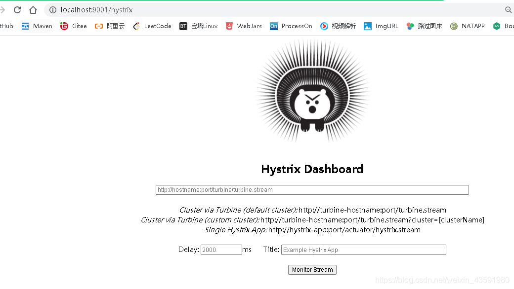

   进入监控页面：

   

   效果如下图：

   

   

   

   * 7色

   * 一圈

     实心圆：共有两种含义，通过颜色变化代表了实例的健康程度

     它的健康程度从绿色<黄色<橙色<红色 递减

     该实心圆除了颜色的变化之外，它的大小也会根据实例的请求流量发生变化，流量越大，该实心圆就越大，所以通过实心圆的展示，就可以在大量的实例中快速发现**故障实例和高压力实例**

   * 一线

     曲线：用来记录2分钟内流量的相对变化，可以通过它来观察到流量的上升和下降趋势！

## 9. Zuul路由网关

### 9.1 概述

#### 1. 什么是zuul?

 Zull包含了对请求的路由(用来跳转的)和过滤两个最主要功能：

 其中**路由功能负责将外部请求转发到具体的微服务实例上，是实现外部访问统一入口的基础，而过滤器功能则负责对请求的处理过程进行干预，是实现请求校验，服务聚合等功能的基础**。Zuul和Eureka进行整合，将Zuul自身注册为Eureka服务治理下的应用，同时从Eureka中获得其他服务的消息，也即以后的访问微服务都是通过Zuul跳转后获得。


**注意**：Zuul 服务最终还是会注册进 Eureka

**提供**：代理 + 路由 + 过滤 三大功能！

#### 2. Zuul 能干嘛？

- 路由
- 过滤

官方文档：https://github.com/Netflix/zuul/

### 9.2 入门案例

1. **新建`springcloud-zuul-9527`模块，并导入依赖**

   ```xml
   <dependencies>
       <!--导入zuul依赖-->
       <dependency>
           <groupId>org.springframework.cloud</groupId>
           <artifactId>spring-cloud-starter-zuul</artifactId>
           <version>1.4.6.RELEASE</version>
       </dependency>
       <!--Hystrix依赖-->
       <dependency>
           <groupId>org.springframework.cloud</groupId>
           <artifactId>spring-cloud-starter-hystrix</artifactId>
           <version>1.4.6.RELEASE</version>
       </dependency>
       <!--dashboard依赖-->
       <dependency>
           <groupId>org.springframework.cloud</groupId>
           <artifactId>spring-cloud-starter-hystrix-dashboar</artifactId>
           <version>1.4.6.RELEASE</version>
       </dependency>
       <!--Ribbon-->
       <dependency>
           <groupId>org.springframework.cloud</groupId>
           <artifactId>spring-cloud-starter-ribbon</artifactId>
           <version>1.4.6.RELEASE</version>
       </dependency>
       <!--Eureka-->
       <dependency>
           <groupId>org.springframework.cloud</groupId>
           <artifactId>spring-cloud-starter-eureka</artifactId>
           <version>1.4.6.RELEASE</version>
       </dependency>
       <!--实体类+web-->
       <dependency>
           <groupId>com.haust</groupId>
           <artifactId>springcloud-api</artifactId>
           <version>1.0-SNAPSHOT</version>
       </dependency>
       <dependency>
           <groupId>org.springframework.boot</groupId>
           <artifactId>spring-boot-starter-web</artifactId>
       </dependency>
       <!--热部署-->
       <dependency>
           <groupId>org.springframework.boot</groupId>
           <artifactId>spring-boot-devtools</artifactId>
       </dependency>
   </dependencies>
   ```

2. **`application.yaml`**

   ```yaml
   server:
     port: 9527
   
   spring:
     application:
       name: springcloud-zuul #微服务名称
   
   # eureka 注册中心配置
   eureka:
     client:
       service-url:
         defaultZone: http://eureka7001.com:7001/eureka/,http://eureka7002.com:7002/eureka/,http://eureka7003.com:7003/eureka/
     instance: #实例的id
       instance-id: zuul9527.com
       prefer-ip-address: true # 显示ip
   
   info:
     app.name: haust.springcloud # 项目名称
     company.name: 河南科技大学西苑校区 # 公司名称
   
   # zull 路由网关配置
   zuul:
     # 路由相关配置
     # 原来访问路由 eg:http://localhost:9527/springcloud-provider-dept/dept/get/1
     # zull路由配置后访问路由 eg:localhost:9527/jin/mydept/dept/get/1
     routes:
       mydept.serviceId: springcloud-provider-dept # eureka注册中心的服务提供方路由名称
       mydept.path: /mydept/** # 将eureka注册中心的服务提供方路由名称 改为自定义路由名称
     # 不能再使用这个路径访问了，*： 忽略,隐藏全部的服务名称~
     ignored-services: "*"
     # 设置公共的前缀
     prefix: /jin
   ```

3. **主启动类**

   ```java
   @SpringBootApplication
   @EnableZuulProxy // 开启Zuul
   public class ZuulApplication_9527 {
   
       public static void main(String[] args) {
           SpringApplication.run(ZuulApplication_9527.class,args);
       }
   }
   ```

4. 测试：

   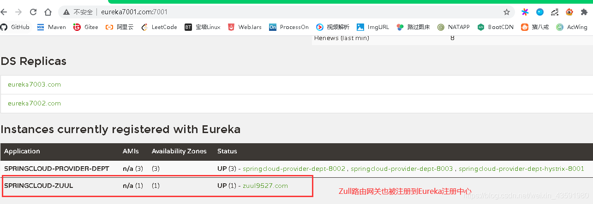

   可以看出Zull路由网关被注册到Eureka注册中心中了！

   

   上图是没有经过Zull路由网关配置时，服务接口访问的路由，可以看出直接用微服务(服务提供方)名称去访问，这样不安全，不能将微服务名称暴露！

   所以经过Zull路由网关配置后，访问的路由为：

   

   我们看到，微服务名称被替换并隐藏，换成了我们自定义的微服务名称mydept，同时加上了前缀haust，这样就做到了对路由fan访问的加密处理！

   详情参考springcloud中文社区zuul组件 :https://www.springcloud.cc/spring-cloud-greenwich.html#_router_and_filter_zuul

   

## 10. Spring Cloud Config 分布式配置

**Dalston.RELEASE**

**Spring Cloud Config为分布式系统中的外部配置提供服务器和客户端支持。**使用Config Server，您可以在所有环境中管理应用程序的外部属性。客户端和服务器上的概念映射与Spring ==Environment==和==PropertySource==抽象相同，因此它们与Spring应用程序非常契合，但可以与任何以任何语言运行的应用程序一起使用。随着应用程序通过从开发人员到测试和生产的部署流程，您可以管理这些环境之间的配置，并确定应用程序具有迁移时需要运行的一切。服务器存储后端的默认实现使用git，因此它轻松支持标签版本的配置环境，以及可以访问用于管理内容的各种工具。很容易添加替代实现，并使用Spring配置将其插入。

### 10.1 概述

**1. 分布式系统面临的–配置文件问题**

微服务意味着要将单体应用中的业务拆分成一个个子服务，每个服务的粒度相对较小，因此系统中会出现大量的服务，由于每个服务都需要必要的配置信息才能运行，所以一套集中式的，动态的配置管理设施是必不可少的。spring cloud提供了configServer来解决这个问题，我们每一个微服务自己带着一个application.yml，那上百个的配置文件修改起来，令人头疼！

**2. 什么是SpringCloud config分布式配置中心？**


spring cloud config 为微服务架构中的微服务提供集中化的外部支持，配置服务器为各个不同微服务应用的所有环节提供了一个**中心化的外部配置**。

 spring cloud config 分为**服务端**和**客户端**两部分。

 服务端也称为**分布式配置中心**，它是一个独立的微服务应用，用来连接配置服务器并为客户端提供获取配置信息，加密，解密信息等访问接口。

 客户端则是**通过指定的配置中心来管理应用资源，以及与业务相关的配置内容，并在启动的时候从配置中心获取和加载配置信息**。配置服务器默认采用git来存储配置信息，这样就有助于对环境配置进行版本管理。并且可用通过git客户端工具来方便的管理和访问配置内容。

**3. spring cloud config 分布式配置中心能干嘛？**

* 集中式管理配置文件
* 不同环境，不同配置，动态化的配置更新，分环境部署，比如 /dev /test /prod /beta /release
* 运行期间动态调整配置，不再需要在每个服务部署的机器上编写配置文件，服务会向配置中心统一拉取配置自己的信息
* 当配置发生变动时，服务不需要重启，即可感知到配置的变化，并应用新的配置
* 将配置信息以REST接口的形式暴露

**4. spring cloud config 分布式配置中心与GitHub整合**

 由于spring cloud config 默认使用git来存储配置文件 (也有其他方式，比如自持SVN 和本地文件)，但是最推荐的还是git ，而且使用的是 http / https 访问的形式。

### 10.2 入门案例

#### **服务端**

1. 新建`springcloud-config-server-3344`模块导入`pom.xml`依赖

   ```xml
   <dependencies>
       <!--web-->
       <dependency>
           <groupId>org.springframework.boot</groupId>
           <artifactId>spring-boot-starter-web</artifactId>
       </dependency>
       <!--config-->
       <dependency>
           <groupId>org.springframework.cloud</groupId>
           <artifactId>spring-cloud-config-server</artifactId>
           <version>2.1.1.RELEASE</version>
       </dependency>
       <!--eureka-->
       <dependency>
           <groupId>org.springframework.cloud</groupId>
           <artifactId>spring-cloud-starter-eureka</artifactId>
           <version>1.4.6.RELEASE</version>
       </dependency>
   </dependencies>
   ```

2. resource下创建`application.yaml`配置文件，Spring Cloud Config服务器从git存储库（必须提供）为远程客户端提供配置：

   ```yaml
   server:
     port: 3344
   
   spring:
     application:
       name: springcloud-config-server
     # 连接远程仓库
     cloud:
       config:
         server:
           git:
             # 注意是https的而不是ssh
             uri: https://github.com/JinhaoZhang0/springcloud-config-test.git
               # 通过 config-server可以连接到git，访问其中的资源以及配置~
   
   # 不加这个配置会报Cannot execute request on any known server 这个错：连接Eureka服务端地址不对
   # 或者直接注释掉eureka依赖 这里暂时用不到eureka
   eureka:
     client:
       register-with-eureka: false
       fetch-registry: false
   ```

3. 主启动类

   ```java
   @EnableConfigServer // 开启spring cloud config server服务
   @SpringBootApplication
   public class ConfigServer_3344 {
       public static void main(String[] args) {
           SpringApplication.run(Config_server_3344.class,args);
       }
   }
   ```

4. 将本地git仓库`springcloud-config`文件夹下新建的`application.yaml`提交到码云仓库：

   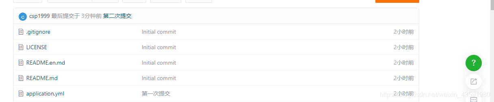

   定位资源的默认策略是克隆一个git仓库（在`spring.cloud.config.server.git.uri`），并使用它来初始化一个迷你`SpringApplication`。小应用程序的`Environment`用于枚举属性源并通过JSON端点发布。

   HTTP服务具有以下格式的资源：

   ```tex
   /{application}/{profile}[/{label}]
   /{application}-{profile}.yml
   /{label}/{application}-{profile}.yml
   /{application}-{profile}.properties
   /{label}/{application}-{profile}.properties
   ```

   其中“应用程序”作为`SpringApplication`中的`spring.config.name`注入（即常规的Spring Boot应用程序中通常是“应用程序”），“配置文件”是活动配置文件（或逗号分隔列表的属性），“label”是可选的git标签（默认为“master”）。

5. 测试访问http://localhost:3344/application-dev.yaml

   

   测试访问 http://localhost:3344/application/test/master

   

   测试访问 http://localhost:3344/master/application-dev.yaml

   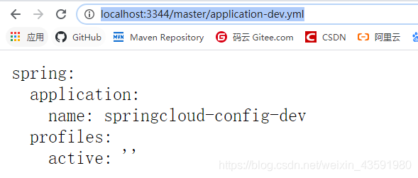

   

   如果测试访问不存在的配置则不显示 如：http://localhost:3344/master/application-aaa.yaml

#### **客户端**

1. 将本地git仓库`springcloud-config`文件夹下新建的`config-client.yaml`提交到码云仓库：

   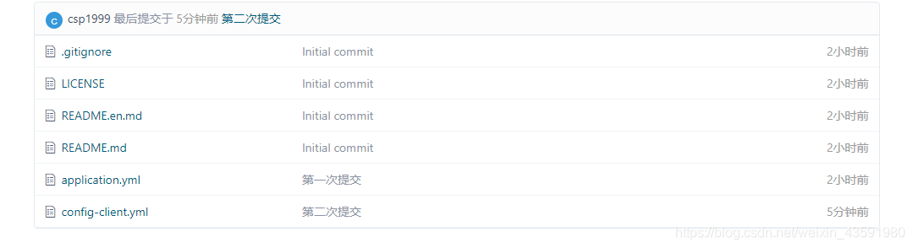

2. 新建一个`springcloud-config-client-3355`模块，并导入依赖

   ```xml
   <dependencies>
       <!--config-->
       <!-- https://mvnrepository.com/artifact/org.springframework.cloud/spring-cloud-start -->
       <dependency>
           <groupId>org.springframework.cloud</groupId>
           <artifactId>spring-cloud-starter-config</artifactId>
           <version>2.1.1.RELEASE</version>
       </dependency>
       <dependency>
           <groupId>org.springframework.boot</groupId>
           <artifactId>spring-boot-starter-actuator</artifactId>
       </dependency>
       <dependency>
           <groupId>org.springframework.boot</groupId>
           <artifactId>spring-boot-starter-web</artifactId>
       </dependency>
   </dependencies>
   ```

3. resources下创建`application.yaml`和`bootstrap.yaml`配置文件

   **`bootstrap.yaml`** 是系统级别的配置

   ```yaml
   # 系统级别的配置
   spring:
     cloud:
       config:
         name: config-client # 需要从git上读取的资源名称，不要后缀
         profile: dev
         label: master
         uri: http://localhost:3344
   ```

   **`application.yaml`** 是用户级别的配置

   ```yaml
   # 用户级别的配置
   spring:
     application:
       name: springcloud-config-client
   ```

4. 创建controller包下的**`ConfigClientController.java`** 用于测试

   ```java
   @RestController
   public class ConfigClientController {
   
       @Value("${spring.application.name}")
       private String applicationName; //获取微服务名称
   
       @Value("${eureka.client.service-url.defaultZone}")
       private String eurekaServer; //获取Eureka服务
   
       @Value("${server.port}")
       private String port; //获取服务端的端口号
   
   
       @RequestMapping("/config")
       public String getConfig(){
           return "applicationName:"+applicationName +
            "eurekaServer:"+eurekaServer +
            "port:"+port;
       }
   }
   ```

5. 主启动类

   ```java
   @SpringBootApplication
   public class ConfigClient_3355 {
       public static void main(String[] args) {
           SpringApplication.run(ConfigClient_3355.class,args);
       }
   }
   ```

6. 测试：

   启动服务端`Config_server_3344`再启动客户端`ConfigClient`

   访问：http://localhost:8201/config/

   

### 10.3 小案例

1. 本地新建`config-dept.yml`和`config-eureka.yml`并提交到码云仓库

2. 新建`springcloud-config-eureka-7001`模块，并将原来的`springcloud-eureka-7001`模块下的内容拷贝的该模块。

3. 清空该模块的`application.yml`配置，并新建`bootstrap.yml`连接远程配置

   ```yaml
   spring:
     cloud:
       config:
         name: config-eureka # 仓库中的配置文件名称
         label: master
         profile: dev
         uri: http://localhost:3344
   ```

4. 在`pom.xml`中添加spring cloud config依赖

   ```xml
   <!--config-->
   <!-- https://mvnrepository.com/artifact/org.springframework.cloud/spring-cloud-starter-config -->
   <dependency>
       <groupId>org.springframework.cloud</groupId>
       <artifactId>spring-cloud-starter-config</artifactId>
       <version>2.1.1.RELEASE</version>
   </dependency>
   ```

5. 主启动类

   ```java
   @SpringBootApplication
   @EnableEurekaServer //EnableEurekaServer 服务端的启动类，可以接受别人注册进来~
   public class ConfigEurekaServer_7001 {
       public static void main(String[] args) {
           SpringApplication.run(ConfigEurekaServer_7001.class,args);
       }
   }
   ```

6. 测试

   第一步：启动 `Config_Server_3344`，并访问 http://localhost:3344/master/config-eureka-dev.yml 测试

   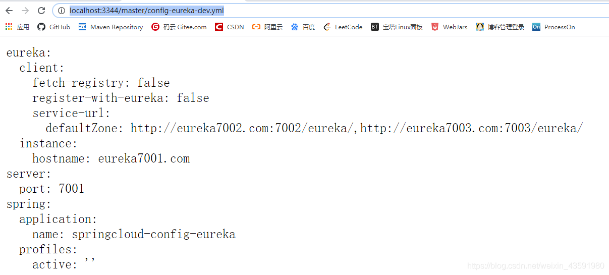

   第二步：启动`ConfigEurekaServer_7001`，访问 http://localhost:7001/ 测试

   

   显示上图则成功

7. 新建`springcloud-config-dept-8001`模块并拷贝`springcloud-provider-dept-8001`的内容

   同理导入spring cloud config依赖、清空`application.yml` 、新建`bootstrap.yml`配置文件并配置

   ```yaml
   spring:
     cloud:
       config:
         name: config-dept
         label: master
         profile: dev
         uri: http://localhost:3344
   ```

8. 主启动类

   ```java
   @SpringBootApplication
   @EnableEurekaClient //在服务启动后自动注册到Eureka中！
   @EnableDiscoveryClient //服务发现~
   @EnableCircuitBreaker //
   public class ConfigDeptProvider_8001 {
       public static void main(String[] args) {
           SpringApplication.run(ConfigDeptProvider_8001.class,args);
       }
   
       //增加一个 Servlet
       @Bean
       public ServletRegistrationBean hystrixMetricsStreamServlet(){
           ServletRegistrationBean registrationBean = new ServletRegistrationBean(new HystrixMetricsStreamServlet());
           registrationBean.addUrlMappings("/actuator/hystrix.stream");
           return registrationBean;
       }
   }
   ```

9. 测试

   
