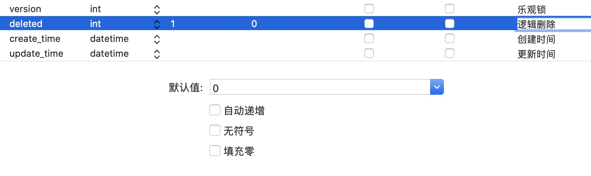
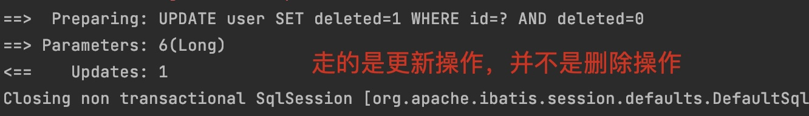
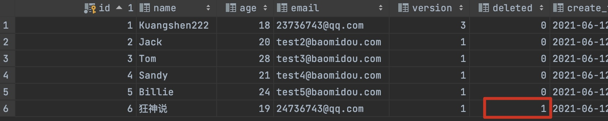
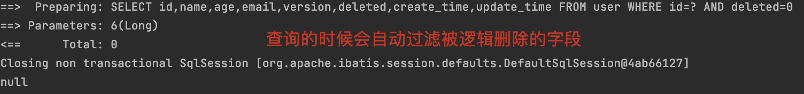

# MyBatisPlus

## 1. MyBatisPlus概述

需要的基础：SSM已学完

为什么要学习它呢？MyBatisPlus可以节省我们大量工作时间，所有的CRUD代码它都可以自动化完成！

JPA, tk-mapper, MyBatisPlus

偷懒的！

### 1.1 简介

是什么？MyBatis本来就是简化JDBC操作的！

官网：[MyBatis-Plus (baomidou.com)](https://baomidou.com/) 简化MyBatis


[MyBatis-Plus](https://github.com/baomidou/mybatis-plus)（简称 MP）是一个 [MyBatis](http://www.mybatis.org/mybatis-3/)的增强工具，在 MyBatis 的基础上只做增强不做改变，为简化开发、提高效率而生。


### 1.2 特性

- **无侵入**：只做增强不做改变，引入它不会对现有工程产生影响，如丝般顺滑
- **损耗小**：启动即会自动注入基本 CURD，性能基本无损耗，直接面向对象操作
- **强大的 CRUD 操作**：内置通用 Mapper、通用 Service，仅仅通过少量配置即可实现单表大部分 CRUD 操作，更有强大的条件构造器，满足各类使用需求
- **支持 Lambda 形式调用**：通过 Lambda 表达式，方便的编写各类查询条件，无需再担心字段写错
- **支持主键自动生成**：支持多达 4 种主键策略（内含分布式唯一 ID 生成器 - Sequence），可自由配置，完美解决主键问题
- **支持 ActiveRecord 模式**：支持 ActiveRecord 形式调用，实体类只需继承 Model 类即可进行强大的 CRUD 操作
- **支持自定义全局通用操作**：支持全局通用方法注入（ Write once, use anywhere ）
- **内置代码生成器**：采用代码或者 Maven 插件可快速生成 Mapper 、 Model 、 Service 、 Controller 层代码，支持模板引擎，更有超多自定义配置等您来使用
- **内置分页插件**：基于 MyBatis 物理分页，开发者无需关心具体操作，配置好插件之后，写分页等同于普通 List 查询
- **分页插件支持多种数据库**：支持 MySQL、MariaDB、Oracle、DB2、H2、HSQL、SQLite、Postgre、SQLServer 等多种数据库
- **内置性能分析插件**：可输出 Sql 语句以及其执行时间，建议开发测试时启用该功能，能快速揪出慢查询
- **内置全局拦截插件**：提供全表 delete 、 update 操作智能分析阻断，也可自定义拦截规则，预防误操作

## 2. 快速入门

地址：[快速开始 | MyBatis-Plus (baomidou.com)](https://baomidou.com/guide/quick-start.html)

使用第三方组件：

1. 导入对应的依赖
2. 研究依赖如何配置
3. 代码如何编写
4. 提高扩展能力即可

### 2.1 步骤

1. 创建数据库`mybatis_plus`

   

2. 创建 `User` 表，其表结构如下：

   | id   | name   | age  | email              |
   | ---- | ------ | ---- | ------------------ |
   | 1    | Jone   | 18   | test1@baomidou.com |
   | 2    | Jack   | 20   | test2@baomidou.com |
   | 3    | Tom    | 28   | test3@baomidou.com |
   | 4    | Sandy  | 21   | test4@baomidou.com |
   | 5    | Billie | 24   | test5@baomidou.com |

   其对应的数据库 Schema 脚本如下：

   ```sql
   DROP TABLE IF EXISTS user;
   
   CREATE TABLE user
   (
   	id BIGINT(20) NOT NULL COMMENT '主键ID',
   	name VARCHAR(30) NULL DEFAULT NULL COMMENT '姓名',
   	age INT(11) NULL DEFAULT NULL COMMENT '年龄',
   	email VARCHAR(50) NULL DEFAULT NULL COMMENT '邮箱',
   	PRIMARY KEY (id)
   );
   -- 真实开发中，version(乐观锁), deleted(逻辑删除), gmt_create, gmt_modified 这些字段都是必要的
   ```
   
   其对应的数据库 Data 脚本如下：
   
   ```sql
   DELETE FROM user;
   
   INSERT INTO user (id, name, age, email) VALUES
   (1, 'Jone', 18, 'test1@baomidou.com'),
   (2, 'Jack', 20, 'test2@baomidou.com'),
   (3, 'Tom', 28, 'test3@baomidou.com'),
   (4, 'Sandy', 21, 'test4@baomidou.com'),
   (5, 'Billie', 24, 'test5@baomidou.com');
   ```
   
3. 编写项目，初始化项目，使用SpringBoot初始化！

4. 导入依赖

   ```xml
   <!--数据库驱动-->
   <dependency>
       <groupId>mysql</groupId>
       <artifactId>mysql-connector-java</artifactId>
   </dependency>
   <!--lombok-->
   <dependency>
       <groupId>org.projectlombok</groupId>
       <artifactId>lombok</artifactId>
   </dependency>
   <!--mybatis-plus 是自己开发的，非官方的-->
   <dependency>
       <groupId>com.baomidou</groupId>
       <artifactId>mybatis-plus-boot-starter</artifactId>
       <version>3.0.5</version>
   </dependency>
   ```

   说明：我们使用mybatis-plus可以节省我们大量的代码，尽量不要同时导入mybatis和mybatis-plus！会有版本的差异

5. 连接数据库，这一步和mybatis相同！

   `application.properties`

   ```properties
   spring.datasource.username=root
   spring.datasource.password=123456
   spring.datasource.url=jdbc:mysql://localhost:3306/mybatis_plus?useSSL=false&useUnicode=true&characterEncoding=utf-8
   spring.datasource.driver-class-name=com.mysql.cj.jdbc.Driver
   ```

6. ==传统方式：pojo-dao(连接mybatis，配置mapper.xml文件)-service-controller==

   使用了mybatis-plus之后

   * pojo
   * mapper接口
   * 使用

   实体类`User`

   ```java
   @Data
   @NoArgsConstructor
   @AllArgsConstructor
   public class User {
       private Long id;
       private String name;
       private Integer age;
       private String email;
   }
   ```

   mapper接口

   ```java
   // 在对应的Mapper上面继承基本的接口BaseMapper
   @Repository //代表持久层
   public interface UserMapper extends BaseMapper<User> {
       //所有的CRUD操作都已经编写完成了
       //你不需要像以前配置一大堆文件了
   }
   ```

   实现类

   ```java
   //扫描mapper文件夹
   @MapperScan("com.jin.mapper")
   @SpringBootApplication
   public class MybatisPlusApplication {
   
       public static void main(String[] args) {
           SpringApplication.run(MybatisPlusApplication.class, args);
       }
   }
   ```

   注意点：我们需要在主启动类上去扫描我们的mapper包下的所有接口`@MapperScan("com.jin.mapper")`

7. 测试类中测试

   ```java
   @SpringBootTest
   class MybatisPlusApplicationTests {
       //继承了BaseMapper，所有的方法都来自父类，
       //我们也可以编写自己的扩展方法！
       @Autowired
       private UserMapper userMapper;
   
       @Test
       void contextLoads() {
           //参数是一个Wrapper，条件构造器，这里我们先不用，null
           //查询全部用户
           List<User> users = userMapper.selectList(null);
           users.forEach(System.out::println);
       }
   }
   ```

   结果：

   

### 2.2 思考问题

1. SQL谁帮我们写的？MyBatisPlus
2. 方法哪里来的？MyBatisPlus


## 3. 配置日志

我们所有的sql现在是不可见的，我们希望知道它是怎么执行的，所以我们必须要看日志！

在`application.properties`中加入如下代码

```properties
# 配置日志
mybatis-plus.configuration.log-impl=org.apache.ibatis.logging.stdout.StdOutImpl
```


配置完毕日志以后，湖面的学习就需要这个自动生成的sql，就会喜欢上MyBatisPlus！


## 4. CRUD扩展

### 4.1 Insert插入

```java
//测试插入
@Test
public void testInsert() {
    User user = new User();
    user.setName("狂神说Java");
    user.setAge(3);
    user.setEmail("24736743@qq.com");

    int result = userMapper.insert(user); //帮我们自动生成id
    System.out.println(result); //受影响的行数
    System.out.println(user); //发现，id会自动回填
}
```


数据库插入的id的默认值为：全局的唯一id

### 4.2 主键生成策略

[分布式系统唯一ID生成方案汇总 - nick hao - 博客园 (cnblogs.com)](https://www.cnblogs.com/haoxinyue/p/5208136.html)

通过在实体类id字段上注解来改变主键生成策略！

```java
@Data
@NoArgsConstructor
@AllArgsConstructor
public class User {
    //对应数据库中的主键(uuid,自增id,雪花算法,redis,zookeeper)
    @TableId(type = IdType.ID_WORKER) //一旦选择INPUT手动输入id之后，就需要自己配置id了
    private Long id;
    private String name;
    private Integer age;
    private String email;
}
```

**雪花算法**：

默认ID_WORKER全局唯一id，（据说新版换成了ASSIGN_ID）

snowflake是Twitter开源的分布式ID生成算法，结果是一个long型的ID。其核心思想是：使用41bit作为毫秒数，10bit作为机器的ID（5个bit是数据中心，5个bit的机器ID），12bit作为毫秒内的流水号（意味着每个节点在每毫秒可以产生 4096 个 ID），最后还有一个符号位，永远是0。可以保证几乎全球唯一！

**主键自增**：

我们需要配置主键自增：

1. 实体类字段上`@TableId(type = IdType.AUTO)`
2. 数据库字段上一定是自增的
3. 再次测试插入即可！

**其余的源码解释：**

```java
public enum IdType {
    AUTO(0),	//数据库id自增
    NONE(1),	//未设置主键
    INPUT(2),	//手动输入
    ID_WORKER(3),	//默认的全局唯一id
    UUID(4),		//全局唯一id uuid
    ID_WORKER_STR(5);	// ID_WORKER字符串表示法
}
```

### 4.3 Update更新

```java
//测试更新
@Test
public void testUpdate() {
    User user = new User();
    //通过条件自动拼接动态sql
    user.setId(6L);
    user.setName("狂神说");
    user.setAge(18);

    //注意；userMapper 参数是一个对象！
    int i = userMapper.updateById(user);
    System.out.println(i);
}
```

所有的sql都是自动帮你动态配置的！

### 4.4 自动填充

创建时间，修改时间！这些个操作都是自动化完成的，我们不希望手动更新!

**阿里巴巴开发手册**：所有的数据库表：`gmt_create`, `gmt_modified` 几乎所有的表都要配置上！而且需要自动化！

#### 方式一：数据库级别

**==该方法不允许在工作中使用，不允许修改数据库！==**

1. 在表中新增字段`create_time`,`update_time`

   

   注意两者默认值都是`CURRENT_TIMESTAMP`，`update_time`要自动更新

2. 再次测试插入方法，我们需要先把实体类同步，添加如下字段

   ```java
   private Date createTime;
   private Date updateTime;
   ```

3. 测试，更新操作

   

   发现更新字段的更新时间变化

#### 方式二：代码级别

1. 去除数据库的默认值，更新操作！

   

2. 实体类字段属性上需要增加注解

   ```java
   //字段添加填充内容
   @TableField(fill = FieldFill.INSERT)
   private Date createTime;
   @TableField(fill = FieldFill.INSERT_UPDATE)
   private Date updateTime;
   ```

3. 编写处理器来处理这个注解即可！

   创建`handler`目录，在下面创建类`MyMetaObjectHandler`

   ```java
   @Slf4j //log
   @Component // 一定不要忘记把处理器加到IOC容器中！
   public class MyMetaObjectHandler implements MetaObjectHandler {
       //插入时的填充策略
       @Override
       public void insertFill(MetaObject metaObject) {
           log.info("start insert fill...");
           // String fieldName, Object fieldVal, MetaObject metaObject
           this.setFieldValByName("createTime", new Date(), metaObject);
           this.setFieldValByName("updateTime", new Date(), metaObject);
       }
   
       //更新时的填充策略
       @Override
       public void updateFill(MetaObject metaObject) {
           log.info("start update fill...");
           this.setFieldValByName("updateTime", new Date(), metaObject);
       }
   }
   ```

4. 测试插入，更新，观察时间，成功！

### 4.5 乐观锁

在面试过程中，我们经常会被问到乐观锁，悲观锁！这个其实非常简单！

**乐观锁：**

* 乐观锁在操作数据时非常乐观，认为别人不会同时修改数据。
* 因此乐观锁不会上锁，只是在执行更新的时候判断一下在此期间别人是否修改了数据。如果别人修改了数据则放弃操作，否则执行操作。

**悲观锁：**

* 悲观锁在操作数据时比较悲观，认为别人会同时修改数据。
* 因此操作数据时直接把数据锁住，直到操作完成后才会释放锁；上锁期间其他人不能修改数据

我们这里主要讲解乐观锁机制

**乐观锁实现方式：**

- 取出记录时，获取当前version
- 更新时，带上这个version
- 执行更新时， set version = newVersion where version = oldVersion
- 如果version不对，就更新失败

```mysql
-- 乐观锁：1. 先查询，获得版本号 version = 1

-- A
update user set name = "Kuangshen", version = version + 1
where id = 2 and version = 1

-- B 线程抢先完成，这个时候 version = 2，会导致A修改失败
update user set name = "Kuangshen", version = version + 1
where id = 2 and version = 1
```

**测试一下MP的乐观锁插件**

1. 给数据库中增加version字段

   

   

2. 我们实体类加对应的字段

   ```java
   @Version //乐观锁Version注解
   private Integer version;
   ```

3. 注册组件，添加`config`目录，创建类`MyBatisPlusConfig`，其中注解`@MapperScan`原先在启动类，转移至此

   ```java
   //扫描mapper文件夹 
   @MapperScan("com.jin.mapper")
   @EnableTransactionManagement //自动管理事务
   @Configuration //配置类
   public class MyBatisPlusConfig {
       //新版已经不是这个，详见官网配置
       //注册乐观锁插件
       @Bean
       public OptimisticLockerInterceptor optimisticLockerInterceptor() {
           return new OptimisticLockerInterceptor();
       }
   }
   ```

4. 测试

   ```java
   //测试乐观锁成功！
   @Test
   public void testOptimisticLocker() {
       //1.查询用户信息
       User user = userMapper.selectById(1L);
       //2.修改用户信息
       user.setName("Kuangshen");
       user.setEmail("23736743@qq.com");
       //3.执行更新操作
       userMapper.updateById(user);
   }
   
   //测试乐观锁失败！多线程下
   @Test
   public void testOptimisticLocker2() {
       //线程1
       User user = userMapper.selectById(1L);
       user.setName("Kuangshen111");
       user.setEmail("23736743@qq.com");
   
       //模拟另外一个线程执行插队操作
       User user2 = userMapper.selectById(1L);
       user2.setName("Kuangshen222");
       user2.setEmail("23736743@qq.com");
       userMapper.updateById(user2);
   
       //可以使用自旋锁多次尝试提交
       userMapper.updateById(user); //如果没有乐观锁就会覆盖插队线程的值
   }
   ```

   

### 4.6 Select查询

```java
// 测试查询
@Test
public void testSelectById() {
    User user = userMapper.selectById(1L);
    System.out.println(user);
}

// 测试批量查询
@Test
public void testSelectBatchIds() {
    List<User> users = userMapper.selectBatchIds(Arrays.asList(1, 2, 3));
    users.forEach(System.out::println);
}

// 测试条件查询 map
@Test
public void testSelectByMap() {
    HashMap<String, Object> map = new HashMap<>();
    //自定义要查询的条件
    map.put("name","狂神说");
    map.put("age",19);
    List<User> users = userMapper.selectByMap(map);
    users.forEach(System.out::println);
}
```

### 4.7 分页查询

分页在网站使用的十分之多！

**分页方法：**

1. 原始的limit进行分页
2. pageHelper 第三方插件
3. MP其实也内置了分页插件

**如何使用：**

1. 配置拦截器组件即可，在`MyBatisPlusConfig`下

   ```java
   //分页插件
   @Bean
   public PaginationInterceptor paginationInterceptor() {
       return new PaginationInterceptor();
   }
   ```

2. 直接使用Page对象测试即可

   ```java
   //测试分页查询
   @Test
   public void testPage() {
       // 参数一：当前页
       // 参数二：页面大小
       Page<User> page = new Page<>(1,5);
       userMapper.selectPage(page,null);
   
       page.getRecords().forEach(System.out::println);
       System.out.println(page.getTotal());
   }
   ```

### 4.8 Delete删除

基本的删除操作

```java
//测试删除
@Test
public void testDeleteById() {
    userMapper.deleteById(7L);
}

//测试批量删除
@Test
public void testDeleteBatchIds() {
    userMapper.deleteBatchIds(Arrays.asList(8L,9L));
}

//通过map删除
@Test
public void testDeleteMap() {
    HashMap<String, Object> map = new HashMap<>();
    map.put("name","狂神说Java");
    userMapper.deleteByMap(map);
}
```

我们在工作中会遇到一些问题：逻辑删除！

### 4.9 逻辑删除

* 物理删除：从数据库中直接移除
* 逻辑删除：在数据库中没有被移除，而是通过一个变量让其失效 deleted = 0  ---> deleted = 1

管理员可以查看被删除的记录！防止数据的丢失，类似于回收站！

测试一下：

1. 在数据表中增加一个`deleted`字段

   

2. 实体类中增加属性

   ```java
   @TableLogic //逻辑删除
   private Integer deleted;
   ```

3. 配置

   `MyBatisPlusConfig`

   ```java
   //逻辑删除
   @Bean
   public ISqlInjector sqlInjector() {
       return new LogicSqlInjector();
   }
   ```

   `application.properties`

   ```properties
   # 配置逻辑删除
   mybatis-plus.global-config.db-config.logic-delete-value=1
   mybatis-plus.global-config.db-config.logic-not-delete-value=0
   ```

4. 测试

   ```java
   //和之前一样的测试删除
   @Test
   public void testDeleteById() {
       userMapper.deleteById(6L);
   }
   ```

   

   

   再进行查询操作

   ```java
   // 测试查询
   @Test
   public void testSelectById() {
       User user = userMapper.selectById(6L);
       System.out.println(user);
   }
   ```

   

   发现已经查不出被逻辑删除的记录

以上所有CRUD操作必须精通掌握，会大大提高工作效率和写项目的效率。

## 5. 性能分析插件

我们在平时的开发中，会遇到一些慢SQL，这时候需要进行测试。druid...

作用：性能分析拦截器，用于输出每条SQL语句及其执行时间

MP也提供性能分析插件，如果超过这个时间就停止运行！

1. 导入插件
2. 测试使用

**==新版的名字叫执行 SQL 分析打印！==**

==**该插件有性能损耗，不建议生产环境使用**==

1. 配置

   `MyBatisPlusConfig`

   ```java
   //SQL执行效率插件
   @Bean
   @Profile({"dev","test"}) //设置 dev test 环境开启，保证我们的效率
   public PerformanceInterceptor performanceInterceptor() {
       PerformanceInterceptor performanceInterceptor = new PerformanceInterceptor();
       performanceInterceptor.setMaxTime(100); //毫秒，设置sql执行的最大时间，如果超过了则不执行
       performanceInterceptor.setFormat(true); //是否开启格式化支持
       return performanceInterceptor;
   }
   ```

   `application.properties`

   ```properties
   # 设置开发环境
   spring.profiles.active=dev
   ```

2. 测试，如果超过最到时间，就会抛出异常

   `MybatisPlusException:  The SQL execution time is too large, please optimize ! `


## 6. 条件构造器

十分重要： Wrapper

我们写一些复杂的sql就可以使用它来替代

1. 测试一，记住查看输出的SQL进行分析

   ```java
   @Autowired
   private UserMapper userMapper;
   
   @Test
   void contextLoads() {
       //参数是一个Wrapper，条件构造器，这里我们先不用，null
       //查询全部用户
       List<User> users = userMapper.selectList(null);
       users.forEach(System.out::println);
   }
   ```

2. 测试二，记住查看输出的SQL进行分析

   ```java
   @Test
   void test2() {
       //查询名字
       QueryWrapper<User> wrapper = new QueryWrapper<>();
       wrapper.eq("name","狂神说");
       User user = userMapper.selectOne(wrapper); //查询一个数据，出现多个结果使用List或者Map
       System.out.println(user);
   }
   ```

3. 测试三，记住查看输出的SQL进行分析

   ```java
   @Test
   void test3() {
       //查询年龄在20～30岁之间的用户
       QueryWrapper<User> wrapper = new QueryWrapper<>();
       wrapper.between("age",20,30); //区间
       Integer count = userMapper.selectCount(wrapper);//查询结果数
       System.out.println(count);
   }
   ```

4. 测试四，记住查看输出的SQL进行分析

   ```java
   // 模糊查询
   @Test
   void test4() {
       QueryWrapper<User> wrapper = new QueryWrapper<>();
       //左 %e 和右 e% 
       wrapper
           .notLike("name", "e")
           .likeRight("email", "t");
       List<Map<String, Object>> maps = userMapper.selectMaps(wrapper);
       maps.forEach(System.out::println);
   }
   ```

5. 测试五，记住查看输出的SQL进行分析

   ```java
   // 嵌套查询
   @Test
   void test5() {
       QueryWrapper<User> wrapper = new QueryWrapper<>();
       //id在子查询中查出来
       wrapper.inSql("id", "select id from user where id<3");
       List<Object> objects = userMapper.selectObjs(wrapper);
       objects.forEach(System.out::println);
   }
   ```

6. 测试六，记住查看输出的SQL进行分析

   ```java
   //排序
   @Test
   void test6() {
       QueryWrapper<User> wrapper = new QueryWrapper<>();
       //通过id降序排序
       wrapper.orderByDesc("id");
       List<User> users = userMapper.selectList(wrapper);
       users.forEach(System.out::println);
   }
   ```

   其余的可以在官方文档查看～


## 7. 代码自动生成器

`dao`, `pojo`, `service`, `controller`都让其自己编写完成！

AutoGenerator 是 MyBatis-Plus 的代码生成器，通过 AutoGenerator 可以快速生成 Entity、Mapper、Mapper XML、Service、Controller 等各个模块的代码，极大的提升了开发效率。

1. 导入`mybatisplus`依赖

2. 配置`application.properites`

   ```properties
   # 服务端口
   server.port=9000
   spring.profiles.active=dev
   
   # 数据库连接配置
   spring.datasource.username=root
   spring.datasource.password=123456
   spring.datasource.url=jdbc:mysql://localhost:3306/mybatis_plus?useSSL=false&useUnicode=true&characterEncoding=utf-8
   spring.datasource.driver-class-name=com.mysql.cj.jdbc.Driver
   
   # 配置日志
   mybatis-plus.configuration.log-impl=org.apache.ibatis.logging.stdout.StdOutImpl
   
   # 配置逻辑删除
   mybatis-plus.global-config.db-config.logic-delete-value=1
   mybatis-plus.global-config.db-config.logic-not-delete-value=0
   ```

3. `MyBatisPlusConfig`

   ```java
   //扫描mapper文件夹
   @MapperScan("com.jin.mapper")
   @EnableTransactionManagement //自动管理事务
   @Configuration //配置类
   public class MyBatisPlusConfig {
   
       //新版已经不是这个，详见官网配置
       //注册乐观锁插件
       @Bean
       public OptimisticLockerInterceptor optimisticLockerInterceptor() {
           return new OptimisticLockerInterceptor();
       }
   
       //分页插件
       @Bean
       public PaginationInterceptor paginationInterceptor() {
           return new PaginationInterceptor();
       }
   
       //逻辑删除
       @Bean
       public ISqlInjector sqlInjector() {
           return new LogicSqlInjector();
       }
   
       //SQL执行效率插件
       @Bean
       @Profile({"dev","test"}) //设置 dev test 环境开启，保证我们的效率
       public PerformanceInterceptor performanceInterceptor() {
           PerformanceInterceptor performanceInterceptor = new PerformanceInterceptor();
           performanceInterceptor.setMaxTime(100); //单位毫秒，设置sql执行的最大时间，如果超过了则不执行
           performanceInterceptor.setFormat(true); //是否开启格式化支持
           return performanceInterceptor;
       }
   }
   ```

4. 代码自动生成器

   ```java
   //代码自动生成器
   public class KuangCode() {
       public static void main(String[] args) {
           //需要构建一个 代码自动生成器 对象
           AutoGenerator mpg = new AutoGenerator();
           //配置策略
   
           //1.全局配置 (generator下的)
           GlobalConfig gc = new GlobalConfig();
           //获取当前路径
           String projectPath = System.getProperty("user.dir");
           gc.setOutputDir(projectPath + "/src/main/java"); //生成路径
           gc.setAuthor("狂神说"); //设置作者
           gc.setOpen(false); //是否打开生成后的文件夹
           gc.setFileOverride(false); //是否覆盖
           gc.setServiceName("%sService"); //去Service的I前缀
           gc.setIdType(IdType.ID_WORKER); //id主键生成策略
           gc.setDateType(DateType.ONLY_DATE); //设置日期类型
           gc.setSwagger2(true); //设置swagger
           mpg.setGlobalConfig(gc);
   
           //2.设置数据源
           DataSourceConfig dsc = new DataSourceConfig();
           dsc.setUrl("jdbc:mysql://localhost:3306/mybatis_plus?useSSL=false&useUnicode=true&characterEncoding=utf-8");
           dsc.setDriverName("com.mysql.cj.jdbc.Driver");
           dsc.setUsername("root");
           dsc.setPassword("123456");
           dsc.setDbType(DbType.MYSQL); //数据库类型
           mpg.setDataSource(dsc);
   
           //3.包的配置
           PackageConfig pc = new PackageConfig();
           pc.setModuleName("blog"); //模块名
           pc.setParent("com.kuang"); //父包名
           pc.setEntity("entity"); //实体包名
           pc.setMapper("mapper");
           pc.setService("service");
           pc.setController("controller");
           mpg.setPackageInfo(pc);
   
           //4.策略配置
           StrategyConfig strategy = new StrategyConfig();
           strategy.setInclude("user","course"); //设置要映射的表名
           strategy.setNaming(NamingStrategy.underline_to_camel); //表名下划线转驼峰命名
           strategy.setColumnNaming(NamingStrategy.underline_to_camel); //列名下划线转驼峰命名
           strategy.setEntityLombokModel(true); //自动lombok
           strategy.setLogicDeleteFieldName("deleted"); //设置逻辑删除
           //自动填充配置
           TableFill gmtCreate = new TableFill("gmt_create", FieldFill.INSERT);
           TableFill gmtModified = new TableFill("gmt_modified", FieldFill.INSERT_UPDATE);
           ArrayList<TableFill> tableFills = new ArrayList<>();
           tableFills.add(gmtCreate);
           tableFills.add(gmtModified);
           strategy.setTableFillList(tableFills);
           //乐观锁配置
           strategy.setVersionFieldName("version");
           strategy.setRestControllerStyle(true); //开启Rest风格
           strategy.setControllerMappingHyphenStyle(true); //改变链接请求风格 localhost:8080/hello_id_2 下划线
           mpg.setStrategy(strategy);
           
           mpg.execute(); //执行
       }
   }
   ```

   