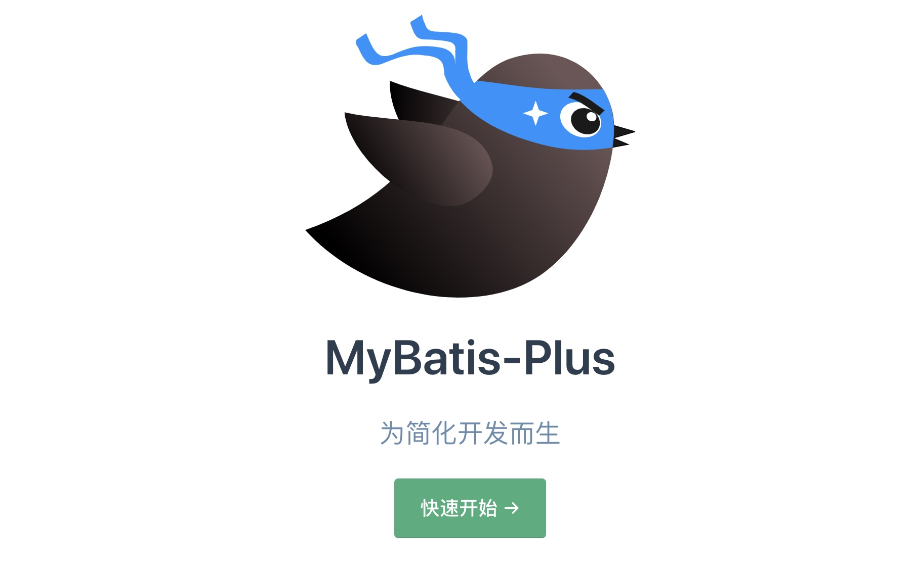
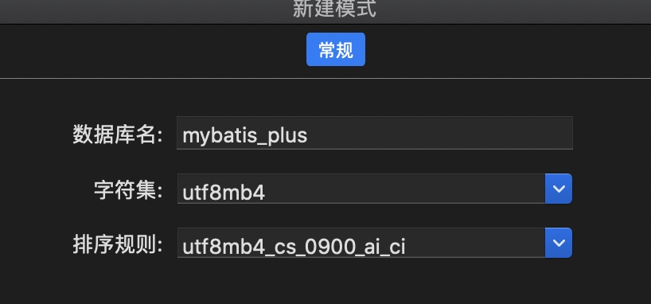
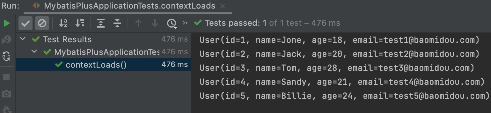
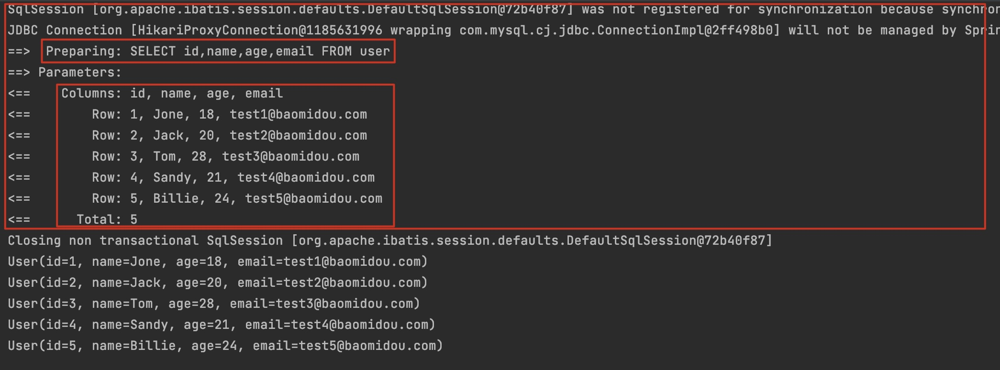
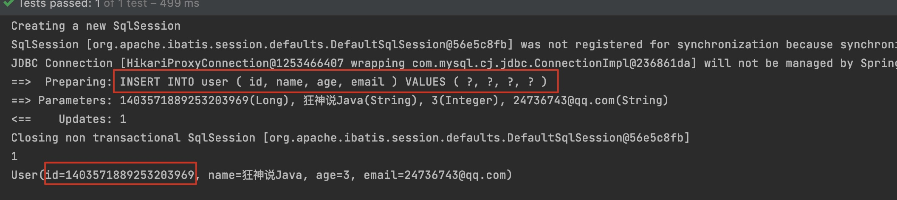
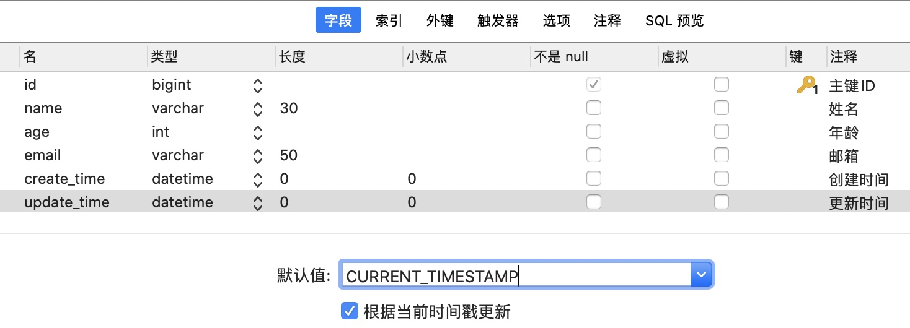
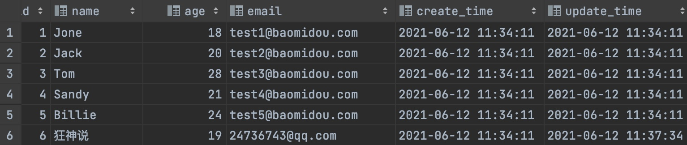
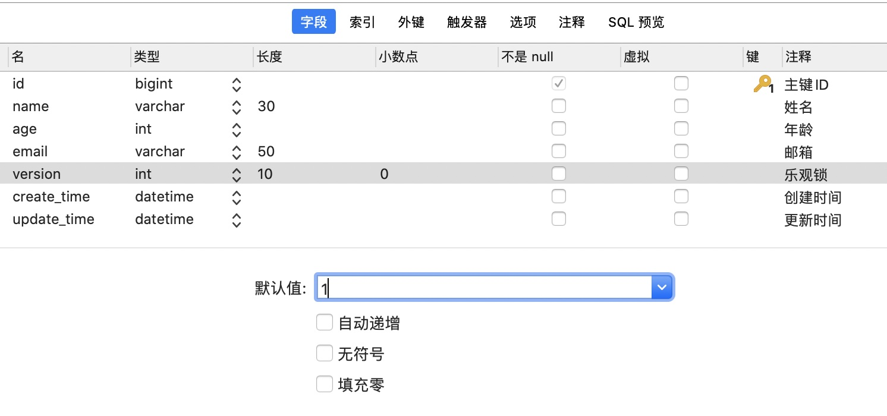

# MyBatisPlus

## 1. MyBatisPlus概述

需要的基础：SSM已学完

为什么要学习它呢？MyBatisPlus可以节省我们大量工作时间，所有的CRUD代码它都可以自动化完成！

JPA, tk-mapper, MyBatisPlus

偷懒的！

### 1.1 简介

是什么？MyBatis本来就是简化JDBC操作的！

官网：[MyBatis-Plus (baomidou.com)](https://baomidou.com/) 简化MyBatis



[MyBatis-Plus](https://github.com/baomidou/mybatis-plus)（简称 MP）是一个 [MyBatis](http://www.mybatis.org/mybatis-3/)的增强工具，在 MyBatis 的基础上只做增强不做改变，为简化开发、提高效率而生。


### 1.2 特性

- **无侵入**：只做增强不做改变，引入它不会对现有工程产生影响，如丝般顺滑
- **损耗小**：启动即会自动注入基本 CURD，性能基本无损耗，直接面向对象操作
- **强大的 CRUD 操作**：内置通用 Mapper、通用 Service，仅仅通过少量配置即可实现单表大部分 CRUD 操作，更有强大的条件构造器，满足各类使用需求
- **支持 Lambda 形式调用**：通过 Lambda 表达式，方便的编写各类查询条件，无需再担心字段写错
- **支持主键自动生成**：支持多达 4 种主键策略（内含分布式唯一 ID 生成器 - Sequence），可自由配置，完美解决主键问题
- **支持 ActiveRecord 模式**：支持 ActiveRecord 形式调用，实体类只需继承 Model 类即可进行强大的 CRUD 操作
- **支持自定义全局通用操作**：支持全局通用方法注入（ Write once, use anywhere ）
- **内置代码生成器**：采用代码或者 Maven 插件可快速生成 Mapper 、 Model 、 Service 、 Controller 层代码，支持模板引擎，更有超多自定义配置等您来使用
- **内置分页插件**：基于 MyBatis 物理分页，开发者无需关心具体操作，配置好插件之后，写分页等同于普通 List 查询
- **分页插件支持多种数据库**：支持 MySQL、MariaDB、Oracle、DB2、H2、HSQL、SQLite、Postgre、SQLServer 等多种数据库
- **内置性能分析插件**：可输出 Sql 语句以及其执行时间，建议开发测试时启用该功能，能快速揪出慢查询
- **内置全局拦截插件**：提供全表 delete 、 update 操作智能分析阻断，也可自定义拦截规则，预防误操作

## 2. 快速入门

地址：[快速开始 | MyBatis-Plus (baomidou.com)](https://baomidou.com/guide/quick-start.html)

使用第三方组件：

1. 导入对应的依赖
2. 研究依赖如何配置
3. 代码如何编写
4. 提高扩展能力即可

### 2.1 步骤

1. 创建数据库`mybatis_plus`

   

2. 创建 `User` 表，其表结构如下：

   | id   | name   | age  | email              |
   | ---- | ------ | ---- | ------------------ |
   | 1    | Jone   | 18   | test1@baomidou.com |
   | 2    | Jack   | 20   | test2@baomidou.com |
   | 3    | Tom    | 28   | test3@baomidou.com |
   | 4    | Sandy  | 21   | test4@baomidou.com |
   | 5    | Billie | 24   | test5@baomidou.com |

   其对应的数据库 Schema 脚本如下：

   ```sql
   DROP TABLE IF EXISTS user;
   
   CREATE TABLE user
   (
   	id BIGINT(20) NOT NULL COMMENT '主键ID',
   	name VARCHAR(30) NULL DEFAULT NULL COMMENT '姓名',
   	age INT(11) NULL DEFAULT NULL COMMENT '年龄',
   	email VARCHAR(50) NULL DEFAULT NULL COMMENT '邮箱',
   	PRIMARY KEY (id)
   );
   -- 真实开发中，version(乐观锁), deleted(逻辑删除), gmt_create, gmt_modified 这些字段都是必要的
   ```
   
   其对应的数据库 Data 脚本如下：
   
   ```sql
   DELETE FROM user;
   
   INSERT INTO user (id, name, age, email) VALUES
   (1, 'Jone', 18, 'test1@baomidou.com'),
   (2, 'Jack', 20, 'test2@baomidou.com'),
   (3, 'Tom', 28, 'test3@baomidou.com'),
   (4, 'Sandy', 21, 'test4@baomidou.com'),
   (5, 'Billie', 24, 'test5@baomidou.com');
   ```
   
3. 编写项目，初始化项目，使用SpringBoot初始化！

4. 导入依赖

   ```xml
   <!--数据库驱动-->
   <dependency>
       <groupId>mysql</groupId>
       <artifactId>mysql-connector-java</artifactId>
   </dependency>
   <!--lombok-->
   <dependency>
       <groupId>org.projectlombok</groupId>
       <artifactId>lombok</artifactId>
   </dependency>
   <!--mybatis-plus 是自己开发的，非官方的-->
   <dependency>
       <groupId>com.baomidou</groupId>
       <artifactId>mybatis-plus-boot-starter</artifactId>
       <version>3.0.5</version>
   </dependency>
   ```

   说明：我们使用mybatis-plus可以节省我们大量的代码，尽量不要同时导入mybatis和mybatis-plus！会有版本的差异

5. 连接数据库，这一步和mybatis相同！

   `application.properties`

   ```properties
   spring.datasource.username=root
   spring.datasource.password=123456
   spring.datasource.url=jdbc:mysql://localhost:3306/mybatis_plus?useSSL=false&useUnicode=true&characterEncoding=utf-8
   spring.datasource.driver-class-name=com.mysql.cj.jdbc.Driver
   ```

6. ==传统方式：pojo-dao(连接mybatis，配置mapper.xml文件)-service-controller==

   使用了mybatis-plus之后

   * pojo
   * mapper接口
   * 使用

   实体类`User`

   ```java
   @Data
   @NoArgsConstructor
   @AllArgsConstructor
   public class User {
       private Long id;
       private String name;
       private Integer age;
       private String email;
   }
   ```

   mapper接口

   ```java
   // 在对应的Mapper上面继承基本的接口BaseMapper
   @Repository //代表持久层
   public interface UserMapper extends BaseMapper<User> {
       //所有的CRUD操作都已经编写完成了
       //你不需要像以前配置一大堆文件了
   }
   ```

   实现类

   ```java
   //扫描mapper文件夹
   @MapperScan("com.jin.mapper")
   @SpringBootApplication
   public class MybatisPlusApplication {
   
       public static void main(String[] args) {
           SpringApplication.run(MybatisPlusApplication.class, args);
       }
   }
   ```

   注意点：我们需要在主启动类上去扫描我们的mapper包下的所有接口`@MapperScan("com.jin.mapper")`

7. 测试类中测试

   ```java
   @SpringBootTest
   class MybatisPlusApplicationTests {
       //继承了BaseMapper，所有的方法都来自父类，
       //我们也可以编写自己的扩展方法！
       @Autowired
       private UserMapper userMapper;
   
       @Test
       void contextLoads() {
           //参数是一个Wrapper，条件构造器，这里我们先不用，null
           //查询全部用户
           List<User> users = userMapper.selectList(null);
           users.forEach(System.out::println);
       }
   }
   ```

   结果：

   

### 2.2 思考问题

1. SQL谁帮我们写的？MyBatisPlus
2. 方法哪里来的？MyBatisPlus


## 3. 配置日志

我们所有的sql现在是不可见的，我们希望知道它是怎么执行的，所以我们必须要看日志！

在`application.properties`中加入如下代码

```properties
# 配置日志
mybatis-plus.configuration.log-impl=org.apache.ibatis.logging.stdout.StdOutImpl
```



配置完毕日志以后，湖面的学习就需要这个自动生成的sql，就会喜欢上MyBatisPlus！


## 4. CRUD扩展

### 4.1 Insert插入

```java
//测试插入
@Test
public void testInsert() {
    User user = new User();
    user.setName("狂神说Java");
    user.setAge(3);
    user.setEmail("24736743@qq.com");

    int result = userMapper.insert(user); //帮我们自动生成id
    System.out.println(result); //受影响的行数
    System.out.println(user); //发现，id会自动回填
}
```



数据库插入的id的默认值为：全局的唯一id

### 4.2 主键生成策略

[分布式系统唯一ID生成方案汇总 - nick hao - 博客园 (cnblogs.com)](https://www.cnblogs.com/haoxinyue/p/5208136.html)

通过在实体类id字段上注解来改变主键生成策略！

```java
@Data
@NoArgsConstructor
@AllArgsConstructor
public class User {
    //对应数据库中的主键(uuid,自增id,雪花算法,redis,zookeeper)
    @TableId(type = IdType.ID_WORKER) //一旦选择INPUT手动输入id之后，就需要自己配置id了
    private Long id;
    private String name;
    private Integer age;
    private String email;
}
```

**雪花算法**：

默认ID_WORKER全局唯一id，（据说新版换成了ASSIGN_ID）

snowflake是Twitter开源的分布式ID生成算法，结果是一个long型的ID。其核心思想是：使用41bit作为毫秒数，10bit作为机器的ID（5个bit是数据中心，5个bit的机器ID），12bit作为毫秒内的流水号（意味着每个节点在每毫秒可以产生 4096 个 ID），最后还有一个符号位，永远是0。可以保证几乎全球唯一！

**主键自增**：

我们需要配置主键自增：

1. 实体类字段上`@TableId(type = IdType.AUTO)`
2. 数据库字段上一定是自增的
3. 再次测试插入即可！

**其余的源码解释：**

```java
public enum IdType {
    AUTO(0),	//数据库id自增
    NONE(1),	//未设置主键
    INPUT(2),	//手动输入
    ID_WORKER(3),	//默认的全局唯一id
    UUID(4),		//全局唯一id uuid
    ID_WORKER_STR(5);	// ID_WORKER字符串表示法
}
```

### 4.3 Update更新

```java
//测试更新
@Test
public void testUpdate() {
    User user = new User();
    //通过条件自动拼接动态sql
    user.setId(6L);
    user.setName("狂神说");
    user.setAge(18);

    //注意；userMapper 参数是一个对象！
    int i = userMapper.updateById(user);
    System.out.println(i);
}
```

所有的sql都是自动帮你动态配置的！

### 4.4 自动填充

创建时间，修改时间！这些个操作都是自动化完成的，我们不希望手动更新!

**阿里巴巴开发手册**：所有的数据库表：`gmt_create`, `gmt_modified` 几乎所有的表都要配置上！而且需要自动化！

#### 方式一：数据库级别

**==该方法不允许在工作中使用，不允许修改数据库！==**

1. 在表中新增字段`create_time`,`update_time`

   

   注意两者默认值都是`CURRENT_TIMESTAMP`，`update_time`要自动更新

2. 再次测试插入方法，我们需要先把实体类同步，添加如下字段

   ```java
   private Date createTime;
   private Date updateTime;
   ```

3. 测试，更新操作

   

   发现更新字段的更新时间变化

#### 方式二：代码级别

1. 去除数据库的默认值，更新操作！

   

2. 实体类字段属性上需要增加注解

   ```java
   //字段添加填充内容
   @TableField(fill = FieldFill.INSERT)
   private Date createTime;
   @TableField(fill = FieldFill.INSERT_UPDATE)
   private Date updateTime;
   ```

3. 编写处理器来处理这个注解即可！

   创建`handler`目录，在下面创建类`MyMetaObjectHandler`

   ```java
   @Slf4j //log
   @Component // 一定不要忘记把处理器加到IOC容器中！
   public class MyMetaObjectHandler implements MetaObjectHandler {
       //插入时的填充策略
       @Override
       public void insertFill(MetaObject metaObject) {
           log.info("start insert fill...");
           // String fieldName, Object fieldVal, MetaObject metaObject
           this.setFieldValByName("createTime", new Date(), metaObject);
           this.setFieldValByName("updateTime", new Date(), metaObject);
       }
   
       //更新时的填充策略
       @Override
       public void updateFill(MetaObject metaObject) {
           log.info("start update fill...");
           this.setFieldValByName("updateTime", new Date(), metaObject);
       }
   }
   ```

4. 测试插入，更新，观察时间，成功！

### 4.5 乐观锁

在面试过程中，我们经常会被问到乐观锁，悲观锁！这个其实非常简单！

**乐观锁：**

* 乐观锁在操作数据时非常乐观，认为别人不会同时修改数据。
* 因此乐观锁不会上锁，只是在执行更新的时候判断一下在此期间别人是否修改了数据。如果别人修改了数据则放弃操作，否则执行操作。

**悲观锁：**

* 悲观锁在操作数据时比较悲观，认为别人会同时修改数据。
* 因此操作数据时直接把数据锁住，直到操作完成后才会释放锁；上锁期间其他人不能修改数据

我们这里主要讲解乐观锁机制

**乐观锁实现方式：**

- 取出记录时，获取当前version
- 更新时，带上这个version
- 执行更新时， set version = newVersion where version = oldVersion
- 如果version不对，就更新失败

```mysql
-- 乐观锁：1. 先查询，获得版本号 version = 1

-- A
update user set name = "Kuangshen", version = version + 1
where id = 2 and version = 1

-- B 线程抢先完成，这个时候 version = 2，会导致A修改失败
update user set name = "Kuangshen", version = version + 1
where id = 2 and version = 1
```

**测试一下MP的乐观锁插件**

1. 给数据库中增加version字段

   

   

2. 我们实体类加对应的字段

   ```java
   @Version //乐观锁Version注解
   private Integer version;
   ```

3. 注册组件，添加`config`目录，创建类`MyBatisPlusConfig`，其中注解`@MapperScan`原先在启动类，转移至此

   ```java
   //扫描mapper文件夹 
   @MapperScan("com.jin.mapper")
   @EnableTransactionManagement //自动管理事务
   @Configuration //配置类
   public class MyBatisPlusConfig {
       //新版已经不是这个，详见官网配置
       //注册乐观锁插件
       @Bean
       public OptimisticLockerInterceptor optimisticLockerInterceptor() {
           return new OptimisticLockerInterceptor();
       }
   }
   ```

4. 测试

   ```java
   //测试乐观锁成功！
   @Test
   public void testOptimisticLocker() {
       //1.查询用户信息
       User user = userMapper.selectById(1L);
       //2.修改用户信息
       user.setName("Kuangshen");
       user.setEmail("23736743@qq.com");
       //3.执行更新操作
       userMapper.updateById(user);
   }
   
   //测试乐观锁失败！多线程下
   @Test
   public void testOptimisticLocker2() {
       //线程1
       User user = userMapper.selectById(1L);
       user.setName("Kuangshen111");
       user.setEmail("23736743@qq.com");
   
       //模拟另外一个线程执行插队操作
       User user2 = userMapper.selectById(1L);
       user2.setName("Kuangshen222");
       user2.setEmail("23736743@qq.com");
       userMapper.updateById(user2);
   
       //可以使用自旋锁多次尝试提交
       userMapper.updateById(user); //如果没有乐观锁就会覆盖插队线程的值
   }
   ```

   

