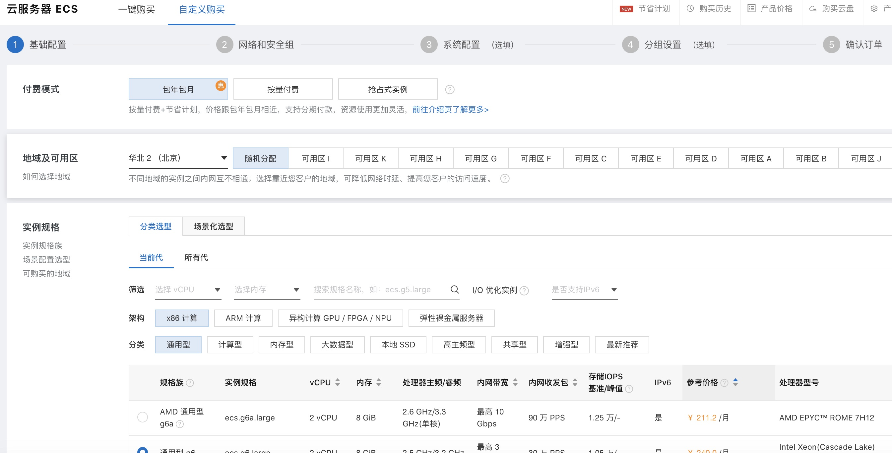
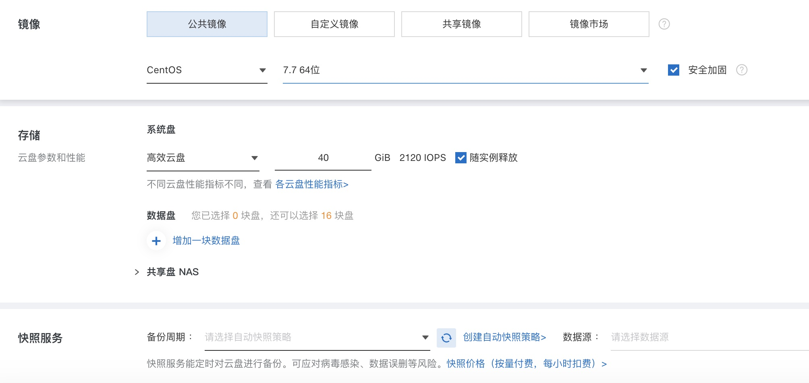
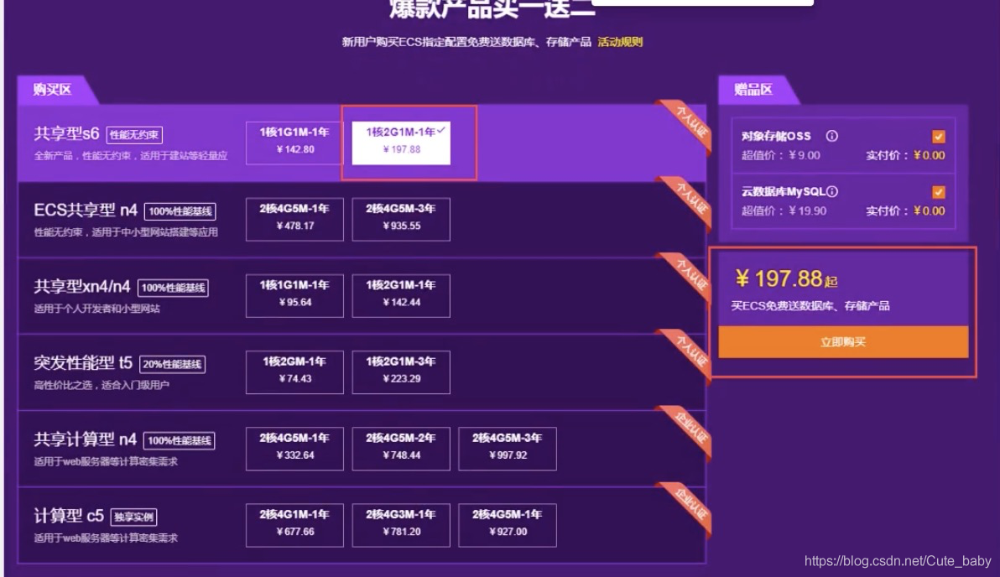
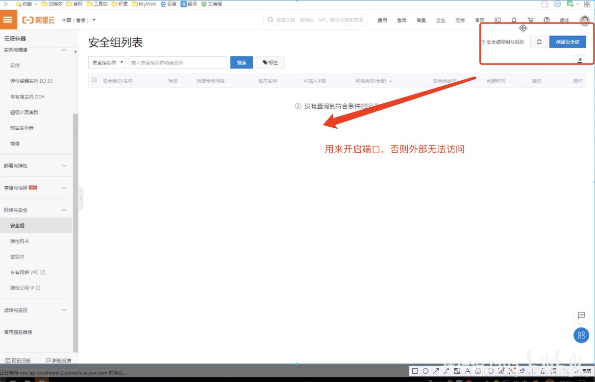
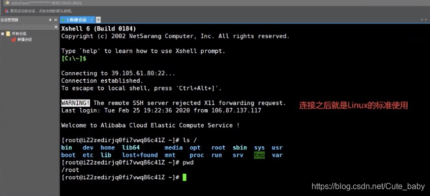
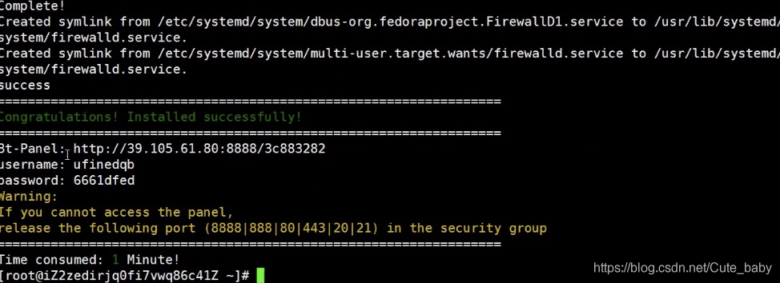
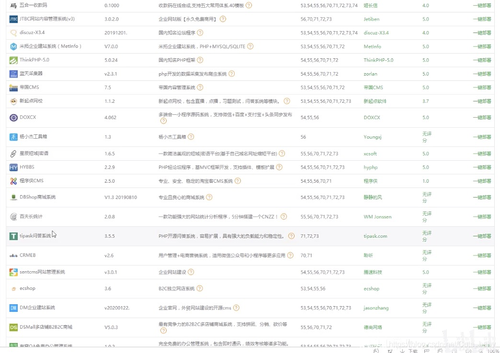
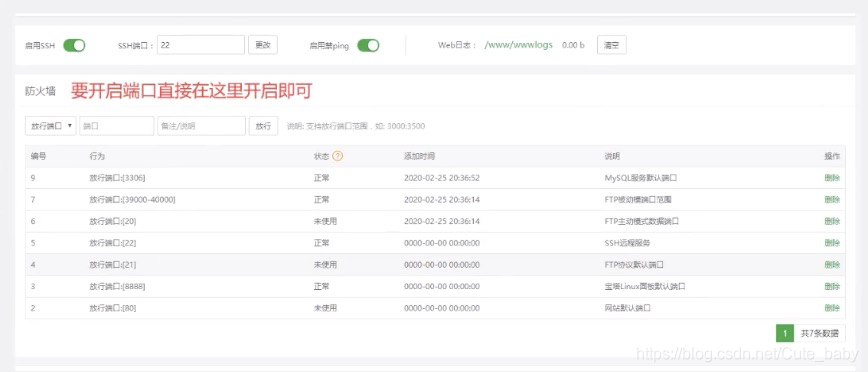

# 服务器购买及宝塔部署环境说明

## 服务器相关知识

#### **为什么程序员都需要一个自己的服务器？**

1. 你作为一个程序员，必须要发布自己的网站和项目
2. 练习Linux操作
3. 自己的远程仓库，远程数据库，远程tomcat... 搭建在服务器上
4. 练习，Linux进行任意的环境部署操作！Windows下开发，你不熟悉Linux

#### **服务器如何购买**

尽量趁打折购买，便宜！

**学生机：**

如果是学生或者24以下的小伙伴，可以购买学生机，100多元一年

==香港服务器可以避免备案==，但是尽量不要挂VPN，会被封！







目前学生机已取消，改为**阿里云开发者成长计划**，详细攻略：[阿里云学生机（原云翼计划）购买方法和问题汇总(2021年更新) - 知乎 (zhihu.com)](https://zhuanlan.zhihu.com/p/130447737#:~:text= 阿里云学生机，是指阿里云推出的扶持在校学生的云翼计划，24岁以下或拥有学信网认证信息的用户，即可享受专属的阿里云服务器优惠产品、创业扶持等多项权益，内容包括：专属云服务器产品优惠、校园产品使用攻略、云数据库产品等。 专属云服务器产品优惠，是指可以 9.5元%2F月 的低价，拥有一台云服务器ECS或轻量应用服务器，两种特价优惠服务器只能二选一。 具体购买方法如下：,首先，注册阿里云账号，注册成功后必须进行实名认证，选择个人认证，成功后，年龄小于24岁就自动获得了学生身份。 不需要再进行学生认证就可以购买了。 其次，获得学生身份后，就会解锁最优惠的价格，可以按 114元%2F年或者57元%2F6个月 的优惠价格购买阿里云服务器。 第三，同时免费获得价值50元的云数据库和对象存储OSS。)

[开发者成长计划 (aliyun.com)](https://developer.aliyun.com/plan/grow-up?spm=5176.10695662.1173276.3.63a1576dsFCS2q)

#### 买完服务器该做什么

服务器就是一个远程Linux

1. 在阿里云购买的，需要开通安全组设置；端口映射（端口映射都需要在阿里云的面板安装）

   

2. 获取服务器的公网ip地址：修改实例名称和密码，第一次修改需要重启，使用Xshell远程连接
   170.11.11.11 root 123456

   

#### 连接到服务器之后，我们需要搭建环境！

##### 1. 傻瓜式（宝塔面板）

宝塔面板安装教学：https://www.bt.cn/bbs/thread-19376-1-1.html

```shell
yum install -y wget && wget -O install.sh http://download.bt.cn/install/install_6.0.sh && sh install.sh
```

下载完毕之后，就可以得到一个地址：宝塔的管理面板

* url
* username
* password



###### 一键部署应用



端口开启



###### 放入网站进行访问

比如tomcat就直接放到webapps目录下
特殊的网站：开源项目，就是按照自己的操作来

###### 上传文件尽量使用XFTP

###### 网站如果访问测试失败，一定是防火墙问题（Linux服务器，阿里云安全组面板）

war直接丢到tomcat即可
jar直接用java -jar 执行即可

##### 2. 命令式（原生）

Linux入门！

# Linux

Java开发之路：JavaSE, MySQL, 前端（HTML，CSS，JS），JavaWeb，SSM框架，SpringBoot，Vue，SpringCloud~

Linux(centOS 7) 操作系统：Window, Mac

消息队列(Kafka, RabbitMQ, RocketMQ)，缓存(Redis)，搜索引擎(ES)，集群分布式(需要购买多台服务器, 如果没有服务器则只能使用虚拟机)！

==我们这个课程基于CentOS 7版本的学习！==

