# 服务器购买及宝塔部署环境说明

## 服务器相关知识

#### **为什么程序员都需要一个自己的服务器？**

1. 你作为一个程序员，必须要发布自己的网站和项目
2. 练习Linux操作
3. 自己的远程仓库，远程数据库，远程tomcat... 搭建在服务器上
4. 练习，Linux进行任意的环境部署操作！Windows下开发，你不熟悉Linux

#### **服务器如何购买**

尽量趁打折购买，便宜！

**学生机：**

如果是学生或者24以下的小伙伴，可以购买学生机，100多元一年

==香港服务器可以避免备案==，但是尽量不要挂VPN，会被封！


目前学生机已取消，改为**阿里云开发者成长计划**，详细攻略：[阿里云学生机（原云翼计划）购买方法和问题汇总(2021年更新) - 知乎 (zhihu.com)](https://zhuanlan.zhihu.com/p/130447737#:~:text= 阿里云学生机，是指阿里云推出的扶持在校学生的云翼计划，24岁以下或拥有学信网认证信息的用户，即可享受专属的阿里云服务器优惠产品、创业扶持等多项权益，内容包括：专属云服务器产品优惠、校园产品使用攻略、云数据库产品等。 专属云服务器产品优惠，是指可以 9.5元%2F月 的低价，拥有一台云服务器ECS或轻量应用服务器，两种特价优惠服务器只能二选一。 具体购买方法如下：,首先，注册阿里云账号，注册成功后必须进行实名认证，选择个人认证，成功后，年龄小于24岁就自动获得了学生身份。 不需要再进行学生认证就可以购买了。 其次，获得学生身份后，就会解锁最优惠的价格，可以按 114元%2F年或者57元%2F6个月 的优惠价格购买阿里云服务器。 第三，同时免费获得价值50元的云数据库和对象存储OSS。)

[开发者成长计划 (aliyun.com)](https://developer.aliyun.com/plan/grow-up?spm=5176.10695662.1173276.3.63a1576dsFCS2q)

#### 买完服务器该做什么

服务器就是一个远程Linux

1. 在阿里云购买的，需要开通安全组设置；端口映射（端口映射都需要在阿里云的面板安装）

   

2. 获取服务器的公网ip地址：修改实例名称和密码，第一次修改需要重启，使用Xshell远程连接
   170.11.11.11 root 123456

   

#### 连接到服务器之后，我们需要搭建环境！

##### 1. 傻瓜式（宝塔面板）

宝塔面板安装教学：https://www.bt.cn/bbs/thread-19376-1-1.html

```shell
yum install -y wget && wget -O install.sh http://download.bt.cn/install/install_6.0.sh && sh install.sh
```

下载完毕之后，就可以得到一个地址：宝塔的管理面板

* url
* username
* password


###### 一键部署应用


端口开启


###### 放入网站进行访问

比如tomcat就直接放到webapps目录下
特殊的网站：开源项目，就是按照自己的操作来

###### 上传文件尽量使用XFTP

###### 网站如果访问测试失败，一定是防火墙问题（Linux服务器，阿里云安全组面板）

war直接丢到tomcat即可
jar直接用java -jar 执行即可

##### 2. 命令式（原生）

Linux入门！

# Linux

这里的知识点是基于全栈开发的Linux，而不是运维级别！

我们为什么要在这个时间学习Linux? Java全栈开发的我们要掌握哪些知识？需要准备什么工作？

Java开发之路：JavaSE, MySQL, 前端（HTML，CSS，JS），JavaWeb，SSM框架，SpringBoot，Vue，SpringCloud~

Linux(centOS 7) 操作系统：Window, Mac

消息队列(Kafka, RabbitMQ, RocketMQ)，缓存(Redis)，搜索引擎(ES)，集群分布式(需要购买多台服务器, 如果没有服务器则只能使用虚拟机)！

==我们这个课程基于CentOS 7版本的学习！==

==Linux 一切皆文件: 文件就 读，写，（权限）==

学习方式：

1. 认识Linux
2. 基本的命令（重点：Git讲了一些基本的命令（文件操作，目录管瘤，文本属性，Vim编辑器，帐号管理，磁盘管理））
3. 软件的安装和部署！（Java, tomcat, docker）

Linux(基础) --> Redis --> Docker

## 1. 入门概述

### 1.1 为什么学习Linux

在服务器端，在开发领域Linux是越来越受欢迎，很多程序员都觉得不懂点Linux都觉得不好意思，Linux在开源社区的地位依然岿然不动。

尤其是作为一个后端程序员，是必须要掌握Linux的，因为这都成为了你找工作的基础门槛了，所以不得不学习！

### 1.2 Linux简介

Linux内核最初只是由芬兰人林纳斯.托瓦兹( Linus Torvalds )在赫尔辛基大学上学时出于个人爱好而编写的。
 Linux是一套免费使用和自由传播的**类Unix操作系统**,是一个基于POSIX (可移植操作系统接口)和UNIX的**多用户、多任务、支持多线程和多CPU**的操作系统。
 Linux能运行**主要的UNIX工具软件、应用程序和网络协议**。它支持32位和64位硬件。Linux 继承了Unix以**网络为核心的**设计思想，是一个性能稳定的多用户网络操作系统。

### 1.3 Linux发行版

Linux发行版就是将Linux内核与应用软件做一个打包

Kali linux：安全渗透测试使用

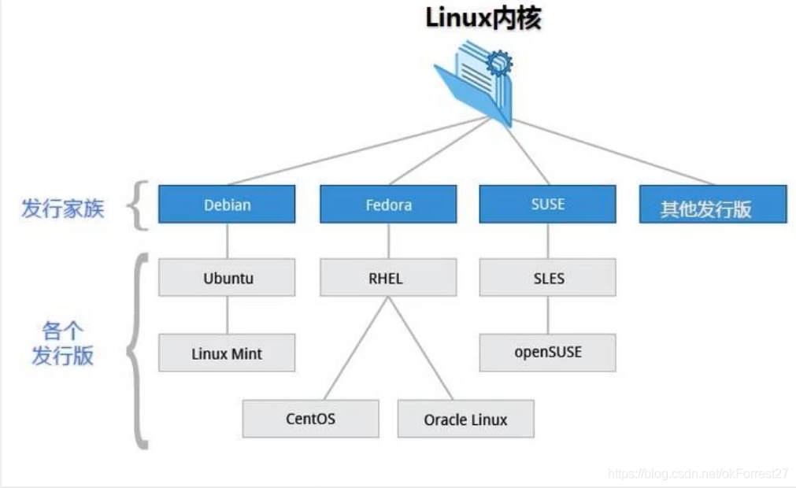

目前市面上较知名的发行版有：Ubuntu, RedHat, CentOS, Debian, Fedora, SuSE, OpenSUSE, Arch Linux, SolusOS等

### 1.4 Linux应用领域

 今天各种场合都有使用各种Linux发行版,从嵌入式设备到超级计算机,并且在服务器领域确定了地位,通常服务器使用LAMP(Linux + Apache + MySQL + PHP)或LNMP(Linux + Nginx + MySQL + PHP)组合。
 目前Linux不仅在家庭与企业中使用,并且在政府中也很受欢迎.


## 2. 环境搭建

环境：虚拟机VMware Workstation Pro 15.2+CentOS 7

#### **安装CentOS**

虚拟机（VMware下载）

1. 可以通过镜像进行安装！
2. 可以使用已经制作好的镜像
3. 安装VMware虚拟机软件，然后打开我们的镜像即可使用！

VMware的使用方式：

点击屏幕进入虚拟机，Ctrl + Alt 将聚焦退出虚拟机！

#### **购买云服务器**

云服务器就是一台远程电脑。

虚拟机安装后会占用空间，也会有些卡顿，我们作为程序员其实可以选择购买一台自己的服务器，这样的话更加接近真实线上工作。

1. 阿里云服务器
2. 购买完毕后，获取服务器IP地址，重制服务器密码，就可以远程登录了
   * 关于安全组的说明：（在阿里云这个很重要，自己需要开放什么端口来这里配置就好了，后续在安装环境时会继续说明）
3. 下载xShell工具，进行远程连接使用

* 注意事项：如果要打开端口，需要在阿里云的安全组面板中开启对应的出入规则，不然的话会被阿里拦截！

**如果前期不好操作，可以推荐安装宝塔面板，傻瓜式管理服务器**

安装教程：https://www.bt.cn/bbs/thread-19376-1-1.html

1. 开启对应的端口
2. 一键安装
3. 安装完毕后会得到远程面板的地址，账号，密码，就可以登录了
4. 登录之后就可以可视化的安装环境和部署网站！

#### 关于域名

如果自己的网站想要上线，就一定要购买一个域名然后备案

备案的话需要一些认证和时间，备案完毕后，就可以解析到自己的网站了，这个时候就可以使用域名来进行服务器的访问！

## 3. 走近Linux系统

#### 开机

开机会启动许多程序。它们在Windows叫做’服务" ( service ) , 在Linux就叫做"守护进程" ( daemon)。

开机成功后，它会显示一个文本登录界面，这个界面就是我们经常看到的登陆界面，在这个登陆界面中会提示用户输入用户名， 而用户输入的用户将作为参数传给login程序来验证用户的身份，密码是不显示的，输完回撤即可！

一般来说，用户的登录方式有三种:

* 命令行登录
* SSH登录(远程)
* 图形界面登录

最高权限账户为root,可以操作一切!

#### 关机

在linux领域内大多用在服务器上,很少遇到关机的操作。毕竟服务器上跑一个服务是永无止境的,除非特殊情况下,不得已才会关机。
关机指令为shutdown

```bash
sync #将数据由内存同步到硬盘中。
shutdown #关机指令，你可以man shutdown 来看一下 帮助文档。例如你可以运行如下命令关机:
shutdown -h 10 #这个命令告诉大家，计算机将在10分钟后关机
shutdown -h now#立马关机
shutdown -h 20:25 #系统会在今天20:25关机
shutdown -h +10 #十分钟后关机
shutdown -r now #系统立马重启
shutdown -r +10 #系统十分钟后重启
reboot #就是重启，等同于shutdown -r now
halt #关闭系统，等同于shutdown -h now和poweroff
```

最后总结：不管是重启还是关闭系统，首先要运行sync命令，把内存中的数据写到磁盘中，执行命令之后没有返回消息则表明运行成功

#### 系统目录结构

1. 一切皆文件
2. 根目录`/`，所有文件都挂载在这个节点下

登录系统后，在当前命令窗口下输入命令：

```bash
ls / #查看根目录
```

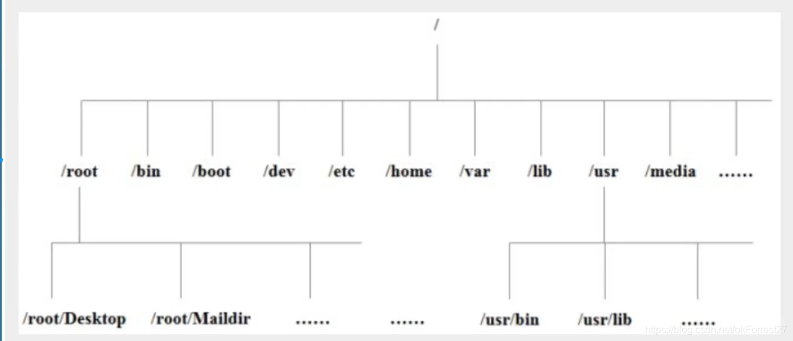

**目录解释**

* **/bin**：bin是Binary的缩写, 这个目录存放着最经常使用的命令。
* **/boot**： 这里存放的是启动Linux时使用的一些核心文件，包括一些连接文件以及镜像文件。
* **/dev** ： dev是Device(设备)的缩写, 存放的是Linux的外部设备，在Linux中访问设备的方式和访问文件的方式是相同的。
* ==**/etc**： 这个目录用来存放所有的系统管理所需要的配置文件和子目录。==
* ==**/home**：用户的主目录，在Linux中，每个用户都有一个自己的目录，一般该目录名是以用户的账号命名的。==
* **/lib**：这个目录里存放着系统最基本的动态连接共享库，其作用类似于Windows里的DLL文件。
* **/lost+found**：这个目录一般情况下是空的，当系统非法关机后，这里就存放了一些文件。
* **/media**：linux系统会自动识别一些设备，例如U盘、光驱等等，当识别后，linux会把识别的设备挂载到这个目录下。
* **/mnt**：系统提供该目录是为了让用户临时挂载别的文件系统的，我们可以将光驱挂载在/mnt/上，然后进入该目录就可以查看光驱里的内容了。
* ==**/opt**：这是给主机额外安装软件所摆放的目录。比如你安装一个ORACLE数据库则就可以放到这个目录下。默认是空的。==
* **/proc**：这个目录是一个虚拟的目录，它是系统内存的映射，我们可以通过直接访问这个目录来获取系统信息。(不用管)
* ==**/root**：该目录为系统管理员，也称作超级权限者的用户主目录。==
* **/sbin**：s就是Super User的意思，这里存放的是系统管理员使用的系统管理程序。
* **/srv**：该目录存放一些服务启动之后需要提取的数据。
* **/sys**：这是linux2.6内核的一个很大的变化。该目录下安装了2.6内核中新出现的一个文件系统 sysfs 。
* ==**/tmp**：这个目录是用来存放一些临时文件的。 用完即丢的文件可以放在这个目录下==
* ==**/usr**：这是一个非常重要的目录，用户的很多应用程序和文件都放在这个目录下，类似于windows下的program files目录。==
* **/usr/bin**： 系统用户使用的应用程序。
* **/usr/sbin**： 超级用户使用的比较高级的管理程序和系统守护程序。
* **/usr/src**： 内核源代码默认的放置目录。
* ==**/var**：这个目录中存放着在不断扩充着的东西，我们习惯将那些经常被修改的目录放在这个目录下。包括各种日志文件。==
* **/run**：是一个临时文件系统，存储系统启动以来的信息。当系统重启时，这个目录下的文件应该被删掉或清除。
* ==**/www**：存放服务器网站相关的资源，环境，网站的项目==


## 4.常用的基本命令

#### cd:切换目录

绝对路径和相对路径

```bash
cd:#切换目录命令!
./:#当前目录
/:#绝对路径
cd ..:#返回上一级目录
cd ~:#回到当前的用户目录
pwd :#显示当前用户所在的目录
```

#### ls(列出目录!)

在Linux中Is可能是最常常被使用的!

```bash
-a: #参数: all ,查看全部的文件,包括隐藏文件
-l: #参数: 列出所有的文件,包含文件的属性和权限,没有隐藏文件
```

所有Linux可以组合使用!

```bash
ls -al 查看全部的文件包括隐藏文件的属性和权限
```

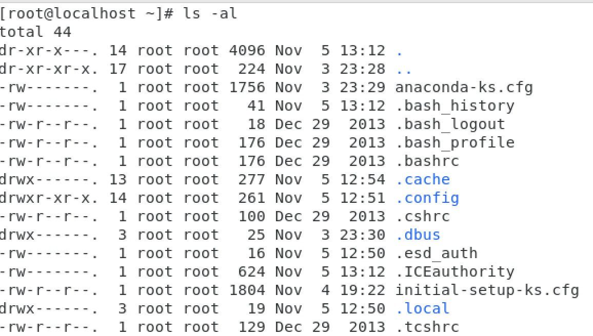

#### mkdir 创建一个目录

```bash
mkdir test1
mkdir -p test2/test3/test4 # 用-p递归创建层级目录
```

#### rmdir 删除目录

```bash
rmdir test1
rmdir -p test2/test3/test4 #递归删除文件
```

rmdir仅能删除空的目录,如果下面存在文件,需要先删除文件,递归删除多个目录-p参数即可

#### cp(复制文件或者目录)

```bash
cp install.sh kuangstudy #将当前目录下的install.sh 复制到kuangstudy文件夹中
```

#### rm 移除文件或者目录

```bash
-f #忽略不存在的文件,不会出现警告,强制删除!
-r #递归删除目录!
-i #互动,删除询问是否删除
rm -rf install.sh/#删除系统中的install.sh
```

#### mv 移动文件或者目录|重命名文件

```bash
-f #强制
-u #只替换已经更新过的文件
```

```bash
mv install.sh kuangstudy #移动文件
mv kuangstudy kuangstudy2 #重命名文件夹名
```


## 5. 基本属性

### 5.1 看懂文件属性

Linux系统是一种典型的多用户系统,不同的用户处于不同的地位,拥有不同的权限。为了保护系统的安全性, Linux系统对不同的用户访问同一文件(包括目录文件)的权限做了不同的规定。

在Linux中我们可以使用`ll`或者`ls -l`命令来显示一个文件的属性以及文件所属的用户和组,如:

实例中, boot文件的第一个属性用"d"表示。 "d"在Linux中代表该文件是一 个目录文件。
在Linux中第一个字符代表这个文件是目录、 文件或链接文件等等:

* ==当为[d]则是目录==
* ==当为[-]则是文件;==
* ==若是[l]则表示为链接文档( link file);==
* 若是[b]则表示为装置文件里面的可供储存的接口设备(可随机存取装置) ;
* 若是[c]则表示为装置文件里面的串行端口设备,例如键盘、鼠标( 一次性读取装置)。

接下来的字符中,以三个为一组,且均为[rwx] 的三个参数的组合。

其中，==[r]代表可读(read)、[w]代表可写(write)、[x]代表可执行(execute)==。

要注意的是,这三个权限的位置不会改变,==如果没有权限,就会出现减号[-]==而已。

每个文件的属性由左边第一部分的10个字符来确定 (如下图) :


从左至右用0-9这些数字来表示。
第0位确定文件类型,第1-3位确定属主(该文件的所有者)拥有该文件的权限。第4-6位确定属组 (所有者的同组用户)拥有该文件的权限,第7-9位确定其他用户拥有该文件的权限。
其中:
第1、4、7位表示读权限,如果用"r"字符表示,则有读权限,如果用"-“字符表示,则没有读权限;
第2、5、8位表示写权限,如果用"W"字符表示,则有写权限,如果用”-“字符表示没有写权限;
第3、6、9位表示可执行权限,如果用"x"字符表示,则有执行权限,如果用”-"字符表示,则没有执行权限。
对于文件来说,它都有一个特定的所有者,也就是对该文件具有所有权的用户。
同时,在Linux系统中,用户是按组分类的, - -个用户属于一个或多个组。
文件所有者以外的用户又可以分为文件所有者的同组用户和其他用户。
**因此, Linux系统按文件所有者、文件所有者同组用户和其他用户来规定了不同的文件访问权限。**
在以上实例中, boot文件是一个目录文件,属主和属组都为root。

l开头的链接文档后面的箭头代表它的具体指向的目录

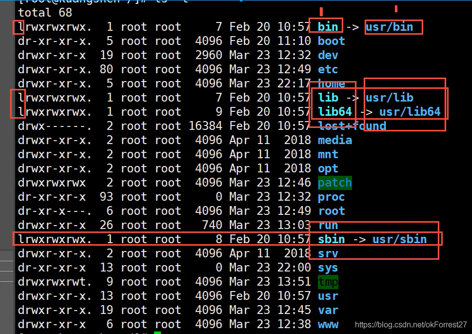

### 5.2 修改文件属性

1. **chgrp :更改文件属组**

```bash
chgrp [-R] 属组名 文件名
```

-R :递归更改文件属组,就是在更改某个目录文件的属组时,如果加上R的参数,那么该目录下的所有文件的属组都会更改。

2. **chown :更改文件属主,也可以同时更改文件属组**

```bash
chown [-R] 属主名 文件名
chown [-R] 属主名:属组名文件名
```

3. **==chmod :更改文件9个属性(必须掌握)==**

```bash
chmod [-R] xyz 文件或目录
```

Linux文件属性有两种设置方法,一种是数字（常用的是数字）, 一种是符号。
Linux文件的基本权限就有九个,分别是owner/group/others三种身份各有自己的read/write/execute权限。
先复习一下刚刚上面提到的数据:文件的权限字符为: [-rwxrwxrwx]，这九个权限是三个三个一组的!其中,我们可以使用字来代表各个权限,各权限的分数对照表如下:

```bash
r:4 w:2 x:1
可读可写不可执行 rw- 6
可读可写可执行 rwx 7
```


chomd 777 文件赋予所有用户可读可执行!

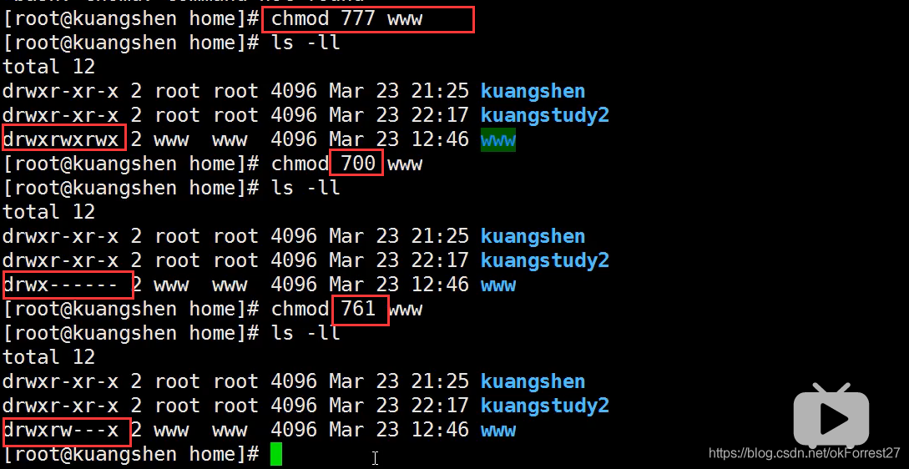

### 5.3 文件内容查看

我们会经常使用到文件查看！

Linux系统中使用以下命令来查看文件的内容:

* ==cat由第一行开始显示文件内容==
* tac从最后一行开始显示，可以看出tac是cat的倒着写!

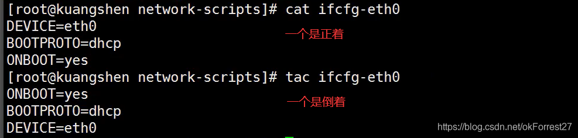

* ==nl显示的时候,顺道输出行号!==

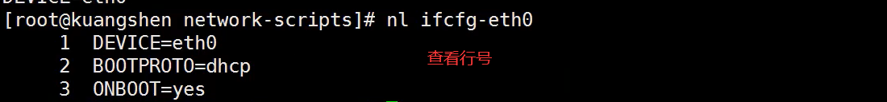

* ==more一页一页的显示文件内容（空格表示翻页，enter代表向下看下一行）==


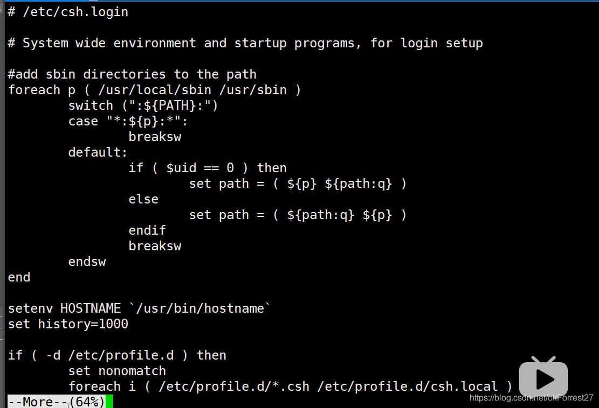

* **less与more类似,但是比more更好的是,他可以往前翻页!（空格翻页，pageUp, pageDown代表上下翻动页面，退出q命令，查找字符串/要查询的字符向下查询，向上查询使用?要查询的字符串,用n继续搜寻下一个,用N向上寻找**
* head 只看头几行 通过-n参数来控制显示几行
* tail只看尾巴几行 通过-n参数来控制显示几行
* 你可以使用man 命令来查看各个命令的使用文档,如: man [命令]。

##### **网络配置目录(centOS7)**

```bash
cd /etc/sysconfig/network-scripts
```

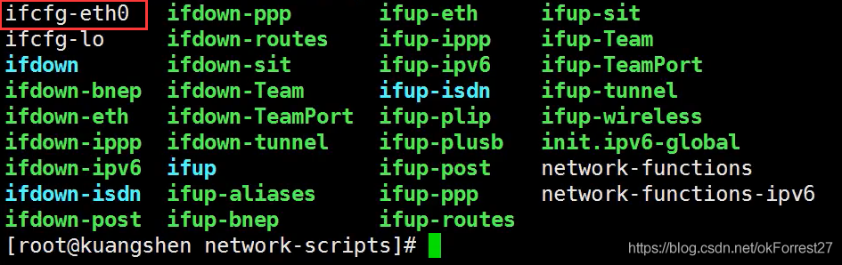

`ifcfg-eth0`默认网络配置文件

```bash
ping #用来查看网络是否连通
ifconfig #查看网络 和Windows的ipconfig是一样的
```

## 6.硬链接和软链接（拓展）

Linux链接分为两种：

* 硬链接：A—B,假设B是A的硬链接，那么他们两个指向了同一个文件!允许一个文件拥有多个路径，用户可以通过这种机制硬链接到一个重要文件上，防止误删
* 软链接：类似Windows下的快捷方式，删除源文件，快捷方式也就访问不了

操作步骤：

* **创建链接 ln命令！**
* **touch命令创建文件！**
* **echo输入字符串**

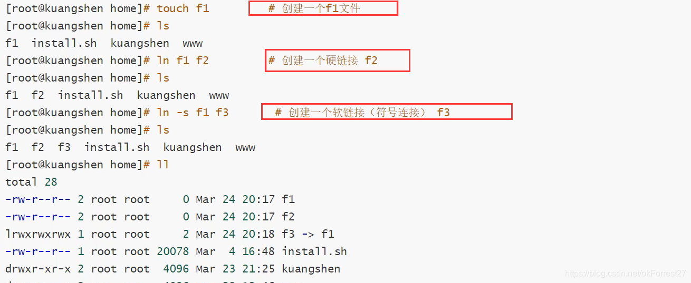

```bash
# echo "i love kuangshen" >>f1  #给f1文件中写入一些字符串！
```

删除f1之后，查看f2和f3的区别

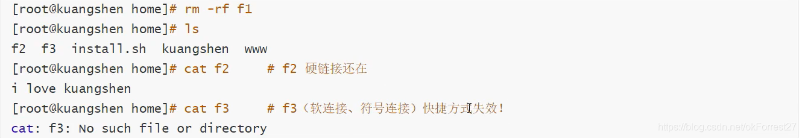

## 7. Vim编辑器

### 7.1 什么是Vim编辑器

Vim通过一些插件可以实现和IDE的功能!

Vim是从Vi发展出来的一个文本编辑器。代码补完、编译及错误跳转等方便编程的功能特别丰富,在程序员中被广泛使用。尤其是Linux中,必须要会使用Vim ==(查看内容, 编辑内容,保存内容! )==

简单的来说，Vi是老式的字处理器,不过功能已经很齐全了,但是还是有可以进步的地方。

Vim则可以说是程序开发者的一项很好用的工具。

三种使用方式:
基本上Vi/Vim共分为三种模式,分别是

* **命令模式( Command mode) **
* **输入模式( Insert mode )**
* **底线命令模式( Lastline mode )**

开启Vim:

```bash
vim kuangstudy.txt #有该文件，打开；没有该文件，创造并打开
```

### 7.2 命令模式

用户刚刚启动Vi/Vim ,便进入了命令模式。
此状态下敲击键盘动作会被Vim识别为命令,而非输入字符。比如我们此时按下`i` ,并不会输入一个字符, `i`被当作了一个命令。
以下是常用的几个命令:

* `i`切换到输入模式,以输入字符。
* `x`删除当前光标所在处的字符。
* `:`切换到底线命令模式,以在最底一行输入命令。如果是编辑模式，需要先按`ESC`键退出编辑模式！

若想要编辑文本:启动Vim,进入了命令模式,按下`i`,切换到输入模式。
命令模式只有一些最基本的命令,因此仍要依靠底线命令模式输入更多命令。

### 7.3 输入模式

在命令模式下按下`i`就进入了输入模式。
在输入模式中，可以使用以下按键：

* 字符按键以及Shift组合，输入字符
* ENTER，回车键，换行
* BACK SPACE，退格键，删除光标前一个字符
* DEL，删除键，删除光标后一个字符
* 方向键，在文本中移动光标
* HOME/END，移动光标到行首/行尾
* Page Up/Page Down，上/下翻页
* Insert，切换光标为输入/替换模式，光标将变成竖线/下划线
* ESC，退出输入模式，切换到命令模式

### 7.4 底线命令模式

在命令模式下按下`:`（英文冒号）就进入了底线命令模式。
底线命令模式可以输入单个或多个字符的命令，可用的命令非常多。
在底线命令模式中，基本的命令有（已经省略了冒号）：
`q` 退出程序
`w` 保存文件
按ESC键可随时退出底线命令模式。

## 8. 账号管理

### 8.1 简介

Linux系统是一个多用户多任务的分时操作系统,任何一个要使用系统资源的用户,都必须首先向系统管理员申请一个账号,然后以这个账号的身份进入系统。
用户的账号一方面可以帮助系统管理员对使用系统的用户进行跟踪,并控制他们对系统资源的访问;另一方面也可以帮助用户组织文件,并为用户提供安全性保护。
每个用户账号都拥有一个唯一的用户名和各自的口令。
用户在登录时键入正确的用户名和口令后,就能够进入系统和自己的主目录。
实现用户账号的管理,要完成的工作主要有如下几个方面:

* 用户账号的添加、删除与修改。
* 用户口令的管理。
* 用户组的管理。

### 8.2 用户账号的管理

用户账号的管理工作主要涉及到用户账号的添加、修改和删除。

添加用户账号就是在系统中创建一个新账号,然后为新账号分配用户号、用户组、主目录和登录ShelI等资源。

#### useradd 命令 添加用户

`useradd` -选项 用户名
`-m`:自动创建这个用户的主目录/home/kuangshen
`-G`:给用户分配组

```bash
[root@cqh home]useradd -m kuangshen  #创建一个用户
[root@cqh home]ls
install.sh kuangstudy kuangshen www  
```

理解一下本质: Linux中一切皆文件,这里的添加用户说白了就是往某个文件中写入用户的信息了! /etc/passwd

```bash
[root@cqh home]cat /etc/passwd  #访问该文件
cqh:x:1002:1002::/home/cqh:/bin/bash
```

#### 删除用户 userdel

```bash
userdel -r cqh #删除用户的时候把它的目录也删除掉 -r
```

#### 修改用户 usermod

对应修改的内容 修改那个用户

```bash
usermode -d /home/233 cqh #-d 目录
```

修改完毕后查看配置文件 将cqh用户下的目录修改为233

#### 切换用户

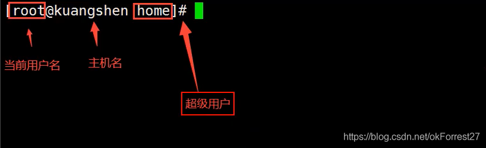

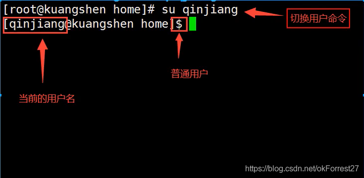

1. 切换用户的命令为: su username [username是你的用户名]
2. 从普通用户切换到root用户,还可以使用命令: sudo su
3. 在终端输入exit或logout或使用快捷方式ctrl+d ,可以退回到原来用户,其实ctrl+d也是执行的exit命令
4. 在切换用户时,如果想在切换用户之后使用新用户的工作环境,可以在su和username之间加,例如: [su- root]
   $表示普通用户，#表示超级用户,也就是root用户

#### 查看和修改主机名

```bash
hostname #查看主机名
hostname kuangshen #修改主机名,修改完毕重新连接即可
```

#### 用户的密码设置问题

我们一般通过root创建用户的时候!要配置密码!
如果是超级用户

```bash
passwd username 
new password #新密码
re password #重新输入密码
```

普通用户

```bash
passwd
(current)UNIX password:
new password: #密码不能过于简单
re password:
```

锁定账户
root ,比如张三辞职了!冻结这个账号, 一旦冻结,这个人就登录不上系统了!

```bash
passwd -l cqh #锁定之后这个用户就不能再登录了
passwd -d cqh #把密码清空 这样也能防止用户登录
```

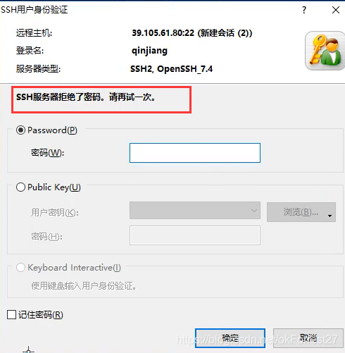

### 8.3 用户组管理

#### 属主、属组

每个用户都有一个用户组,系统可以对一个用户组中的所有用户进行集中管理(开发、测试、运维)。不同Linux 系统对用户组的规定有所不同,如Linux下的用户属于与它同名的用户组,这个用户组在创建用户时同时创建。

用户组的管理涉及用户组的添加、删除和修改。==组的增加、删除和修改实际上就是对/etc/group文件的更新。==

#### 创建一个用户组 groupadd

```bash
[root@cqh ~]group add cqh
[root@cqh ~]cat /etc/group
```

创建完用户组后可以得到一一个组的id ,这个id是可以指定的! `-g 520`， 如果不指定就是自增1

#### 删除用户组 groupdel

```bash
[root@cqh ~]groupdel cqh
[root@cqh ~]cat /etc/group
```

#### 修改用户组的权限和名字 groupmod -g-n

```bash
cqh:x:1003
[root@cqh ~]group -g 666 -n newcqh cqh #修改cqh用户组id为666 重命名为newcqh 
```

#### 用户切换用户组

```bash
#当前登录用户 cqh
$ newgrp root #切换为root
```

#### 拓展 用户账户文件的查看(了解即可) /etc/passwd

```bash
root:x:0:0:root:/root:/bin/bash
#用户名:口令(登录密码，我们不可见) :用户标识号:组标识号:注释性描述:主目录:登录Shell
```

这个文件中的每一行都代表这一用户,我们可以从这里看出这个用户的主目录在那里,可以看到属于哪一个组!
登录口令:把真正的加密后的用户口令字存放到`/etc/shadow`文件中,保证我们密码的安全性!
用户组的所有信息都存放在`/etc/group`文件中。

## 9. 磁盘管理

df(列出文件系统整体的磁盘使用量) 

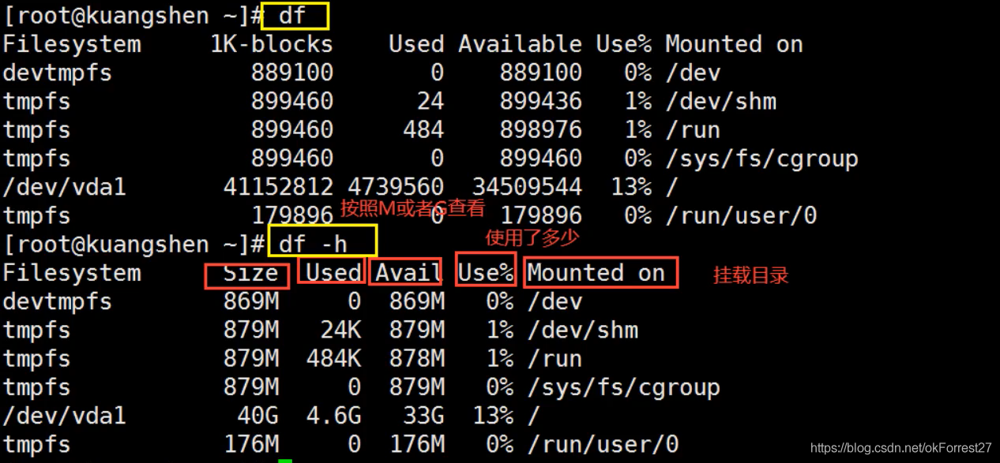

du(检查磁盘空间使用量)

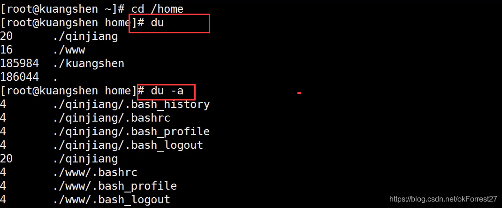

du -sm /*(查看系统目录)

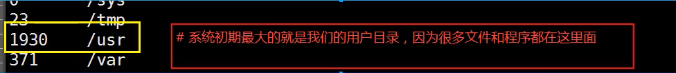

#### Mac 或者想使用Linux 挂载我们的一些本地磁盘或者文件!

挂载：mount

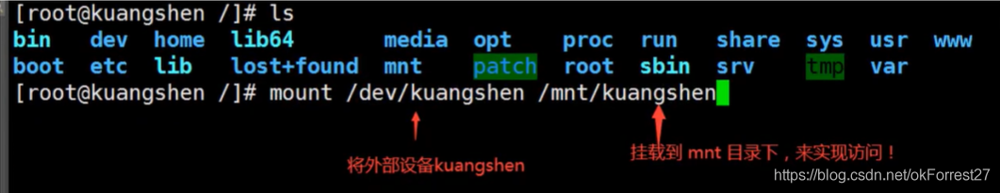

卸载：umount-f [挂载位置] 强制卸载
除了这个之外，以后安装了JDK，可以使用Java命令查看信息

## 10. 进程管理

#### 什么是进程

1. 在Linux中 ,每一个程序都是有自己的一个进程,每一个进程都有一个id号!
2. 每一个进程都会有一个父进程!
3. 进程可以有两种存在方式：前台!后台运行!
4. 一般的话服务都是后台运行的，基本的程序都是前台运行的

#### 命令

**ps** 查看当前系统中正在执行的各种进程的信息！
ps- xx：
  -a 显示当前终端所有的进程信息（当前的进程）
  -u 以用户的信息显示进程
  -x 显示后台运行进程的参数

```bash
#ps -aux  查看所有进程
ps-aux|grep mysql  查看mysql相关进程
# | 在Linux中这个叫管道符   A|B  A命令结果作为输出操作B命令
# grep 查找文件中符合条件的字符串
```

对于我们来说,这里目前只需要记住一个命令即可ps -xx|grep进程名字!过滤进程信息!
**ps -ef** ：可以查看到父进程的信息

```bash
ps -ef|grep mysql #看父进程我们一般可以通过目录树结构来查看
#进程树
pstree -pu
#-p 显示父id
#-u 显示用户组
```

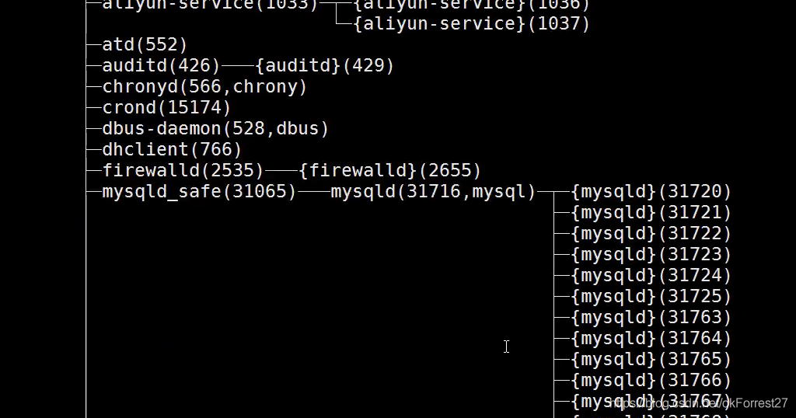

结束进程：杀掉进程 等价于Windows结束任务

Java死循环时可以使用

```bash
kill -9 pid
```

表示强制结束该进程


## 11. 环境安装

安装软件一般有三种方式

* rpm(jdk, 在线发布一个SpringBoot项目)
* 解压缩(tomcat，启动并通过外网访问，发布网站)
* yum在线安装(docker：直接安装运行跑起来docker就可以)

### 11.1 JDK安装

1. 下载IDK rpm。 去oralce官网下载即可!
2. 安装java环境

```bash
java -version 检测当前系统是否存在Java环境 和windows命令一样
#如果有的话就需要卸载
rpm -qa|grep jdk 查看JDK版本信息
rpm -e --nodeps jdk_ 卸载
#卸载完毕后可安装JDK
rpm -ivk rpm包 
```

 java-version命令:

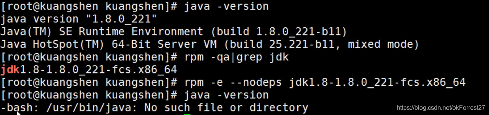

安装中:


配置环境变量: /etc/profile 在文件的最后面增加java的配置和window安装环境变量一样!

```bash
vim /etc/profile
```

这个环境变量有问题 狂神老师敲的是有问题的

```bash
JAVA_HOME=/usr/java/jdk-14.0.1
JRE_HOME=$JAVA_HOME/jre
PATH=$PATH:$JAVA_HOME/bin:$JRE_HOME/bin
CLASSPATH=.:$JAVA_HOME/lib/dt.jar:$JAVA_HOME/lib/tools.jar:$JRE_HOME/lib
export JAVA_HOME JRE_HOME PATH CLASSPATH
```

让这个配置文件生效!

```bash
source /etc/profile
```

狂神老师用的是阿里云，自带网络了，此处给用虚拟机的同学使用。虚拟机联网教程：[虚拟机和主机联网教程](https://blog.csdn.net/u012049667/article/details/81171003)
配置完后在Linux防火墙中开启相应端口 使用java -jar发布 如果你的项目在云服务器上，就可以在公网上进行发布查看了

```bash
#开启防火墙端口
firewall-cmd --zone=public --add-port=9000/tcp --permanent
#重启防火墙
systemctl restart firewalld.service
#查看所有开启的端口，如果是阿里云 需要配置安全组规则
firewall-cmd --list-ports
```

命令运行效果：

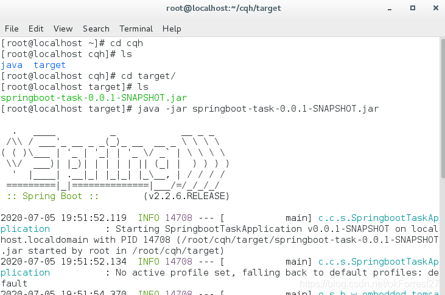

查出centos7中的ip 外机进行访问


### 11.2 Tomcat安装

ssm war 就需要放在tomcat中运行

1. 下载tomcat 官网下载即可
2. 解压`tar -zxvf apache-tomcat-9.0.36.tar.gz`
3. 启动tomcat

```bash
#执行 
./startup.sh
#停止
./shutdown.sh
```

进入`bin`，启动效果

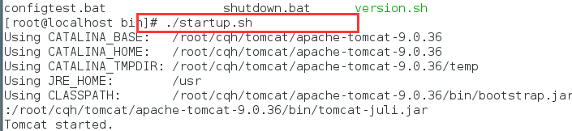

如果防火墙8080端口开了并且阿里云安全组也开放了这个时候就可以直接访问远程了。

```bash
#开启端口
firewall-cmd --zone=public --add-port=8080/tcp –permanent
```

命令含义:
 `--zone` 作用域
 `--add-port-80/tcp` 添加端口， 格式为:端口/通讯协议
 `--permanent` 永久生效，没有此参数重启后失效

 如果是阿里云 上传完毕的项目直接购买自己的域名,备案解析过去即可!
 域名解析后,如果端口是80 - http或者443-https 可以直接访问,如果是9000 8080 ,就需要通过Apcahe或者Nginx做一下反向代理即可（配置文件）

### 11.3 Docker（yum安装）

1. 检测CentOS 7

```bash
[root@localhost ~] cat /etc/redhat-release 
CentOS Linux release 7.3.1611 (Core)
```

2. 安装我们的准备环境

```bash
yum -y install 包名
#yum install 安装命令 -y  所有的提示都为y
yum -y install gcc
yum -y install gcc-c++
```

3. 卸载以前的docker

```bash
yum remove docker \
                  docker-client \
                  docker-client-latest \
                  docker-common \
                  docker-latest \
                  docker-latest-logrotate \
                  docker-logrotate \
                  docker-engine
```

4. 下载环境

```bash
yum install -y yum-utils \device-mapper-persistent-data \lvm2
```

5. 使用国内阿里云镜像

```bash
yum-config-manager --add-repo http://mirrors.aliyun.com/docker-ce/linux/centos/docker-ce.repo
```

6. 更新yum软件包安装

```bash
yum makecache fast
```

7. 安装docker ce

```bash
yum -y install docker-ce docker-ce-Cli containerd.io
```

8. 启动docker

```bash
systemctl start docker
```

9. 测试

```bash
docker version
docker run hello-world
docker images
```

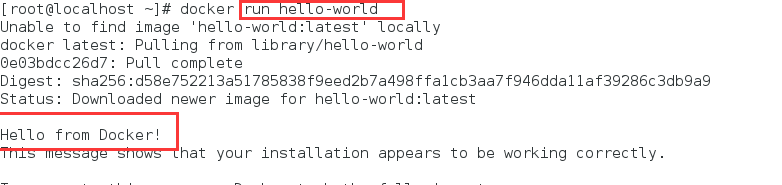
