# Redis

## 1. NoSQL 概述

### 1.1 为什么使用NoSQL

#### 1. 单机Mysql时代


90年代,一个网站的访问量一般不会太大，单个数据库完全够用。随着用户增多，网站出现以下问题

1. 数据量增加到一定程度，单机数据库就放不下了
2. 数据的索引（B+ Tree）,一个机器内存也存放不下（MySQL超过300万条数据就一定要建立索引！）
3. 访问量变大后（读写混合），一台服务器承受不住。

#### 2. Memcached(缓存) + Mysql + 垂直拆分（读写分离）

网站80%的情况都是在读，每次都要去查询数据库的话就十分的麻烦！所以说我们希望减轻数据库的压力，我们可以使用缓存来保证效率！

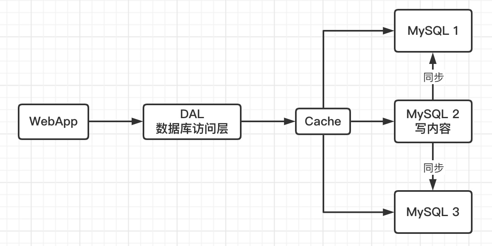

优化过程经历了以下几个过程：

1. 优化数据库的数据结构和索引(难度大)
2. 文件缓存，通过IO流获取比每次都访问数据库效率略高，但是流量爆炸式增长时候，IO流也承受不了
3. MemCache,当时最热门的技术，通过在数据库和数据库访问层之间加上一层缓存，第一次访问时查询数据库，将结果保存到缓存，后续的查询先检查缓存，若有直接拿去使用，效率显著提升。

#### 3. 分库分表 + 水平拆分 + Mysql集群

技术和业务在发展的同时，对人的要求也越来越高了

==本质：数据库（读，写）==

早些年MyISAM: 表锁，十分影响效率！高并发下就会出现严重的锁问题！

转战InnoDB：行锁

慢慢的就开始使用分库分表来解决写的压力！MySQL于是推出了表分区（这个并没有多少公司使用）

MySQL的集群，很好满足那个年代的需求！

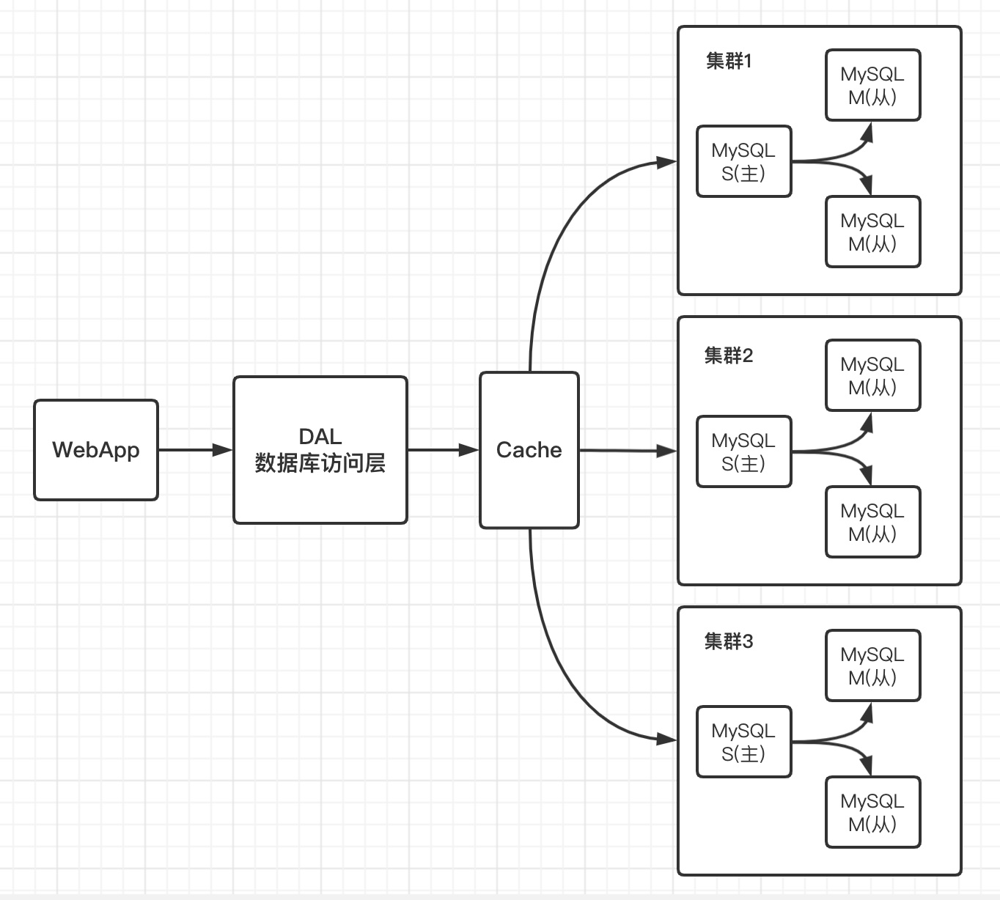

#### 4. 如今的年代(NoSQL)

 如今信息量井喷式增长，各种各样的数据出现（用户定位数据，图片数据，热榜等），大数据的背景下关系型数据库（RDBMS）无法满足大量数据要求。Nosql数据库就能轻松解决这些问题。

目前一个基本的互联网项目

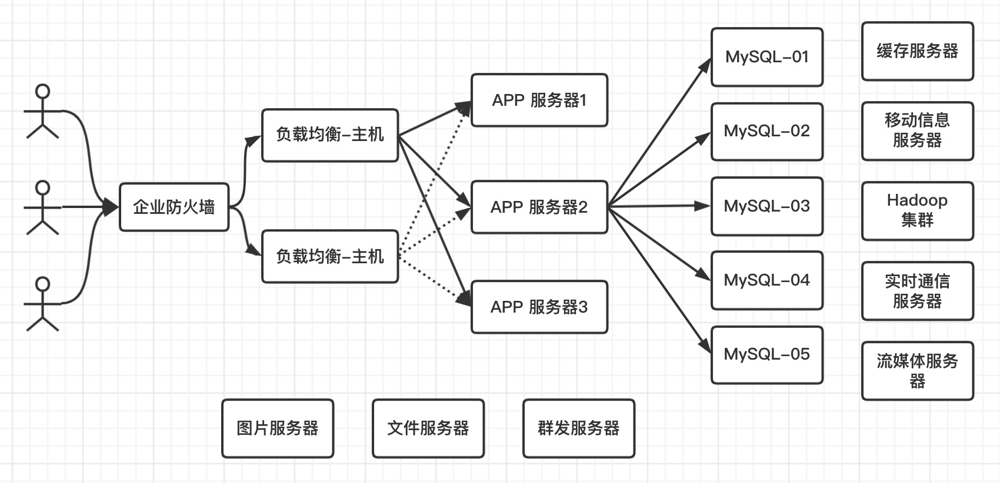

#### 5. 为什么要用NoSQL ？

用户的个人信息，社交网络，地理位置。用户自己产生的数据，用户日志等等爆发式增长！
这时候我们就需要使用NoSQL数据库的，NoSQL可以很好的处理以上的情况！

### 1.2 什么是Nosql

==NoSQL = Not Only SQL（不仅仅是SQL）==

Not Only Structured Query Language

关系型数据库：列+行，同一个表下数据的结构是一样的。

非关系型数据库：数据存储没有固定的格式，并且可以进行横向扩展。

NoSQL泛指非关系型数据库，随着web2.0互联网的诞生，传统的关系型数据库很难对付web2.0时代！尤其是超大规模的高并发的社区，暴露出来很多难以克服的问题，NoSQL在当今大数据环境下发展的十分迅速，Redis是发展最快的。

很多的数据类型用户的个人信息，社交网络，地理位置，这些数据类型的存储不需要一个固定的格式！不需要多月的操作就可以横向发展！

### 1.3 Nosql特点

1. 方便扩展（数据之间没有关系，很好扩展！）
2. 大数据量高性能（Redis一秒可以写8万次，读11万次，NoSQL的缓存记录级，是一种细粒度的缓存，性能会比较高！）
3. 数据类型是多样型的！（不需要事先设计数据库，随取随用）
4. 传统的 RDBMS 和 NoSQL

```
传统的 RDBMS(关系型数据库)
- 结构化组织
- SQL
- 数据和关系都存在单独的表中 row col
- 操作，数据定义语言
- 严格的一致性
- 基础的事务
- ...
```

 ```
 Nosql
 - 不仅仅是数据
 - 没有固定的查询语言
 - 键值对存储，列存储，文档存储，图形数据库（社交关系）
 - 最终一致性
 - CAP定理和BASE
 - 高性能，高可用，高扩展
 - ...
 ```

### 1.4 了解：3V + 3高

大数据时代的3V ：主要是**描述问题**的

1. 海量Volume
2. 多样Variety
3. 实时Velocity

大数据时代的3高 ： 主要是**对程序的要求**

1. 高并发
2. 高可扩
3. 高性能

真正在公司中的实践：NoSQL + RDBMS 一起使用才是最强的。

### 阿里巴巴演进分析

推荐阅读：阿里云的这群疯子https://yq.aliyun.com/articles/653511

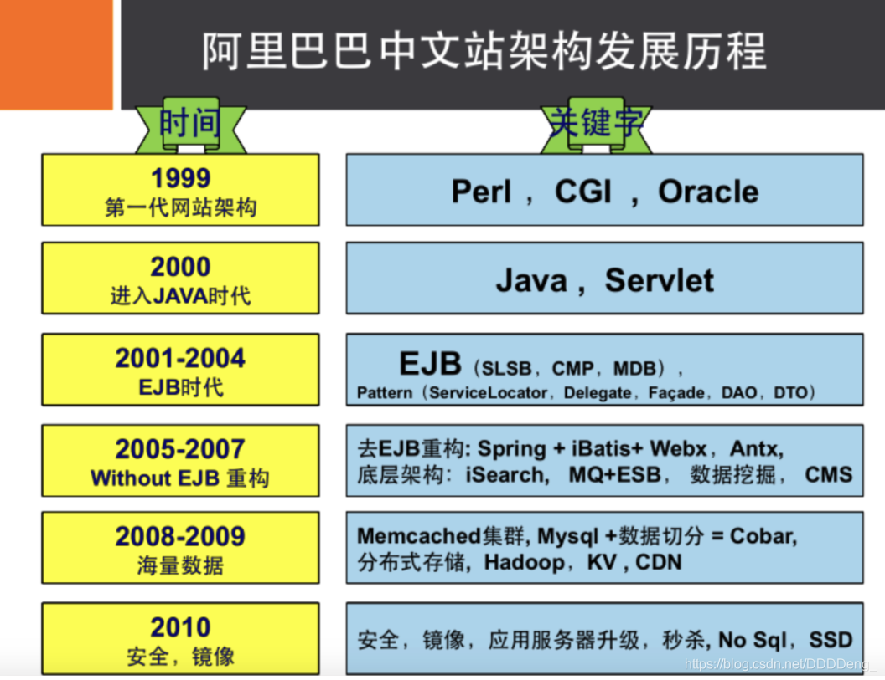


如果未来当架构师：没有什么是加一层解决不了的！

```bash
# 商品信息
- 一般存放在关系型数据库：Mysql,阿里巴巴使用的Mysql都是经过内部改动的。

# 商品描述、评论(文字居多)
- 文档型数据库：MongoDB

# 图片
- 分布式文件系统 FastDFS
- 淘宝：TFS
- Google: GFS
- Hadoop: HDFS
- 阿里云: oss

# 商品关键字 用于搜索
- 搜索引擎：solr,elasticsearch
- 阿里：Isearch 多隆

# 商品热门的波段信息
- 内存数据库：Redis，Memcache

# 商品交易，外部支付接口
- 第三方应用
```

一个简单的网页背后的技术一定不是想象的这么简单！

大型互联网应用问题：

* 数据类型太多了
* 数据源太多了，经常重构！
* 数据要改造，大面积改造麻烦！

### 1.5 NoSQL的四大分类

#### 1. **KV键值对**

- 新浪：**Redis**
- 美团：Redis + Tair
- 阿里、百度：Redis + Memcache

#### 2. 文档型数据库（bson数据格式）：

* **MongoDB**(掌握)
  * 基于分布式文件存储的数据库。C++编写，用于处理大量文档。
  * MongoDB是RDBMS和NoSQL的中间产品。MongoDB是非关系型数据库中功能最丰富的，NoSQL中最像关系型数据库的数据库。
* ConthDB

#### 3. **列存储数据库**

- **HBase**(大数据必学)
- 分布式文件系统

#### 4. **图关系数据库**

用于广告推荐，社交网络

- **Neo4j**、InfoGrid

| **分类**                | **Examples举例**                                   | **典型应用场景**                                             | **数据模型**                                    | **优点**                                                     | **缺点**                                                     |
| ----------------------- | -------------------------------------------------- | ------------------------------------------------------------ | ----------------------------------------------- | ------------------------------------------------------------ | ------------------------------------------------------------ |
| **键值对（key-value）** | Tokyo Cabinet/Tyrant, Redis, Voldemort, Oracle BDB | 内容缓存，主要用于处理大量数据的高访问负载，也用于一些日志系统等等。 | Key 指向 Value 的键值对，通常用hash table来实现 | 查找速度快                                                   | 数据无结构化，通常只被当作字符串或者二进制数据               |
| **列存储数据库**        | Cassandra, HBase, Riak                             | 分布式的文件系统                                             | 以列簇式存储，将同一列数据存在一起              | 查找速度快，可扩展性强，更容易进行分布式扩展                 | 功能相对局限                                                 |
| **文档型数据库**        | CouchDB, MongoDb                                   | Web应用（与Key-Value类似，Value是结构化的，不同的是数据库能够了解Value的内容） | Key-Value对应的键值对，Value为结构化数据        | 数据结构要求不严格，表结构可变，不需要像关系型数据库一样需要预先定义表结构 | 查询性能不高，而且缺乏统一的查询语法。                       |
| **图形(Graph)数据库**   | Neo4J, InfoGrid, Infinite Graph                    | 社交网络，推荐系统等。专注于构建关系图谱                     | 图结构                                          | 利用图结构相关算法。比如最短路径寻址，N度关系查找等          | 很多时候需要对整个图做计算才能得出需要的信息，而且这种结构不太好做分布式的集群 |


## 2. Redis入门

### 2.1 概述

#### 1. Redis是什么？

Redis（Remote Dictionary Server )，即远程字典服务。

是一个开源的使用ANSI C语言编写、支持网络、可基于内存亦可持久化的日志型、**Key-Value数据库**，并提供多种语言的API。

与memcached一样，为了保证效率，**数据都是缓存在内存中**。区别的是redis会周期性的把更新的数据写入磁盘或者把修改操作写入追加的记录文件，并且在此基础上实现了master-slave(主从)同步。

#### 2. Redis能该干什么？

1. 内存存储、持久化，内存是断电即失的，所以需要持久化（RDB、AOF）
2. 高效率、用于高速缓存
3. 发布订阅系统
4. 地图信息分析
5. 计时器、计数器(eg：浏览量)
6. 。。。

#### 3. 特性

1. 多样的数据类型

2. 持久化

3. 集群

4. 事务

   …

### 2.2 环境搭建

官网：https://redis.io/

中文网： http://www.redis.cn/

==推荐使用Linux服务器学习==。

windows版本的Redis已经停更很久了…

#### 1. Windows安装

https://github.com/dmajkic/redis

1. 解压安装包

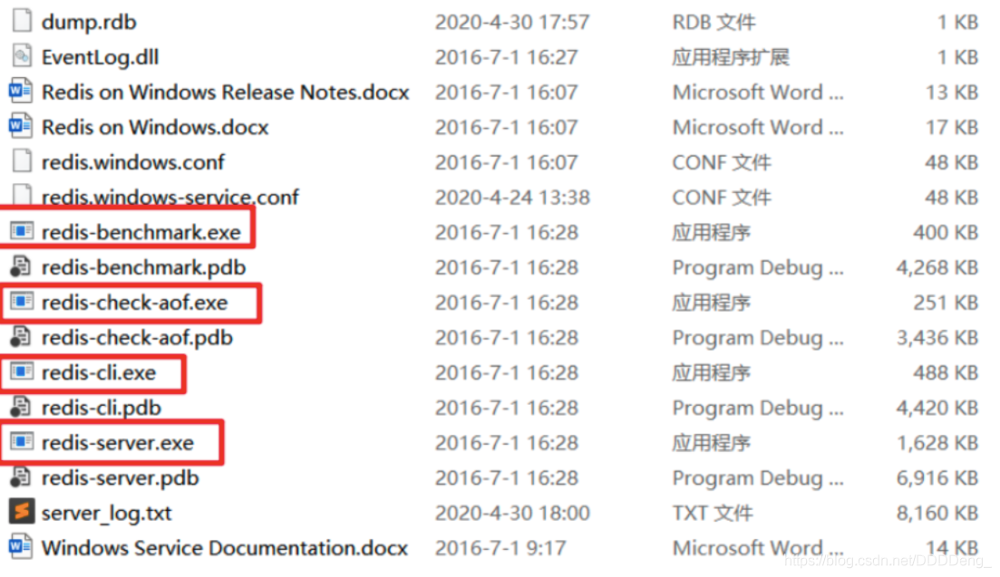

2. 开启redis-server.exe
3. 启动redis-cli.exe测试


==**默认端口号：6379**==

#### 2. Linux安装

1. 下载安装包！`redis-6.0.6.tar.gz`

2. 解压Redis的安装包！程序一般放在 `/opt` 目录下

   

   ```bash
   tar -zxvf redis-6.0.6.tar.gz
   ```

3. 基本环境安装

   ```bash
   #在解压后的redis目录下进行如下操作:
   yum install gcc-c++
   # 然后进入redis目录下执行
   make
   # 然后执行
   make install
   
   ##安装6.0以上版本的redis需要将gcc升级到5.3以上,此处升级到gcc7和scl
   yum -y install centos-release-scl
   yum -y install devtoolset-7-gcc*
   #scl命令启动只是临时的，退出shell或重启就会恢复原系统gcc版本
   scl enable devtoolset-7 bash
   #如需长期使用：
   echo "source /opt/rh/devtoolset-7/enable">>/etc/profile
   source /etc/profile
   #查看版本
   gcc -v
   ```

   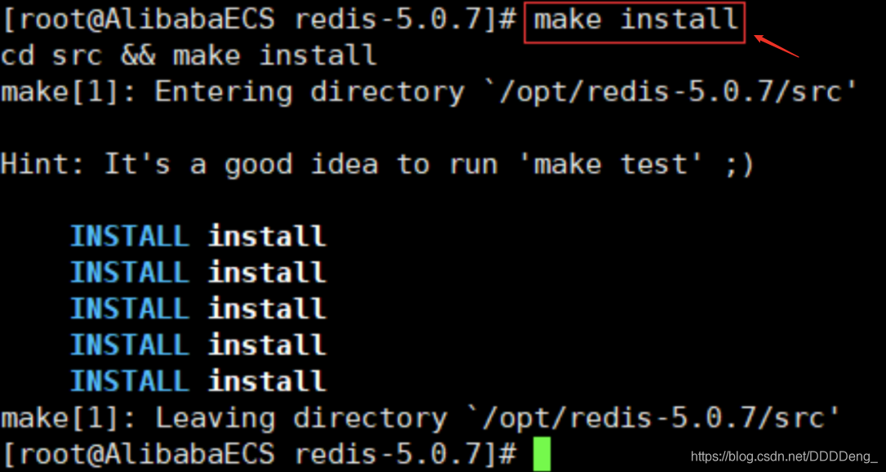

4. redis默认安装路径 `/usr/local/bin`

   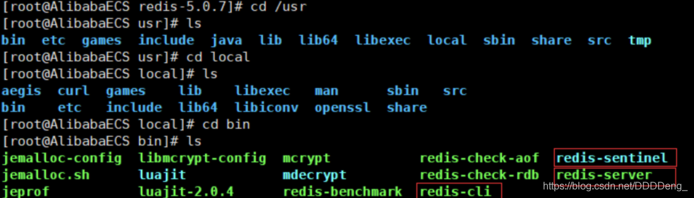

5. 将redis的配置文件复制到 程序安装目录 `/usr/local/bin/kconfig`下(kconfig是自定义的)

   ```bash
   mkdir kconfig
   cp /opt/redis-6.0.6/redis.conf kconfig 
   ```

   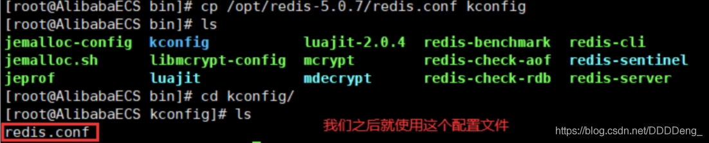

6. redis默认不是后台启动的，需要修改配置文件！

   ```bash
   vim redis.config
   #进入后，将daemonize no改为yes
   ```

   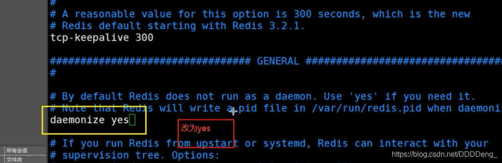

7. 通过制定的配置文件启动redis服务

   ```bash
   redis-server kconfig/redis.conf
   ```

   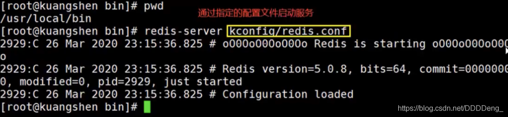

8. 使用redis-cli连接指定的端口号测试，==Redis的默认端口6379==

   ```bash
   redis-cli -p 6379
   ```
   
   ```bash
   #进行测试
   #键值对存入查看
   set name kuangshen
   get name
   #查看所有键
   keys *
   ```
   
   
9. 查看redis进程是否开启

   ```bash
   ps -ef/grep redis
   ```

   

10. 关闭Redis服务 `shutdown` `exit`

    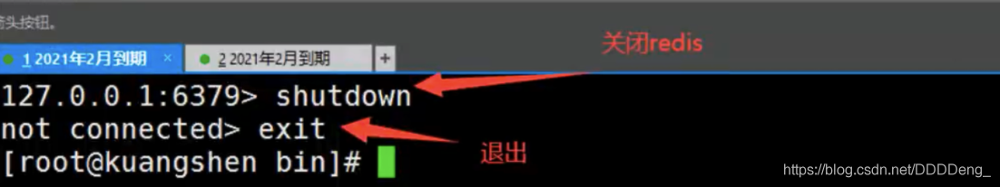

11. 再次查看进程是否存在

12. 后面我们会使用单机多Redis启动集群测试

### 2.3 测试性能

**==redis-benchmark==：**Redis官方提供的性能测试工具，参数选项如下：

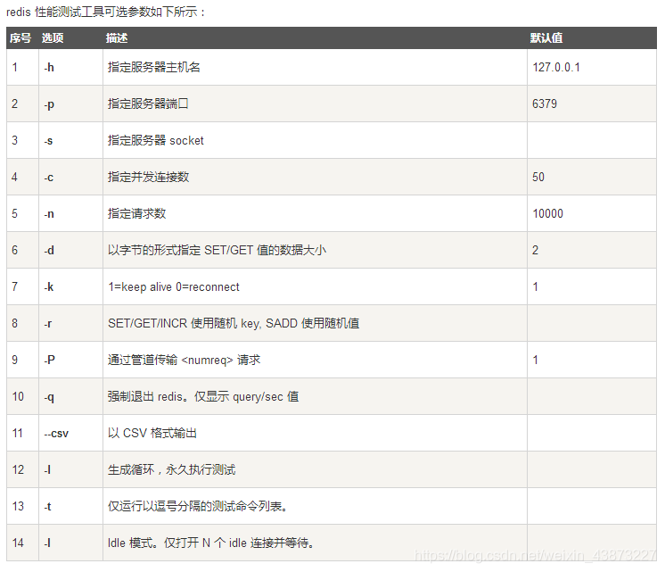

**简单测试：**

```bash
# 测试：100个并发连接 100000请求
redis-benchmark -h localhost -p 6379 -c 100 -n 100000
```

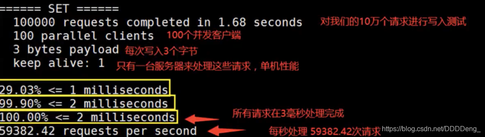

### 2.4 基础知识

**redis默认有16个数据库**

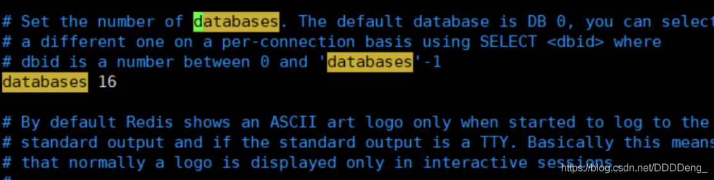

默认使用的第0个;

16个数据库为：DB 0~DB 15
默认使用DB 0 ，可以使用`select n`切换到DB n，`dbsize`可以查看当前数据库的大小，与key数量相关。

```bash
127.0.0.1:6379> config get databases # 命令行查看数据库数量databases
1) "databases"
2) "16"

127.0.0.1:6379> select 8 # 切换数据库 DB 8
OK
127.0.0.1:6379[8]> dbsize # 查看数据库大小
(integer) 0

# 不同数据库之间 数据是不能互通的，并且dbsize 是根据库中key的个数。
127.0.0.1:6379> set name sakura 
OK
127.0.0.1:6379> SELECT 8
OK
127.0.0.1:6379[8]> get name # db8中并不能获取db0中的键值对。
(nil)
127.0.0.1:6379[8]> DBSIZE
(integer) 0
127.0.0.1:6379[8]> SELECT 0
OK
127.0.0.1:6379> keys *
1) "counter:__rand_int__"
2) "mylist"
3) "name"
4) "key:__rand_int__"
5) "myset:__rand_int__"
127.0.0.1:6379> DBSIZE # size和key个数相关
(integer) 5
```

`keys *` ：查看当前数据库中所有的key。

`flushdb`：清空当前数据库中的键值对。

`flushall`：清空所有数据库的键值对。

**Redis是单线程的，Redis是基于内存操作的。**

所以Redis的性能瓶颈不是CPU,而是机器内存和网络带宽。

那么为什么Redis的速度如此快呢，性能这么高呢？QPS达到10W+，C语言写的，完全不比同样是key-value的Memecache差！

**Redis为什么单线程还这么快？**

- 误区1：高性能的服务器一定是多线程的？
- 误区2：多线程（CPU上下文会切换！）一定比单线程效率高！

核心：Redis是将所有的数据放在内存中的，所以说使用单线程去操作效率就是最高的，多线程（CPU上下文会切换：耗时的操作！），==对于内存系统来说，如果没有上下文切换效率就是最高的，多次读写都是在一个CPU上的==，在内存存储数据情况下，单线程就是最佳的方案。

## 3. 五大数据类型

 Redis是一个开源（BSD许可），内存存储的数据结构服务器，可用作**数据库**，**高速缓存**和**消息队列代理**。它支持字符串、哈希表、列表、集合、有序集合，位图，hyperloglogs等数据类型。内置复制、Lua脚本、LRU收回、事务以及不同级别磁盘持久化功能，同时通过Redis Sentinel提供高可用，通过Redis Cluster提供自动分区。

### 3.1 Redis-key

**在redis中无论什么数据类型，在数据库中都是以key-value形式保存，通过进行对Redis-key的操作，来完成对数据库中数据的操作。**

下面学习的命令：

- `exists key`：判断键是否存在
- `del key`：删除键值对
- `move key db`：将键值对移动到指定数据库
- `expire key second`：设置键值对的过期时间
- `type key`：查看value的数据类型

```bash
127.0.0.1:6379> keys * # 查看当前数据库所有key
(empty list or set)
127.0.0.1:6379> set name qinjiang # set key
OK
127.0.0.1:6379> set age 20
OK
127.0.0.1:6379> keys *
1) "age"
2) "name"
127.0.0.1:6379> move age 1 # 将键值对移动到指定数据库
(integer) 1
127.0.0.1:6379> EXISTS age # 判断键是否存在
(integer) 0 # 不存在
127.0.0.1:6379> EXISTS name
(integer) 1 # 存在
127.0.0.1:6379> SELECT 1
OK
127.0.0.1:6379[1]> keys *
1) "age"
127.0.0.1:6379[1]> del age # 删除键值对
(integer) 1 # 删除个数


127.0.0.1:6379> set age 20
OK
127.0.0.1:6379> EXPIRE age 15 # 设置键值对的过期时间

(integer) 1 # 设置成功 开始计数
127.0.0.1:6379> ttl age # 查看key的过期剩余时间
(integer) 13
127.0.0.1:6379> ttl age
(integer) 11
127.0.0.1:6379> ttl age
(integer) 9
127.0.0.1:6379> ttl age
(integer) -2 # -2 表示key过期，-1表示key未设置过期时间

127.0.0.1:6379> get age # 过期的key 会被自动delete
(nil)
127.0.0.1:6379> keys *
1) "name"

127.0.0.1:6379> type name # 查看value的数据类型
string
```

关于`TTL`命令

Redis的key，通过TTL命令返回key的过期时间，一般来说有3种：

1. 当前key==没有设置过期时间，所以会返回-1.==
2. 当前key有设置过期时间，而且==key已经过期，所以会返回-2.==
3. 当前key有==设置过期时间，且key还没有过期，故会返回key的正常剩余时间.==

关于重命名`RENAME`和`RENAMENX`

- `RENAME key newkey`修改 key 的名称
- `RENAMENX key newkey`仅当 newkey 不存在时，将 key 改名为 newkey 。

更多命令学习：https://www.redis.net.cn/order/

### 3.2 String(字符串)

普通的set、get直接略过。

| 命令                                 | 描述                                                         | 示例                                                         |
| ------------------------------------ | ------------------------------------------------------------ | :----------------------------------------------------------- |
| `APPEND key value`                   | 向指定的key的value后追加字符串                               | 127.0.0.1:6379> set msg hello OK 127.0.0.1:6379> append msg " world" (integer) 11 127.0.0.1:6379> get msg “hello world” |
| `DECR/INCR key`                      | 将指定key的value数值进行+1/-1(仅对于数字)                    | 127.0.0.1:6379> set age 20 OK 127.0.0.1:6379> incr age (integer) 21 127.0.0.1:6379> decr age (integer) 20 |
| `INCRBY/DECRBY key n`                | 按指定的步长对数值进行加减                                   | 127.0.0.1:6379> INCRBY age 5 (integer) 25 127.0.0.1:6379> DECRBY age 10 (integer) 15 |
| `INCRBYFLOAT key n`                  | 为数值加上浮点型数值                                         | 127.0.0.1:6379> INCRBYFLOAT age 5.2 “20.2”                   |
| STRLEN key                           | 获取key保存值的字符串长度                                    | 127.0.0.1:6379> get msg “hello world” 127.0.0.1:6379> STRLEN msg (integer) 11 |
| `GETRANGE key start end`             | 按起止位置获取字符串（闭区间，起止位置都取）                 | 127.0.0.1:6379> get msg “hello world” 127.0.0.1:6379> GETRANGE msg 3 9 “lo worl” |
| `SETRANGE key offset value`          | 用指定的value 替换key中 offset开始的值                       | 127.0.0.1:6379> SETRANGE msg 2 hello (integer) 7 127.0.0.1:6379> get msg “tehello” |
| `GETSET key value`                   | 将给定 key 的值设为 value ，并返回 key 的旧值(old value)。   | 127.0.0.1:6379> GETSET msg test “hello world”                |
| `SETNX key value`                    | 仅当key不存在时进行set                                       | 127.0.0.1:6379> SETNX msg test (integer) 0 127.0.0.1:6379> SETNX name sakura (integer) 1 |
| `SETEX key seconds value`            | set 键值对并设置过期时间                                     | 127.0.0.1:6379> setex name 10 root OK 127.0.0.1:6379> get name (nil) |
| `MSET key1 value1 [key2 value2..]`   | 批量set键值对                                                | 127.0.0.1:6379> MSET k1 v1 k2 v2 k3 v3 OK                    |
| `MSETNX key1 value1 [key2 value2..]` | 批量设置键值对，仅当参数中所有的key都不存在时执行            | 127.0.0.1:6379> MSETNX k1 v1 k4 v4 (integer) 0               |
| `MGET key1 [key2..]`                 | 批量获取多个key保存的值                                      | 127.0.0.1:6379> MGET k1 k2 k3 1) “v1” 2) “v2” 3) “v3”        |
| `PSETEX key milliseconds value`      | 和 SETEX 命令相似，但它以毫秒为单位设置 key 的生存时间，     |                                                              |
| `getset key value`                   | 如果不存在值，则返回nil，如果存在值，获取原来的值，并设置新的值 |                                                              |

String类似的使用场景：value除了是字符串还可以是数字，用途举例：

- 计数器
- 统计多单位的数量：uid:123666：follow 0
- 粉丝数
- 对象存储缓存

### 3.3 List(列表)

Redis列表是简单的字符串列表，按照插入顺序排序。你可以添加一个元素到列表的头部（左边）或者尾部（右边）

一个列表最多可以包含 232 - 1 个元素 (4294967295, 每个列表超过40亿个元素)。

首先我们列表，可以经过规则定义将其变为队列、栈、双端队列等

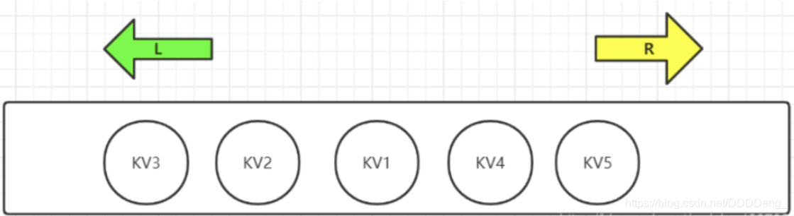

正如图==Redis中List是可以进行双端操作的，所以命令也就分为了LXXX和RLLL两类==，有时候L也表示List例如LLEN

| 命令                                    | 描述                                                         |
| --------------------------------------- | ------------------------------------------------------------ |
| `LPUSH/RPUSH key value1[value2..]`      | 从左边/右边向列表中PUSH值(一个或者多个)。                    |
| `LRANGE key start end`                  | 获取list 起止元素==（索引从左往右 递增）==                   |
| `LPUSHX/RPUSHX key value`               | 向已存在的列名中push值（一个或者多个）                       |
| `LINSERT key BEFORE|AFTER pivot value`  | 在指定列表元素的前/后 插入value                              |
| `LLEN key`                              | 查看列表长度                                                 |
| `LINDEX key index`                      | 通过索引获取列表元素                                         |
| `LSET key index value`                  | 通过索引为元素设值                                           |
| `LPOP/RPOP key`                         | 从最左边/最右边移除值 并返回                                 |
| `RPOPLPUSH source destination`          | 将列表的尾部(右)最后一个值弹出，并返回，然后加到另一个列表的头部 |
| `LTRIM key start end`                   | 通过下标截取指定范围内的列表                                 |
| `LREM key count value`                  | List中是允许value重复的 `count > 0`：从头部开始搜索 然后删除指定的value 至多删除count个 `count < 0`：从尾部开始搜索… `count = 0`：删除列表中所有的指定value。 |
| `BLPOP/BRPOP key1[key2] timout`         | 移出并获取列表的第一个/最后一个元素， 如果列表没有元素会阻塞列表直到等待超时或发现可弹出元素为止。 |
| `BRPOPLPUSH source destination timeout` | 和`RPOPLPUSH`功能相同，如果列表没有元素会阻塞列表直到等待超时或发现可弹出元素为止。 |

```bash
---------------------------LPUSH---RPUSH---LRANGE--------------------------------

127.0.0.1:6379> LPUSH mylist k1 # LPUSH mylist=>{1}
(integer) 1
127.0.0.1:6379> LPUSH mylist k2 # LPUSH mylist=>{2,1}
(integer) 2
127.0.0.1:6379> RPUSH mylist k3 # RPUSH mylist=>{2,1,3}
(integer) 3
127.0.0.1:6379> get mylist # 普通的get是无法获取list值的
(error) WRONGTYPE Operation against a key holding the wrong kind of value
127.0.0.1:6379> LRANGE mylist 0 4 # LRANGE 获取起止位置范围内的元素
1) "k2"
2) "k1"
3) "k3"
127.0.0.1:6379> LRANGE mylist 0 2
1) "k2"
2) "k1"
3) "k3"
127.0.0.1:6379> LRANGE mylist 0 1
1) "k2"
2) "k1"
127.0.0.1:6379> LRANGE mylist 0 -1 # 获取全部元素
1) "k2"
2) "k1"
3) "k3"

---------------------------LPUSHX---RPUSHX-----------------------------------

127.0.0.1:6379> LPUSHX list v1 # list不存在 LPUSHX失败
(integer) 0
127.0.0.1:6379> LPUSHX list v1 v2  
(integer) 0
127.0.0.1:6379> LPUSHX mylist k4 k5 # 向mylist中 左边 PUSH k4 k5
(integer) 5
127.0.0.1:6379> LRANGE mylist 0 -1
1) "k5"
2) "k4"
3) "k2"
4) "k1"
5) "k3"

---------------------------LINSERT--LLEN--LINDEX--LSET----------------------------

127.0.0.1:6379> LINSERT mylist after k2 ins_key1 # 在k2元素后 插入ins_key1
(integer) 6
127.0.0.1:6379> LRANGE mylist 0 -1
1) "k5"
2) "k4"
3) "k2"
4) "ins_key1"
5) "k1"
6) "k3"
127.0.0.1:6379> LLEN mylist # 查看mylist的长度
(integer) 6
127.0.0.1:6379> LINDEX mylist 3 # 获取下标为3的元素
"ins_key1"
127.0.0.1:6379> LINDEX mylist 0
"k5"
127.0.0.1:6379> LSET mylist 3 k6 # 将下标3的元素 set值为k6
OK
127.0.0.1:6379> LRANGE mylist 0 -1
1) "k5"
2) "k4"
3) "k2"
4) "k6"
5) "k1"
6) "k3"

---------------------------LPOP--RPOP--------------------------

127.0.0.1:6379> LPOP mylist # 左侧(头部)弹出
"k5"
127.0.0.1:6379> RPOP mylist # 右侧(尾部)弹出
"k3"

---------------------------RPOPLPUSH--------------------------

127.0.0.1:6379> LRANGE mylist 0 -1
1) "k4"
2) "k2"
3) "k6"
4) "k1"
127.0.0.1:6379> RPOPLPUSH mylist newlist # 将mylist的最后一个值(k1)弹出，加入到newlist的头部
"k1"
127.0.0.1:6379> LRANGE newlist 0 -1
1) "k1"
127.0.0.1:6379> LRANGE mylist 0 -1
1) "k4"
2) "k2"
3) "k6"

---------------------------LTRIM--------------------------

127.0.0.1:6379> LTRIM mylist 0 1 # 截取mylist中的 0~1部分
OK
127.0.0.1:6379> LRANGE mylist 0 -1
1) "k4"
2) "k2"

# 初始 mylist: k2,k2,k2,k2,k2,k2,k4,k2,k2,k2,k2
---------------------------LREM--------------------------

127.0.0.1:6379> LREM mylist 3 k2 # 从头部开始搜索 至多删除3个 k2
(integer) 3
# 删除后：mylist: k2,k2,k2,k4,k2,k2,k2,k2

127.0.0.1:6379> LREM mylist -2 k2 #从尾部开始搜索 至多删除2个 k2
(integer) 2
# 删除后：mylist: k2,k2,k2,k4,k2,k2


---------------------------BLPOP--BRPOP--------------------------

mylist: k2,k2,k2,k4,k2,k2
newlist: k1

127.0.0.1:6379> BLPOP newlist mylist 30 # 从newlist中弹出第一个值，mylist作为候选
1) "newlist" # 弹出
2) "k1"
127.0.0.1:6379> BLPOP newlist mylist 30
1) "mylist" # 由于newlist空了 从mylist中弹出
2) "k2"
127.0.0.1:6379> BLPOP newlist 30
(30.10s) # 超时了

127.0.0.1:6379> BLPOP newlist 30 # 我们连接另一个客户端向newlist中push了test, 阻塞被解决。
1) "newlist"
2) "test"
(12.54s)
```

小结

* list实际上是一个链表，before Node after , left, right 都可以插入值
* 如果key不存在，则创建新的链表
* 如果key存在，新增内容
* 如果移除了所有值，空链表，也代表不存在
* 在两边插入或者改动值，效率最高！修改中间元素，效率相对较低

**应用：**

**消息排队！消息队列（Lpush Rpop）,栈（Lpush Lpop）**

### 3.4 Set(集合)

Redis的Set是string类型的==无序集合。集合成员是唯一的，这就意味着集合中不能出现重复的数据==。

Redis 中 集合是==通过哈希表实现的==，所以添加，删除，查找的复杂度都是O(1)。

集合中最大的成员数为 232 - 1 (4294967295, 每个集合可存储40多亿个成员)。

| 命令                                      | 描述                                                         |
| ----------------------------------------- | ------------------------------------------------------------ |
| `SADD key member1[member2..]`             | 向集合中无序增加一个/多个成员                                |
| `SCARD key`                               | 获取集合的成员数                                             |
| `SMEMBERS key`                            | 返回集合中所有的成员                                         |
| `SISMEMBER key member`                    | 查询member元素是否是集合的成员,结果是无序的                  |
| `SRANDMEMBER key [count]`                 | 随机返回集合中count个成员，count缺省值为1                    |
| `SPOP key [count]`                        | 随机移除并返回集合中count个成员，count缺省值为1              |
| `SMOVE source destination member`         | 将source集合的成员member移动到destination集合                |
| `SREM key member1[member2..]`             | 移除集合中一个/多个成员                                      |
| `SDIFF key1[key2..]`                      | 返回所有集合的差集 key1- key2 - …                            |
| `SDIFFSTORE destination key1[key2..]`     | 在SDIFF的基础上，将结果保存到集合中==(覆盖)==。不能保存到其他类型key噢！ |
| `SINTER key1 [key2..]`                    | 返回所有集合的交集                                           |
| `SINTERSTORE destination key1[key2..]`    | 在SINTER的基础上，存储结果到集合中。覆盖                     |
| `SUNION key1 [key2..]`                    | 返回所有集合的并集                                           |
| `SUNIONSTORE destination key1 [key2..]`   | 在SUNION的基础上，存储结果到及和张。覆盖                     |
| `SSCAN KEY [MATCH pattern] [COUNT count]` | 在大量数据环境下，使用此命令遍历集合中元素，每次遍历部分     |

```bash
---------------SADD--SCARD--SMEMBERS--SISMEMBER--------------------

127.0.0.1:6379> SADD myset m1 m2 m3 m4 # 向myset中增加成员 m1~m4
(integer) 4
127.0.0.1:6379> SCARD myset # 获取集合的成员数目
(integer) 4
127.0.0.1:6379> smembers myset # 获取集合中所有成员
1) "m4"
2) "m3"
3) "m2"
4) "m1"
127.0.0.1:6379> SISMEMBER myset m5 # 查询m5是否是myset的成员
(integer) 0 # 不是，返回0
127.0.0.1:6379> SISMEMBER myset m2
(integer) 1 # 是，返回1
127.0.0.1:6379> SISMEMBER myset m3
(integer) 1

---------------------SRANDMEMBER--SPOP----------------------------------

127.0.0.1:6379> SRANDMEMBER myset 3 # 随机返回3个成员
1) "m2"
2) "m3"
3) "m4"
127.0.0.1:6379> SRANDMEMBER myset # 随机返回1个成员
"m3"
127.0.0.1:6379> SPOP myset 2 # 随机移除并返回2个成员
1) "m1"
2) "m4"
# 将set还原到{m1,m2,m3,m4}

---------------------SMOVE--SREM----------------------------------------

127.0.0.1:6379> SMOVE myset newset m3 # 将myset中m3成员移动到newset集合
(integer) 1
127.0.0.1:6379> SMEMBERS myset
1) "m4"
2) "m2"
3) "m1"
127.0.0.1:6379> SMEMBERS newset
1) "m3"
127.0.0.1:6379> SREM newset m3 # 从newset中移除m3元素
(integer) 1
127.0.0.1:6379> SMEMBERS newset
(empty list or set)

# 下面开始是多集合操作,多集合操作中若只有一个参数默认和自身进行运算
# setx=>{m1,m2,m4,m6}, sety=>{m2,m5,m6}, setz=>{m1,m3,m6}

-----------------------------SDIFF------------------------------------

127.0.0.1:6379> SDIFF setx sety setz # 等价于setx-sety-setz
1) "m4"
127.0.0.1:6379> SDIFF setx sety # setx - sety
1) "m4"
2) "m1"
127.0.0.1:6379> SDIFF sety setx # sety - setx
1) "m5"


-------------------------SINTER---------------------------------------
# 共同关注（交集）

127.0.0.1:6379> SINTER setx sety setz # 求 setx、sety、setx的交集
1) "m6"
127.0.0.1:6379> SINTER setx sety # 求setx sety的交集
1) "m2"
2) "m6"

-------------------------SUNION---------------------------------------

127.0.0.1:6379> SUNION setx sety setz # setx sety setz的并集
1) "m4"
2) "m6"
3) "m3"
4) "m2"
5) "m1"
6) "m5"
127.0.0.1:6379> SUNION setx sety # setx sety 并集
1) "m4"
2) "m6"
3) "m2"
4) "m1"
5) "m5"
```

### 3.5 Hash（哈希）

Redis hash 是一个string类型的field和value的映射表，==hash特别适合用于存储对象==。

Set就是一种简化的Hash,只变动key,而value使用默认值填充。可以将一个Hash表作为一个对象进行存储，表中存放对象的信息。

| 命令                                             | 描述                                                         |
| ------------------------------------------------ | ------------------------------------------------------------ |
| `HSET key field value`                           | 将哈希表 key 中的字段 field 的值设为 value 。重复设置同一个field会覆盖,返回0 |
| `HMSET key field1 value1 [field2 value2..]`      | 同时将多个 field-value (域-值)对设置到哈希表 key 中。        |
| `HSETNX key field value`                         | 只有在字段 field 不存在时，设置哈希表字段的值。              |
| `HEXISTS key field`                              | 查看哈希表 key 中，指定的字段是否存在。                      |
| `HGET key field value`                           | 获取存储在哈希表中指定字段的值                               |
| `HMGET key field1 [field2..]`                    | 获取所有给定字段的值                                         |
| `HGETALL key`                                    | 获取在哈希表key 的所有字段和值                               |
| `HKEYS key`                                      | 获取哈希表key中所有的字段                                    |
| `HLEN key`                                       | 获取哈希表中字段的数量                                       |
| `HVALS key`                                      | 获取哈希表中所有值                                           |
| `HDEL key field1 [field2..]`                     | 删除哈希表key中一个/多个field字段                            |
| `HINCRBY key field n`                            | 为哈希表 key 中的指定字段的整数值加上增量n，并返回增量后结果 一样只适用于整数型字段 |
| `HINCRBYFLOAT key field n`                       | 为哈希表 key 中的指定字段的浮点数值加上增量 n。              |
| `HSCAN key cursor [MATCH pattern] [COUNT count]` | 迭代哈希表中的键值对。                                       |

```bash
------------------------HSET--HMSET--HSETNX----------------
127.0.0.1:6379> HSET studentx name sakura # 将studentx哈希表作为一个对象，设置name为sakura
(integer) 1
127.0.0.1:6379> HSET studentx name gyc # 重复设置field进行覆盖，并返回0
(integer) 0
127.0.0.1:6379> HSET studentx age 20 # 设置studentx的age为20
(integer) 1
127.0.0.1:6379> HMSET studentx sex 1 tel 15623667886 # 设置sex为1，tel为15623667886
OK
127.0.0.1:6379> HSETNX studentx name gyc # HSETNX 设置已存在的field
(integer) 0 # 失败
127.0.0.1:6379> HSETNX studentx email 12345@qq.com
(integer) 1 # 成功

----------------------HEXISTS--------------------------------
127.0.0.1:6379> HEXISTS studentx name # name字段在studentx中是否存在
(integer) 1 # 存在
127.0.0.1:6379> HEXISTS studentx addr
(integer) 0 # 不存在

-------------------HGET--HMGET--HGETALL-----------
127.0.0.1:6379> HGET studentx name # 获取studentx中name字段的value
"gyc"
127.0.0.1:6379> HMGET studentx name age tel # 获取studentx中name、age、tel字段的value
1) "gyc"
2) "20"
3) "15623667886"
127.0.0.1:6379> HGETALL studentx # 获取studentx中所有的field及其value
 1) "name"
 2) "gyc"
 3) "age"
 4) "20"
 5) "sex"
 6) "1"
 7) "tel"
 8) "15623667886"
 9) "email"
10) "12345@qq.com"


--------------------HKEYS--HLEN--HVALS--------------
127.0.0.1:6379> HKEYS studentx # 查看studentx中所有的field
1) "name"
2) "age"
3) "sex"
4) "tel"
5) "email"
127.0.0.1:6379> HLEN studentx # 查看studentx中的字段数量
(integer) 5
127.0.0.1:6379> HVALS studentx # 查看studentx中所有的value
1) "gyc"
2) "20"
3) "1"
4) "15623667886"
5) "12345@qq.com"

-------------------------HDEL--------------------------
127.0.0.1:6379> HDEL studentx sex tel # 删除studentx 中的sex、tel字段
(integer) 2
127.0.0.1:6379> HKEYS studentx
1) "name"
2) "age"
3) "email"

-------------HINCRBY--HINCRBYFLOAT------------------------
127.0.0.1:6379> HINCRBY studentx age 1 # studentx的age字段数值+1
(integer) 21
127.0.0.1:6379> HINCRBY studentx name 1 # 非整数字型字段不可用
(error) ERR hash value is not an integer
127.0.0.1:6379> HINCRBYFLOAT studentx weight 0.6 # weight字段增加0.6
"90.8"
```

 Hash变更的数据user name age，尤其是用户信息之类的，经常变动的信息！**Hash更适合于对象的存储，Sring更加适合字符串存储！**

### 3.6 Zset（有序集合）

不同的是每个元素都会关联一个double类型的分数（score）。redis正是==通过分数来为集合中的成员进行从小到大的排序。==
==score相同：按字典顺序排序==
有序集合的成员是唯一的,但分数(score)却可以重复。

| 命令                                              | 描述                                                         |
| ------------------------------------------------- | ------------------------------------------------------------ |
| `ZADD key score member1 [score2 member2]`         | 向有序集合添加一个或多个成员，或者更新已存在成员的分数       |
| `ZCARD key`                                       | 获取有序集合的成员数                                         |
| `ZCOUNT key min max`                              | 计算在有序集合中指定区间score的成员数                        |
| `ZINCRBY key n member`                            | 有序集合中对指定成员的分数加上增量 n                         |
| `ZSCORE key member`                               | 返回有序集中，成员的分数值                                   |
| `ZRANK key member`                                | 返回有序集合中指定成员的索引                                 |
| `ZRANGE key start end`                            | 通过索引区间返回有序集合成指定区间内的成员                   |
| `ZRANGEBYLEX key min max`                         | 通过字典区间返回有序集合的成员                               |
| `ZRANGEBYSCORE key min max`                       | 通过分数返回有序集合指定区间内的成员==-inf 和 +inf分别表示最小最大值，只支持开区间()== |
| `ZLEXCOUNT key min max`                           | 在有序集合中计算指定字典区间内成员数量                       |
| `ZREM key member1 [member2..]`                    | 移除有序集合中一个/多个成员                                  |
| `ZREMRANGEBYLEX key min max`                      | 移除有序集合中给定的字典区间的所有成员                       |
| `ZREMRANGEBYRANK key start stop`                  | 移除有序集合中给定的排名区间的所有成员                       |
| `ZREMRANGEBYSCORE key min max`                    | 移除有序集合中给定的分数区间的所有成员                       |
| `ZREVRANGE key start end`                         | 返回有序集中指定区间内的成员，通过索引，分数从高到底         |
| `ZREVRANGEBYSCORRE key max min`                   | 返回有序集中指定分数区间内的成员，分数从高到低排序           |
| `ZREVRANGEBYLEX key max min`                      | 返回有序集中指定字典区间内的成员，按字典顺序倒序             |
| `ZREVRANK key member`                             | 返回有序集合中指定成员的排名，有序集成员按分数值递减(从大到小)排序 |
| `ZINTERSTORE destination numkeys key1 [key2 ..]`  | 计算给定的一个或多个有序集的交集并将结果集存储在新的有序集合 key 中，numkeys：表示参与运算的集合数，将score相加作为结果的score |
| `ZUNIONSTORE destination numkeys key1 [key2..]`   | 计算给定的一个或多个有序集的交集并将结果集存储在新的有序集合 key 中 |
| `ZSCAN key cursor [MATCH pattern\] [COUNT count]` | 迭代有序集合中的元素（包括元素成员和元素分值）               |

```bash
-------------------ZADD--ZCARD--ZCOUNT--------------
127.0.0.1:6379> ZADD myzset 1 m1 2 m2 3 m3 # 向有序集合myzset中添加成员m1 score=1 以及成员m2 score=2..
(integer) 2
127.0.0.1:6379> ZCARD myzset # 获取有序集合的成员数
(integer) 2
127.0.0.1:6379> ZCOUNT myzset 0 1 # 获取score在 [0,1]区间的成员数量
(integer) 1
127.0.0.1:6379> ZCOUNT myzset 0 2
(integer) 2

----------------ZINCRBY--ZSCORE--------------------------
127.0.0.1:6379> ZINCRBY myzset 5 m2 # 将成员m2的score +5
"7"
127.0.0.1:6379> ZSCORE myzset m1 # 获取成员m1的score
"1"
127.0.0.1:6379> ZSCORE myzset m2
"7"

--------------ZRANK--ZRANGE-----------------------------------
127.0.0.1:6379> ZRANK myzset m1 # 获取成员m1的索引，索引按照score排序，score相同索引值按字典顺序顺序增加
(integer) 0
127.0.0.1:6379> ZRANK myzset m2
(integer) 2
127.0.0.1:6379> ZRANGE myzset 0 1 # 获取索引在 0~1的成员
1) "m1"
2) "m3"
127.0.0.1:6379> ZRANGE myzset 0 -1 # 获取全部成员
1) "m1"
2) "m3"
3) "m2"

#testset=>{abc,add,amaze,apple,back,java,redis} score均为0
------------------ZRANGEBYLEX---------------------------------
127.0.0.1:6379> ZRANGEBYLEX testset - + # 返回所有成员
1) "abc"
2) "add"
3) "amaze"
4) "apple"
5) "back"
6) "java"
7) "redis"
127.0.0.1:6379> ZRANGEBYLEX testset - + LIMIT 0 3 # 分页 按索引显示查询结果的 0,1,2条记录
1) "abc"
2) "add"
3) "amaze"
127.0.0.1:6379> ZRANGEBYLEX testset - + LIMIT 3 3 # 显示 3,4,5条记录
1) "apple"
2) "back"
3) "java"
127.0.0.1:6379> ZRANGEBYLEX testset (- [apple # 显示 (-,apple] 区间内的成员
1) "abc"
2) "add"
3) "amaze"
4) "apple"
127.0.0.1:6379> ZRANGEBYLEX testset [apple [java # 显示 [apple,java]字典区间的成员
1) "apple"
2) "back"
3) "java"

-----------------------ZRANGEBYSCORE---------------------
127.0.0.1:6379> ZRANGEBYSCORE myzset 1 10 # 返回score在 [1,10]之间的的成员
1) "m1"
2) "m3"
3) "m2"
127.0.0.1:6379> ZRANGEBYSCORE myzset 1 5
1) "m1"
2) "m3"

--------------------ZLEXCOUNT-----------------------------
127.0.0.1:6379> ZLEXCOUNT testset - +
(integer) 7
127.0.0.1:6379> ZLEXCOUNT testset [apple [java
(integer) 3

------------------ZREM--ZREMRANGEBYLEX--ZREMRANGBYRANK--ZREMRANGEBYSCORE--------------------------------
127.0.0.1:6379> ZREM testset abc # 移除成员abc
(integer) 1
127.0.0.1:6379> ZREMRANGEBYLEX testset [apple [java # 移除字典区间[apple,java]中的所有成员
(integer) 3
127.0.0.1:6379> ZREMRANGEBYRANK testset 0 1 # 移除排名0~1的所有成员
(integer) 2
127.0.0.1:6379> ZREMRANGEBYSCORE myzset 0 3 # 移除score在 [0,3]的成员
(integer) 2


# testset=> {abc,add,apple,amaze,back,java,redis} score均为0
# myzset=> {(m1,1),(m2,2),(m3,3),(m4,4),(m7,7),(m9,9)}
----------------ZREVRANGE--ZREVRANGEBYSCORE--ZREVRANGEBYLEX-----------
127.0.0.1:6379> ZREVRANGE myzset 0 3 # 按score递减排序，然后按索引，返回结果的 0~3
1) "m9"
2) "m7"
3) "m4"
4) "m3"
127.0.0.1:6379> ZREVRANGE myzset 2 4 # 返回排序结果的 索引的2~4
1) "m4"
2) "m3"
3) "m2"
127.0.0.1:6379> ZREVRANGEBYSCORE myzset 6 2 # 按score递减顺序 返回集合中分数在[2,6]之间的成员
1) "m4"
2) "m3"
3) "m2"
127.0.0.1:6379> ZREVRANGEBYLEX testset [java (add # 按字典倒序 返回集合中(add,java]字典区间的成员
1) "java"
2) "back"
3) "apple"
4) "amaze"

-------------------------ZREVRANK------------------------------
127.0.0.1:6379> ZREVRANK myzset m7 # 按score递减顺序，返回成员m7索引
(integer) 1
127.0.0.1:6379> ZREVRANK myzset m2
(integer) 4


# mathscore=>{(xm,90),(xh,95),(xg,87)} 小明、小红、小刚的数学成绩
# enscore=>{(xm,70),(xh,93),(xg,90)} 小明、小红、小刚的英语成绩
-------------------ZINTERSTORE--ZUNIONSTORE-----------------------------------
127.0.0.1:6379> ZINTERSTORE sumscore 2 mathscore enscore # 将mathscore enscore进行合并 结果存放到sumscore
(integer) 3
127.0.0.1:6379> ZRANGE sumscore 0 -1 withscores # 合并后的score是之前集合中所有score的和
1) "xm"
2) "160"
3) "xg"
4) "177"
5) "xh"
6) "188"

127.0.0.1:6379> ZUNIONSTORE lowestscore 2 mathscore enscore AGGREGATE MIN # 取两个集合的成员score最小值作为结果的
(integer) 3
127.0.0.1:6379> ZRANGE lowestscore 0 -1 withscores
1) "xm"
2) "70"
3) "xg"
4) "87"
5) "xh"
6) "93"
```

应用案例：

- set排序 存储班级成绩表 工资表排序！
- 普通消息，1.重要消息 2.带权重进行判断
- 排行榜应用实现，取Top N测试