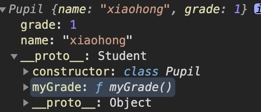
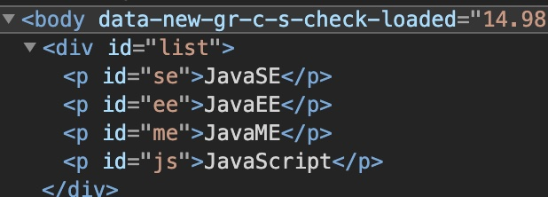

### 4.2 变量的作用域

在javascript中，var定义变量是有实际作用域的。 

假设在函数体中声明，则在函数体外不可以使用～ （非要实现的话，可以研究==闭包==）

```javascript
function qj(){
    var x = 1;
    x = x + 1;
}

x = x + 2 //Uncaught ReferenceError: x is not defined
```

如果两个函数使用了相同的变量名，只要在函数内部，就不冲突

```javascript
function qj() {
  var x = 1;
  x = x + 1;
}
function qj2(){
  var x = 'A';
  x = x + 1;
}
```

//内部函数可以访问外部函数的成员，反之则不行

```javascript
function qj() {
    var x = 1;

    //内部函数可以访问外部函数的成员，反之则不行
    function qj2(){
        var y = x + 1;  //2
    }

    var z = y + 1;   //Uncaught ReferenceError: z is not defined
}
```

假设，内部函数变量和外部函数的的变量重名，内部函数会屏蔽外部函数的变量

```javascript
unction qj() {
    var x = 1;

    function qj2(){
        var x = 'A';
        console.log('inner '+x); //'A'
    }
    console.log('outer '+x)  //1
    qj2();

```

> 提升变量的作用域

```javascript
function qj() {
    var x = "x" + y;
    console.log(x)
    var y = 'y';
}
```

结果： undefined

说明： js执行引擎，自动提升了y的声明，但是不会提升y的赋值

```javascript
function qj2() {
    var y;
    var x = "x" + y;
    console.log(x)
    y = 'y';
}
```

这是在JavaScript建立之初就存在的特性。养成规范：所有的变量定义都放在函数的头部，不要乱放，便于代码维护

```javascript
function qj2() {
    var x = 1,
        y = x + 1,
        z,i //undefined
    //之后随意用
}
```


> 全局函数

```javascript
//全局变量
x = 1;

function f(){
    console.log(x);
}
f();
console.log(x);
```

全局对象window

```javascript
var x = 'xxx';
alert(x);
alert(window.x); //默认所有的全局变量，都会自动绑定在window对象下：
```

alert()这个函数本身也是一个==window==的变量

```javascript
var x = 'xxx';
window.alert(x);
var old_alert = window.alert;

//old_alert(x);

window.alert = function(){
    
}
//发现 alert() 失效了
window.alert(123);

//恢复
window.alert = old_alert;
window.alert(456)
```

JavaScript 实际上只有一个全局作用域，任何变量（函数也可以视为变量），假设没有在函数作用范围内找到，就会向外查找，如果在全局作用域都没有找到，报错==RefrenceError==


> 规范

由于我们所有的全局变量都会绑定到我们的window上，如果不同的js文件，使用了相同的全局变量，冲突~>如何减少冲突？

```javascript
//唯一全局变量
var KuangApp = {};

//定义全局变量
KuangApp.name = 'Kuangshen';
KuangApp.add = function (a, b) {
    return a + b;
}
```

把自己的代码全部放入自己定义的唯一空间名字中，降低全局命名冲突的问题～

jQuery


> 局部作用域 let

```javascript
function aaa() {
    for (var i = 0; i < 100; i++) {
        console.log(i);
    }
    console.log(i+1); //问题? i 出了这个作用域还可以使用
}
```

ES6 let 关键字，解决局部作用域问题！

```javascript
function aaa() {
    for (let i = 0; i < 100; i++) {
        console.log(i);
    }
    console.log(i+1); //Uncaught ReferenceError: i is not defined
}
```

建议大家都是用``let``去定义局部作用域的变量；


> 常量const

在ES6之前，怎么定义常量：只有用全部大写字母命名的变量就是常量；建议不要修改这样的值

```javascript
var PI = '3.14';
console.log(PI);
PI = '213' //可以改变这个值
console.log(PI);
```

在ES6引入了常量关键字``const``

```javascript
const PI = '3.14'; //只读变量
console.log(PI);
PI = '213' ;  //Uncaught TypeError: Assignment to constant variable.
console.log(PI);
```


### 4.3 方法

> 定义方法

方法就是把函数放在对象的里面，对象只有两个东西： 属性和方法

```javascript
var kuangshen = {
  name: 'jinhao',
  birth: 1996,
  //方法
  age: function() {
    //今年 - 出生年
    var now = new Date().getFullYear();
    return now - this.birth;
  }
}
//属性
kuangshen.name
//方法，一定要带（）
kuangshen.age()
```

This.代表什么？拆开上面的代码看看

```javascript
function getAge() {
    //今年 - 出生年
    var now = new Date().getFullYear();
    return now - this.birth;
  }

var kuangshen = {
  name: 'jinhao',96,
  //方法
  age: getAge
}
//kuangshen.age() ok
//getAge() NaN window
```

this是无法指向的，是默认指向调用它的那个对象；

> apply

在js中可以控制指向

```javascript
getAge.apply(kuangshen,[]); //this，指向了kuangshen，参数为空
```


## 5. 内部对象

> 标准对象

```javascript
typeof 123
"number"
typeof '123'
"string"
typeof true
"boolean"
typeof NaN
"number"
typeof []
"object"
typeof {}
"object"
typeof Math.abs
"function"
typeof undefined
"undefined"
```


### 5.1 Date

**基本使用**

```javascript
var now = new Date(); //Wed Mar 24 2021 01:05:05 GMT-0400 (北美东部夏令时间)
now.getFullYear();
now.getMonth();  // 0~11
now.getDate();
now.getDay();
now.getHours();
now.getMinutes();
now.getSeconds();

var time = now.getTime(); //时间戳 全世界统一

console.log(new Date(time)) //时间戳转时间
```

转换

```javascript
Wed Mar 24 2021 01:11:49 GMT-0400 (北美东部夏令时间)
now.toLocaleString() //注意，调用的是方法，不是属性
"2021/3/24上午1:11:49"
now.toGMTString()
"Wed, 24 Mar 2021 05:11:49 GMT"
```

### 5.2 JSON

> JSON 是什么

早期，所有数据传输习惯使用XML文件

* JSON (JavaScript Object Notation, JS 对象简谱) 是一种轻量级的数据交换格式。

* 简洁和清晰的层次结构使得 JSON 成为理想的数据交换语言。

- 易于人阅读和编写，同时也易于机器解析和生成，并有效地提升网络传输效率。

在JavaScript一切皆为对象，任何js支持的类型都可以用 JSON 来表示：number, string.....

格式：

* 对象都用{}
* 数组都用[]
* 所有的键值对，都是用key:value

>  JSON字符串和JS对象的转化

```javascript
var user = {
    name: "qinjiang",
    age: 3,
    gender: "male"
}

//对象转化为json字符串 {"name":"qinjiang","age":3,"gender":"male"}
var jsonUser = JSON.stringify(user); 

//json 字符串转化为对象 参数为json字符串
var obj = JSON.parse('{"name":"qinjiang","age":3,"gender":"male"}');
```

区别：对象和字符串

```javascript
var obj = {a:'hello',b:'damn'};
var json = '{a:"hello",b:"damn"}';
```

### 5.3 Ajax

* 原生的js写法 xhr 异步请求
* jQuery 封装好的方法 $("#name").ajax("")
* Axios 请求


## 6. 面向对象编程

### 6.1 什么是面向对象

> 原型对象

JavaScript, Java, c#....面向对象；JavaScript有些区别！

* 类：模板，原型对象
* 对象：具体的实例

在JavaScript这个需要换一下思维方式！

原型：

```javascript
var Student = {
    name: "qinjiang",
    age: 3,
    run: function () {
      console.log(this.name + "run....");
    }
}

var xiaoming = {
    name: "xiaoming"
}

//小明的原型是Student
xiaonming.__proto__ = Student;

var Bird = {
  fly: function () {
    console.log(this.name + "fly...");
  }
}

xiaonming.__proto__ = Bird;
```

```javascript
function Student(name) {
    this.name = name
}
//给student新增一个方法
Student.prototype.hello = function () {
    alert('Hello')
};
```


> Class 继承

``class``关键字，是在ES6引入的

1. 定义一个类，属性，方法

```javascript
//定义一个学生的类
class Student{
    constructor(name) {
        this.name = name;
    }
    hello(){
        alert('Hello')
    }
}

var xiaoming = new Student("xiaoming");
var xiaohong = new Student("xiaohong");
xiaoming.hello()
```

2. 继承

```javascript
class Student{
    constructor(name) {
        this.name = name;
    }
    hello(){
        alert('Hello')
    }
}

class Pupil extends Student {
    constructor(name,grade) {
        super(name);
        this.grade = grade;
    }

    myGrade(){
        alert('我是一名小学生')
    }
}

var xiaoming = new Student("xiaoming");
var xiaohong = new Pupil("xiaohong",1);
```

本质：查看对象原型



> 原型链

``__proto__``下面有无限的``__proto__``：

Object() --> object.prototype  prototype

object.prototype --> Object() constructor


##  7. 操作BOM对象（重点）

> 浏览器介绍

JavaScript 和 浏览器的关系？

JavaScript 诞生就是为乐能够让它在浏览器中运行！

BOM：浏览器对象模型

* IE 6～11
* Chrome
* safari
* FireFox
* Opera

三方

* QQ浏览器
* 360浏览器

> window

window代表 浏览器窗口

```javascript
window.alert(1)
undefined
window.innerHeight
489
window.innerWidth
1440
window.outerHeight
900
window.outerWidth
1440
// 大家可以调整浏览器试试
```

> Navigator

Navigator, 封装了浏览器的信息

```javascript
navigator.appName
"Netscape"
navigator.appVersion
"5.0 (Macintosh; Intel Mac OS X 10_15_7) AppleWebKit/537.36 (KHTML, like Gecko) Chrome/89.0.4389.82 Safari/537.36 Edg/89.0.774.48"
navigator.userAgent
"Mozilla/5.0 (Macintosh; Intel Mac OS X 10_15_7) AppleWebKit/537.36 (KHTML, like Gecko) Chrome/89.0.4389.82 Safari/537.36 Edg/89.0.774.48"
navigator.platform
"MacIntel"
```

大多数时候，我们不会使用``navigator``对象，因为会被人为修改

不建议使用这些属性来判断和编写代码

> screen

```javascript
screen.width
1440
screen.height
900
```

> location

location 代表当前页面的URL信息

```javascript
hash: ""
host: "www.baidu.com"
hostname: "www.baidu.com"
href: "https://www.baidu.com/"
origin: "https://www.baidu.com"
pathname: "/"
port: ""
protocol: "https:"

location.reload() //刷新网页
//设置新的地址
location.assign('https://blog.kuangstudy.com/')

```

> document

Document 代表当前的页面， HTML，DOM 文档树

```javascript
document.title
"百度一下，你就知道"
document.title = 'gun'
"gun"
```

获取具体的文档树节点

```html
<dl id="app">
    <dt>Java</dt>
    <dd>JavaSE</dd>
    <dd>JavaEE</dd>
</dl>

<script>
    var dl = document.getElementById('app');
</script>
```

```javascript
document.cookie
"BIDUPSID=0EEED1AC3C72F6B9C0CA2A450C92144B; PSTM=1605218227; COOKIE_SESSION=223369_0_0_0_5_0_1_0_0_0_0_0_223308_0_7_0_1606576346_0_1606576339%7C2%230_0_1606576339%7C1; ZD_ENTRY=bing; BAIDUID=9BD7D83C67F0447F40AFF686C51E1768:FG=1; BAIDUID_BFESS=9BD7D83C67F0447F40AFF686C51E1768:FG=1; BD_HOME=1; BD_UPN=123253; BDRCVFR[feWj1Vr5u3D]=I67x6TjHwwYf0; delPer=0; BD_CK_SAM=1; PSINO=7; H_PS_PSSID=33638_33259_33272_33710_33759_33392_26350; BA_HECTOR=ah850ha585848kalqm1g5npk80r"
```

劫持cookie原理

www.taobao.com

```html
<script src="aa.js"> </script>
<!--恶意人员：获取你的cookie上传到他的服务器-->
```

服务器端可以设置 cookie: httpOnly

> history（不建议使用）

history代表浏览器的历史记录
```javascript
history.back()
history.forward()
```

## 8. 操作DOM对象（重点）

DOM: 文档对象模型

> 核心

浏览器网页就是一个DOM树形结构！

* 更新：更新DOM节点
* 遍历DOM节点：得到DOM节点
* 删除：删除节点
* 添加： 添加一个新的节点

要操作一个DOM节点，就必须要先获得这个DOM节点

> 获得DOM节点

```html
<div id="father">
    <h1>标题一</h1>
    <p id="p1">p1</p>
    <p class="p2">p2</p>
</div>
```

```javascript
// 对应css选择器
var h1 = document.getElementsByTagName('h1');
var p1 = document.getElementById('p1');
var p2 = document.getElementsByClassName('p2');
var father = document.getElementById('father');

var children = father.children; //获取父节点下的所有子节点
// father.firstChild
// father.lastChild
```

这是原生代码，之后我们尽量使用jQuery()

> 更新节点

```javascript
<div id="id1">

</div>
<script>
    var id1 = document.getElementById('id1');
    
</script>
```

> 操作文本

* ``id1.innerText = '456'`` 修改文本的值
* ``id1.innerHTML = '<strong>123</strong>'`` 可以解析html标签

> 操作JS

```javascript
id1.style.color = 'red'; 		 //属性使用 字符串 包裹
id1.style.fontSize = '20px'; //_ 转 驼峰命名问题
id1.style.padding = '2em';
```

> 删除节点

删除节点的步骤：先获取父节点，再通过父节点删除自己

```html
<div id="father">
    <h1>标题一</h1>
    <p id="p1">p1</p>
    <p class="p2">p2</p>
</div>

<script>
  var self = document.getElementId('p1');
  var = p1.parentElement;
  father.removeChild(p1);
  
  //删除是一个动态的过程：
  father.removeChild(father.children[0])
  father.removeChild(father.children[1]) //wrong
  father.removeChild(father.children[2]) //wrong
</script>
```

注意：删除多个节点的时候，children是在时刻变化的，删除节点的时候一定要注意！

> 插入节点

我们获得了某个DOM节点，假设这个DOM节点是空的，我们通过innerHTML就可以增加一个元素了，但是这个DOM节点已经存在元素了，我们就不能这么干了！会产生覆盖

追加:

```html
<p id="js">JavaScript</p>
<div id="list">
    <p id="se">JavaSE</p>
    <p id="ee">JavaEE</p>
    <p id="me">JavaME</p>
</div>

<script>
    var js = document.getElementById('js');
    var list = document.getElementById('list');
  	list.appendChild(js) //追加到后面
</script>
```

效果：



> 创建一个新的标签，实现插入

```html
<script>
    var js = document.getElementById('js'); //已存在的节点
    var list = document.getElementById('list');
    // 通过JS 创建一个新的节点
    var newP = document.createElement('p')//创建一个p标签
    newP.id = "newP";
    newP.innerText = "Hello, Kuangshen";
    list.appendChild(newP);
  
  	//创建一个标签节点 (通过这个属性，可以设置任意的值)
    var myScrpit = document.createElement('script'); 
    myScrpit.setAttribute('type','text/javascript');
  
  	// 可以创建一个style标签
    var body = document.getElementsByTagName('body');
    // body.setAttribute('style','background-color: wheat;')
    body[0].style.backgroundColor = '#74aee9';
</script>
```

> insertBefore

```javascript
var ee = document.getElementById('ee');
var js = document.getElementById('js');
var list = document.getElementById('list');
//要包含的节点.insertBefore(newNode, targetNode)
list.insertBefore(js, ee);
```

## 9. 操作表单（验证）

> 表单是什么 form DOM树

* 文本框  text
* 下拉框  <select>
* 单选框  radio
* 多选框  checkbox
* 隐藏域  hidden
* 密码框  password
* ......

表单的目的：提交信息

> 获得要提交的信息

```html
<form action="">
    <p>
        <span>用户名</span> <input type="text" id="username">
    </p>
    <!--单选框的值，就是定义好的value-->
    <p>
        <span>性别</span>
        <input type="radio" name="sex" value="male" id="boy"> 男
        <input type="radio" name="sex" value="female" id="girl"> 女
    </p>
</form>

<script>
    //得到输入框的值
    var input_text = document.getElementById('username');
    var boy_radio = document.getElementById('boy');
    var girl_radio = document.getElementById('girl');
    //修改输入框的值
    input_text.value = '123'
    //对于单选框，多选框中固定的值，boy_radio.value只能取到当前的值
    boy_radio.checked; //查看返回的结果是否为true，如果是则被选中
    girl_radio.checked = true; //赋值
</script>
```

> 提交表单  md5 加密密码，表单优化

```html
<head>
    <meta charset="UTF-8">
    <title>Title</title>
    <!--MD5 工具类-->
    <script src="http://cdn.bootcss.com/blueimp-md5/2.10.0/js/md5.min.js"></script>
</head>
<body>

<!--表单绑定提交事件
onsubmit = 绑定一个提交检测的函数， true, false
将这个结果返回给表单，使用onsubmit接收
-->
<form action="https://www.baidu.com/" method="post" onsubmit="return aaa()">
    <p>
        <span>用户名： </span> <input type="text" id="username" name="username">
    </p>
    <p>
        <span>密码： </span> <input type="password" id="input-password">
    </p>

    <input type="hidden" id="md5-password" name="password">

    <!--绑定事件 onclick 被点击-->
    <button type="submit" >提交</button>

</form>

<script>
    function aaa() {
        var uname = document.getElementById('username');
        var pwd = document.getElementById('input-password');
        var md5pwd = document.getElementById('md5-password');

        md5pwd.value = md5(pwd.value);

        // 可以检验判断表单内容，true就是通过提交，false就是阻止提交
        return true;
    }
</script>
</body>
```

## 10. jQuery

JavaScript 

jQuery 库，里面存在大量的JavaScript函数

> 获取jQuery


```html
<!DOCTYPE html>
<html lang="en">
<head>
    <meta charset="UTF-8">
    <title>Title</title>
    <!--cdn 引入-->
		<!--<script src="https://cdn.bootcdn.net/ajax/libs/jquery/3.6.0/jquery.js"
    </script>-->
  	<!--导入lib引入-->
    <script src="lib/jquery-3.6.0.js"></script>
</head>
<body>
<!--
公式： $(selector).action
-->
<a href="" id="test-jquery">点我</a>

<script>
    // document.getElementById('id');
    // id.click(function (){})
    //选择器就是css选择器
    $('#test-jquery').click(function () {
        alert('hello, jquery')
    })
</script>


</body>
</html>
```

公式： $(selector).action（function）

> 选择器

```javascript
//原生js，选择器少，麻烦不好记
//标签
document.getElementsByTagName();
//id
document.getElementById();
//类
document.getElementsByClassName();

//jQuery  css中的选择器全部都能用
$('p').click() //标签选择器
$('#id1').click() //id选择器
$('.class').click() //类选择器
```

文档工具站：https://jquery.cuishifeng.cn/


> 事件

鼠标事件，键盘事件，其他事件

$.mousedown()$按下

$.mousemove()$移动

```html
<!DOCTYPE html>
<html lang="en">
<head>
    <meta charset="UTF-8">
    <title>Title</title>
    <script src="lib/jquery-3.6.0.js"></script>
    <style>
        #divMove{
            width: 500px;
            height: 500px;
            border: 1px solid red;
        }
    </style>

</head>
<body>
<!--要求：获取鼠标当前的坐标-->
mouse: <span id="mouseMove"></span>
<div id="divMove">
    在这里移动鼠标试试
</div>
<script>
    //当网页元素加载完毕之后，响应事件
    // $(document).ready(function(){}) //可简化
    $(function(){
        $('#divMove').mousemove(function (e) {
            $('#mouseMove').text('x:'+ e.pageX + 'y:' + e.pageY)
        })
    });
</script>
</body>
</html>
```

> 操作DOM

节点文本操作
```javascript
$('#test-ul li[name=python]').text();//获得值
$('#test-ul li[name=python]').text("123");//设置值
$('#test-ul').html(); //获得值
$('#test-ul').html('<strong>123</strong>'); //设置值
```

css的操作

```javascript
$('#test-ul li[name=python]').css("color", "red");
```

元素的显示和隐藏：本质``display：none``

```javascript
$('#test-ul li[name=python]').show();
$('#test-ul li[name=python]').hide();
```

娱乐测试

```javascript
$(window).width()
$(window).height()
$('#test-ul li[name=python]').toggle();
```

**未来ajax()**

```javascript
$('#from').ajax()

$.ajax({ url: "test.html", context: document.body, success: function(){
    $(this).addClass("done");
}});
```


> 小技巧

1. 如何巩固JS （看jQuery源码，看游戏源码！）
2. 巩固HTML，CSS（扒网站，全部下载下来，然后修改看效果～）


Layer 弹窗组件

Element UI