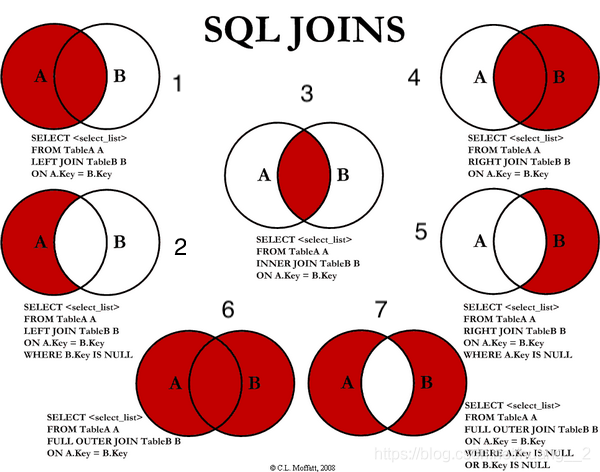
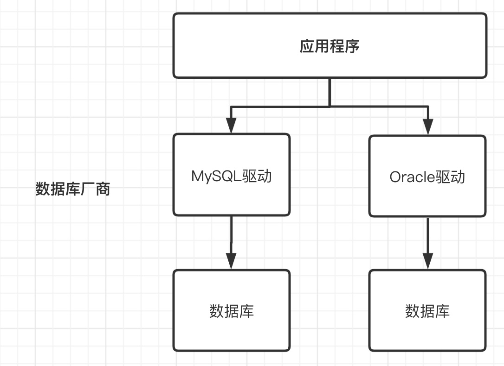
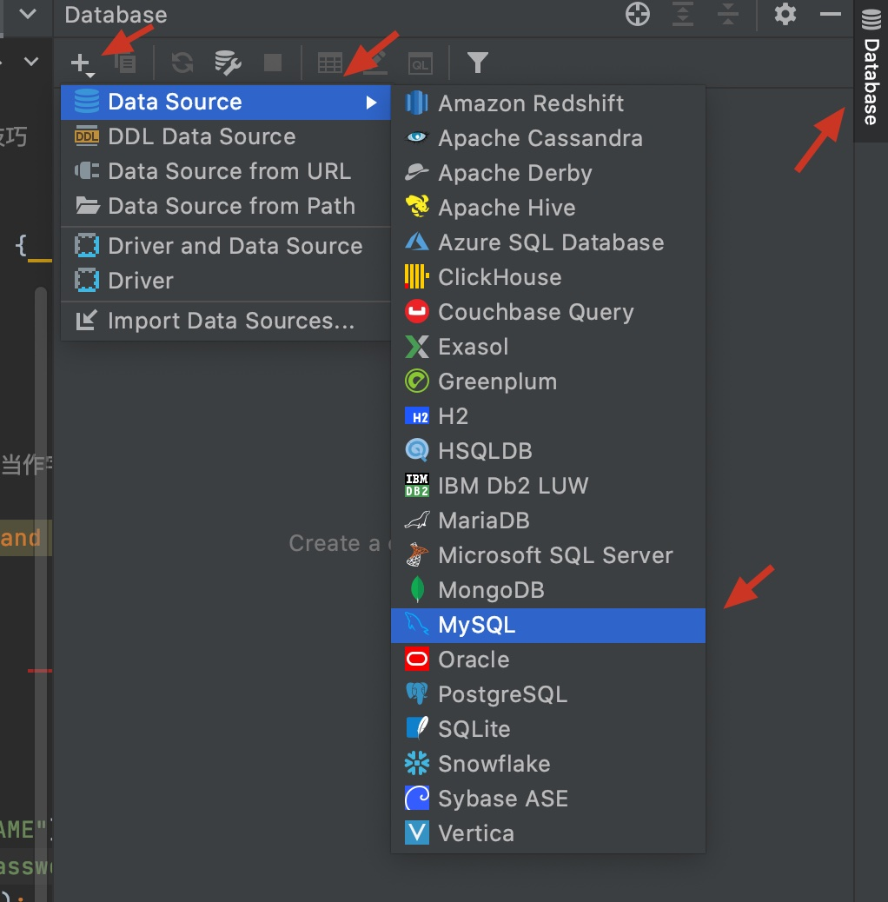
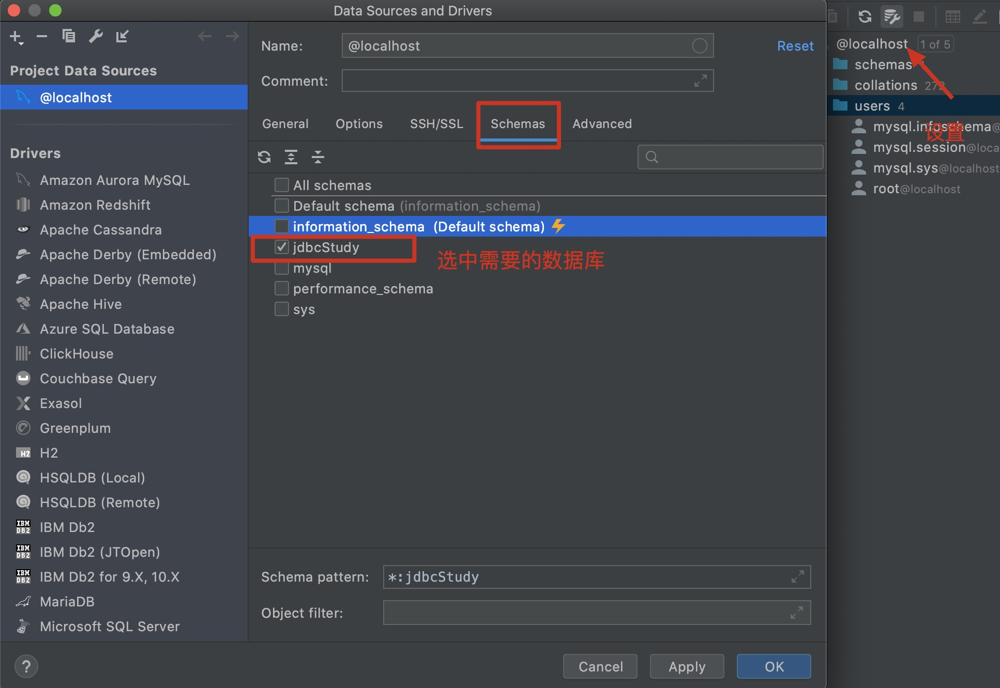
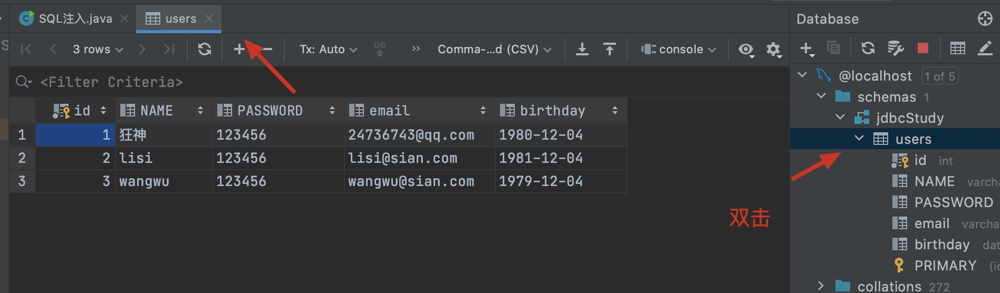
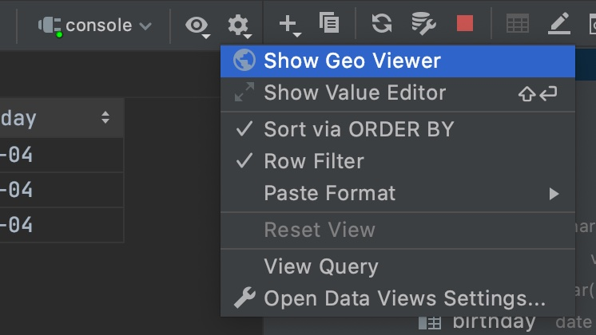
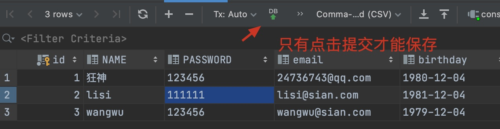
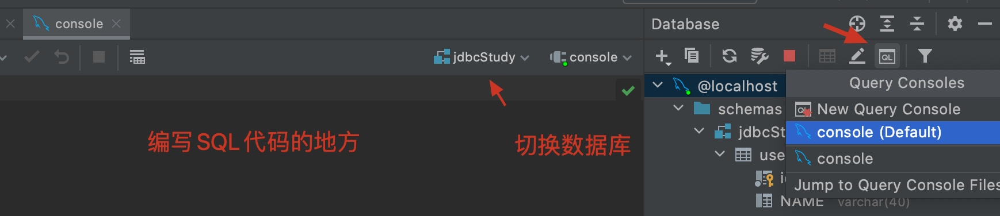
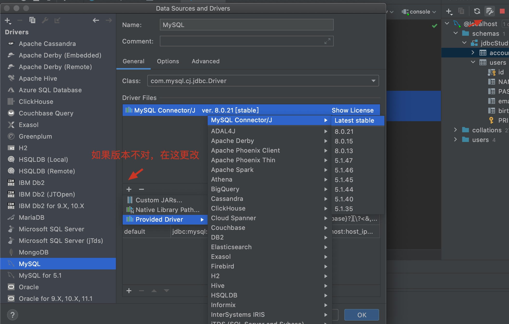

# MYSQL

## 1. 初识MySQL

JavaEE: 企业级java开发 

前端（页面：展示，数据！） 

后台 （连接点：连接数据库JDBC，连接前端（控制，控制视图跳转，和给前端传递数据））

数据库（存数据，txt, Excel, Word)

> 只会写代码，学好数据库，基本混饭吃
>
> 操作系统，数据结构和算法！ 当一个不错的程序员！
>
> 离散数学，数字电路，体系结构，编译原理。 +实战经验，高级程序员～优秀


### 1.1 为什么要学习数据库

1. 岗位需求
2. 现在的世界，大数据时代～，得数据者得天下。
3. 被迫需求：存数据 去IOE
4. **==数据库是所有软件体系中最核心的存在==** DBA

### 1.2 什么是数据库

数据库（DB，DataBase)

概念：数据仓库，**软件**，安装在操作系统上（windows,linux,mac)之上！SQL，可以存储大量的数据。500万！

作用：存储数据，管理数据

### 1.3 数据库分类

**关系型数据库：**(SQL)

* MySOL, Oracle, Sql Server, DB2, SOLlite
* 通过表和表之间，行和列之间的关系进行数据的存储，学院信息表，考勤表.....

**非关系型数据库：**（NoSQL)

* Redis, MongoDB
* 非关系型数据库，对象存储，通过对象的自身的属性来决定。

**==DBMS（数据库管理系统）==**

* 数据库的管理软件，科学有效的管理我们的数据。维护和获取数据；
* MySQL，数据库管理系统！

### 1.4 MySQL简介

MySQL是一个**关系型数据库管理系统**

前世：瑞典MySQL AB 公司

今生：属于Oracle旗下产品

MySQL是最好的 RDBMS (Relational Database Management System，关系数据库管理系统) 应用软件之一。

开源的数据库软件～

体积小、速度快、总体拥有成本低，招人成本比较低，所有人必须会～

中小型网站，或者大型网站，集群～

官网： https://www.mysql.com/

5.7 稳

8.0 最新

### 1.5 MySQL 安装

4. 新建一个数据库 school

   ==每一个操作，本质就是对应了一个sql，可以在软件的历史记录中查看==

5. 新建一张表student

```sql
字段：   id,name,age
```

6. 查看表
7. 自己尝试添加元素

### 1.6 连接数据库

命令行连接!

```sql
mysql -uroot -p123456 --连接数据库

update mysql.user set authentication_string=password('123456') where user='root' and Host = 'localhost'; --修改用户密码
flush privileges --刷新权限

------------------------------------------------------------------------
-- 所有的语句都用分号结尾：结尾
show databases; --查看所有的数据库
mysql> use school --切换数据库
Database changed

show tables; --查看数据库中所有的表
desc student; --显示数据库中所有表的信息

create database westos; --创建一个数据库

exit; --退出连接

-- 单行注释（SQL 的本来的注释）
/* 多行注释
*/
```

数据库xxx语言

DDL	定义

DML	操作

DQL	查询

DCL	控制

## 2. 操作数据库

操作数据库>操作数据库中的表>操作表中的数据

==mysql中的关键字不区分大小写

### 2.1 操作数据库（了解）

1. 创建数据库

```mysql
CREATE DATABASE [IF NOT EXISTS] westos; 
```

2. 删除数据库

```mysql
DROP DATABASE [IF EXISTS] westos;
```

3. 使用数据库

```mysql
-- 反引号，如果你的表名或者字段名是一个特殊字符，就需要带``
USE `user`
```

4. 查看数据库

```mysql
SHOW DATABASES； -- 查看所有的数据库
```

学习思路：

* 对照可视化历史记录查看sql
* 固定的语法或关键字必须强行记住！


### 2.2 数据库的数据类型

> 数值

* tinyint		    十分小的数据 	    1个字节
* smallint         较小的数据             2个字节
* mediumint    中等的数据             3个字节
* **int                   标准的整数            4个字节**
* bigint              较大的数据            8个字节
* float                浮点数                    4个字节
* double           双精度浮点数         8个字节 （精度问题！）
* decimal          字符串形式浮点数     金融计算的时候，一般是使用decimal

> 字符串

* char               字符串固定大小的    0～255
* **varchar        可变字符串            0～65535**         常用 对应string
* tinytext          微型文本               2^8 -1
* **text                 文本串                   2^16-1**             保存大文本

> 时间日期

Java.util.Date

* Date  		  YYYY-MM-DD, 日期格式
* time            HH:mm:ss        时间格式
* **datetime    YYYY-MM-DD HH:mm:ss   最常用的时间格式**
* **timestamp            时间戳         1970.1.1 到现在的毫秒数**
* year              年份表示

> Null

* 没有值，未知
* ==注意，不要使用NULL进行计算

### 2.3 数据库的字段属性（重点）

*Unsigned:*

* 无符号整数
* 不能声明负数

*zerofill:*

* 0填充的
* 不足的位数，使用0来填充， int(3) ,  5-> 005

*自增：*

* 通常理解为自增，自动在上一条记录的基础上+1（默认）
* 通常来设计唯一的主键～ index，必须是整数类型
* 可以自定义设计主键自增的起始值和步长

*非空：NULL， not null*

* 假设设置为 not null, 如果不给他赋值，就会报错
* Null，如果不填写值，默认为null

*默认：*

* 设置默认的值；
* Sex,默认为男，如果不指定该列的值，则会有默认的值！


==**拓展：**==

```mysql
/*每一个表，都必须存在以下五个字段！未来做项目用的，表示一个记录存在意义！*/

id            主键
`version`     乐观锁
is_delete     伪删除
gmt_create    创建时间
gmt_update    修改时间
```

### 2.4 创建数据库表（重点）

```mysql
-- 目标，：创建一个school数据库
-- 创建学生表（列，字段） 使用SQL创建
-- 学号int 登录密码varchar(20) 姓名，性别varchar(2),出生日期(datetime)，家庭住址，email

-- 注意点，使用英文括号，表的名称 和 字段 尽量用 ``括起来
-- AUTO_INCREMENT 自增
-- 字符串使用单引号括起来
-- 所有的语句后面加逗号，最后一个不用加
-- PRIMARY KEY 主键，一般一个表只有一个主键！
CREATE TABLE IF NOT EXISTS `student`(
	`id` INT(4) NOT NULL AUTO_INCREMENT COMMENT '学号',
	`name` VARCHAR(30) NOT  NULL DEFAULT '匿名' COMMENT '姓名',
	`pwd` VARCHAR(20) NOT NULL DEFAULT '123456' COMMENT '密码',
	`gender` VARCHAR(2) NOT NULL DEFAULT '女' COMMENT '性别',
	`birthday` DATETIME DEFAULT NULL COMMENT '出生日期',
	`address` VARCHAR(100) DEFAULT NULL COMMENT '家庭住址',
	`email` VARCHAR(50) DEFAULT	NULL COMMENT '邮箱',
	PRIMARY KEY (`id`)
) ENGINE INNODB DEFAULT CHARSET=utf8
```

格式

```mysql
CREATE TABLE [IF NOT EXISTS] `表名`(
	`字段名` 列类型 [属性] [索引] [注释],
  `字段名` 列类型 [属性] [索引] [注释],
  ...
  `字段名` 列类型 [属性] [索引] [注释]
)[表类型][字符集设置][注释]
```

常用命令

```mysql
SHOW CREATE DATABASE `school`;  -- 查看创建数据库的语句
SHOW CREATE TABLE `student`;  -- 查看student数据表的定义语句
DESC student; -- 显示表的结构
```

### 2.5 数据表的类型

```mysql
-- 关于数据库引擎
/*
INNODB 默认使用～
MYISAM 早些年使用的
*/
```

|              | MYISAM | INNODB        |
| ------------ | ------ | ------------- |
| 事务支持     | 不支持 | 支持          |
| 数据行锁定   | 不支持 | 支持          |
| 外键         | 不支持 | 支持          |
| 全文索引     | 支持   | 不支持        |
| 表空间的大小 | 较小   | 较大，约为2倍 |

常规使用操作：

* MYISAM    节约空间，速度较快
* INNODB    安全性高，事务的处理，多表多用户操作

> 在物理空间存在的位置

所有的数据库文件都存在data目录下，一个文件夹就对应一个数据库

本质还是文件的存储！

MySQL引擎在物理文件上的差别

* InnoDB 在数据库表中只有一个*.frm文件，以及上级目录下的ibdata1文件
* MYISAM 对应文件
  * *.frm - 表结构的定义文件
  * *.MYD 数据文件(data)
  * *.MYI  索引文件(index)

> 设置数据库表的字符集编码

```mysql
CHARSET=utf8mp4
```

不设置的话，会是mysql默认的字符集编码～ （不支持中文！)

MySQL的默认编码是Latin1，不支持中文

在my.ini中配置默认的编码

```mysql
character-set-server=utf8
```

### 2.6 修改删除表

> 修改

```mysql
-- -- 修改表名:  ALTER TABLE 旧表名 RENAME AS 新表名 
ALTER TABLE teacher1 RENAME AS teacher;
-- 增加表的字段 ALTER TABLE 表名 ADD 字段名 列属性 
ALTER TABLE teacher ADD age INT(11);
-- 修改表的字段（重命名，修改约束！）
-- ALTER TABLE 表名 MODIFY 字段名 列属性[]
ALTER TABLE teacher1 MODIFY age VARCHAR(11);  -- 修改约束 
-- ALTER TABLE 表名 CHANGE 旧名字 新名字 列属性[]
ALTER TABLE teacher1 CHANGE age age1 INT(1);  -- 字段重命名 

-- 删除表的字段：ALTER TABLE 表明 DROP 字段名;
ALTER TABLE teacher DROP age1;
```

> 删除

```mysql
-- 删除表（如果表存在再删除）
DROP TABLE IF EXISTS teacher；
```

==所有的创建和删除操作尽量加上判断，以免报错==

注意点：

* `` 字段名，使用这个包裹！
* 注释 -- /**/
* sql关键字大小写不敏感
* 所有的符号全部用英文

## 3. MySQL数据管理

### 3.1 外键（了解）

>  方式一、在创建表的时候，增加约束（麻烦且复杂）

```mysql
CREATE TABLE IF NOT EXISTS `grade`(
	`gradeid` INT(10) NOT NULL AUTO_INCREMENT COMMENT '年级id',
	`gradename` VARCHAR(50) NOT NULL COMMENT '年级名称',
	PRIMARY KEY (`gradeid`)
) ENGINE=INNODB DEFAULT CHARSET=utf8;

-- 学生表的gradeid字段 要去引用年级表的gradeid
-- 定外键key
-- 给这个外键添加约束（执行引用）references 引用
CREATE TABLE IF NOT EXISTS `student`(
	`id` INT(4) NOT NULL AUTO_INCREMENT COMMENT '学号',
	`name` VARCHAR(30) NOT  NULL DEFAULT '匿名' COMMENT '姓名',
	`pwd` VARCHAR(20) NOT NULL DEFAULT '123456' COMMENT '密码',
	`gender` VARCHAR(2) NOT NULL DEFAULT '女' COMMENT '性别',
	`birthday` DATETIME DEFAULT NULL COMMENT '出生日期',
	`gradeid` INT(10) NOT NULL COMMENT '学生的年级',
	`address` VARCHAR(100) DEFAULT NULL COMMENT '家庭住址',
	`email` VARCHAR(50) DEFAULT	NULL COMMENT '邮箱',
	PRIMARY KEY (`id`),
	KEY `FK_gradid` (`gradeid`),
	CONSTRAINT `FK_gradid` FOREIGN KEY (`gradeid`) REFERENCES `grade` (`gradeid`)
)ENGINE=INNODB DEFAULT CHARSET=utf8;
```

删除有外键关系的表的时候，必须先删除引用别人的表（从表），再删除被引用的表（主表）

> 方式二：创建表成功后，再添加外键约束

```mysql

CREATE TABLE IF NOT EXISTS `grade`(
	`gradeid` INT(10) NOT NULL AUTO_INCREMENT COMMENT '年级id',
	`gradename` VARCHAR(50) NOT NULL COMMENT '年级名称',
	PRIMARY KEY (`gradeid`)
) ENGINE=INNODB DEFAULT CHARSET=utf8;

-- 学生表的gradeid字段 要去引用年级表的gradeid
-- 定外键key
-- 给这个外键添加约束（执行引用）references 引用
CREATE TABLE IF NOT EXISTS `student`(
	`id` INT(4) NOT NULL AUTO_INCREMENT COMMENT '学号',
	`name` VARCHAR(30) NOT  NULL DEFAULT '匿名' COMMENT '姓名',
	`pwd` VARCHAR(20) NOT NULL DEFAULT '123456' COMMENT '密码',
	`gender` VARCHAR(2) NOT NULL DEFAULT '女' COMMENT '性别',
	`birthday` DATETIME DEFAULT NULL COMMENT '出生日期',
	`gradeid` INT(10) NOT NULL COMMENT '学生的年级',
	`address` VARCHAR(100) DEFAULT NULL COMMENT '家庭住址',
	`email` VARCHAR(50) DEFAULT	NULL COMMENT '邮箱',
	PRIMARY KEY (`id`)
)ENGINE=INNODB DEFAULT CHARSET=utf8;

-- 创建表的时候没有外键关系
ALTER TABLE `student`
ADD CONSTRAINT `FK_gradeid` FOREIGN KEY (`gradeid`) REFERENCES `grade` (`gradeid`);
-- ALTER TABLE 表 ADD CONSTRAINT 约束名 FOREIGN KEY（作为外键的列）REFERENCES 那个表（那个字段）
```

以上的操作都是物理外键，数据库级别的外键，我们不建议使用！（避免数据库过多造成困扰，这里了解即可）

==最佳实践==

* 数据库就是单纯的表，只用来存数据，只用行（数据）和列（字段）
* 我们想使用多张表的数据，想使用外键（程序去实现）

### 3.2 DML语言（全部记住，背下来）

**数据库的意义：**数据存储，数据管理

* insert
* update 
* delete

### 3.3 添加

> Insert

```mysql
-- 插入语句（添加）
-- INSERT INTO 表名（[字段名1，字段名2，字段名3]) values('值1'','值2'','值3'',...)
INSERT INTO `grade` (`gradename`) VALUES('大四')；

-- 由于主键自增我们可以省略（如果不写表的字段，它就会一一匹配）
INSERT INTO `grade` VALUES('大三');

-- 一般写插入语句，我们一定要数据和字段一一对应！

-- 插入多个字段 
INSERT INTO `grade` (`gradename`) 
VALUES('大一'),('大二');

INSERT INTO `student` (`name`) VALUE ('张三');
INSERT INTO `student` (`name`,`pwd`,`gender`) VALUE ('张三','aaaa','男');
INSERT INTO `student` (`name`,`pwd`,`gender`) 
VALUE ('张三','aaaa','男')，('王五','bbbb','男');
```

语法：``INSERT INTO 表名（[字段名1，字段名2，字段名3]) values('值1'','值2'','值3'',...)``

注意事项：

1. 字段和字段之间用英文逗号隔开；
2. 字段是可以省略的，但是后面的值必须一一对应，不能少
3. 可以同时插入多条数据，VALUES后面的值，需要使用逗号隔开 ``VALUES(),(),...``

### 3.4 修改

> update 修改谁（条件） set 原来的值 = 新值

```mysql
-- 修改学员名字，带了简介
UPDATE `student` SET `name` = '狂神' WHERE id = 1;

-- 不指定条件的情况下，会改动所有的表！
UPDATE `student` SET `name` = '长江七号'；

-- 修改多个属性，逗号隔开
UPDATE `student` SET `name` = '狂神',`email` = '24736743@qq.com' WHERE id = 1；

-- 语法：
-- UPDATE 表名 SET column_name = value, [column_name = value,...] WHERE 条件；
```

条件： where 子句 运算符 id等于某个值，大于某个值，在某个区间修改

|      操作符      | 含义         | 范围        | 结果  |
| :--------------: | ------------ | ----------- | ----- |
|        =         | 等于         | 5=6         | False |
|        <>        | 不等于       | 5<>6        | True  |
|        >         |              |             |       |
|        <         |              |             |       |
|        <=        |              |             |       |
|        >=        |              |             |       |
| BETWEEN...AND... | 在某个范围内 |             |       |
|       AND        | 我和你&&     | 5>1 and 1>2 | False |
|        OR        | 我或你｜｜   | 5>1 or 1>2  | True  |

```mysql
-- 通过多个条件定位数据
UPDATE `student` SET `name`='长江七号' WHERE `name`='狂神' AND sex='女'
```

语法：``UPDATE 表名 SET column_name = value, [column_name = value,...] WHERE 条件``

注意：

* Column_name 是数据库的列，尽量带上``；
* 条件，筛选的条件，如果没有指定，则会修改所有的列；
* Value，是一个具体的值，也可以是一个变量；
* 多个设置的属性之间，使用英文逗号隔开

```mysql
UPDATE `student` SET `birthday`= CURRENT_TIME `name` = '长江七号' AND sex = '女';
```

### 3.5 删除

> delete 命令

语法：``delete from 表名 [where 条件]``

```mysql
-- 删除数据（避免这样写，会全部删除）
DELETE FROM `student`;

-- 删除指定数据
DELETE FROM `student` WHERE id = 1;
```

> TRUNCATE命令

作用：完全情况一个数据库表，表的结构和索引约束不会变！

```mysql
-- 清空 student 表
TRUNCATE `student`;
```

> delete 和 TRUNCATE 的区别

* 相同点：都能删除数据，都不会删除表结构
* 不同点：
  * TRUNCATE 重新设置 自增列 计数器会归零
  * TRUNCATE 不会影响事务

```mysql
-- 测试delete 和 TRUNCATE 区别
CREATE TABLE `test` (
	`id` INT(4) NOT NULL AUTO_INCREMENT,
  `coll` VARCHAR(20) NOT NULL,
  PRIMARY KEY (`id`)
)ENGINE=INNODB DEFAUL CHARSET=utf8;

INSERT INTO `test` (`coll`) VALUE('1'),('2'),('3');

DELETE FROM `test`; -- 不会影响自增

TRUNCATE TABLE `test`; -- 自增会归零 
```

了解即可：``DELETE删除的问题``，重启数据库，现象

* InnoDB 自增列会重1开始 （存在内存当中的，断电即失）
* MyISAM 继续从上一个自增量开始 （存在文件中的，不会丢失）

## 4. DQL查询数据（最重点）

### 4.1 DQL

(Data Query Language: 数据查询语言)

* 所有查询操作都用它 select;
* 简单的查询，复杂的查询它都能做；
* ==数据库中最核心的语言，最重要的语句；==
* 使用频率最高的语句

>  Select 完整语法：

```mysql
SELECT
	[ALL | DISTINCT | DISTINCTROW]
		[HIGH_PRIORITY]
		[STRAIGHT_JOIN]
		[SQL_SMALL_RESULT] [SQL_BIG_RESULT] [SQL_BUFFER_RESULT]
		[SQL_CACHE | SQL_NO_CACHE] [SQL_CALC_FOUND_ROWS]
	select_expr [,select_expr ...]
	[FROM table_references
  	[PARTITION partition_list]
  [WHERE where_condition]
  [GROUP BY {col_name | expr | position}
  	[ASC | DESC], ... [WITH ROLLUP]]
  [HAVING where_condition]
  [ORDER BY {col_name | expr | position}
  	[[ASC | DESC], ...]
  [LIMIT {[offset,] row_count | row_count OFFSET offset}]
  [PROCEDURE procedure_name(argument_list)]
  [INTO OUTLINE 'file_name'
  	[CHARACTER SET charset_name]
  	export_options
  |	INTO DUMPFILE 'file_name'
  | INTO var_name [,var_name]]
  [FOR UPDATE | LOCK IN SHARE MODE]]
```

> **Select常用语法**

```mysql
SELECT [ALL | DISTINCT]
{* | table.* | [table.field1[as alias1][table.field2[as alias2]][,...]]}
FROM table_name [as table_alias]
  	[left | right | inner join table_name2] 	-- 联合查询
  	[WHERE ...]	 -- 指定结果需满足的条件
  [GROUP BY ...] -- 指定结果按照哪几个字段来分组
  [HAVING ...] -- 过滤分组的记录必须满足的次要条件
  [ORDER BY ...] -- 指定查询记录按一个或多个条件排序
  [LIMIT {[offset,] row_count | row_count OFFSET offset}];
  -- 指定查询的记录从哪条到哪条
```


### 4.2 指定查询字段

```mysql
-- 查询全部的学生 SELECT 字段 FROM 表
SELECT * FROM student;

-- 查询指定字段
SELECT `StudentNo`, `StudentName` FROM student;

-- 别名，给结果起一个名字 AS 可以给字段起别名，也可以给表起别名
SELECT `StudentNo` AS 学号, `StudentName` AS 学生姓名 FROM student AS s;

-- 函数 Concat(a,b)
SELECT CONCAT('姓名：', StudentName) AS 新名字 FROM student;
```

语法：``SELECT 字段... FROM 表``

> 有的时候，列名字不是那么的见名知意。 我们起别名 AS     字段名 as 别名    表名 as 别名


> 去重 distinct

作用：去除SELECT查询出来的结果中重复的数据，重复的数据只显示一条

```mysql
-- 查询一下那些同学参加了考试，成绩
SELECT * FROM result -- 查询全部考试成绩
SELECT `StudentNo` FROM result -- 查询有哪些同学参加了考试
SELECT DISTINCT `StudentNo` FROM result -- 发现重复数据，去重
```

> 数据库的列（表达式）

```mysql
SELECT VERSION() -- 查询系统版本（函数）
SELECT 100*3-1 AS 计算结果 -- 用来计算（表达式）
SELECT @@auto_increment_increment -- 查询自增的步长（变量）

-- 学员考试成绩+1分查看
SELECT `StudentNo`,`StudentResult`+1 AS '提分后' FROM result
```

==数据库中的表达式：文本值，列，NULL，函数，计算表达式，系统变量...==

select ``表达式`` from 表

### 4.3 where条件子句

作用：检索数据中``符合条件``的值

搜索条件由一个或多个表达式组成！ 结果为布尔值

> 逻辑运算符

| 运算符    | 语法             | 描述   |
| --------- | ---------------- | ------ |
| and  &&   | a and b, a && b  | 逻辑与 |
| or   \|\| | a or b, a \|\| b | 逻辑或 |
| not   !   | not a,  !a       | 逻辑非 |

==尽量使用英文字母==

```mysql
-- ======================= where ===========================
SELECT studentNo, `StudentResult` FROM result;

-- 查询考试再 95～100 分之间
SELECT studentNo, `StudentResult` FROM result
WHERE StudentResult>=95 AND StundentResult<=100;

-- and &&
SELECT studentNo, `StudentResult` FROM result
WHERE StudentResult>=95 && StundentResult<=100;

-- 模糊查询（区间）
SELECT studentNo, `StudentResult` FROM result
WHERE StudentResult BETWEEN 95 AND 100;

-- 除了1000号学生之外的同学的成绩
SELECT studentNo, `StudentResult` FROM result
WHERE studentNo != 1000;

-- != not
SELECT studentNo, `StudentResult` FROM result
WHERE NOT studentNo = 1000;
```

> 模糊查询：比较运算符

| 运算符      | 语法                | 描述                                             |
| ----------- | ------------------- | ------------------------------------------------ |
| IS NULL     | a is null           | 如果操作符为NULL,结果为真                        |
| IN NOT NULL | a in not null       | 如果操作符不为NULL,结果为真                      |
| BETWEEN     | a between b and c   | 若a再b和c之间，则结果为真                        |
| **Like**    | a like b            | SQL匹配，如果a匹配b，则结果为真                  |
| **IN**      | a in (a1,a2,a3,...) | 假设a在a1，或者a2...，其中的某一个值中，结果为真 |

```mysql
-- =============================== 模糊查询 ===============================
-- 查询姓刘的同学
-- like结合 %（代表0到任意字符） _（一个字符）
SELECT `StudentNo`, `StudentName` FROM `student`
WHERE StudentName LIKE '刘%';

-- 查询姓刘的同学，名字后面只有一个字的
SELECT `StudentNo`, `StudentName` FROM `student`
WHERE StudentName LIKE '刘_';

-- 查询姓刘的同学，名字后面只有两个字的
SELECT `StudentNo`, `StudentName` FROM `student`
WHERE StudentName LIKE '刘__';

-- 查询名字中有嘉的同学 %嘉%
SELECT `StudentNo`, `StudentName` FROM `student`
WHERE StudentName LIKE '%嘉%';


-- ================= in（具体的一个或者多个值）===========================
-- 查询 1001，1002，1003号学员
SELECT `StudentNo`, `StudentName` FROM `student`
WHERE StudentNo IN (1001,1002,1003);

-- 查询在北京的学生
SELECT `StudentNo`, `StudentName` FROM `student`
WHERE `Address` IN ('安徽','河南洛阳');

-- ======================== null not null========================

-- 查询地址为空的学生null ''
SELECT `StudentNo`, `StudentName` FROM `student`
WHERE adress='' OR address IS NULL;

-- 查询有出生日期的同学，不为空
SELECT `StudentNo`, `StudentName` FROM `student`
WHERE `BornDate` IS NOT NULL;

-- 查询没有出生日期的同学，为空
SELECT `StudentNo`, `StudentName` FROM `student`
WHERE `BornDate` IS NULL;
```

### 4.4 <span id=joins>联表查询</span>

>  JOIN对比



由于mysql没有full outer join操作，所以mysql中6为 1 union 4； 7为 2 union 5

1. LEFT JOIN
2. LEFT EXCLUDING JOIN
3. INNER JOIN
4. RIGHT JOIN
5. RIGHT EXCLUDING JOIN
6. OUTER JOIN
7. OUTER EXCLUDING JOIN

``` mysql
-- ================ 联表查询 JOIN ==================
-- 查询参加了考试的同学（学号，姓名，科目编号，分数）
SELECT * FROM student;
SELECT * FROM result;

/* 思路 
1. 分析要求，分析查询的字段来自哪些表，（连接查询）
2. 确定使用哪种连接查询？ 7种
确定交叉点（这两个表中哪个数据是相同的）
判断的条件：学生表中的 student = 成绩表中的 studentNo 
*/
-- INNER JOIN
SELECT s.studentNo,studentName,SubjectNo,StudentResult 
FROM student AS s 
INNER JOIN result AS r
ON s.studentNo = r.studentNo;

-- RIGHT JOIN
-- as 可省略
SELECT s.studentNo,studentName,SubjectNo,StudentResult 
FROM student s 
RIGHT JOIN result r
ON s.studentNo = r.studentNo;

-- LEFT JOIN
SELECT s.studentNo,studentName,SubjectNo,StudentResult 
FROM student s 
LEFT JOIN result r
ON s.studentNo = r.studentNo;

-- ON（连接查询）是建立两者关系，然后可以选择再通过 WHERE 筛选（等值查询） 

-- 查询缺考的同学
SELECT s.studentNo,studentName,SubjectNo,StudentResult 
FROM student s 
LEFT JOIN result r
ON s.studentNo = r.studentNo
WHERE StudentResult IS NULL;
```

| 操作       | 描述                                             |
| ---------- | ------------------------------------------------ |
| inner join | 如果表中至少有一个匹配，就返回行（只返回匹配的） |
| left join  | 会从左表中返回所有的值，即使右表中没有匹配       |
| right join | 会从右表中返回所有的值，即使左表中没有匹配       |

```mysql
-- 思考题（查询了参加考试的同学信息：学号，学生姓名，科目名，分数）
/* 思路
1. 分析需求，分析查询的字段来自哪些表，student,result,subject（连接查询）
2. 确定使用了哪种连接查询？ 7种
确定交叉点（这两个表中哪个数据是相同的）
判断的条件：学生表中的 studentNo = 成绩表中的 studentNo
*/

SELECT s.studentNo,studentName,SubjectNo,StudentResult 
FROM student s 
RIGHT JOIN result r
ON s.studentNo = r.studentNo
INNER JOIN `subject` sub
on r.SubjectNo = sub.SubjectNo;

-- 我要查询哪些数据select...
-- 从哪几个表中查 FROM 表 xxx JOIN 连接的表 on 交叉条件
-- 假设存在一种多张表查询，慢慢来，先查询两张表再慢慢增加
```

> 自连接

自己的表和字节的表连接，核心：**一张表拆为两张一样的表即可**

| Category（子类） | Pid（父类） | categoryName |
| ---------------- | ----------- | ------------ |
| 3                | 1           | 软件开发     |
| 5                | 1           | 美术设计     |
| 4                | 3           | 数据库       |
| 8                | 2           | 办公信息     |
| 2                | 1           | 信息技术     |
| 6                | 3           | web开发      |
| 7                | 5           | ps技术       |

操作：查询父类对应的子类关系

| 父栏目   | 子栏目   |
| -------- | -------- |
| 信息技术 | 办公信息 |
| 软件开发 | 数据库   |
| 软件开发 | web开发  |
| 美术设计 | ps技术   |

```mysql
-- 查询父子信息：把一张表看为两个一模一样的表
SELECT a.`categoryName` AS '父栏目', b.`categoryName` AS '子栏目'
FROM `category` AS a, `category` AS b
WHERE a.`categoryid` = b.`pid`
```


### 4.5 分页和排序

> 排序

```mysql
-- 排序： 升序 ASC; 降序 DESC
-- ORDER BY 通过那个字段排序，怎么排
-- 查询的结果根据 成绩降序 排序
SELECT s.studentNo,studentName,SubjectNo,StudentResult 
FROM student s
INNER JOIN `result` r
ON s.StudentNo = r.StudentNo
INNER JOIN `subject` sub
ON r.`SubjectNo` = sub.`SubjectNo`
WHERE subjectName = '数据库结构-1'
ORDER BY StudentResult ASC
```

> 分页

```mysql
-- 为什么要分页
-- 缓解数据库压力，给人的体验更好       还有一种瀑布流

-- 分页，每页只显示五条数据
-- 语法： limit起始值，页面的大小
-- 网页应用：当前，总的页数，页面的大小
-- LIMIT 0,5 1~5
-- LIMIT 1,5 2~6
SELECT s.studentNo,studentName,SubjectNo,StudentResult 
FROM student s
INNER JOIN `result` r
ON s.StudentNo = r.StudentNo
INNER JOIN `subject` sub
ON r.`SubjectNo` = sub.`SubjectNo`
WHERE subjectName = '数据库结构-1'
ORDER BY StudentResult ASC
LIMIT 5,5

-- 第N页 limit (n-1)*pageSize, paSize
-- [pageSize: 页面大小]
-- [(n-1)*pageSize: 起始值]
-- [n: 当前页]
-- [数据总数/页面大小 = 总页数]
```

语法：==limit（查询起始下标，pageSize）==

### 4.6 <span id=subquery>子查询</span>

where （这个值是计算出来的）

本质：``在where语句中嵌套一个子查询语句``

```mysql
-- ====================== where ======================
-- 1. 查询 数据库结构-1的所有考试结果（学号，科目编号，成绩），降序排列
-- 方式一：使用连接查询
SELECT `StudentNo`, r.`SubjectNo,`StudentResult`
FROM `result` r
INNER JOIN `subject` sub
ON r.SubjectNo = sub.SubjectNo
WHERE SubjectName = '数据库结构-1'
ORDER BY StudentResult DESC;

-- 方式二：使用子查询（由里及外）
-- 查询所有数据库结构-1 的学生学号
SELECT `StudentNo`, `SubjectNo,`StudentResult`
FROM `result` 
WHERE SubjectNo = (
			SELECT SubjectNo FROM `subject`
  		WHERE SubjectName = '数据库结构-1'
)
ORDER BY StudentResult DESC;

-- 查询课程为 高等数学-2 且分数不小于80的同学的学号和姓名
SELECT s.StudentNo,StudentName
FROM student s
INNER JOIN result r
ON s.StudentNo = r.StudentNo
INNER JOIN subject sub
ON r.SubjectNo = sub.SubjectNo
WHERE SubjectName = '高等数学-2' AND StudentResult>=80;

-- 分数不小于80分的学生的学号和姓名
SELECT DISTINCT s.StudentNo,StudentName
FROM student s
INNER JOIN result r
ON s.StudentNo = r.StudentNo
WHERE StudentResult>=80;

-- 在这个基础上增加一个科目，高等数学-2
-- 查询 高等数学-2 的编号
SELECT DISTINCT s.StudentNo,StudentName
FROM student s
INNER JOIN result r
ON s.StudentNo = r.StudentNo
WHERE StudentResult>=80 AND SubjectNo = (
	SELECT SubjectNo FROM subject
  WHERE SubjectName = '高等数学-2'
);

-- 再改造（由里及外）
SELECT DISTINCT StudentNo,StudentName FROM student WHERE StudentNo IN(
	SELECT StudentNo FROM result WHERE StudentResult>=80 AND SubjectNo = (
	SELECT SubjectNo FROM subject WHERE SubjectName = '高等数学-2'
	)
);
```

### 4.7 分组和过滤

```mysql
-- 查询不同课程的平均分，最高分，最低分
-- 核心：（根据不同的课程分组）
SELECT ANY_VALUE(SubjectName), AVG(StudentResult) AS 平均分, MAX(StudentResult) AS 最高分, MIN(StudentResult) AS 最低分
FROM result r
INNER JOIN `subject` sub
ON r.`SubjectNo` = sub.`SubjectNo`
GROUP BY r.SubjectNo -- 通过什么字段来分组
HAVING 平均分>80;
```


## 5. MySQL 函数

### 5.1 常用函数

```mysql
-- ==================== 常用函数 ===========================
-- 数学运算
SELECT ABS(-8)      -- 绝对值
SELECT CEILING(9.4) -- 向上取整
SELECT FLOOR(9.4)   -- 向下取整
SELECT RAND()       -- 返回一个0～1之间的随机数
SELECT SIGN(10)     -- 判断一个数的符号，负数返回-1，0返回0，正数返回1

-- 字符串函数
SELECT CHAR_LENGTH('即使再小的帆也能远航') -- 字符串长度
SELECT CONCAT('我','爱','你们') -- 拼接字符串
SELECT INSERT('我爱编程helloworld',1,2,'超级热爱') -- 查询，从某个位置开始替换某个长度
SELECT LOWER('KuangShen') -- 小写字母
SELECT UPPER('KuangShen') -- 大写字母
SELECT INSTR('KuangShen','h') -- 返回第一次出现的子串的索引
SELECT REPLACE('狂神说坚持就能成功','坚持','努力') -- 替换出现的指定字符串
SELECT SUBSTR('狂神说坚持就能成功',4,6) -- 返回指定的子字符串（源字符串，截取的位置，截取的长度）
SELECT REVERSE('呢马你说你')  -- 反转

-- 查询姓周的同学，名字邹
SELECT REPLACE(student,'周','邹') FROM student
WHERE srudentname LIKE '周%'

-- 时间和日期函数（记住）
SELECT CURRENT_DATE() -- 获取当前日期
SELECT CURDARE() -- 获取当前日期
SELECT NOW() -- 获取当前时间
SELECT LOCALTIME() -- 本地时间
SELECT SYSDATE() -- 系统时间

SELECT YEAR(NOW())
SELECT MONTH(NOW())
SELECT DAY(NOW())
SELECT HOUR(NOW())
SELECT MINUTE(NOW())
SELECT SECOND(NOW())

-- 系统
SELECT SYSTEM_USER()
SELECT USER()
SELECT VERSION()
```

### 5.2 聚合函数（常用）

| 函数名称 | 描述   |
| -------- | ------ |
| COUNT()  | 计数   |
| SUM()    | 求和   |
| AVG()    | 平均值 |
| MAX()    | 最大值 |
| MIN()    | 最小值 |
| ...      | ...    |

```mysql
-- ================= 聚合函数 ==========================
-- 都能够统计 表中的数据 （想查询一个表中有多少个记录，就使用这个count()）
SELECT COUNT(`BornDate`) FROM student; -- 
SELECT COUNT(*) FROM student;
SELECT COUNT(1) FROM result;

SELECT SUM(`StudentResult`) AS 总和 FROM result
SELECT AVG(`StudentResult`) AS 平均分 FROM result
SELECT MAX(`StudentResult`) AS 最高分 FROM result
SELECT MIN(`StudentResult`) AS 最低分 FROM result

```

### 5.3 数据库级别的MD5加密（扩展）

什么是MD5？

主要增强算法复杂度和不可逆性

MD5 不可逆，具体的值的MD5是一样的

MD5破解网站的原理，背后有一个字典，MD5加密后的值，加密前的值

```mysql
-- =================== 加密 ==========================
CREATE TABLE `testmd5`(
		`id` INT(4) NOT NULL,
  	`name` VARCHAR(20) NOT NULL,
  	`pwd` VARCHAR(50) NOT NULL,
  	PRIMARY KEY(`id)
)ENGINE=INNODB DEFAULT CHARSET=utf8

-- 明文密码
INSERT INTO testmd5 VALUES(1,'zhangsan','123456'),(2,'lisi','123456'),(3,'wangwu','123456')

-- 加密
UPDATE testmd5 SET pwd=MD5(pwd) WHERE id = 1
UPDATE testmd5 SET pwd=MD5(pwd) -- 加密全部的密码

-- 插入的时候加密
INSERT INTO testmd5 VALUES(4,'xiaoming',MD5('123456'))

-- 如何校验：将用户传递进来的密码，进行md5加密，然后比对加密后的值
SELECT * FROM testmd5 WHERE `name`='xiaoming' AND pwd=MD5('123456')
```

## 6. 事务

### 6.1 什么是事务

==要么都成功，要么都失败==

——————

1. SQL执行       A 给 B 转账           A 1000 ---> 200     B 200
2. SQL执行       B 收到 A 的钱       A 800   —> B 400

——————

将一组SQL放在一个批次中去执行

> 事务原则：ACID原则 	原子性，一致性，隔离性，持久性    （脏读，幻读）

**原子性(Atomicity):**

要么都成功，要么都失败

**一致性(Consistency):**

事务前后的数据完整性要保持一致

**隔离性(Isolation):**

多个用户访问数据库时，数据库为每一个用户开启的事务，不能被其他事务的操作数据所干扰，要相互隔离

**持久性(Durability):**

事务一旦提交则不可逆，被持久化到数据库中

**脏读：**

指一个事务读取了另外一个事务为提交的数据

**不可重复读：**

在一个事务内读取表中的某一行数据，多次读取结果不同（这个不一定是错误，只是某些场合不对）

**虚读（幻读）：**

是指在一个事务内读取到了别的事务插入的数据，导致前后读取不一致


> 执行事务

```mysql
-- ========================= 事务 ===============================
-- mysql 是默认开启事务自动提交的
SET autocommit = 0 -- 关闭
SET autocommit = 1 -- 开启（默认的）

-- 手动处理事务
SET autocommit = 0 -- 关闭自动提交

-- 事务开启
START TRANSACTION -- 标记一个事务的开始，从这个之后的 sql 都在同一个事务内

INSERT XX
INSERT XX

-- 提交：持久化（成功！）
COMMIT
-- 回滚：回到原来的样子（失败！）
ROLLBACK

-- 事务结束
SET autocommit = 1 -- 开启自动提交

-- 了解
SAVEPOINT 保存点名 -- 设置一个事务的保存点
ROLLBACK TO SAVEPOINT 保存点名 -- 会滚到保存点
RELEASE SAVEPOINT 保存点名 -- 撤销保存点
```

> 模拟场景

```mysql
-- 转账
CREATE DATABASE shop CHARACTER SET utf8 COLLATE utf8_general_ci
USE shop

CREATE TABLE `account`(
	`id` INT(3) NOT NULL AUTO_INCREMENT,
  `name` VARCHAR(30) NOT NULL,
  `money` DECIMAL(9,2) NOT NULL,
  PRIMARY KEY (`id`)
)ENGINE=INNODB DEFAULT CHARSET=utf8

INSERT INTO account(`name`,`money`)
VALUES('A',2000.00),('B',10000.00)

-- 模拟转账：事务
SET autocommit = 0 -- 关闭自动提交
START TRANSACTION -- 开启一个事务

UPDATE account SET money=money-500 WHERE `name` = 'A' -- A减500
UPDATE account SET money=money+500 WHERE `name` = 'B' -- A加500

COMMIT -- 提交事务，就被持久化了
ROLLBACK -- 回滚

SET autocommit = 1 -- 恢复默认
```

## 7. 索引

> MySQL官方对索引的定义为：**索引（index）是帮助MySQL高效获取数据的数据结构。**
>
> 提取句子主干，就可以得到索引的本质：索引是数据结构。

### 7.1 索引的分类

> 在一个表中，主键索引唯一，唯一索引不唯一

* 主键索引（PRIMARY KEY)
  * 唯一的标识，主键不重复，只能有一个列作为主键
* 唯一索引（UNQUE KEY）
  * 一个表中可以有多个唯一索引，列中元素不重复
* 常规索引（KEY/INDEX）
  * 默认的，index，key关键词来设置
* 权威索引（FullText）
  * 在特殊的数据库引擎下才有，MyISAM
  * 快速定位数据

> 基础语法

```mysql
-- 索引的使用
-- 1. 在创建表的时候给字段增加索引
-- 2. 创建完毕之后，增加索引

-- 显示所有的索引信息
SHOW INDEX FROM student;

-- 增加一个全文索引（索引名）列名
ALTER TABLE school.student ADD FULLTEXT INDEX `studentName` (`studentName`);

-- EXPLAIN 分析sql执行的情况

EXPLAIN SELECT * FROM student; -- 全文索引
EXPLAIN SELECT * FROM student WHERE MATCH(studentName) AGAINST('刘');
```

### 7.2 测试索引

```mysql
CREATE TABLE `app_user` (
	`id` BIGINT(20) UNSIGNED NOT NULL AUTO_INCREMENT,
  `name` VARCHAR(50) DEFAULT '' COMMENT '',
  `email` VARCHAR(50) NOT NULL '' COMMENT '', 
  `phone` VARCHAR(20) DEFAULT '' COMMENT '',
  `gender` TINYINT(4) UNSIGNED DEFAULT '0' COMMENT '',
  `password` VARCHAR(100) NOT NULL COMMENT '',
  `age` TINYINT(4) DEFAULT '0' COMMENT '',
  `create_time` DATETIME DEFAULT CURRENT_TIMESTAMP,
  `update_time` TIMESTAMP NULL DEFAULT CURRENT_TIMESTAMP ON UPDATE CURRENT_TIMESTAMP,
  PRIMARY KEY (`id`)
)ENGINE=INNODB DEFAULT CHARSET=utf8mb4 COMMENT='app用户表';

-- 插入100万数据
DELIMITER $$ -- 写函数之前必须要写，标志
CREATE FUNCTION mock_data()
RETURNS INT 
BEGIN
	DECLARE num INT DEFAULT 1000000;
	DECLARE i INT DEFAULT 0;
	WHILE i<num DO
		INSERT INTO app_user(`name`,`email`,`phone`,`gnder`,`password`,`age`)
		VALUES(CONCAT('用户',i),'24736743@qq.com',
           CONCAT('18',FLOOR(RAND()*9999999999)+100000000000), 
           FLOOR(RAND()*2),UUID(),FLOOR(RAND()*100));
    SET i = i + 1;
  END WHILE;
  RETURN i;
END;
SELECT mock_data();

SELECT * FROM app_user WHERE `name`='用户9999';

EXPLAIN SELECT * FROM app_user WHERE `name` = '用户9999';
SELECT * FROM student

-- id _ 表名 _ 字段名
-- CREATE [FullText] INDEX 索引名 ON 表(字段)
CREATE INDEX id_app_user_name ON app_user(`name`);
SELECT * FROM app_user WHERE `name` = '用户9999'; -- 变快了很多
EXPLAIN SELECT * FROM app_user WHERE `name` = '用户9999';
```

==索引在小数据量的时候，用处不大，但在大数据的时候，区别十分明显～==

### 7.3 索引原则

* 索引不是越多越好
* 不要对经常变动的数据加索引
* 小数据量的表不需要加索引
* 索引一般加在常用来查询的字段上

> 索引的数据结构

Hash类型

B-tree : InnoDB 的默认数据结构

阅读：[CodingLabs - MySQL索引背后的数据结构及算法原理](http://blog.codinglabs.org/articles/theory-of-mysql-index.html)


## 8. 数据库备份

### 8.1 用户管理

> SQL 可视化管理

删除和添加用户，选择的用户是谁，登陆的时候就是谁

> SQL 命令操作

用户表： mysql.user

本质：读这张表进行增删改查

```mysql
-- 创建用户 CREATE USER 用户名 IDENTIFIED BY `密码`
CREATE USER kuangshen IDENTIFIED BY '123456';

-- 修改密码（修改当前密码）
SET PASSWORD = PASSWORD('123456');

-- 修改密码（修改指定用户密码）
SET PASSWORD FOR kuangshen = PASSWORD('123456');

-- 重命名 RENAME USER 原来名字 TO 现在名字
RENAME USER kuangshen TO kuangshen2

-- 用户授权 ALL PRIVILEGES 全部的权限， 库.表
-- ALL PRIVILEGES 除了给别人授权，其他都能干
GRANT ALL PRIVILEGES ON *.* TO kuangshen2

-- 查询权限
SHOW GRANTS FOR kuangshen2 -- 查看指定用户的权限
SHOW GRANTS FOR root@localhost

-- ROOT用户权限：GRANT ALL PRIVILEGES ON *.* TO 'root'@'localhost' WITH GRANT OPTION

-- 撤销权限 REVOKE 哪些权限，在哪个库撤销，给谁撤销
REVOKE ALL PRIVILEGES ON *.* TO kuangshen2

-- 删除用户
DROP user kuangshen
```

### 8.2 MySQL备份

为什么要备份：

* 保证重要的数据不丢失
* 数据转移

MySQL 数据库备份方式

* 直接拷贝物理文件
* 在Navicat这种可视化工具中手动导出
  * 在想要导出的表或者库中，右键，选择备份或导出
* 使用命令行导出 mysqldump

```bash
# mysqldump -h 主机   -u 用户名 -p 密码  数据库   表名  > 物理磁盘位置/文件名
mysqldump -hlocalhost -uroot -p123456 school student >D:/a.sql

# mysqldump -h 主机   -u 用户名 -p 密码  数据库 表1 表2 表3  > 物理磁盘位置/文件名
mysqldump -hlocalhost -uroot -p123456 school student >D:/b.sql

# mysqldump -h 主机   -u 用户名 -p 密码  数据库  > 物理磁盘位置/文件名
mysqldump -hlocalhost -uroot -p123456 school >D:/b.sql

# 导入
# 登录的情况下，切换到指定的数据库
# source 备份文件
source d:/a.sql
# 未登录
mysql -u用户名 -p密码 库名< 备份文件
```

假设你要备份数据库，防止数据丢失。

把数据库给朋友，sql文件给别人即可

## 9. 规范数据库设计

### 9.1 为什么需要设计

==当数据库比较复杂的时候，我们就需要设计了==

**糟糕的数据库设计：**

* 数据冗余，浪费空间
* 数据库插入和删除都会麻烦，异常【屏蔽使用物理外键】
* 程序的性能差

**良好的数据库设计：**

* 节省内存空间
* 保证数据库的完整性
* 方便我们开发系统

**软件开发中，关于数据库的设计**

* 分析需求：分析业务和需要处理的数据库的需求
* 概要设计：设计关系图 E-R图

**设计数据库的步骤：（个人博客）**

* 收集信息，分析需求
  * 用户表（用户登录注销，用户的个人信息，写博客，创建分类）
  * 分类表（文章分类，谁创建的）
  * 文章表（文章的信息）
  * 友链表（友链信息）
  * 自定义表（系统信息，某个关键的字，或者一些字段） key:value
  * 说说表（发表心情）
* 标识实体（把需求落地到每个字段）
* 标识实体之间的关系
  * 写博客：user ---> blog
  * 创建分类：user ---> category
  * 关注：user ---> user
  * 友链：links
  * 评论：user ---> user ---> blog

### 9.2 三大范式

**为什么数据要规范化？**

* 信息重复
* 更新异常
* 插入异常
  * 无法正吃显示信息
* 删除异常
  * 丢失有效信息

> 三大范式（了解）

**Normal Forms Summary** 

1st normal form:

- All attributes depend on the key 

2nd normal form:

- All attributes depend on the whole key. 

3rd normal form:

- All attributes depend on nothing but the key 

**第一范式（1NF）**

属性原子化：保证每一列不可再分，一列下不能有多个属性，且与主键相关

**第二范式（2NF）**

消除部分依赖：存在联合主键的时候，每一列都必须于其整体相关，若存在部分相关的列就拆分出来

**第三范式（3NF）**

消除传递依赖：每一列必须和主键直接相关而非间接相关，如有间接则需拆分


(规范数据库的设计)

**规范性 和 性能问题**

*关联查询的表不能超过三张*

* 考虑商业化的需求和目标（成本，用户体验）数据库性能更加重要
* 在规范性能的问题的时候，需要适当的考虑一下规范性
* 故意给某些表加一些冗余的字段（从多表查询中变为单表查询）
* 故意增加一些计算列（从大数据量降为小数据量的查询：索引）

## 10. JDBC（重点）

### 10.1 数据库驱动

驱动：声卡，显卡，数据库



我们的程序通过数据库驱动，和数据库打交道！

### 10.2 JDBC

SUN公司为了简化开发人员的（对数据库的统一）操作，提供了一个（Java操作）规范：俗称JDBC。

这些规范的实现由具体的厂商去做～

对于开发人员来说，我们只需要掌握JDBC接口的操作即可


两个库：java.sql，javax.sql

还需要导入一个数据库驱动包

### 10.3 第一个JDBC程序

> 创建测试数据库

```mysql
CREATE DATABASE jdbcStudy CHARACTER SET utf8 COLLATE utf8_general_ci;

USE jdbcStudy;

CREATE TABLE users(
	id INT PRIMARY KEY,
	NAME VARCHAR(40),
	PASSWORD VARCHAR(40),
	email VARCHAR(60),
	birthday DATE
);

INSERT INTO users(id,NAME,PASSWORD,email,birthday)
VALUES(1,'zhangsan','123456','zs@sian.com','1980-12-04'),
(2,'lisi','123456','lisi@sian.com','1981-12-04'),
(3,'wangwu','123456','wangwu@sian.com','1979-12-04');
```

1. 创建一个普通项目
2. 导入数据库驱动
   * 在java项目下新建一个lib，放入mysql-connector-java.jar，然后add as library
3. 编写测试代码

```java
package com.lesson01;

import java.sql.*;

// 我的第一个jdbc程序
public class jdbcFirstDemo {
    public static void main(String[] args) throws ClassNotFoundException, SQLException {
        //1. 加载驱动    mysql8.0以上
      	//DriverManager.registerDriver(new com.mysql.cj.jdbc.Driver());
      	//上面这个源码里也有new driver，相当于注册两次，用反射可以解决这一点
        Class.forName("com.mysql.cj.jdbc.Driver"); // 固定写法，加载驱动 5.0没有cj

        //2. 用户信息和url
        // useUnicode=true&characterEncoding=UTF-8&useSSL=true
        String url = "jdbc:mysql://localhost:3306/jdbcStudy?useUnicode=true&characterEncoding=UTF-8&useSSL=True";
        String username = "root";
        String password = "123456";

        //3. 连接成功，数据库对象    Connection 代表数据库
        Connection connection = DriverManager.getConnection(url, username, password);

        //4. 执行SQL的对象
        Statement statement = connection.createStatement();

        //5. 执行SQL的对象 去执行SQL，可能存在结果，查看返回结果
        String sql = "SELECT * FROM users";
        ResultSet resultSet = statement.executeQuery(sql); 
      	// 返回结果集，结果集中封装了我们全部的查询出来的结果

        while (resultSet.next()) {
            System.out.println("id=" + resultSet.getObject("id"));
            System.out.println("name=" + resultSet.getObject("NAME"));
            System.out.println("pwd=" + resultSet.getObject("PASSWORD"));
            System.out.println("email=" + resultSet.getObject("email"));
            System.out.println("birth=" + resultSet.getObject("birthday"));
            System.out.println("=================================");
        }

        //6. 释放连接
        resultSet.close();
        statement.close();
        connection.close();
    }
}

```

步骤总结：

1. 加载驱动
2. 连接数据库DriverManager
3. 获得执行sql的对象 Statement
4. 获得返回的结果集
5. 释放连接

> DriverManager

```java
//DriverManager.registerDriver(new com.mysql.cj.jdbc.Driver());
Class.forName("com.mysql.cj.jdbc.Driver"); // 固定写法，加载驱动 
Connection connection = DriverManager.getConnection(url, username, password);

// connection 代表数据库
// 数据库设置自动提交
// 事务提交
// 事务回滚
connection.rollback();
connection.commit();
connection.setAutoCommit();
```

> URL

```java
String url = "jdbc:mysql://localhost:3306/jdbcStudy?useUnicode=true&characterEncoding=UTF-8&useSSL=True";
//mysql -- 3306
//协议://主机地址:端口号/数据库名?参数1&参数2&参数3     有时加时区 serverTimezone=UTC

//oracle -- 1521
//jdbc:oracle:thin:@localhost:1521:sid
```

> Statement 执行SQL的对象           PrepareStatement 执行SQL的对象

```java
String sql = "SELECT * FROM users"; //编写SQL

statement.executeQuery();   //查询操作返回 ResultSet
statement.execute();        //执行任何SQL
statement.executeUpdate();  //更新，插入，删除。都是用这个，返回一个受影响的行数
```

> ResultSet 查询的结果集：封装了所有的查询结果

```java
resultSet.getObject();  // 在不知道列类型的时候使用
resultSet.getString();
resultSet.getInt();
resultSet.getFloat();
resultSet.getDouble();
...
```

> 遍历

```java
resultSet.beforeFirst();    //移动到最前面
resultSet.afterLast();      //移动到最后面
resultSet.next();           //移动到下一个数据
resultSet.previous();       //移动到前一行
resultSet.absolute(row);    //移动到指定行
```

> 释放资源

```java
//6. 释放连接
resultSet.close();
statement.close();
connection.close(); //耗资源，用完关掉
```

### 10.4 statement对象

==jdbc中的statement对象用于向数据库发送SQL语句，想完成对数据库的增删改查，只需要通过这个对象向数据库发送增啥改查语句即可。==

Statement对象的executeUpdate方法，用于向数据库发送增，删，改的sql语句，executeUpdate执行完后，将会返回一个整数（即增删改语句导致了数据库几行数据发生了变化）

Statement.executeQuery方法用于向数据库发送查询语句，executeQuery方法返回代表查询结果的ResultSet对象。

> CRUD操作-create

使用executeUpdate(String sql)方法完成数据添加操作，示例操作：

```java
Statement st = conn.createStatement();
String sql = "insert into user(...) values(...)";
int num = st.executeUpdate(sql);
if(num>0){
  System.out.println("插入成功！");
}
```

> CRUD操作-delete

使用executeUpdate(String sql)方法完成数据删除操作，示例操作：

```java
Statement st = conn.createStatement();
String sql = "delete from user where id=1";
int num = st.executeUpdate(sql);
if(num>0){
  System.out.println("删除成功！");
}
```

> CRUD操作-update

使用executeUpdate(String sql)方法完成数据修改操作，示例操作：

```java
Statement st = conn.createStatement();
String sql = "update user set name='' where name=''";
int num = st.executeUpdate(sql);
if(num>0){
  System.out.println("修改成功！");
}
```

> CRUD操作-read

使用executeQuery(String sql)方法完成数据查询操作，示例操作：

```java
Statement st = conn.createStatement();
String sql = "select * from user where id=1";
ResultSet rs = st.executeUpdate(sql);
if(rs.next()){
  //根据获取的列的数据类型，分别调用rs的相应方法映射到java对象中
}
```


> 代码实现

1. 提取工具类

   ```properties
   driver=com.mysql.cj.jdbc.Driver
   url=jdbc:mysql://localhost:3306/jdbcStudy?useUnicode=true&characterEncoding=UTF-8&useSSL=True
   username=root
   password=123456
   /*db.properties*/
   ```

   

   ```java
   package com.lesson02.utils;
   
   import java.io.IOException;
   import java.io.InputStream;
   import java.sql.*;
   import java.util.Properties;
   
   public class JdbcUtils {
       private static String driver = null;
       private static String url = null;
       private static String username = null;
       private static String password = null;
   
       static {
           try {
               InputStream in = JdbcUtils.class.getClassLoader().getResourceAsStream("db.properties");
               Properties properties = new Properties();
               properties.load(in);
   
               driver = properties.getProperty("driver");
               url = properties.getProperty("url");
               username = properties.getProperty("username");
               password = properties.getProperty("password");
   
               // 1.驱动只用加载一次
               Class.forName(driver);
   
           } catch (IOException | ClassNotFoundException e) {
               e.printStackTrace();
           }
       }
       //获取连接
       public static Connection getConnection() throws SQLException {
           return DriverManager.getConnection(url, username, password);
       }
   
       //释放连接资源
       public static void release(Connection conn, Statement st, ResultSet rs){
           if(rs!=null){
               try {
                   rs.close();
   
               } catch (SQLException throwables) {
                   throwables.printStackTrace();
               }
           }
           if(st!=null){
               try {
                   st.close();
   
               } catch (SQLException throwables) {
                   throwables.printStackTrace();
               }
           }
           if(conn!=null){
               try {
                   conn.close();
   
               } catch (SQLException throwables) {
                   throwables.printStackTrace();
               }
           }
       }
   
   }
   
   ```

2. 编写增删改的方法：``excuteupdate``

增

```java
package com.lesson02;

import com.lesson02.utils.JdbcUtils;

import java.sql.Connection;
import java.sql.ResultSet;
import java.sql.SQLException;
import java.sql.Statement;

public class TestInsert {
    public static void main(String[] args) {

        Connection conn = null;
        Statement st = null;
        ResultSet rs = null;

        try {
            conn = JdbcUtils.getConnection(); //获得数据库连接
            st = conn.createStatement(); //获得SQL的执行对象
            String sql = "insert into users(id,`NAME`,`PASSWORD`,`email`,`birthday`) " +
                    "values(4,'kuangshen','123456','24736743@qq.com','2020-01-01')";
            int i = st.executeUpdate(sql);
            if (i>0){
                System.out.println("插入成功！");
            }
        } catch (SQLException throwables) {
            throwables.printStackTrace();
        }finally {
            JdbcUtils.release(conn,st,rs);
        }
    }
}

```

删

```java
package com.lesson02;

import com.lesson02.utils.JdbcUtils;

import java.sql.Connection;
import java.sql.ResultSet;
import java.sql.SQLException;
import java.sql.Statement;

public class TestDelete {
    public static void main(String[] args) {

        Connection conn = null;
        Statement st = null;
        ResultSet rs = null;

        try {
            conn = JdbcUtils.getConnection(); //获得数据库连接
            st = conn.createStatement(); //获得SQL的执行对象
            String sql = "delete from users where id = 4";
            int i = st.executeUpdate(sql);
            if (i>0){
                System.out.println("删除成功！");
            }
        } catch (SQLException throwables) {
            throwables.printStackTrace();
        }finally {
            JdbcUtils.release(conn,st,rs);
        }
    }
}

```

改

```java
package com.lesson02;

import com.lesson02.utils.JdbcUtils;

import java.sql.Connection;
import java.sql.ResultSet;
import java.sql.SQLException;
import java.sql.Statement;

public class TestUpdate {
    public static void main(String[] args) {

        Connection conn = null;
        Statement st = null;
        ResultSet rs = null;

        try {
            conn = JdbcUtils.getConnection(); //获得数据库连接
            st = conn.createStatement(); //获得SQL的执行对象
            String sql = "update users set `name`='kuangshen',`email`='24736743@qq.com' where id=1";
            int i = st.executeUpdate(sql);
            if (i>0){
                System.out.println("更新成功！");
            }
        } catch (SQLException throwables) {
            throwables.printStackTrace();
        }finally {
            JdbcUtils.release(conn,st,rs);
        }
    }
}
```

3. 查询 ``executeQuery``

```java
package com.lesson02;

import com.lesson02.utils.JdbcUtils;

import java.sql.Connection;
import java.sql.ResultSet;
import java.sql.SQLException;
import java.sql.Statement;

public class TestSelect {
    public static void main(String[] args) {
        Connection conn = null;
        Statement st = null;
        ResultSet rs = null;
        try {
            conn = JdbcUtils.getConnection(); //获得数据库连接
            st = conn.createStatement(); //获得SQL的执行对象
            //SQL
            String sql = "select * from users where id = 1";

            rs = st.executeQuery(sql); //查询完毕会返回一个结果集

            while (rs.next()){
                System.out.println(rs.getString("NAME"));
            }
        } catch (SQLException e) {
            e.printStackTrace();
        }finally {
            JdbcUtils.release(conn,st,rs);
        }
    }
}

```


> SQL 注入的问题

sql存在漏洞，会被攻击导致数据泄露，==SQL会被拼接or==

```java
package com.lesson02.utils;

import java.sql.Connection;
import java.sql.ResultSet;
import java.sql.SQLException;
import java.sql.Statement;

public class SQL注入 {
    public static void main(String[] args) {
//        login("kuangshen","123456");
        login(" 'or '1=1", "'or '1=1"); //技巧
    }
    //登录业务
    public static void login(String username, String password) {
        Connection conn = null;
        Statement st = null;
        ResultSet rs = null;
        try {
            conn = JdbcUtils.getConnection(); //获得数据库连接
            st = conn.createStatement(); //获得SQL的执行对象

            //SELECT * FROM users WHERE `Name` = 'kuangshen' AND `password` = '123456';
            //SELECT * FROM users WHERE `Name` = ''or '1=1' AND `password` = ''or '1=1';
            String sql = "select * from users where `NAME`= '" + username + "' AND `password` = '" + password + "'";

            rs = st.executeQuery(sql); //查询完毕会返回一个结果集

            while (rs.next()){
                System.out.println(rs.getString("NAME"));
                System.out.println(rs.getString("password"));
                System.out.println("=========================");
            }
        } catch (SQLException e) {
            e.printStackTrace();
        }finally {
            JdbcUtils.release(conn,st,rs);
        }
    }

}
```

### 10.5 PreparedStatement 对象

PreparedStatement 可以防止SQL注入，并且效率更高！

1. 新增

```java
package com.lesson03;

import com.lesson02.utils.JdbcUtils;

import java.util.Date;
import java.sql.*;

public class TestInsert {
    public static void main(String[] args) {
        Connection conn = null;
        PreparedStatement st = null;

        try {
            conn = JdbcUtils.getConnection();

            // 区别
            // 使用 ? 占位符代替参数
            String sql = "insert into users(id,`NAME`,`PASSWORD`,`email`,`birthday`) values(?,?,?,?,?)";
            st = conn.prepareStatement(sql); //预编译SQL，先写SQL，然后不执行

            // 手动给参数赋值
            st.setInt(1, 4);
            st.setString(2, "qinjiang");
            st.setString(3, "1232112");
            st.setString(4, "24734673@qq.com");
            // 注意点： sql.Date   数据库        java.sql.Date()
            //        util.Date  Java         new Date().getTime() 获得时间戳
            st.setDate(5, new java.sql.Date(new java.util.Date().getTime()));

            // 执行
            int i = st.executeUpdate();
            if (i > 0) {
                System.out.println("插入成功！");
            }

        } catch (SQLException throwables) {
            throwables.printStackTrace();
        } finally {
            JdbcUtils.release(conn,st,null);
        }
    }
}

```

2. 删除

```java
public static void main(String[] args) {
        Connection conn = null;
        PreparedStatement st = null;

        try {
            conn = JdbcUtils.getConnection();

            // 使用 ? 占位符代替参数
            String sql = "delete from users where id=?";
            st = conn.prepareStatement(sql); //预编译SQL，先写SQL，然后不执行

            // 手动给参数赋值
            st.setInt(1, 4);

            // 执行
            int i = st.executeUpdate();
            if (i > 0) {
                System.out.println("删除成功！");
            }

        } catch (SQLException throwables) {
            throwables.printStackTrace();
        } finally {
            JdbcUtils.release(conn,st,null);
        }
}
```

3. 更新

```java
public static void main(String[] args) {
        Connection conn = null;
        PreparedStatement st = null;

        try {
            conn = JdbcUtils.getConnection();

            // 使用 ? 占位符代替参数
            String sql = "update users set `NAME` = ? where id=?";
            st = conn.prepareStatement(sql); //预编译SQL，先写SQL，然后不执行

            // 手动给参数赋值
            st.setString(1, "狂神");
            st.setInt(2, 1);

            // 执行
            int i = st.executeUpdate();
            if (i > 0) {
                System.out.println("更新成功！");
            }

        } catch (SQLException throwables) {
            throwables.printStackTrace();
        } finally {
            JdbcUtils.release(conn, st, null);
        }
    }
```

4. 查询

```java
package com.lesson03;

import com.lesson02.utils.JdbcUtils;

import java.sql.Connection;
import java.sql.PreparedStatement;
import java.sql.ResultSet;
import java.sql.SQLException;

public class TestSelect {
    public static void main(String[] args) {
        Connection conn = null;
        PreparedStatement st = null;
        ResultSet rs = null;

        try {
            conn = JdbcUtils.getConnection();

            String sql = "select * from users where id = ?"; //编写SQL
            st = conn.prepareStatement(sql); // 预编译

            st.setInt(1, 2); // 传递参数

            rs = st.executeQuery(); // 执行
            while (rs.next()) {
                System.out.println(rs.getString("NAME"));
            }

        } catch (SQLException throwables) {
            throwables.printStackTrace();
        } finally {
            JdbcUtils.release(conn, st, rs);
        }
    }
}

```

5. 防止SQL注入

```java
package com.lesson03;

import com.lesson02.utils.JdbcUtils;

import java.sql.*;

public class SQL注入 {
    public static void main(String[] args) {
//        login("lisi","123456");
        login(" ''or 1=1", "''or 1=1"); //技巧
    }
    //登录业务
    public static void login(String username, String password) {
        Connection conn = null;
        PreparedStatement st = null;
        ResultSet rs = null;
        try {
            conn = JdbcUtils.getConnection(); //获得数据库连接
            // PreparedStatement 防止SQL注入的本质，把传递进来的参数当作字符
            // 假设其中存在转义字符，比如说 ' 会被直接转义
            String sql = "select * from users where `NAME`= ? and `PASSWORD` = ?";  //Mybatis

            st = conn.prepareStatement(sql); //预编译
            st.setString(1, username);
            st.setString(2, password);

            rs = st.executeQuery(); //查询完毕会返回一个结果集
            while (rs.next()){
                System.out.println(rs.getString("NAME"));
                System.out.println(rs.getString("password"));
                System.out.println("=========================");
            }
        } catch (SQLException e) {
            e.printStackTrace();
        }finally {
            JdbcUtils.release(conn,st,rs);
        }
    }

}

```


### 10.6 使用IDEA连接数据库



连接成功后，可以选择数据库：



双击数据库：



如果下面没有记录框可以在设置里打开：



更新数据：



找console：



连接失败，查看原因：



### 10.7 事务

==要么都成功，要么都失败==

> ACID原则

原则性：要么全部完成，要么都不完成

一致性：总数不变

**隔离性：多个线程互不干扰**

持久性：一旦提交不可逆，持久到了数据库


隔离性的问题：

脏读：一个事务读取了另一个没有提交的事务

不可重复读：在同一个事务内，重复读取表中的数据，表数据发生了改变

幻读/虚读：在一个事务内，读取到了别人插入的数据，导致前后读出来结果不一致

> 代码实现

1. 开启事务 ``conn = JdbcUtils.getConnection();``
2. 一组业务执行完毕，提交事务
3. 可以在catch语句中显示的定义回滚语句，但默认失败就会回滚

```java
package com.lesson04;

import com.lesson02.utils.JdbcUtils;

import java.sql.Connection;
import java.sql.PreparedStatement;
import java.sql.ResultSet;
import java.sql.SQLException;

public class TestTransaction1 {
    public static void main(String[] args) {
        Connection conn = null;
        PreparedStatement st = null;
        ResultSet rs = null;

        try {
            conn = JdbcUtils.getConnection();
            //关闭数据库自动提交功能，自动会开启事务
            conn.setAutoCommit(false); //开启事务

            String sql1 = "update account set money = money - 100 where name = 'A'";
            st = conn.prepareStatement(sql1);
            st.executeUpdate();

            String sql2 = "update account set money = money + 100 where name = 'B'";
            st = conn.prepareStatement(sql2);
            st.executeUpdate();

            //业务完毕，提交事务
            conn.commit();
            System.out.println("成功！");

            conn.setAutoCommit(true);

        } catch (SQLException e) {
//            try {
//                conn.rollback(); //如果失败则回滚事务
//            } catch (SQLException e1) {
//                e1.printStackTrace();
//            }
            e.printStackTrace();
        } finally {
            JdbcUtils.release(conn,st,rs);
        }
    }
}
```

### 10.8 数据库连接池

数据库连接----执行完毕----释放  

连接----释放  十分浪费系统资源

**池化技术：准备一些预先的资源，过来就连接预先准备好的** （可以类比线程池）


最小连接数：10

最大连接数：15

等待超时：100ms


编写连接池，实现一个接口 DataSource

> 开源数据源实现（拿来即用）

DBCP

C3P0

Druid：阿里巴巴

使用了这些数据库连接池之后，我们在项目开发中就不需要编写连接数据库的代码了！

> DBCP

需要用到的 jar 包

commons-dbcp-1.4, commons-pool-1.6，commons-logging-1.2

> C3P0

需要用到的 jar 包

commons-dbcp-1.4, commons-pool-1.6，commons-logging-1.2

> 结论

无论使用什么数据源，本质还是一样的，DataSource接口不会变，方法就不会变

