# JavaWeb

## 1. 基本概念

### 1.1 前言

web开发：

* Web，网页的意思，www.baidu.com
* 静态web
  * html, css
  * 提供给所有人看的数据始终不会发生变化！
* 动态web
  * 淘宝，几乎所用的网站；
  * 提供给所有人看的数据会发生变化，每个人在不同的时间，不同的地点看到的信息各不相同！
  * 技术栈：Servlet/JSP, ASP, PHP

在Java中，动态web资源开发的技术统称为JavaWeb；

### 1.2 web应用程序

什么是程序：可以提供浏览器访问的程序；

* a.html, b.html...多个web资源，这些web资源可以被外界访问，对外界提供服务
* 你们能访问到的任何一个页面或者资源，都存在于这个世界的某一个角落的计算机上。
* URL
* 这些统一的web资源会被放在同一个文件夹下，web应用程序--->Tomcat：服务器
* 一个web应用由多个部分组成（静态web，动态web)
  * Html, css, js
  * Jsp, servlet
  * java程序
  * jar包
  * 配置文件（Properties）

web应用程序编写完毕后，如果想提供给外界访问：需要一个服务器来统一管理；

### 1.3 静态web

* *.htm, *.html这些都是网页的后缀，如果服务器上一直存在这些东西，我们就可以直接进行读取。通络；

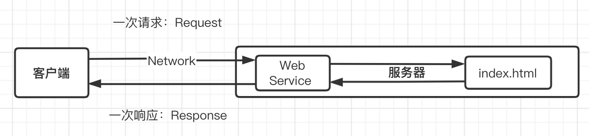

* 静态web存在的缺点
  * web页面无法动态更新，所有用户看到的都是一个页面
    * 轮播图，点击特效：伪动态
    * JavaScript [实际开发中，它用的最多]
    * VBScript
  * 它无法和数据库交互（数据无法持久化，用户无法交互）

### 1.4 动态web

页面会动态展示：“webd的页面展示效果因人而异“；

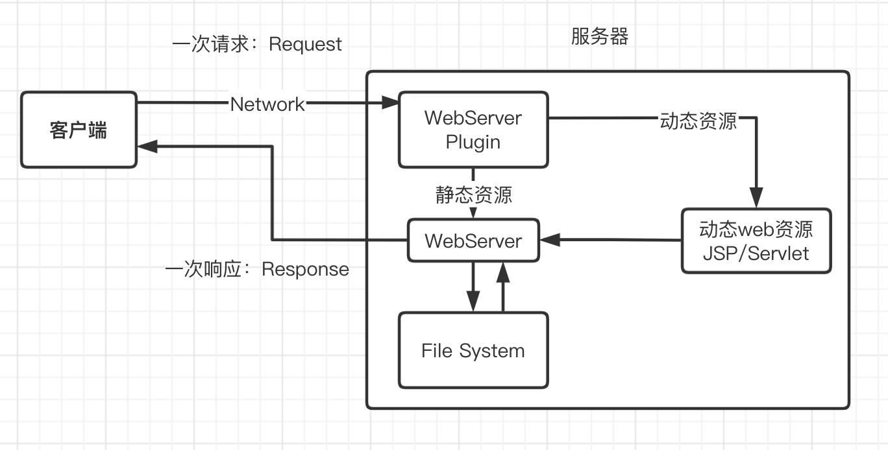

缺点

* 假如服务器的动态web资源出现了错误，我们需要重新编写我们的**后台程序**，重新发布；
  * 停机维护

优点

* web页面可以动态更新，所有用户看到的不是一个页面
* 它可以和数据库交互（数据持久化：注册，商品信息，用户信息...）

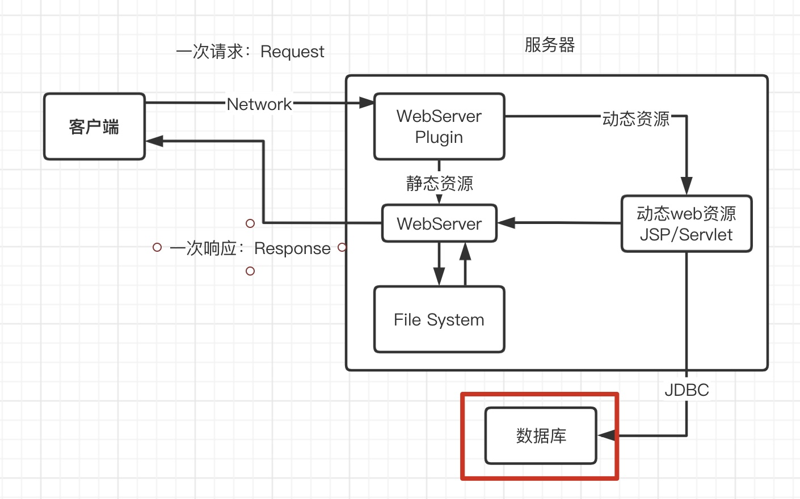

## 2. web服务器

### 2.1 技术讲解

**ASP：**

* 微软：国内最早流行的就是ASP；
* 在HTML中嵌入了VB的脚本， ASP + COM；
* 在ASP开发中，基本一个页面都有几千行的业务代码，页面及其混乱
* 维护成本高！
* C#
* IIS

```html
<h1>
  <%
     System.out.println("hello")
    %></%>
</h1>
```

**PHP：**

* PHP开发速度很快，功能很强大，跨平台，代码很简单（70%，WP）
* 无法承载大访问量的情况下（局限性）

**JSP/Servlet：**

B/S：浏览器和服务器

C/S：客户端和服务器

* sun公司主推的B/S架构
* 基于java语言的（所有的大公司，或者一些开源的组件，都是用java写的）
* 可以承载三高问题带来的影响（高并发，高可用，高性能）
* 语法像ASP，ASP--->JSP，加强市场强度

### 2.2 web服务器

服务器是一种被动的操作，用来处理用户的一些请求和给用户一些响应信息；

**IIS：**

微软的； ASP... Windows中自带的

**Tomcat:**


面向Google编程；

Tomcat是Apache 软件基金会（Apache Software Foundation）的Jakarta 项目中的一个核心项目，最新的Servlet 和JSP 规范总是能在Tomcat 中得到体现。因为Tomcat 技术先进、性能稳定，而且**免费**，因而深受Java 爱好者的喜爱并得到了部分软件开发商的认可，成为目前比较流行的Web 应用服务器。

Tomcat 服务器是一个免费的开放源代码的Web 应用服务器，属于轻量级应用[服务器](https://baike.baidu.com/item/服务器)，在中小型系统和并发访问用户不是很多的场合下被普遍使用，是开发和调试JSP 程序的首选。对于一个Java初学web的人来说，它是最佳的选择。

Tomcat 实际上运行JSP 页面和Servlet。目前Tomcat最新版本为**9.0.41**。

**工作3-5年之后，可以尝试手写Tomcat服务器；**

下载tomcat：

1. 安装 or 解压
2. 了解配置文件和目录结构
3. 这个东西的作用

## 3. Tomcat

### 3.1 安装tomcat

Tomcat官网：

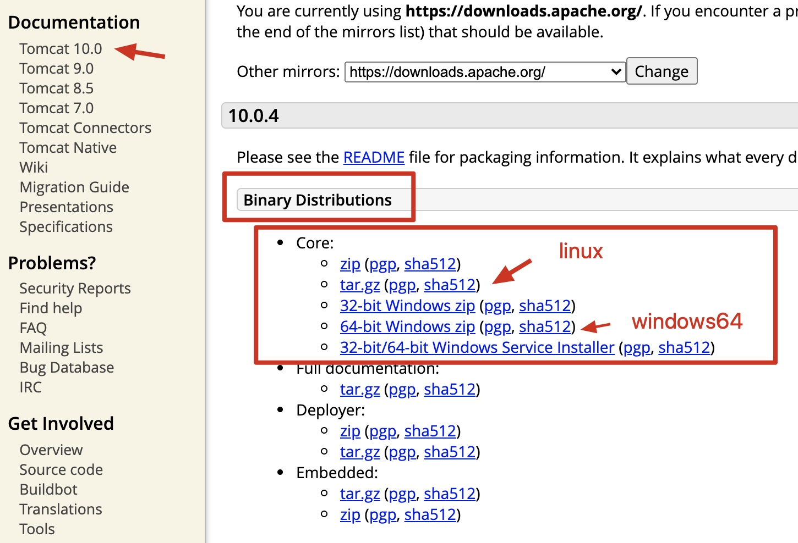

### 3.2 Tomcat启动和配置

> 文件夹作用：

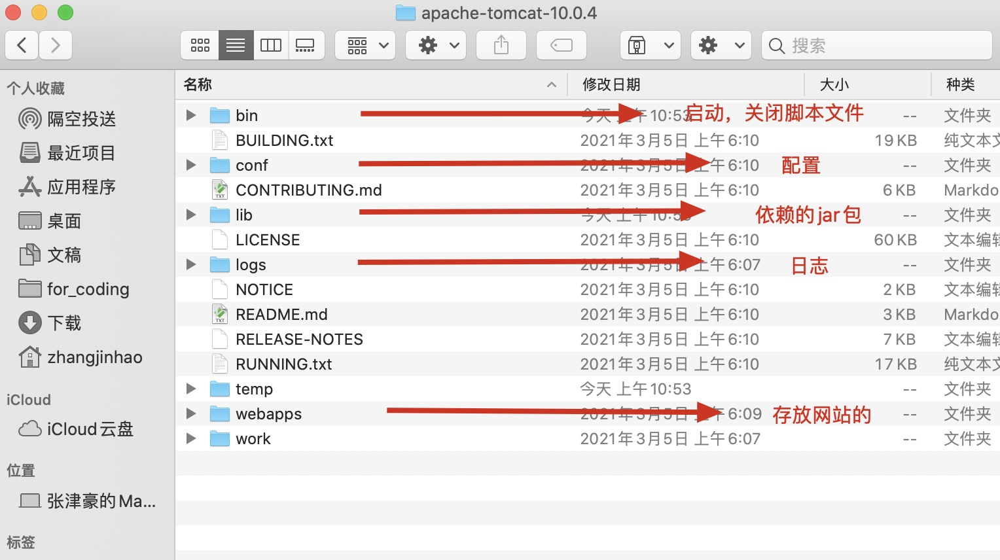

>  启动，关闭Tomcat

用终端（Terminal）直接打开Tomcat了

1、进入Tomcat的bin目录下：终端输入cd /Library/Tomcat/bin ，输完回车

```bash
cd Library/Tomcat/bin 
```

  也可以打开Tomcat文件夹，把bin文件夹直接拖拉到终端，当然前提是先输入cd+空格

2、授权bin目录下的所有操作：终端输入sudo chmod 755 *.sh，输完回车

```bash
sudo chmod 755 *.sh
```

3、这时要输入密码，输完回车

4、这时候就可以**==开启Tomcat==**了，终端输入``sudo sh ./startup.sh``，输完回车

```bash
sudo sh ./startup.sh
```

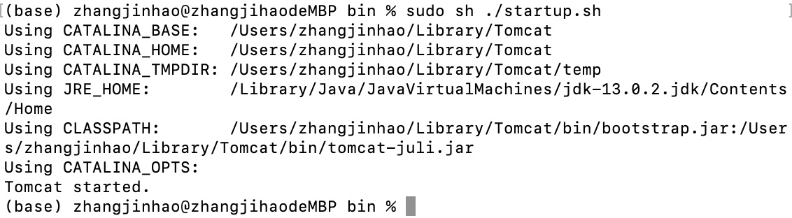

成功后的终端是这样的。

到浏览器输入网址localhost，若出现了下面的画面就证明成功了 http://localhost:8080/

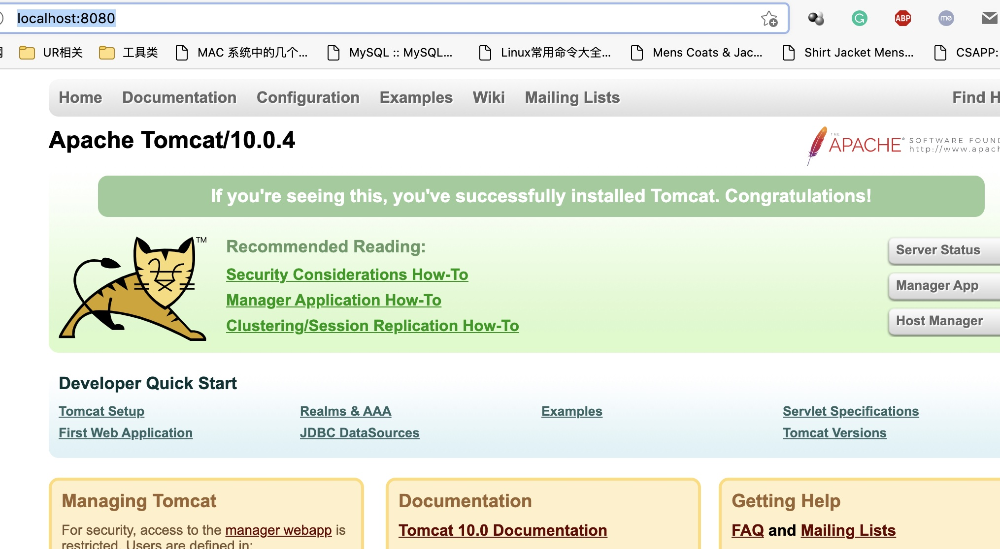

==**关闭Tomcat:**==

用终端输入``sh ./shutdown.sh``，回车即可关闭

```bash
sh ./shutdown.sh
```

***说明：***

*sudo为系统超级管理员权限.*

*chmod 改变一个或多个文件的存取模式*

*755代表用户对该文件拥有读、写、执行的权限，同组的其他人员拥有执行和读的权限，没有写的权限，其它用户的权限和同组人员一样.*

*777代表，user,group ,others ,都有读写和可执行权限.*

*chmod -R 777 folername,获取文件夹权限.*

访问测试： http://localhost:8080/

可能遇到的问题：

1. java环境变量没有配置
2. 闪退问题：需要配置兼容性
3. 乱码问题：配置文件中设置

### 3.3 配置

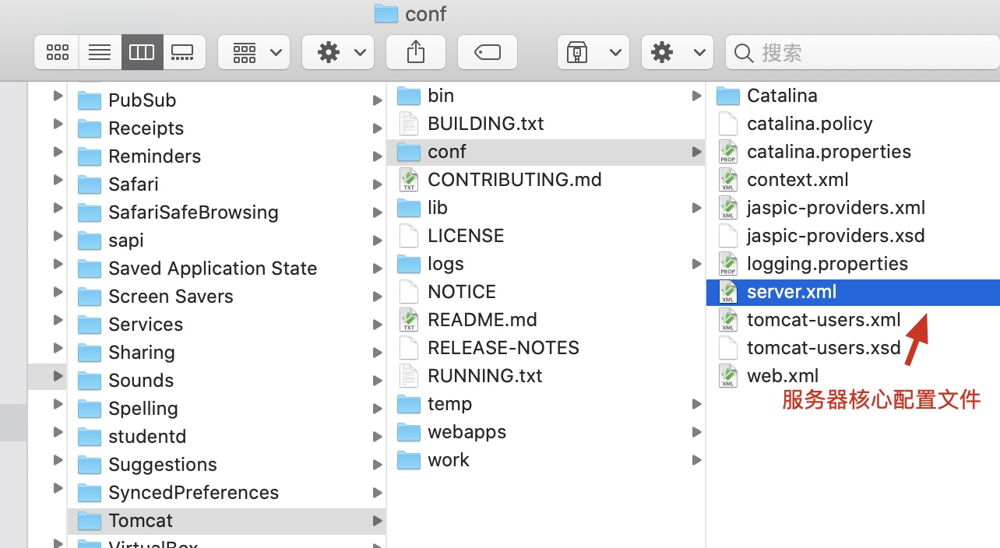

可以配置启动的端口号

* tomcat的默认端口号：8080
* mysql：3306
* http: 80
* Https: 443

```xml
<Connector port="8080" protocol="HTTP/1.1"
               connectionTimeout="20000"
               redirectPort="8443" />
```

可以配置主机的名称

* 默认的主机名为：localhost-->127.0.0.1
* 默认的网站应用的位置为：webapps

```xml
<Host name="localhost"  appBase="webapps"
            unpackWARs="true" autoDeploy="true">
```

#### 高难度面试题：

请你谈谈网站是如何进行访问的？

1. 输入一个域名，回车

2. 检查本机 hosts 配置文件下又没有这个域名映射

   * 查找方法：前往---> 前往文件夹--->/etc/hosts
   * 如果有：直接返回对应的ip地址，这个地址中，有我们需要访问的web程序，可以直接访问

   ```bash
   ##
   # Host Database
   #
   # localhost is used to configure the loopback interface
   # when the system is booting.  Do not change this entry.
   ##
   127.0.0.1				localhost
   255.255.255.255	broadcasthost
   ::1             localhost
   
   ```

   * 如果没有：去DNS服务器找，找到的话就返回，找不到就返回找不到；

   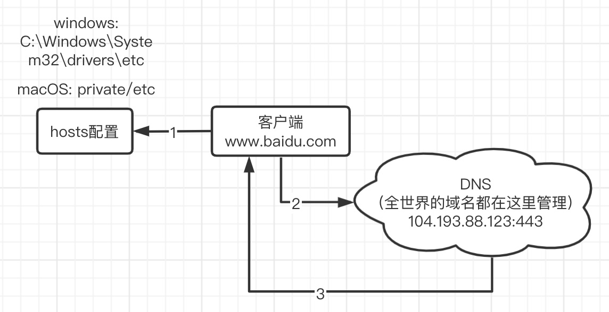

3. 可以配置一下环境变量（可选性）

### 3.4 发布一个web网站

不会就先模仿

* 将自己写的网站，放到服务器（Tomcat）中指定的web应用的文件夹（webapps）下，就可以访问了

网站应该有的结构

```java
--webapps : Tomcat服务器的web目录
  -ROOT
  -kuangstudy : 网站的目录名
    - WEB-INF
    	-classes : java程序
      -lib : web应用所依赖的jar包
    	-web.xml : 网站配置文件
    - index.html 默认的首页
    - static
        -css
        	-style.css
        -js
        -img
    -...
```

HTTP协议：面试

Maven：构建工具

* Maven安装包

Servlet入门

* HelloWorld!
* Servlet配置
* 原理

## 4. HTTP

### 4.1 什么是HTTP

超文本传输协议（Hypertext Transfer Protocol，HTTP）是一个简单的请求-响应协议，它通常运行在TCP之上。

* 文本： html，字符串，...
* 超文本：图片，音乐，视频，定位，地图....
* 默认端口：80

HTTPS：安全的

* 默认端口：443

### 4.2 两个时代

* http1.0
  * HTTP/1.0：客户端可以与web服务器连接后，只能获得一个web资源，断开连接
* http2.0
  * HTTP/1.1：客户端可以与web服务器连接后，可以获得多个web资源。

### 4.3 HTTP请求

* 客户端---发请求(Request)-->服务器

百度：

```java
Request URL: https://www.baidu.com/     	//请求地址
Request Method: GET												//get方法/post方法
Status Code: 200 OK												//状态码：200
Remote Address: 104.193.88.77:443					
```

```java
Accept: text/html
Accept-Encoding: gzip, deflate, br
Accept-Language: zh-CN,zh;q=0.9,en;q=0.8   	//语言
Cache-Control:max-age=0
Connection: keep-alive
```

#### 1. 请求行

* 请求行中的请求方式： GET
* 请求方式： **GET/POST**,  HEAD, DELETE, PUT, TRACE...
  * get: 请求能够携带的参数比较少，大小有限制，还在浏览器的URL地址栏显示数据内容，不安全，但高效
  * post：请求能够携带的参数没有限制，大小没有限制，不会在浏览器的URL地址栏显示数据内容，安全，但不高效

#### 2. 消息头

```java
Accept: 告诉服务器，它所支持的数据类型
Accept-Encoding: 支持那种编码格式 GBK UTf-8 GB2312 ISO8859-1
Accept-Language: 告诉服务器，它的语言环境
Cache-Control: 缓存控制
Connection: 告诉服务器，请求完成时断开还是保持连接
Host: 主机
```


### 4.4 HTTP响应

* 服务器---响应(response)-->客户端

```java
Cache-Control: private    		//缓存控制
Connection: keep-alive				//连接
Content-Encoding: gzip				//编码
Content-Type: text/html;charset=utf-8	//类型
```

#### 1. 响应体

```java
Accept: 告诉浏览器，它所支持的数据类型
Accept-Encoding: 支持那种编码格式 GBK UTf-8 GB2312 ISO8859-1
Accept-Language: 告诉浏览器，它的语言环境
Cache-Control: 缓存控制
Connection: 告诉浏览器，请求完成时断开还是保持连接
Host: 主机
Refresh: 告诉客户端，多久刷新一次
Location: 让网页重新定位
```

#### 2. 响应状态码

200：请求相应成功

3**：请求重定向

* 重定向：重新到我给你的新位置去；

4xx：找不到资源 404

* 资源不存在；

5xx：服务器代码错误 500 502:网关错误

#### 常见面试题

当你的浏览器中地址栏输入地址并回车的一瞬间到页面能够展示回来，经历了什么？

**域名解析 --> 发起TCP的3次握手 --> 建立TCP连接后发起http请求 --> 服务器响应http请求，浏览器得到html代码 --> 浏览器解析html代码，并请求html代码中的资源（如js、css、图片等） --> 浏览器对页面进行渲染呈现给用户**

[当你在浏览器地址栏输入一个URL后回车，将会发生的事情？ - 武培轩 - 博客园 (cnblogs.com)](https://www.cnblogs.com/wupeixuan/p/8747918.html)

## 5. Maven

**我为什么要学习这个技术？**

1. 在JavaWeb开发中，需要使用大量的jar包，我们手动去导入；
2. 如何能够让一个东西自动帮我导入和配置这个jar包；

由此，Maven诞生了！

### 5.1 Maven项目架构管理工具

我们目前就是用来方便导入jar包的！

Maven的核心思想：**约定大于配置**

* 有约束，不要去违反。

Maven会规定好你该如何去编写我们的Java代码，必须要按照这个规范来；

### 5.2 下载安装Maven

官网：https://maven.apache.org/


下载完成后，解压即可；

建议所有环境都放在一个文件夹下，方便管理

### 5.3 配置环境变量

在我们的系统环境配置中

Mac OS 下的配置：https://www.jianshu.com/p/7c9a5df967d4

​								  https://blog.csdn.net/dearKundy/article/details/80291275

配置如下：

* M2_HOME	                maven目录下的bin目录
* MAVEN_HOME             maven的目录
* 在系统的path中配置    %MAVEN_HOME%\bin

测试Maven是否安装成功，保证必须配置完毕！

### 5.4 阿里云镜像

* 镜像： mirrors
  * 作用：加速我们的下载
* 国内建议使用阿里云镜像

```java
<mirror>
  <id>aliyunmaven</id>
  <mirrorOf>*</mirrorOf>
  <name>阿里云公共仓库</name>
  <url>https://maven.aliyun.com/repository/public</url>
</mirror>
```

### 5.5 本地仓库

在本地的仓库，远程仓库

**建立一个本地仓库：**localRepository

```xml
<localRepository>/usr/local/apache-maven-3.6.3/repository</localRepository>
```

### 5.6 在IDEA中使用Maven

1. 启动IDEA
2. 创建一个Maven项目

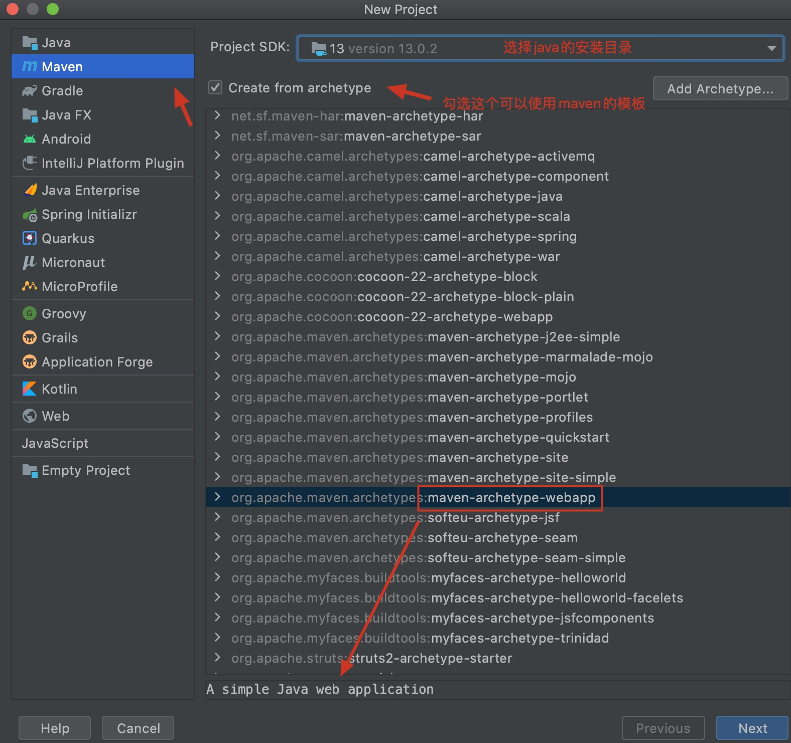

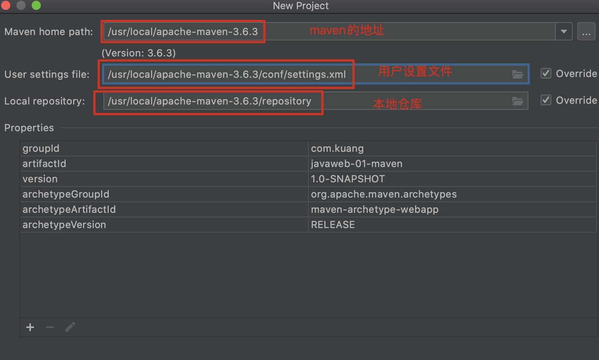

3. 等待项目初始化完毕

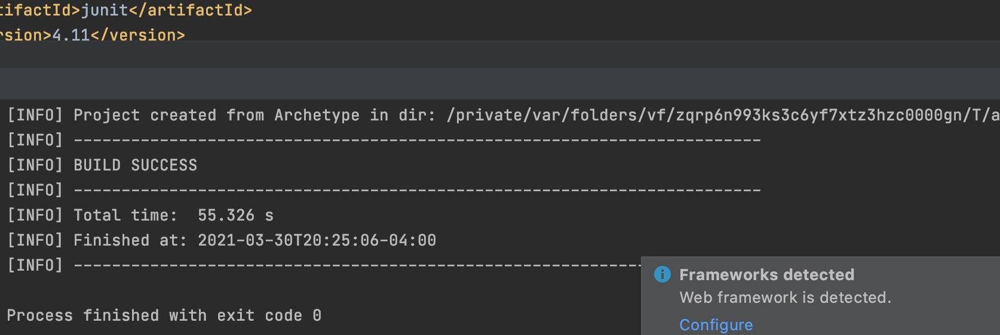

4. 观察Maven仓库中多了什么东西

5. IDEA中的Maven设置

   IDEA项目创建成功后，看一眼Maven配置


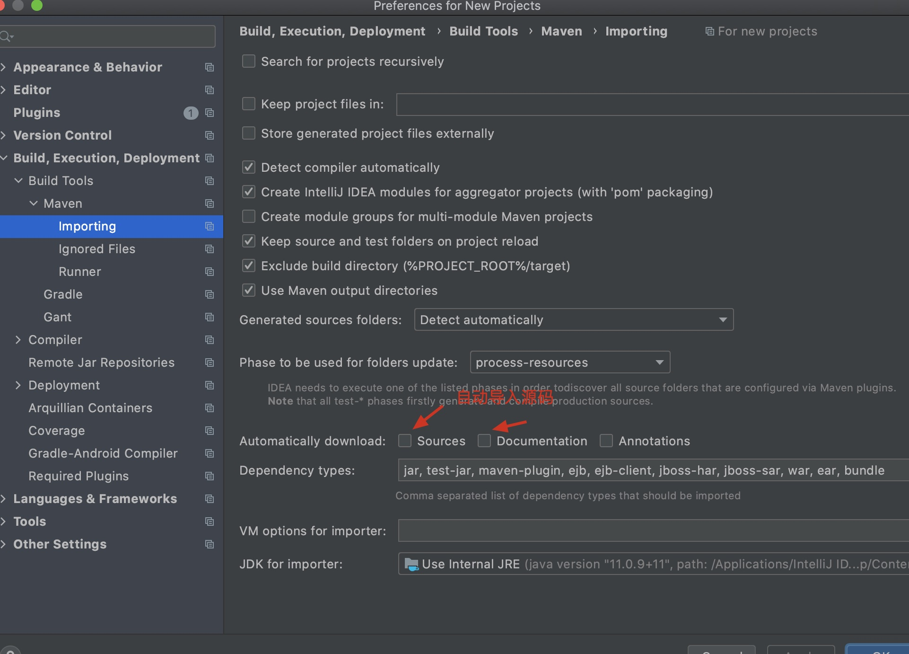

6. 到这里，Maven在IDEA中的配置和使用就OK了！

### 5.7 创建一个普通的Maven项目

在第一步不勾选模板

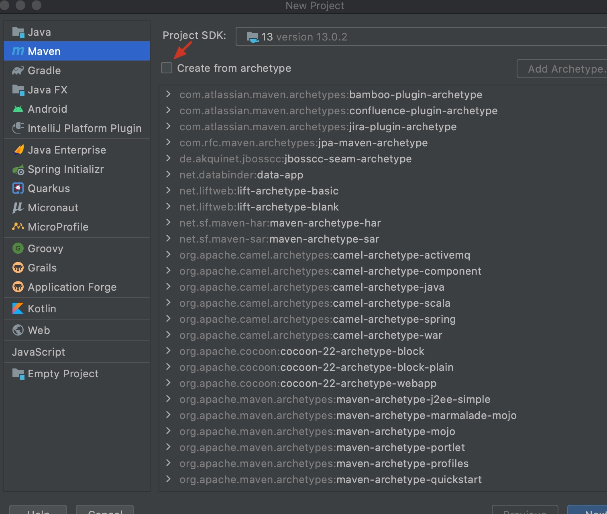

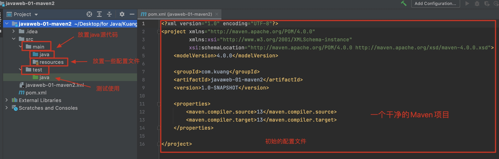

下图只有在web应用下才会有！

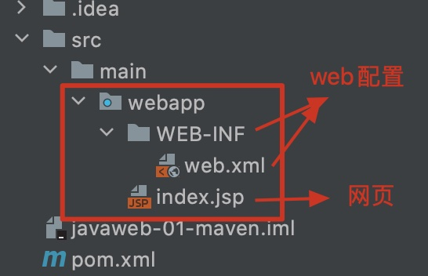

### 5.8 IDEA中标记文件夹功能

* 点击文件夹设置路径

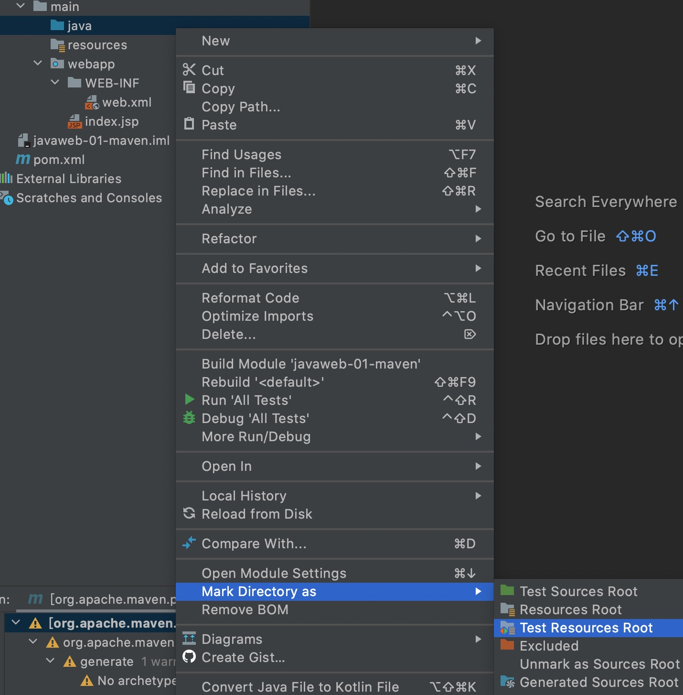

* 或者在项目结构中配置

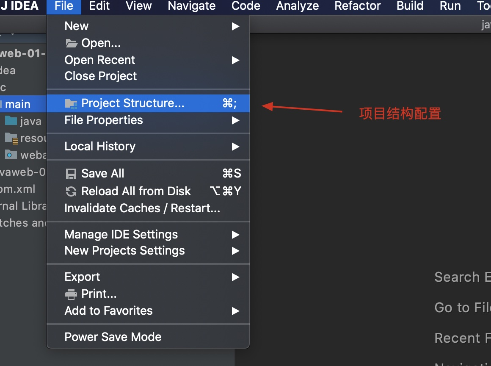

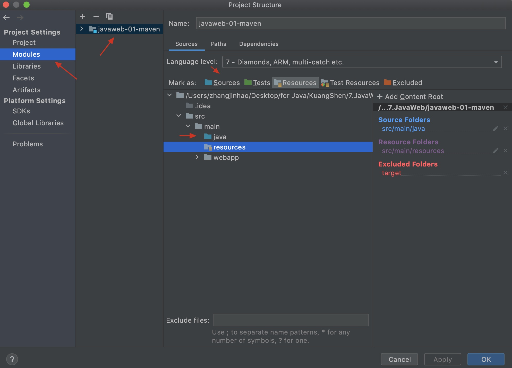

### 5.9 在IDEA中配置Tomcat

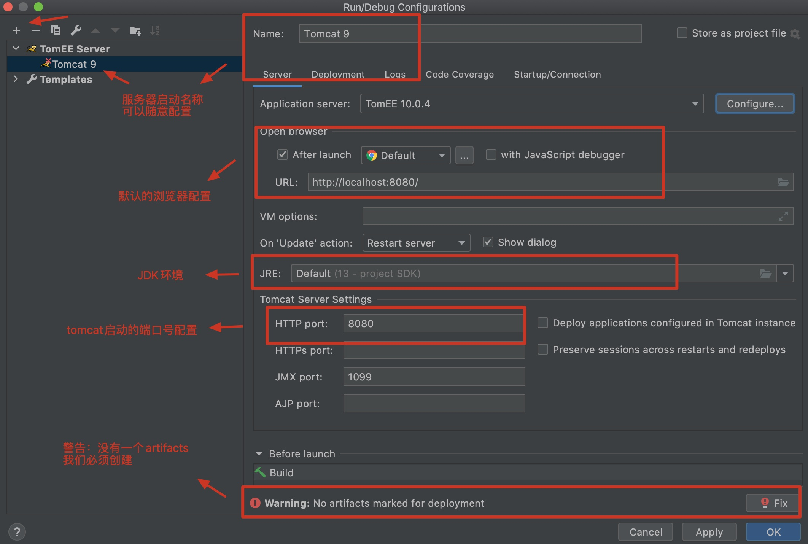

解决警告问题

必须要的：**为什么会有这个问题：我们访问一个网站，需要指定一个文件夹名字；**

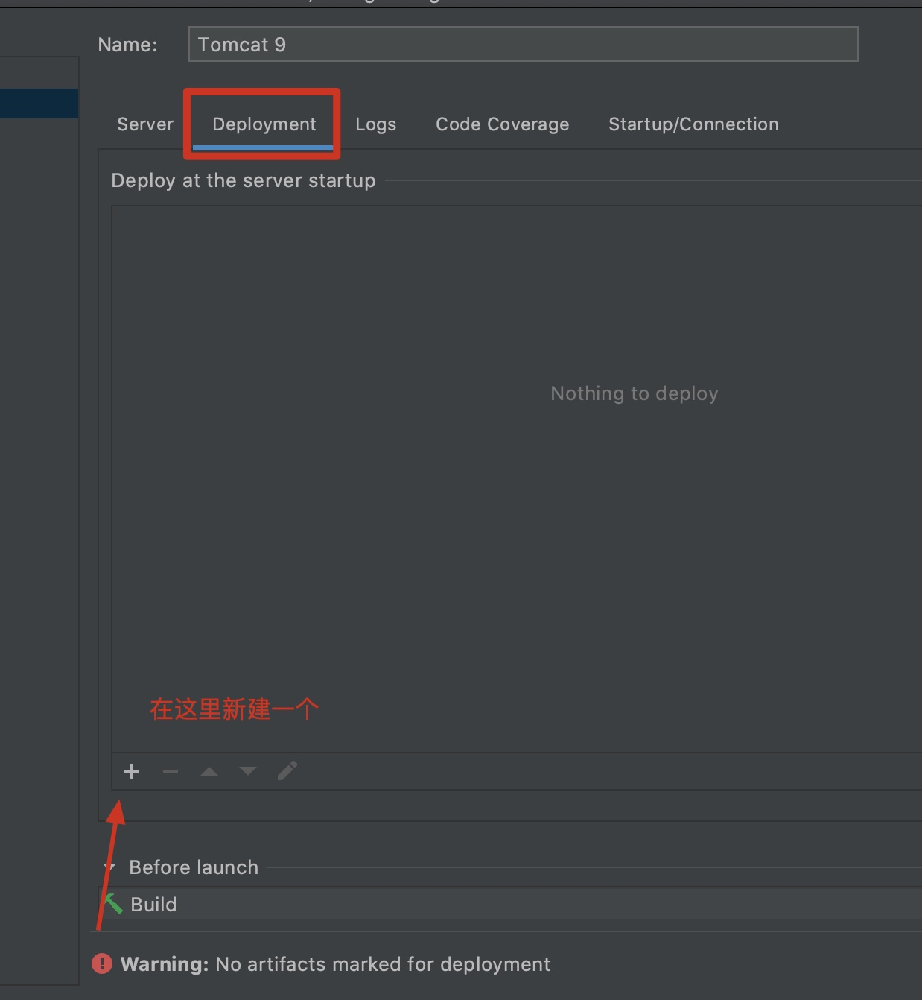

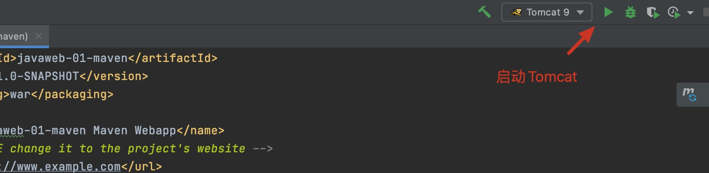


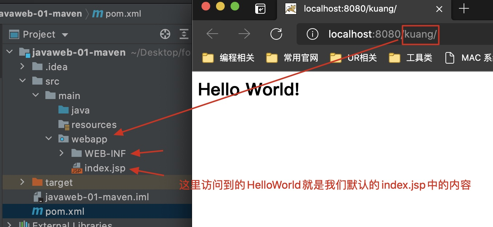

### 5.10 pom文件

Pom.xml 是maven的核心配置文件

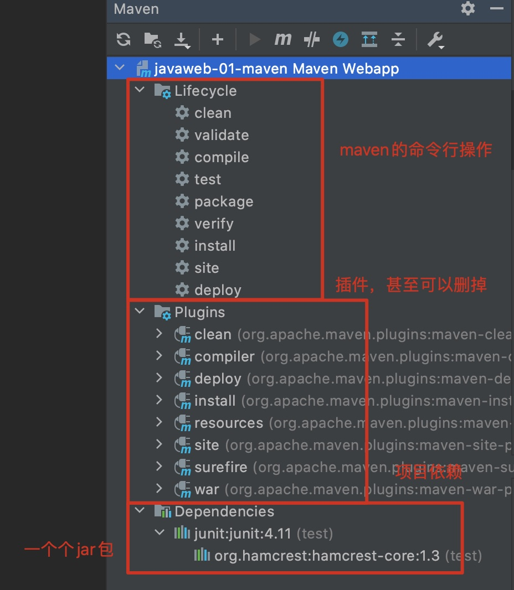

```html
<?xml version="1.0" encoding="UTF-8"?>

<!--Maven版本和头文件-->
<project xmlns="http://maven.apache.org/POM/4.0.0" xmlns:xsi="http://www.w3.org/2001/XMLSchema-instance"
  xsi:schemaLocation="http://maven.apache.org/POM/4.0.0 http://maven.apache.org/xsd/maven-4.0.0.xsd">
  <modelVersion>4.0.0</modelVersion>

  <!--这里就是我们刚才配置的GAV-->
  <groupId>com.kuang</groupId>
  <artifactId>javaweb-01-maven</artifactId>
  <version>1.0-SNAPSHOT</version>
  <!--Package：项目的打包方式
  jar: Java应用
  war: JavaWeb应用
  -->
  <packaging>war</packaging>
  <!--配置-->
  <properties>
    <!--项目的默认构建编码-->
    <project.build.sourceEncoding>UTF-8</project.build.sourceEncoding>
    <!--编码版本-->
    <maven.compiler.source>1.8</maven.compiler.source>
    <maven.compiler.target>1.8</maven.compiler.target>
  </properties>

  <!--项目依赖-->
  <dependencies>
    <!--具体依赖的jar包配置文件-->
    <dependency>
      <groupId>junit</groupId>
      <artifactId>junit</artifactId>
      <version>4.11</version>
    </dependency>
  </dependencies>
  <!--项目构建用的东西-->
  <build>
    <finalName>javaweb-01-maven</finalName>
    <pluginManagement><!-- lock down plugins versions to avoid using Maven defaults (may be moved to parent pom) -->
      <plugins>
        <plugin>
          <artifactId>maven-clean-plugin</artifactId>
          <version>3.1.0</version>
        </plugin>
        <!-- see http://maven.apache.org/ref/current/maven-core/default-bindings.html#Plugin_bindings_for_war_packaging -->
        <plugin>
          <artifactId>maven-resources-plugin</artifactId>
          <version>3.0.2</version>
        </plugin>
        <plugin>
          <artifactId>maven-compiler-plugin</artifactId>
          <version>3.8.0</version>
        </plugin>
        <plugin>
          <artifactId>maven-surefire-plugin</artifactId>
          <version>2.22.1</version>
        </plugin>
        <plugin>
          <artifactId>maven-war-plugin</artifactId>
          <version>3.2.2</version>
        </plugin>
        <plugin>
          <artifactId>maven-install-plugin</artifactId>
          <version>2.5.2</version>
        </plugin>
        <plugin>
          <artifactId>maven-deploy-plugin</artifactId>
          <version>2.8.2</version>
        </plugin>
      </plugins>
    </pluginManagement>
  </build>
</project>

```

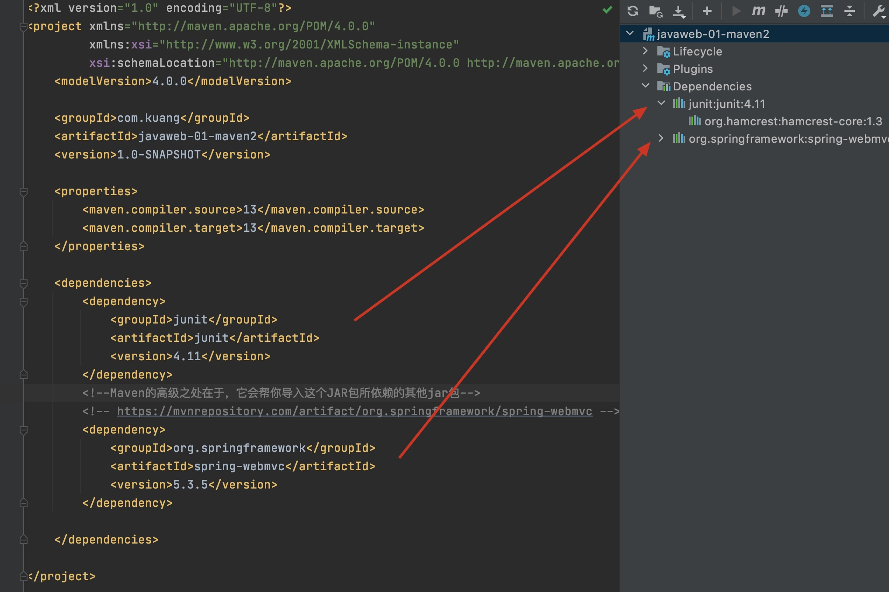

maven由于它的约定大于配置，我们之后可能能遇到我们写的配置文件，无法被导出或者生效的问题

##### <span id="ConvOverConf">**解决方案：**</span>

```xml
<!--在build中配置resources，来防止我们资源导出失败的问题-->
<build>
    <resources>
        <resource>
            <directory>src/main/resources</directory>
            <!--如果是excludes则是排除-->
            <includes>
                <include>**/*.properties</include>
                <include>**/*.xml</include>
            </includes>
            <filtering>true</filtering>
        </resource>
        <resource>
            <directory>src/main/java</directory>
            <includes>
                <include>**/*.properties</include>
                <include>**/*.xml</include>
            </includes>
            <filtering>true</filtering>
        </resource>
    </resources>
</build>
```

### 5.11 IDEA操作

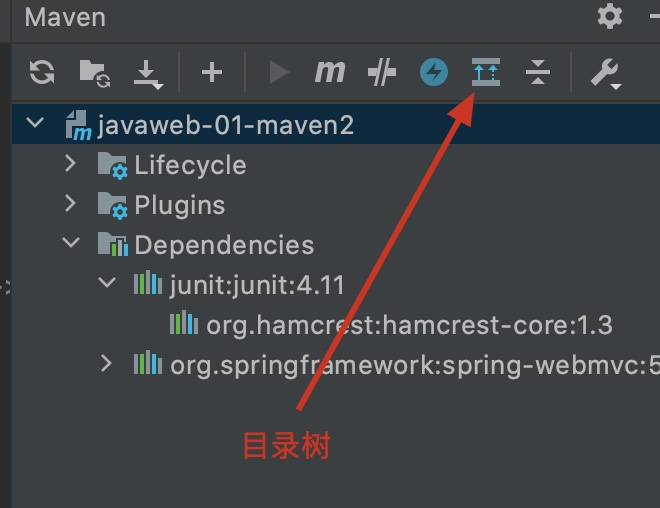

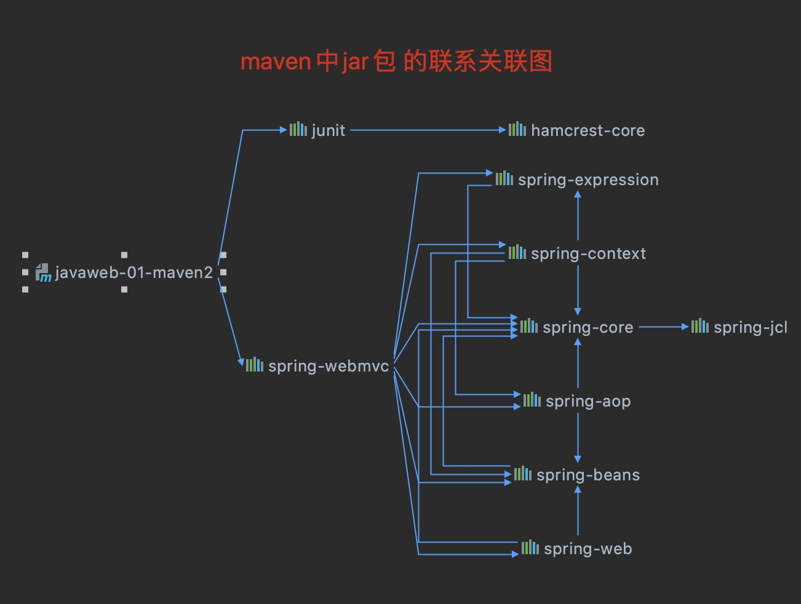

### 5.12 解决遇到的问题

1. Maven 版本问题：`` Unable to import maven project: See logs for details``
   * 解决方法：换版本
2. Tomcat闪退
3. IDEA中美词都要重复配置Maven
   * 在IDEA中的全局默认配置中去配置
4. Maven项目中Tomcat无法配置
5. maven默认web项目中的web.xml版本问题

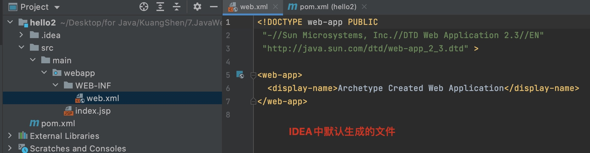

6. 替换为webapp4.0版本和tomcat一致

```xml
<?xml version="1.0" encoding="UTF-8"?>
<web-app xmlns="http://xmlns.jcp.org/xml/ns/javaee"
         xmlns:xsi="http://www.w3.org/2001/XMLSchema-instance"
         xsi:schemaLocation="http://xmlns.jcp.org/xml/ns/javaee
                             http://xmlns.jcp.org/xml/ns/javaee/web-app_4_0.xsd"
         version="4.0"
         metadata-complete="true">
</web-app>
```

7. Maven仓库的使用

地址： https://mvnrepository.com/

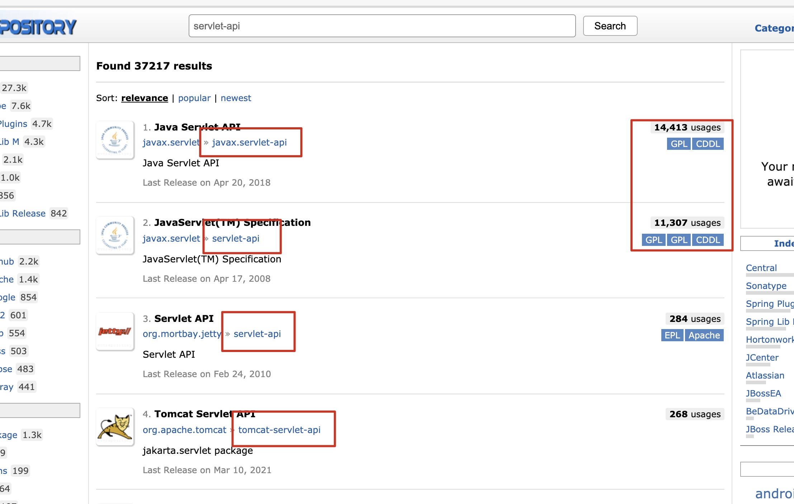

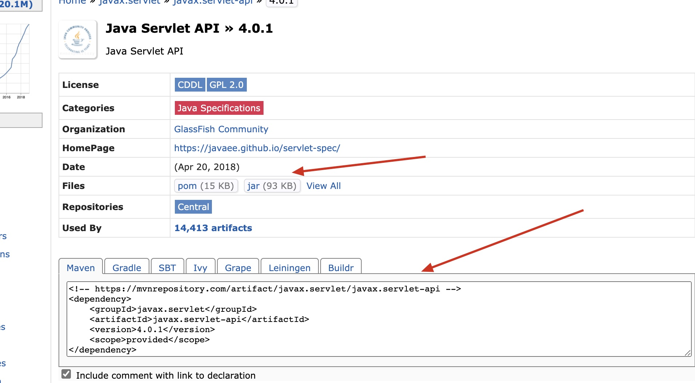


## 6. Servlet

### 6.1 Servlet简介

* Servlet就是sun公司开发动态web的一门技术
* sun在这些API中提供一个借口叫做：Servlet，如果你想开发一个Servlet程序，只需要完成两个步骤：
  * 编写一个类，实现Servlet接口
  * 把开发好的Java类部署到web服务器中

**把实现了Servlet接口的Java程序叫做，Servlet**

### 6.2 HelloServlet

Servlet接口Sun公司有两个默认的实现类：HttpServlet，GenericServlet 

1. 构建一个普通的Maven项目，删掉里面的src目录，以后我们的学习就在这个项目里面建立model；这个空着的工程就是Maven的主工程；

2. 关于Maven父子工程的理解：

   父项目会有

   ```xml
   <modules>
           <module>servlet01</module>
   </modules>
   ```

   子项目会有

   ```xml
   <parent>
   	<artifactId>javaweb-02-servlet</artifactId>
     <groupId>com.kuang</groupId>
     <version>1.0-SNAPSHOT</version>
   </parent>
   ```

   父项目中的java子项目可以直接使用

   ```java
   son extends father
   ```

3. Maven环境优化

   1. 修改web.xml为最新（可查看tomcat部分的更新内容）
   2. 将maven的结构搭建完整

4. 编写一个Servlet程序

   1. 编写一个普通类
   2. 实现Servlet接口，这里我们直接继承HttpServlet

   ```java
   public class HelloServlet extends HttpServlet {
       //由于get或者post只是请求实现的不同的方式，可以互相调用，业务逻辑都一样；
       @Override
       protected void doGet(HttpServletRequest req, HttpServletResponse resp) throws ServletException, IOException {
           //ServletOutputStream outputStream = resp.getOutputStream();
           PrintWriter writer = resp.getWriter(); //响应流
           writer.print("Hello, Servlet");
       }
   
       @Override
       protected void doPost(HttpServletRequest req, HttpServletResponse resp) throws ServletException, IOException {
           doGet(req, resp);
       }
   }
   ```

5. 编写Servlet的映射

   为什么需要映射：我们写的是Java程序，但是要通过浏览器访问，而浏览器需要连接web服务器，所以我们需要在web服务中注册我们的Servlet，还需要给他一个浏览器能够访问的路径。

   ```xml
       <!--web.xml-->
       <!--注册Servlet-->
       <servlet>
           <servlet-name>hello</servlet-name>
           <servlet-class>com.jin.servlet.HelloServlet</servlet-class>
       </servlet>
       <!--Servlet的请求路径-->
       <servlet-mapping>
           <servlet-name>hello</servlet-name>
           <url-pattern>/hello</url-pattern>
       </servlet-mapping>
   ```

6. 配置Tomcat

   注意：配置项目发布的路径就可以了，记得添加Deployment里的artifact

   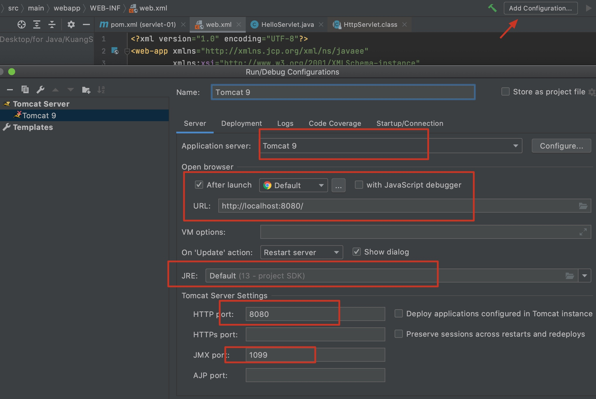

7. 启动测试，OK！

### 6.3 运行原理

Servlet是由web服务器调用，web服务器在收到浏览器请求之后，会：


### 6.4 Mapping问题

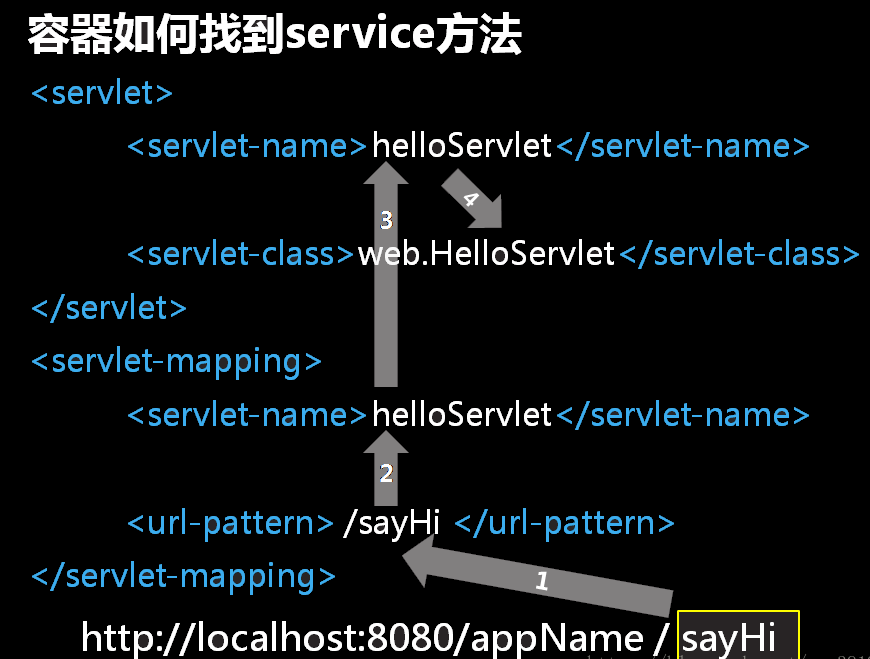

1. 一个Servlet可以指定一个映射路径

   ```xml
   <servlet-mapping>
     <servlet-name>hello</servlet-name>
     <url-pattern>/hello</url-pattern>
   </servlet-mapping>
   ```

2. 一个Servlet可以指定多个映射路径

   ```xml
   <servlet-mapping>
     <servlet-name>hello</servlet-name>
     <url-pattern>/hello</url-pattern>
   </servlet-mapping>
   <servlet-mapping>
     <servlet-name>hello</servlet-name>
     <url-pattern>/hello2</url-pattern>
   </servlet-mapping>
   ```

3. 一个Servlet可以指定通用映射路径

   ```xml
   <servlet-mapping>
     <servlet-name>hello</servlet-name>
     <url-pattern>/hello/*</url-pattern>
   </servlet-mapping>
   ```

4. 默认请求路径（少去用）

   ```xml
   <!--默认请求路径-->
   <servlet-mapping>
     <servlet-name>hello</servlet-name>
     <url-pattern>/*</url-pattern>
   </servlet-mapping>
   ```

5. 指定一些后缀或者前缀等等

   ```xml
   <!--可以自定义后缀实现请求映射
       注意.*前面不能加项目映射路径
       hello/faffa.jin这种可以
       -->
   <servlet-mapping>
     <servlet-name>hello</servlet-name>
     <url-pattern>*.jin</url-pattern>
   </servlet-mapping>
   ```

6. 优先级问题

   指定了固有的映射路径优先级最高，如果找不到就会走默认的处理请求；

   下面的错误请求就是默认的处理请求

   ```xml
   <!--404-->
   <servlet>
     <servlet-name>error</servlet-name>
     <servlet-class>com.jin.servlet.ErrorServlet</servlet-class>
   </servlet>
   <servlet-mapping>
     <servlet-name>error</servlet-name>
     <url-pattern>/*</url-pattern>
   </servlet-mapping>
   ```


### 6.5 ServletContext

web容器在启动的时候，它会为每个web程序都创建一个对应的ServletContext对象，它代表了当前的web应用；

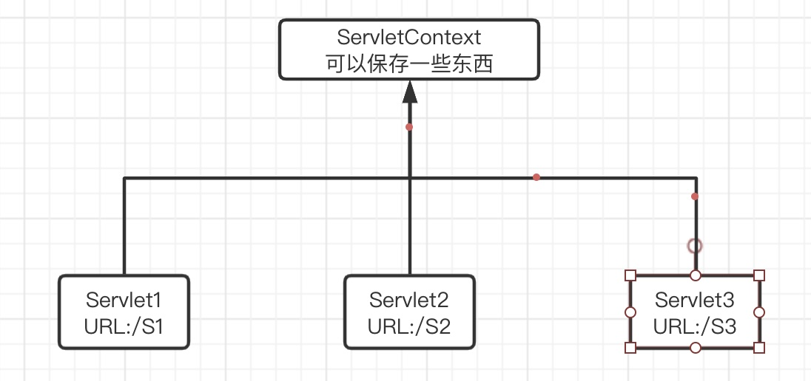

#### 1. 共享数据

我在这个Servlet中保存的数据，可以在另外一个Servlet中拿到；

```java
//放置数据的类
public class HelloServlet extends HttpServlet {
    @Override
    protected void doGet(HttpServletRequest req, HttpServletResponse resp) throws ServletException, IOException {

        //this.getInitParameter()   //初始化参数
        //this.getServletConfig()   //Servlet配置
        //this.getServletContext()  //Servlet上下文
        ServletContext context = this.getServletContext();

        String username = "jin"; //数据
        context.setAttribute("username",username); 
      	//将一个数据保存在了ServletContext中 名字："username" 值：username
    }
}
```

```java
//读取数据的类
public class GetServlet extends HttpServlet {
    @Override
    protected void doGet(HttpServletRequest req, HttpServletResponse resp) throws ServletException, IOException {
        ServletContext context = this.getServletContext();
        String username = (String) context.getAttribute("username");

        resp.setContentType("text/html");
        resp.setCharacterEncoding("utf-8");
        resp.getWriter().print("名字" + username);
    }
}
```

```xml
<!--配置的web.xml文件-->
<servlet>
  <servlet-name>hello</servlet-name>
  <servlet-class>com.jin.servlet.HelloServlet</servlet-class>
</servlet>
<servlet-mapping>
  <servlet-name>hello</servlet-name>
  <url-pattern>/hello</url-pattern>
</servlet-mapping>

<servlet>
  <servlet-name>getc</servlet-name>
  <servlet-class>com.jin.servlet.GetServlet</servlet-class>
</servlet>
<servlet-mapping>
  <servlet-name>getc</servlet-name>
  <url-pattern>/getc</url-pattern>
</servlet-mapping>

```

测试访问结果，配置完后，启动Tomcat，先http://localhost:8080/s2/hello通过ServletContext放置数据，再http://localhost:8080/s2/getc通过ServletContext读取数据，达到数据共享的目的。

#### 2. 获取初始化参数

```xml
<!--配置一些web应用初始化参数-->
<context-param>
  <param-name>url</param-name>
  <param-value>jdbc:mysql://localhost:3306/mybatis</param-value>
</context-param>
```

```java
//使用
@Override
    protected void doGet(HttpServletRequest req, HttpServletResponse resp) throws ServletException, IOException {
        ServletContext context = this.getServletContext();
        String url = context.getInitParameter("url");
        resp.getWriter().print(url);
    }
```

#### 3. 请求转发

```xml
<servlet>
  <servlet-name>sd4</servlet-name>
  <servlet-class>com.jin.servlet.ServletDemo04</servlet-class>
</servlet>
<servlet-mapping>
  <servlet-name>sd4</servlet-name>
  <url-pattern>/sd4</url-pattern>
</servlet-mapping>
```

```java
@Override
    protected void doGet(HttpServletRequest req, HttpServletResponse resp) throws ServletException, IOException {
        ServletContext context = this.getServletContext();
        System.out.println("进入了ServletDemo04");
        //RequestDispatcher requestDispatcher = 
      									//context.getRequestDispatcher("/gp"); //转发的请求路径
        //requestDispatcher.forward(req, resp); //调用forward实现请求转发
        context.getRequestDispatcher("/gp").forward(req, resp);
    }
```

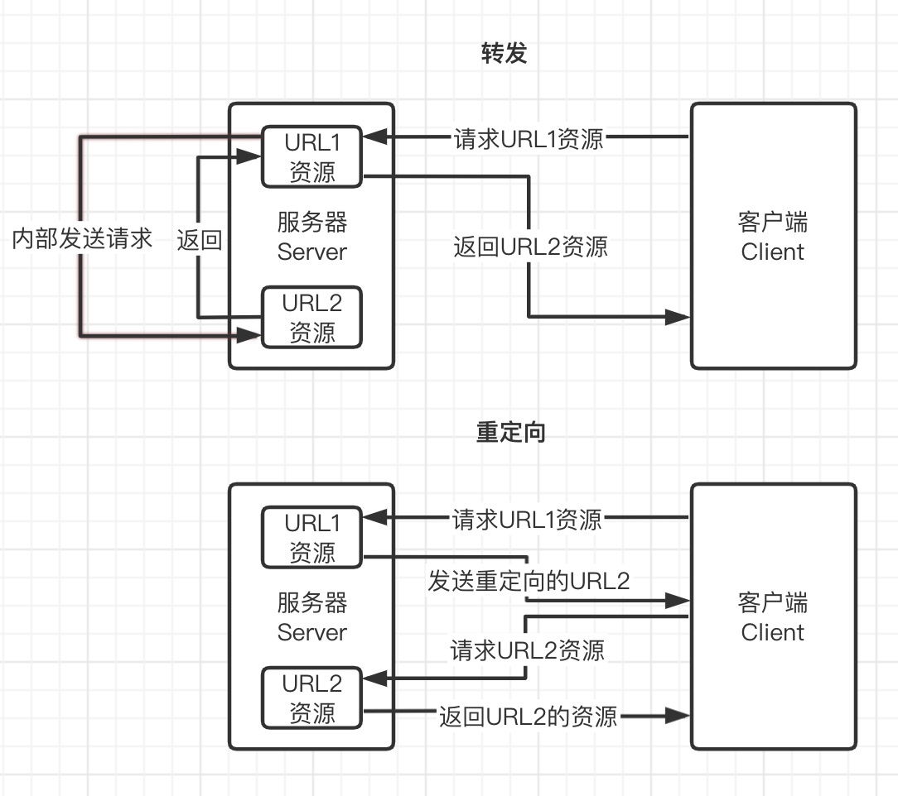

* 转发的url并不会改变

#### 4. 读取资源文件

Properties

* 在java目录下新建properties
* 在resources目录下新建properties

发现：都被打包到了同一个路径下：classes，我们俗称这个路径为classpath

问题：java目录下的properties会被剔除，而resources下的会被保留。这是约定大于配置的原因。

​		如果想要保留java目录下的，参考5.10 pom文件下的解决方案。

思路：需要一个文件流；

```properties
#db.properties
username=root
password=123456
```

```java
@Override
    protected void doGet(HttpServletRequest req, HttpServletResponse resp) throws ServletException, IOException {
        // '/'代表当前web项目，这里即servlet-02-1.0-SNAPSHOT
        InputStream is = this.getServletContext().getResourceAsStream("/WEB-INF/classes/db.properties");

        Properties prop = new Properties();
        prop.load(is);
        String user = prop.getProperty("username");
        String pwd = prop.getProperty("password");
        resp.getWriter().print(user+":"+pwd);
    }
```

访问测试即可ok。

#### ==以上所有的应用都会被之后的知识所取代掉。==

### 6.6 HttpServletResponse

web服务器接收到客户端的http请求，针对这个请求，分别创建一个代表请求的 HttpServletRequest 对象，一个代表响应的 HttpServletResponse 对象；

* 如果要获取客户端请求过来的参数：找HttpServletRequest
* 如果要给客户端响应一些信息：找HttpServletResponse

#### 1.简单分类

负责向浏览器发送数据的方法

```java
ServletOutputStream getOutputStream() throws IOException;
PrintWriter getWriter() throws IOException;
```

负责向浏览器发送响应头的方法

```java
void setCharacterEncoding(String var1);
void setContentLength(int var1);
void setContentLengthLong(long var1);
void setContentType(String var1);
void setDateHeader(String var1, long var2);
void addDateHeader(String var1, long var2);
void setHeader(String var1, String var2);
void addHeader(String var1, String var2);
void setIntHeader(String var1, int var2);
void addIntHeader(String var1, int var2);
```

响应的状态码

```java
int SC_CONTINUE = 100;
int SC_SWITCHING_PROTOCOLS = 101;
int SC_OK = 200;   //
int SC_CREATED = 201;
int SC_ACCEPTED = 202;
int SC_NON_AUTHORITATIVE_INFORMATION = 203;
int SC_NO_CONTENT = 204;
int SC_RESET_CONTENT = 205;
int SC_PARTIAL_CONTENT = 206;
int SC_MULTIPLE_CHOICES = 300;    //
int SC_MOVED_PERMANENTLY = 301;
int SC_MOVED_TEMPORARILY = 302;
int SC_FOUND = 302;
int SC_SEE_OTHER = 303;
int SC_NOT_MODIFIED = 304;
int SC_USE_PROXY = 305;
int SC_TEMPORARY_REDIRECT = 307;
int SC_BAD_REQUEST = 400;
int SC_UNAUTHORIZED = 401;
int SC_PAYMENT_REQUIRED = 402;
int SC_FORBIDDEN = 403;           //
int SC_NOT_FOUND = 404;           //
int SC_METHOD_NOT_ALLOWED = 405;
int SC_NOT_ACCEPTABLE = 406;
int SC_PROXY_AUTHENTICATION_REQUIRED = 407;
int SC_REQUEST_TIMEOUT = 408;
int SC_CONFLICT = 409;
int SC_GONE = 410;
int SC_LENGTH_REQUIRED = 411;
int SC_PRECONDITION_FAILED = 412;
int SC_REQUEST_ENTITY_TOO_LARGE = 413;
int SC_REQUEST_URI_TOO_LONG = 414;
int SC_UNSUPPORTED_MEDIA_TYPE = 415;
int SC_REQUESTED_RANGE_NOT_SATISFIABLE = 416;
int SC_EXPECTATION_FAILED = 417;
int SC_INTERNAL_SERVER_ERROR = 500;        //
int SC_NOT_IMPLEMENTED = 501;
int SC_BAD_GATEWAY = 502;                  //
int SC_SERVICE_UNAVAILABLE = 503;
int SC_GATEWAY_TIMEOUT = 504;
int SC_HTTP_VERSION_NOT_SUPPORTED = 505;
```

#### 2. 下载文件

* 向浏览器输出消息（一直在讲，就不说了）

* 下载文件

   1. 要获取下载文件的路径；
   2. 获取要下载的文件名；
   3. 设置想办法让浏览器支持下载我们需要的东西；
   4. 获取下载文件的输入流；
   5. 创建缓冲区；
   6. 获取OutputStream对象；
   7. 将FlieOutputStream写入到buffer缓冲区；
   8. 使用OutputStream将缓冲区中的数据输出到客户端！

```java
@Override
    protected void doGet(HttpServletRequest req, HttpServletResponse resp) throws ServletException, IOException {
        // 1. 要获取下载文件的路径；
        String realPath = "/Users/zhangjinhao/Desktop/for Java/KuangShen/7.JavaWeb/javaweb-02-servlet/response/target/response-1.0-SNAPSHOT/WEB-INF/classes/津.jpg";
        System.out.println("下载文件的路径： "+realPath);
        // 2. 获取要下载的文件名；
        String filename = realPath.substring(realPath.lastIndexOf("/") + 1);
        // 3. 设置想办法让浏览器支持(Content-Disposition)下载我们需要的东西；
      	// 中文名用URLEncoder.encode进行编码；
        resp.setHeader("Content-Disposition","attachment;filename="+ URLEncoder.encode(filename, StandardCharsets.UTF_8));
        // 4. 获取下载文件的输入流；
        FileInputStream in = new FileInputStream(realPath);
        // 5. 创建缓冲区；
        int len = 0;
        byte[] buffer = new byte[1024];
        // 6. 获取OutputStream对象；
        ServletOutputStream out = resp.getOutputStream();
        // 7. 将FlieOutputStream写入到buffer缓冲区；
        // 8. 使用OutputStream将缓冲区中的数据输出到客户端！
        while((len=in.read(buffer))>0) {
            out.write(buffer, 0, len);
        }
        out.close();
        in.close();
    }
```

#### 3. 验证码

验证怎么来的？

* 前端实现
* 后端实现，需要用到Java的图片类，生成一个图片

==以下代码纯属娱乐，已经过时，无须记忆==

```java
@Override
    protected void doGet(HttpServletRequest req, HttpServletResponse resp) throws ServletException, IOException {
        //如何让浏览器3秒自动刷新一次
        resp.setHeader("refresh","3");

        //在内存中创建一个图片
        BufferedImage image = new BufferedImage(80, 20, BufferedImage.TYPE_INT_RGB);
        //得到图片
        Graphics2D g = (Graphics2D) image.getGraphics(); //笔
        //设置图片的背景颜色
        g.setColor(Color.white);
        g.fillRect(0,0,80,20);
        //给图片写数据
        g.setColor(Color.blue);
        g.setFont(new Font(null,Font.BOLD,20));
        g.drawString(makeNum(),0,20);

        //告诉浏览器，这个请求用图片的方式打开
        resp.setContentType("image/jpeg");
        //网站存在缓存，不让浏览器缓存
        resp.setDateHeader("expires",-1);
        resp.setHeader("Cache-Control","no-cache");
        resp.setHeader("Pragma","no-cache");

        //把图片写给浏览器
        ImageIO.write(image, "jpg", resp.getOutputStream());
    }
    //生成随机数
    private String makeNum() {
        Random random = new Random();
        String num = random.nextInt(9999999) + "";
        StringBuffer sb = new StringBuffer();
        for (int i = 0; i < 7 - num.length(); i++) {
            sb.append("0");
        }
        num = sb.toString() + num;
        return num;
    }
```

#### 4. 实现重定向


一个web资源收到客户端请求后，他会通知客户端去访问另外一个web资源，这个过程叫重定向.

常见场景：

* 用户登录

```java
void sendRedirect(String var1) throws IOException;
```

测试：

```java
@Override
    protected void doGet(HttpServletRequest req, HttpServletResponse resp) throws ServletException, IOException {
        /*
        resp.setHeader("Location", path);
        resp.setStatus(302);
         */
        String path = getServletContext().getContextPath() + "/img";
        resp.sendRedirect(path); //重定向
    }
```

##### 面试题：请你聊聊重定向和转发的区别？

相同点：

* 页面都会跳转

不同点：

* 请求转发的时候，url不会产生变化，仅一次请求；
* 重定向的时候，url地址栏会发生变化，有两次请求；

**使用场景：**

当前后两个页面有数据传递时，例如查询了数据需要在页面显示时，用请求转发

当没有数据传递，例如做了更新操作跳转到其他页面，就用重定向。

```java
//RequestTest.java
@Override
    protected void doGet(HttpServletRequest req, HttpServletResponse resp) throws ServletException, IOException {
        //处理请求
        String username = req.getParameter("username");
        String password = req.getParameter("password");
        System.out.println(username+":"+password);
        //重定向时候一定要注意 路径问题：否则404；
        resp.sendRedirect(req.getContextPath() + "/success.jsp");
    }

    @Override
    protected void doPost(HttpServletRequest req, HttpServletResponse resp) throws ServletException, IOException {
        doGet(req, resp);
    }
```

```jsp
<!--index.jsp-->
<html>
<body>
<h2>Hello World!</h2>
<%--这里提交的路径，需要寻找到项目的路径--%>
<%--${pageContext.request.contextPath}代表当前的项目--%>
<%@ page contentType="text/html; charset=UTF-8" %>
<form action="${pageContext.request.contextPath}/login" method="get">
    用户名：<input type="text", name="username"> <br>
    密码：<input type="password", name="password"> <br>
    <input type="submit">
</form>
</body>
</html>
```

```jsp
<!--success.jsp-->
<%@ page contentType="text/html;charset=UTF-8" language="java" %>
<html>
<head>
    <title>Title</title>
</head>
<body>
<h1>Success</h1>
</body>
</html>
```

### 6.7 HttpServletRequest

HttpServletRequest代表客户端的请求，用户通过http协议访问服务器，http请求中的所有信息会被封装到HttpServletRequest，通过这个HttpServletRequest方法，获得客户端的信息。

#### 1. 获取前端传递的参数，请求转发

常用方法：

```java
req.getParameter(String s)-> String
req.getParameterValues(String s)-> String[]
```

实现：

```java
//loginServlet.java
@Override
    protected void doGet(HttpServletRequest req, HttpServletResponse resp) throws ServletException, IOException {
        //后台接受中文乱码的问题
        req.setCharacterEncoding("utf-8");
        resp.setCharacterEncoding("utf-8");

        String username = req.getParameter("username");
        String password = req.getParameter("password");
        String[] hobbies = req.getParameterValues("hobbies");

        System.out.println("============================");
        System.out.println(username);
        System.out.println(password);
        System.out.println(Arrays.toString(hobbies));
        System.out.println("============================");

        //通过请求转发
        req.getRequestDispatcher("/success.jsp").forward(req,resp);
    }
```

```jsp
<!--index.jsp-->
<%@ page contentType="text/html;charset=UTF-8" language="java" %>
<html>
<head>
    <title>登录</title>
</head>
<body>

<h1>登录</h1>

<div style="text-align: center">
    <%--这里表单表达的意思：以post方式提交表单，提交到我们的login请求--%>
    <form action="${pageContext.request.contextPath}/login" method="post">
        用户名：<input type="text" name="username"> <br>
        密码：<input type="password" name="password"> <br>
        爱好：
        <input type="checkbox" name="hobbies" value="女孩">女孩
        <input type="checkbox" name="hobbies" value="代码">代码
        <input type="checkbox" name="hobbies" value="唱歌">唱歌
        <input type="checkbox" name="hobbies" value="电影">电影
        <br>
        <input type="submit">
    </form>
</div>

</body>
</html>
```

```jsp
<!--success.jsp-->
<%@ page contentType="text/html;charset=UTF-8" language="java" %>
<html>
<head>
    <title>登录成功</title>
</head>
<body>
</body>
</html>
```

##### 请求转发和重定向的区别（重复）：

相同点：

* 页面都会跳转

不同点：

* 请求转发的时候，url不会产生变化，仅一次请求；     307
* 重定向的时候，url地址栏会发生变化，有两次请求； 302

**使用场景：**

当前后两个页面有数据传递时，例如查询了数据需要在页面显示时，用请求转发

当没有数据传递，例如做了更新操作跳转到其他页面，就用重定向。


## 7. Cookie, Session(session为重点)

### 7.1 会话

**会话：**用户打开一个浏览器，点击了很多超链接，访问多个web资源，关闭浏览器，这个过程可以称之为会话。

**有状态会话：**一个同学来过教师，下次再来教室，我们会知道这个同学，曾经来过，称之为有状态对话。

**你能怎么证明你是本校的学生？**

你            学校

1. 学生证           学校给你学生证
2. 学校登记       学校标记你是本校学生

**一个网站，怎么证明你来过？**

客户端				服务端

1. 服务端给客户端一个信件，客户端下次访问服务端带上信件就可以了； cookie
2. 服务器登记你来过了，下次你来的时候我来匹配你；


### 7.2 保存会话的两种技术

**cookie**

* 客户端技术（响应，请求）

**session**

* 服务端技术，利用这个技术，可以保存用户的会话信息？我们可以把信息或者数据放在session中！


常见场景：网站登录之后，你下次不用再登录了，第二次访问直接就上去了！

### 7.3 Cookie

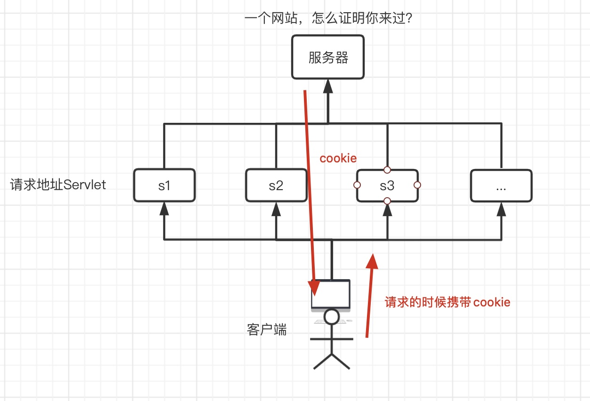

1. 从请求中拿到cookie信息
2. 服务器响应给客户端cookie

```java
Cookie[] cookies = req.getCookies(); //获得Cookie
cookie.getName(); //获得cookie中的key
cookie.getValue()；//获得cookie中的值
new Cookie("lastLoginTime", System.currentTimeMillis()+"") //新建一个cookie
cookie.setMaxAge(24*60*60); //设置cookie的有效期
resp.addCookie(cookie); //响应给客户端一个cookie
```

**cookie：一般会保存在本地的用户目录下appdata；**

一个网站cookie是否存在上限？**聊聊细节问题**

* 一个cookie只能保存一个信息
* 一个web站点可以给浏览器发送多个cookie，最多存放20个cookie
* cookie大小有限制，4kb
* 300个cookie浏览器上限

**删除Cookie：**

* 不设置有效期，关闭浏览器，自动失效；
* 设置有效期时间为0

**编码解码：**

```java
URLEncoder.encode("津", "utf-8");
URLDecoder.decode(cookie.getValue(),"utf8");
```

### 7.4 Session（重点）

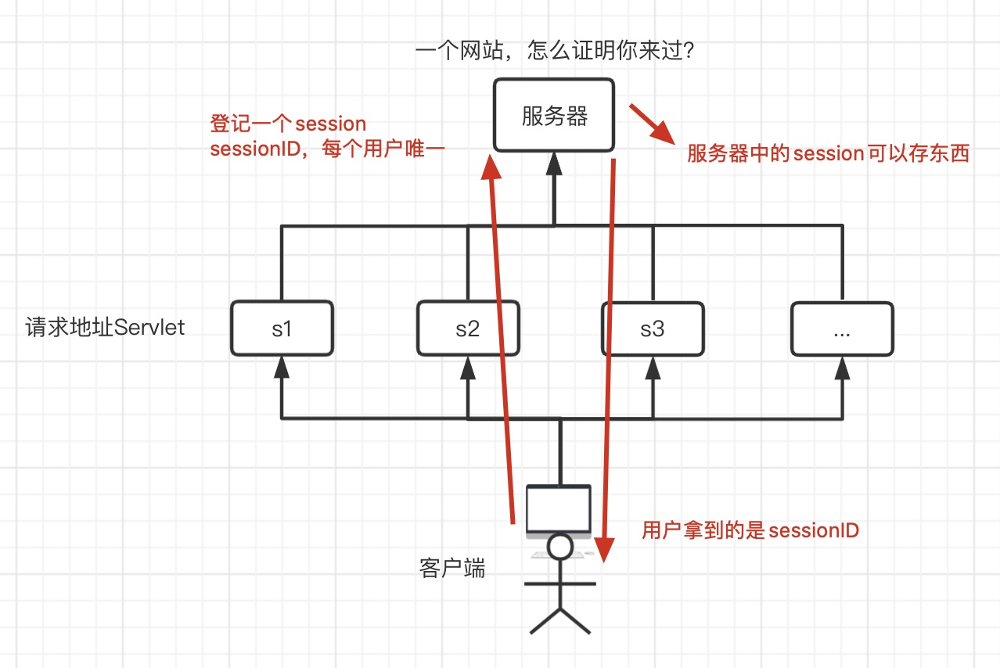

什么是Session：

* 服务器会给每一个用户（浏览器）创建一个Session对象；
* 一个Session独占一个浏览器，只要浏览器没有关闭，这个Session就存在；
* 用户登录之后，整个网站它都可以访问！--> 保存用户的信息，保存购物车的信息....

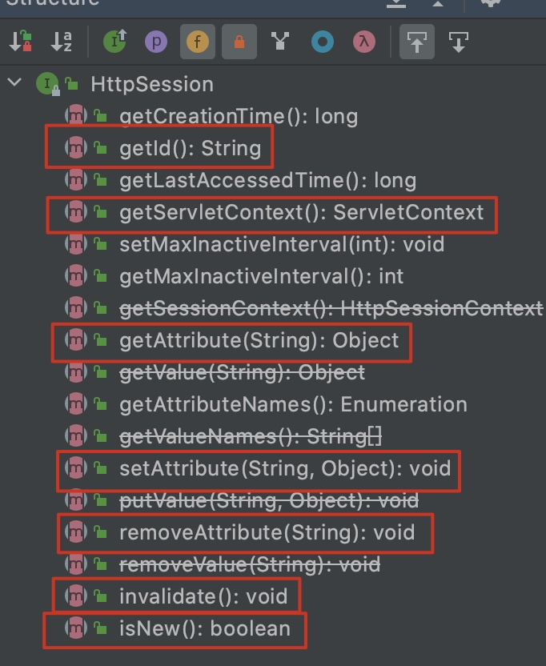

Session和Cookie区别：

* cookie是把用户的数据写给用户的浏览器，浏览器保存（可以保存多个）
* session把用户的数据写到用户独占session中，服务器端保存（保存重要的信息，减少服务器资源浪费）
* session对象由服务器创建

使用场景：

* 保存一个登录用户的信息；
* 购物车信息；
* 在整个网站中经常会使用的数据，我们将它们保存在session中；

使用session：

```java
@Override
    protected void doGet(HttpServletRequest req, HttpServletResponse resp) throws ServletException, IOException {
        //解决乱码问题
        req.setCharacterEncoding("utf-8");
        resp.setContentType("text/html; charset=UTF-8");
        //得到session
        HttpSession session = req.getSession();
        //给session中存东西
        session.setAttribute("name",new Person("津",1));
        //获取session的id
        String sessionId = session.getId();
        //判断session是不是新创建的
        if (session.isNew()) {
            resp.getWriter().write("session创建成功，ID: "+sessionId);
        } else {
            resp.getWriter().write("session已经在服务器中存在了，ID: " + sessionId);
        }
//        //session创建的时候做了什么事情
//        Cookie cookie = new Cookie("JSESSONID", sessionId);
//        resp.addCookie(cookie);
    }

    @Override
    protected void doPost(HttpServletRequest req, HttpServletResponse resp) throws ServletException, IOException {
        doGet(req, resp);
    }

//得到session
HttpSession session = req.getSession();
Person person = (Person) session.getAttribute("name");
System.out.println(person.toString());

//手动注销session
session.invalidate();
```

**会话自动过期：web.xml配置**

```xml
<!--设置session默认的失效时间-->
<session-config>
  <!--1分钟后session自动失效，以分钟为单位-->
  <session-timeout>1</session-timeout>
</session-config>
```

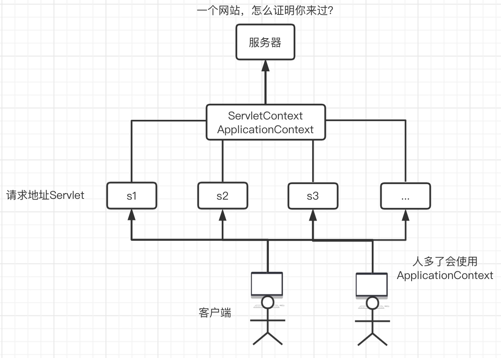

## 8. JSP

### 8.1 什么是JSP

Java Server Pages:  Java服务器端页面，也和Servlet一样，用于动态web技术！

最大的特点：

* 写JSP就像在写HTML
* 区别：
  * HTML只给用户提供静态的数据；
  * JSP页面中可以嵌入Java代码，为用户提供动态数据；

### 8.2 JSP原理

思路：JSP到底是怎么执行的！

* 代码层面没有任何问题
* 服务器内部工作
  * Tomcat中有一个work目录；
  * IDEA中使用Tomcat会在IDEA的Tomcat中生成一个work目录
* JSP被转成了java程序？

**浏览器向服务器发送请求，不管访问什么资源，其实都是在访问Servlet！**

JSP最终也会被转换成为一个Java类！

**JSP本质上就是一个Servlet（index_jsp.java源码分析）**

```java
//初始化
public void _jspInit() {}
//销毁
public void _jspDestroy() {}
//JSPService
public void _jspService(HttpServletRequest request, HttpServletResponse response)
```

1. 判断请求
2. 内置一些对象

```java
final javax.servlet.jsp.PageContext pageContext;	//页面上下文
javax.servlet.http.HttpSession session = null;		//session
final javax.servlet.ServletContext application;		//applicationCotext
final javax.servlet.ServletConfig config;					//config
javax.servlet.jsp.JspWriter out = null;						//out
final java.lang.Object page = this;								//page: 当前
HttpServletRequest request;												//请求
HttpServletResponse response;											//响应
```

3. 输出页面前增加的代码

```java
response.setContentType("text/html");							//设置响应的页面类型
pageContext = _jspxFactory.getPageContext(this, request, response, 
                                          null, true, 8192, true);
_jspx_page_context = pageContext;
application = pageContext.getServletContext();
config = pageContext.getServletConfig();
session = pageContext.getSession();
out = pageContext.getOut();
_jspx_out = out;
```

4. 以上的这些对象我们可以在JSP页面中直接使用！

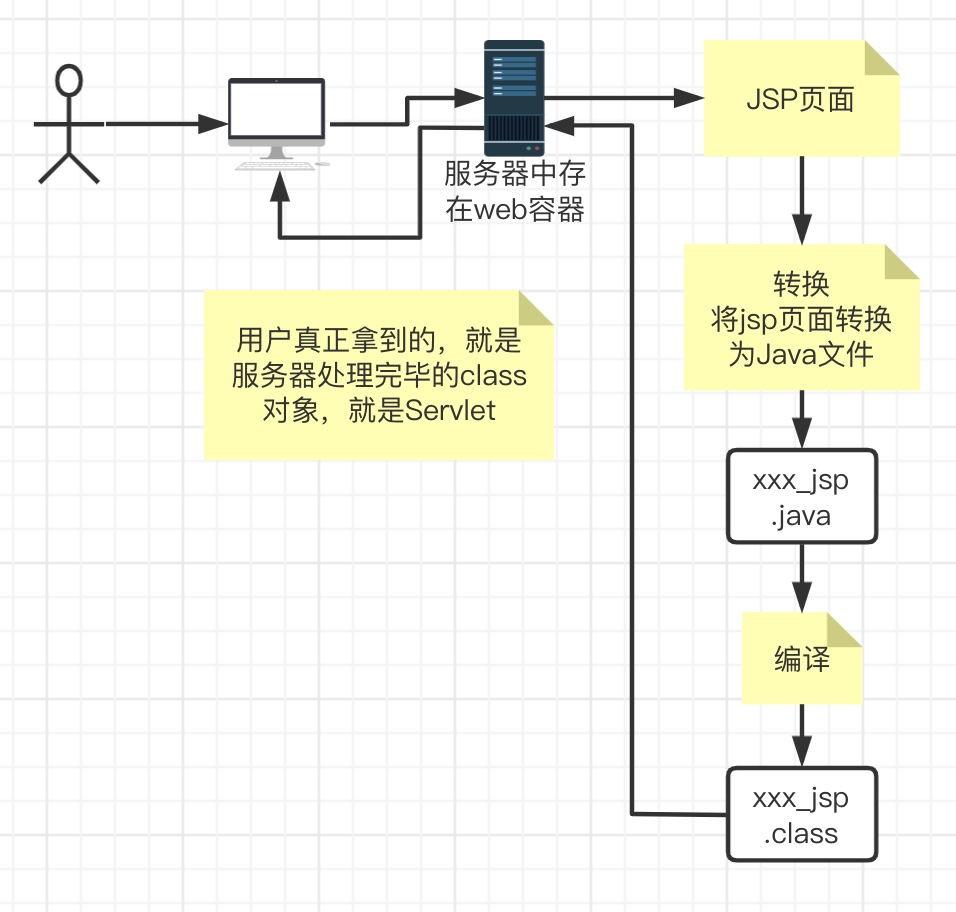

在JSP页面中，只要是Java代码就会原封不动的输出；如果是html代码，就会被转化为：

```java
out.write("<html>\r\n")
```

这样的格式输出到前端！

### 8.3 JSP基础语法

任何语言都有自己的语法，JSP作为java技术的一种应用，它拥有一些自己扩充的语法（了解，知道即可！）Java的语法都支持！

#### **JSP表达式**

```jsp
 <%-- JSP表达式
  作用：用来将程序的输出，输出到客户端
  <%= 变量或表达式%>
  --%>
  <%= new java.util.Date()%>
```

#### **JSP脚本片段**

```jsp
<%--JSP脚本片段--%>
  <%
    int sum = 0;
    for (int i = 1; i <= 100; i++) {
      sum += i;
    }
    out.println("<h1>sum="+sum+"</h");
  %>
```

#### **脚本片段的再实现**

```jsp
 <%
    int x = 10;
    out.println(x);
  %>
  <p>这是一个JSP文档</p>
  <%
    int y = 20;
    out.println(y);
  %>
  <hr>

<%--  在代码中嵌入HTML元素--%>
  <%
    for (int i = 0; i < 5; i++) {

  %>
  <h1>Hello, world! <%=i%></h1>
  <%
    }
  %>
```

#### JSP声明

```jsp
<%!
    static {
      System.out.println("Loading Servlet!");
    }
    private int globalVar = 0;

    public void kuang(){
      System.out.println("进入了方法kuang!");
    }
  %>
```

JSP声明：会被编译到JSP生成的Java类中！其他的，就会被生成到_jspService方法中！

在JSP，嵌入Java代码即可！

```jsp
<%%>
<%=%>
<%!%>
<%--注释--%>
```

JSP的注释，不会在客户端显示，HTML就会！

### 8.4 JSP指令

```jsp
<%@ page args... %>
<%@include file="" %>

<%--@include会将两个页面合二为一--%>

<%@include file="common/header.jsp"%>
<h1>网页主体</h1>
<%@include file="common/footer.jsp"%>
<hr>

<%--jsp标签
  	jsp:include:拼接页面，本质还是三个
  --%>
<jsp:include page="common/header.jsp"/>
<h1>网页主体</h1>
<jsp:include page="common/footer.jsp"/>
```

### 8.5 9大内置对象

* PageContext     存东西
* Request     存东西
* Response
* Session     存东西
* Application    [ServletContext]  存东西
* Config     [ServletConfig]
* out
* page   不用了解
* exception

```java
pageContext.setAttribute("name1","神州1号");  //保存的数据只在一个页面中有效
request.setAttribute("name2","神州2号");   //保存的数据只在一次请求中有效，请求转发会携带这个数据
session.setAttribute("name3","神州3号");   //保存的数据只在一个会话中有效，从打开浏览器到关闭浏览器
application.setAttribute("name4","神州4号"); //保存的数据在服务器中有效，从打开服务器到关闭服务器
//从底层到高层（作用域）：page-->request-->session-->application
```

request：客户端向服务器发送请求，产生的数据，用户看完就没用了，比如：新闻，用户看完没用的；

session：客户端向服务器发送请求，产生的数据，用户用完一会儿还有用，比如：购物车；

application：客户端向服务器发送请求，产生的数据，一个用户用完了，其他用户还可以使用，比如：聊天数据

### 8.6 JSP标签，JSTL标签，EL表达式

###### 需要添加的依赖

```xml
<dependencies>
  <!--Servlet 依赖-->
  <dependency>
    <groupId>javax.servlet</groupId>
    <artifactId>servlet-api</artifactId>
    <version>2.5</version>
  </dependency>
  <!--JSP 依赖-->
  <dependency>
    <groupId>javax.servlet.jsp</groupId>
    <artifactId>javax.servlet.jsp-api</artifactId>
    <version>2.3.3</version>
  </dependency>
  <!--JSTL表达式的依赖-->
  <dependency>
    <groupId>javax.servlet.jsp.jstl</groupId>
    <artifactId>jstl-api</artifactId>
    <version>1.2</version>
  </dependency>
  <!--standard标签库-->
  <dependency>
    <groupId>taglibs</groupId>
    <artifactId>standard</artifactId>
    <version>1.1.2</version>
  </dependency>
</dependencies>
<!--需要添加的依赖-->
```

##### **EL表达式**：${}

* **获取数据**
* **执行运算**
* **获取web开发的常用对象**
* ~~调用Java方法~~

##### **JSP标签**

```jsp
<%--jsp:include--%>
<%--
http://localhost:8080/jsptag.jsp?name=kuangshen&age=12
--%>
<jsp:forward page="jsptag2.jsp">
    <jsp:param name="name" value="kuangshen"/>
    <jsp:param name="age" value="12"/>
</jsp:forward>
```

##### **JSTL表达式**

JSTL标签的使用就是为了弥补HTML标签的不足！它自定义许多标签，可以供我们使用，标签的功能和Java代码一样。

###### 格式化标签

###### SQL标签

###### XML标签

###### 核心标签（掌握部分）

引用核心标签库的语法如下：

```jsp
<%@ taglib prefix="c" uri="http://java.sun.com/jsp/jstl/core" %>
```

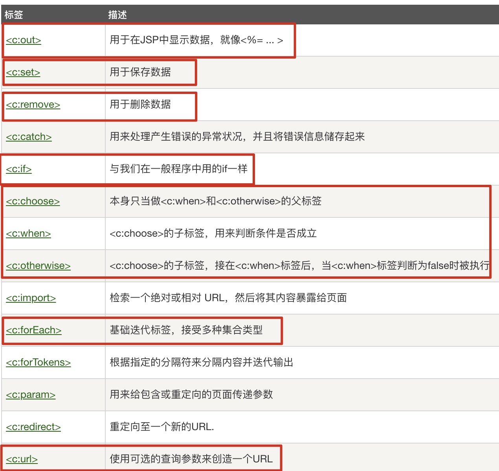

**JSTL标签库使用步骤：**

* 引入其中的taglib
* 使用其中的方法

c : if

```jsp
<%@ page contentType="text/html;charset=UTF-8" language="java" %>
<%--引入jstl标签库，我们才能使用jstl标签--%>
<%@ taglib prefix="c" uri="http://java.sun.com/jsp/jstl/core" %>
<html>
<head>
    <title>Title</title>
</head>
<body>

<h4>if测试</h4>
<hr>
<form action="coreif.jsp" method="get">
    <%--
    EL表达式获取表单中的数据
    ${param.参数名}
    --%>
    <input type="text" name="username" value="${param.username}">
        <input type="submit" value="登录">
</form>

<%--判断如果提交的用户名是管理员，则登录成功--%>
<c:if test="${param.username=='adimin'}" var="isAdmin">
    <c:out value="管理员欢迎您" />
</c:if>
  
<%--自闭合标签--%>
<c:out value="${isAdmin}" />

</body>
</html>

```

c : choose

```jsp
<c:set var="score" value="55"/>
<c:choose>
	<c:when test="${score>=90}">
  	你的成绩为优秀
  </c:when>
  <c:when test="${score>=80}">
  	你的成绩为良好
  </c:when>
  <c:when test="${score>=70}">
  	你的成绩为一般
  </c:when>
  <c:when test="${score<=60}">
  	你的成绩为不及格
  </c:when>
</c:choose>
```

c : forEach

```jsp
<%
	ArrayList<String> people = new ArrayList<>();
	people.add(0,"张三");
	people.add(1,"李四");
	people.add(2,"王五");
	people.add(3,"赵六");
	people.add(4,"钱七");
	request.setAttribute("list",people);
%>

<%--
 var, 每一次遍历出来的变量
 items, 要遍历的对象
 begin, 哪里开始
 end, 到哪里
 stemp, 步长
--%>
<c:forEach var="people" items="${list}">
	<c:out value="${people}" />  <br>
</c:forEach>

<hr>

<c:forEach var="people" items="${list}" begin="1" end="3" step="1" >
	<c:out value="${people}" /> <br>
</c:forEach>
```

## 9. JavaBean

实体类

JavaBean有特定的写法：

* 必须要有一个无参构造
* 属性必须私有化
* 必须有对应的get/set方法

一般用来和数据库的字段做映射 ORM

ORM：对象关系映射

* 表-->类
* 字段-->属性
* 行记录-->对象

**people表**

| Id   | Name    | Age  | Address |
| ---- | ------- | ---- | ------- |
| 1    | 长征1号 | 3    | 西安    |
| 2    | 长征2号 | 18   | 西安    |
| 3    | 长征3号 | 100  | 西安    |

```java
class People{
  private int id;
  private String name;
  private int age;
  private String address;
}
class A{
  new People(1,"长征1号"，3，"西安");
  new People(2,"长征2号"，18，"西安");
  new People(3,"长征3号"，100，"西安");
}
```

## 10. MVC三层架构

什么是MVC： Model, View, Controller 模型，视图，控制器

### 10.1 早些年架构

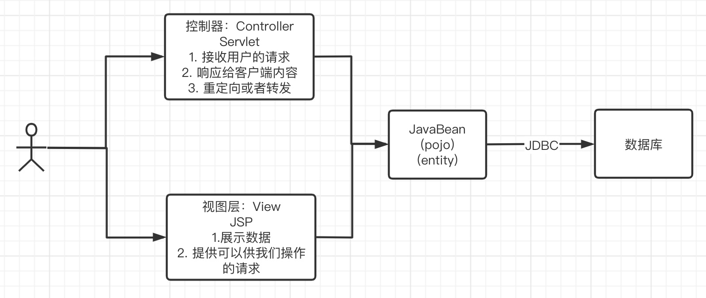

用户直接访问控制层，控制层就可以直接操作数据库：

```java
Servlet--CRUD-->数据库
弊端：程序十分臃肿，不利于维护（耦合度过高）
Servlet的代码中：处理请求，响应，视图跳转，处理JDBC，处理业务代码，处理逻辑代码
  
架构：没有什么是加一层解决不了的
程序员调用
  ｜
 JDBC
  ｜
MySQL, Oracle, sqlserver....
```

### 10.2 MVC三层架构

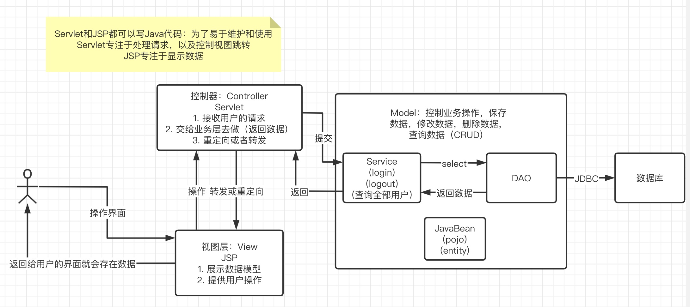

**Model**

* 业务处理：业务逻辑（service）
* 数据持久层：CRUD（DAO）

**View**

* 展示数据
* 提供链接，发起Servlet请求（a，form，img...）

**Controller**

* 接受用户请求：（req：请求参数，session信息）
* 交给业务层处理对应的代码
* 控制视图的跳转

```java
登录--->接收用户的登录请求--->处理用户的请求（获取用户登录的参数，usr,pwd）--->交给业务层处理登录业务（判断用户名密码是否正确：事务）--->DAO层查询用户名和密码是否正确--->数据库
```

## 11. Filter(重点)

Fliter：过滤器，用来过滤网站的数据；

* 处理中文乱码
* 登录验证...

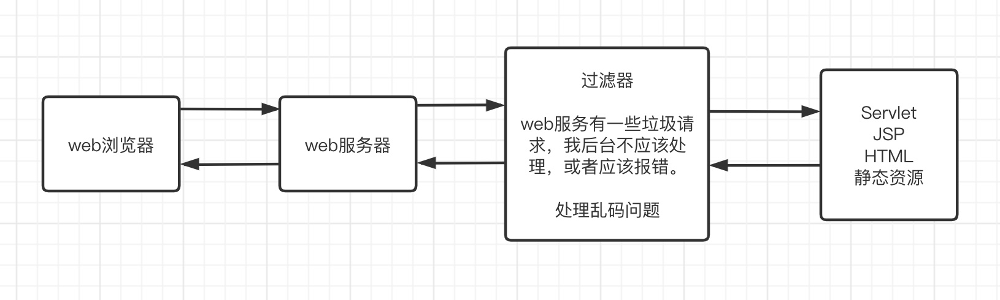

需要的依赖：

```xml
    <dependencies>
        <!--Servlet 依赖-->
        <dependency>
            <groupId>javax.servlet</groupId>
            <artifactId>servlet-api</artifactId>
            <version>2.5</version>
        </dependency>
        <!--JSP 依赖-->
        <dependency>
            <groupId>javax.servlet.jsp</groupId>
            <artifactId>javax.servlet.jsp-api</artifactId>
            <version>2.3.3</version>
        </dependency>
        <!--JSTL表达式的依赖-->
        <dependency>
            <groupId>javax.servlet.jsp.jstl</groupId>
            <artifactId>jstl-api</artifactId>
            <version>1.2</version>
        </dependency>
        <!--standard标签库-->
        <dependency>
            <groupId>taglibs</groupId>
            <artifactId>standard</artifactId>
            <version>1.1.2</version>
        </dependency>
        <!--连接数据库-->
        <dependency>
            <groupId>mysql</groupId>
            <artifactId>mysql-connector-java</artifactId>
            <version>5.1.47</version>
        </dependency>
    </dependencies>
```

Filter开发步骤：

1. 导包

2. 编写过滤器

   1. 导包不要错

      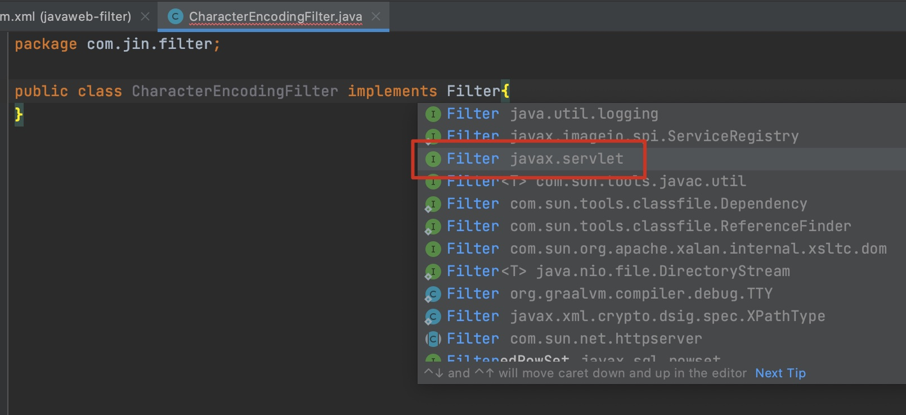

   2. 实现Fliter接口，重写对应的方法即可

   ```java
   public class CharacterEncodingFilter implements Filter {
       //初始化：web服务器启动时，就已经初始化了，随时等待过滤对象出现！
       public void init(FilterConfig filterConfig) throws ServletException {
           
           System.out.println("CharacterEncodingFilter初始化");
       }
       //chain：链
       /*
       1. 过滤器中的所有代码，在过滤特定请求的时候都会执行；
       2. 必须要让过滤器继续通行
           chain.doFilter(request,response);
        */
       public void doFilter(ServletRequest request, ServletResponse response, FilterChain chain) throws IOException, ServletException {
           request.setCharacterEncoding("utf-8");
           response.setContentType("text/html;charset=UTF-8");
   
           System.out.println("CharacterEncodingFilter执行前...");
           chain.doFilter(request,response); //让我们的请求继续走，如果不写，程序就到这里就被拦截停止！
           System.out.println("CharacterEncodingFilter执行后...");
       }
       //销毁：web服务器关闭的时候，过滤器会销毁
       public void destroy() {
           System.out.println("CharacterEncodingFilter销毁");
       }
   }
   ```

   3. 在web.xml中配置Filter

   ```xml
   <filter>
     <filter-name>characterEncodingFilter</filter-name>
     <filter-class>com.jin.filter.CharacterEncodingFilter</filter-class>
   </filter>
   <filter-mapping>
     <filter-name>characterEncodingFilter</filter-name>
     <!--只要是/servlet下面的任何请求，都会经过这个过滤器-->
     <url-pattern>/servlet/*</url-pattern>
   </filter-mapping>
   ```

## 12. Listener

监听器：实现一个监听器的接口；有N种

1. 编写一个监听器

   实现监听器的接口

```java
//统计网站在线人数：统计session
public class OnlineCountListener implements HttpSessionListener {
    //创建session的监听：看你的一举一动
    //一旦创建session就会触发一次这个事件
    @Override
    public void sessionCreated(HttpSessionEvent se) {
        ServletContext ctx = se.getSession().getServletContext();
        Integer onlineCount = (Integer) ctx.getAttribute("OnlineCount");

        if (onlineCount==null) {
            onlineCount = 1;
        } else {
            onlineCount++;
        }

        ctx.setAttribute("OnlineCount",onlineCount);
    }
    //销毁session的监听
    //一旦销毁session就会触发一次这个事件
    @Override
    public void sessionDestroyed(HttpSessionEvent se) {
        ServletContext ctx = se.getSession().getServletContext();
//        se.getSession().invalidate();
        Integer onlineCount = (Integer) ctx.getAttribute("OnlineCount");

        if (onlineCount==null) {
            onlineCount = 0;
        } else {
            onlineCount--;
        }
        ctx.setAttribute("OnlineCount",onlineCount);
    }
    /*
    Session销毁
    1. 手动销毁 se.getSession().invalidate();
    2. 自动销毁
     */
}
```

2. web.xml中注册监听器

```xml
<!--注册监听器-->
<listener>
  <listener-class>com.jin.listener.OnlineCountListener</listener-class>
</listener>
```

3. 看情况是否使用

## 13. 过滤器，监听器常见应用

**监听器：GUI编程中经常使用**

```java
public class TestPanel {
    public static void main(String[] args) {
        Frame frame = new Frame("中秋节快乐");//窗体
        Panel panel = new Panel(null);//面板
        frame.setLayout(null);//设置窗体布局

        frame.setBounds(300,300,500,500);
        frame.setBackground(new Color(0,0,255));//设置背景颜色
        panel.setBounds(50,50,300,300);
        panel.setBackground(new Color(0,255,0));

        frame.add(panel);
        frame.setVisible(true);

        //监听关闭事件
        frame.addWindowListener(new WindowAdapter() {
            @Override
            public void windowClosing(WindowEvent e) {
                super.windowClosing(e);
            }
        });
    }
}
```

用户登录之后才能进入首页！用户注销后就不能进入主页了！

1. 用户登录之后，向session中放入用户的数据；
2. 进入主页的时候要判断用户是否已经登录；要求：在过滤器中实现！

```java
public void doFilter(ServletRequest req, ServletResponse resp, FilterChain chain) throws IOException, ServletException {
        HttpServletRequest request = (HttpServletRequest) req;
        HttpServletResponse response = (HttpServletResponse) resp;
        if(request.getSession().getAttribute(Constant.USER_SESSION)==null) {
            response.sendRedirect("/error.jsp");
        }
        chain.doFilter(req,resp);
    }
```

## 14. JDBC

什么是JDBC：Java连接数据库！

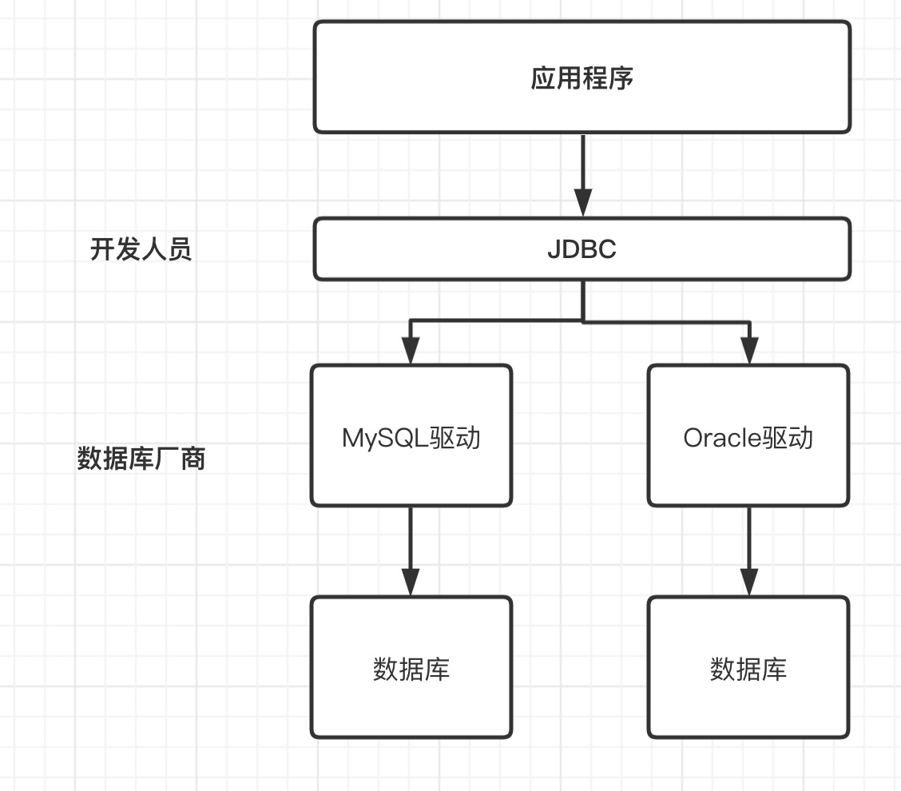

需要jar包的支持：

* java.sql
* Javax.sql
* Mysql-connctor-java... 连接驱动（必须要导入）

##### **实验环境搭建**

```mysql
CREATE TABLE users{
	id INT PRIMARY KEY,
	`name` VARCHAR(40),
	`password` VARCHAR(40),
	email VARCHAR(60),
	birthday DATE
}

INSERT INTO users(id,`name`,`password`,email,birthday)
VALUES(1,'张三','123456','zs@qq.com','2000-01-01');
INSERT INTO users(id,`name`,`password`,email,birthday)
VALUES(2,'李四','123456','ls@qq.com','2000-01-01');
INSERT INTO users(id,`name`,`password`,email,birthday)
VALUES(3,'王五','123456','ww@qq.com','2000-01-01');

SELECT * FROM users;
```

导入数据包依赖

```xml
<!--mysql的驱动,8.0适用于java8, 5.0适用于java5-->
<dependency>
  <groupId>mysql</groupId>
  <artifactId>mysql-connector-java</artifactId>
  <version>8.0.23</version>
</dependency>
```

IDEA连接数据库（右上角database)


##### **JDBC固定步骤：**

1. 加载驱动
2. 连接数据库，（connection）代表数据库
3. 向数据库发送SQL的对象Statement, PreparedStatement: CRUD
4. 编写SQL（根据业务，不同的SQL）
5. 执行查询SQL（可返回一个结果集）
6. 关闭连接

```java
public static void main(String[] args) throws ClassNotFoundException, SQLException {
        //配置信息
        //useUnicode=true&characterEncoding=utf8 解决中文乱码
        String url = "jdbc:mysql://localhost:3306/jdbc?useUnicode=true&characterEncoding=UTF-8&useSSL=True";
        String username = "root";
        String password = "123456";

        //1. 加载驱动
        Class.forName("com.mysql.cj.jdbc.Driver");
        //2. 连接数据库,代表数据库
        Connection connection = DriverManager.getConnection(url, username, password);
        //3. 向数据库发送SQL的对象statement: CRUD
        Statement statement = connection.createStatement();
        //4. 编写SQL
        String sql = "select * from users";
        //5. 执行查询SQL，返回一个结果集
        ResultSet rs = statement.executeQuery(sql);
        while (rs.next()) {
            System.out.println("id=" + rs.getObject("id"));
            System.out.println("name=" + rs.getObject("name"));
            System.out.println("password=" + rs.getObject("password"));
            System.out.println("email=" + rs.getObject("email"));
            System.out.println("birthday=" + rs.getObject("birthday"));
        }
        //6. 关闭连接，释放资源（一定要做），先开后关
        rs.close();
        statement.close();
        connection.close();
    }
```

预编译SQL：

```java
public static void main(String[] args) throws Exception {
    //配置信息
    //useUnicode=true&characterEncoding=utf8 解决中文乱码
    String url = "jdbc:mysql://localhost:3306/jdbc?useUnicode=true&characterEncoding=UTF-8&useSSL=True";
    String username = "root";
    String password = "123456";

    //1. 加载驱动
    Class.forName("com.mysql.cj.jdbc.Driver");
    //2. 连接数据库,代表数据库
    Connection connection = DriverManager.getConnection(url, username, password);
    //3. 编写SQL
    String sql = "insert into users(id,name,password,email,birthday) values (?,?,?,?,?)";
    //4. 预编译
    PreparedStatement preparedStatement = connection.prepareStatement(sql);
    preparedStatement.setInt(1,4);
    preparedStatement.setString(2,"狂神说");
    preparedStatement.setString(3,"123456");
    preparedStatement.setString(4,"24736743@qq.com");
    preparedStatement.setDate(5,new Date(new java.util.Date().getTime()));
    //执行SQL
    int i = preparedStatement.executeUpdate();
    if (i>0){
        System.out.println("插入成功");
    }

    //6. 关闭连接，释放资源（一定要做），先开后关
    preparedStatement.close();
    connection.close();
}
```

##### 事务

要么都成功，要么都失败！

ACID原则，保证数据的安全。

```java
	开启事务
  事务提交 commit()
  事务回滚 rollback()
  关闭事务
    
  转账：
  A:1000							A(900) --100--> B(1100)
  B:1000
```

```java
Connection connection = null;
        try {
            //1. 加载驱动
            Class.forName("com.mysql.cj.jdbc.Driver");
            //2. 连接数据库,代表数据库
            connection = DriverManager.getConnection(url, username, password);
            //3. 通知数据库开启事务 false是开启
            connection.setAutoCommit(false);
            String sql = "update account set money = money-100 where name = 'A'";
            connection.prepareStatement(sql).executeUpdate();
            //制造错误
            int i =1/0;
            String sql2 = "update account set money = money+100 where name = 'B'";
            connection.prepareStatement(sql2).executeUpdate();
            connection.commit(); //以上两条SQL都执行成功了，就提交事务！
            System.out.println("提交成功");
        } catch (Exception e) {
            try {
                //如果出现异常，就通知数据库回滚事务
                connection.rollback();
            } catch (SQLException throwables) {
                throwables.printStackTrace();
            }
            e.printStackTrace();
        }finally {
            try {
                connection.close();
            } catch (SQLException throwables) {
                throwables.printStackTrace();
            }
        }
```

##### Junit 单元测试

依赖

```xml
<!--单元测试-->
<dependency>
  <groupId>junit</groupId>
  <artifactId>junit</artifactId>
  <version>4.12</version>
</dependency>
```

简单使用

@Test注解只有在方法上有效，只要加了这个注解的方法，就可以直接运行

```java
@Test
    public void test(){
        System.out.println("Hello");
    }
```

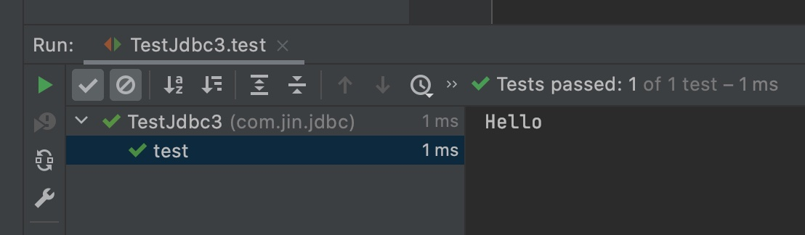

失败时为红色：

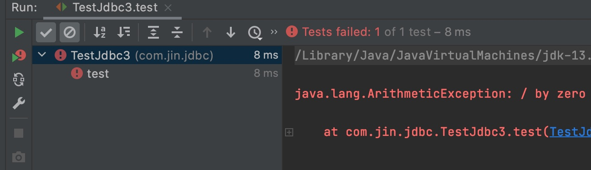

搭建一个环境


## 15. 文件上传和下载（不用特别记）

在web应用中，文件上传和下载功能是非常重要的功能，今天来讲一下JavaWeb中的文件上传和下载功能的实现。

### 1. 准备工作

对于文件上传，浏览器在上传的过程中是将文件以流的形式提交到服务器端的。

一般选择采用apache的开源工具commons-fileupload这个文件上传组件。

commons-fileupload是依赖于commons-io这个包的，所以还需要下载这个包。

###### 我们下载最新的包

[Maven Repository: commons-io » commons-io (mvnrepository.com)](https://mvnrepository.com/artifact/commons-io/commons-io)

[Maven Repository: commons-fileupload » commons-fileupload (mvnrepository.com)](https://mvnrepository.com/artifact/commons-fileupload/commons-fileupload)

在JavaWeb项目中导入jar包

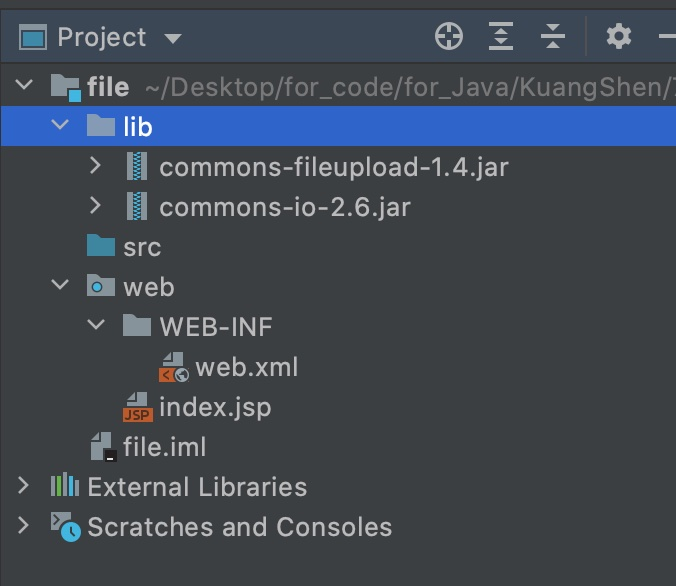

【注意：使用IDEA导包时需要注意修复路径，将lib添加到项目输出目录】

### 2. 使用类介绍

==【文件上传到注意事项】==

1. 为保证服务器安全，上传文件应该放在外界无法直接访问的目录下，比如放于WEB-INF目录下；
2. 为防止文件覆盖的现象发生，要为上传文件产生一个唯一的文件名；
   * 时间戳，UUID，md5，位运算算法
3. 要限制上传文件的最大值；
4. 可以限制上传文件的类型，在收到上传文件名时，判断后缀是否合法。

【需要用到的类详解】

**ServletFileUpload**负责处理上传的文件数据，并将表单中每个输入项封装成一个**FileItem**对象，在使用ServletFileUpload对象解析请求时需要**DiskFileItemFactory**对象。所以，我们需要在进行解析工作前构造好DiskFileItemFactory对象，通过ServletFileUpload对象的构造方法或setFileItemFactory()方法设置ServletFileUpload对象的**fileItemFactory**属性

#### FileItem类

在HTML页面input必须有name``<input type="file" name="filename">`

**表单如果包含一个文件上传输入项的话，这个表单的enctype属性就必须设置为multipart/form-data**

```jsp
<%--通过表单上传文件
      get: 上传文件大小有限制
      post: 上传文件大小没有限制
  --%>
<form action="${pageContext.request.contextPath}/upload.do" enctype="multipart/form-data" method="post">
    上传用户：<input type="text" name="username"><br/>
    上传文件1：<input type="file" name="file1"><br/>
    上传文件2：<input type="file" name="file2"><br/>
    <input type="submit" value="提交">
</form>
```

浏览器表单的类型如果为multipart/form-data，在服务器端想获取数据就要通过流。

【常用方法介绍】

```java
//isFormField方法用于判断FileItem类对象封装的数据是一个普通文本表单
//还是一个文件表单，如果是普通表单字段则返回true,否则返回false
boolean isFormField();

//getFiledName方法用于返回表单标签name属性的值
String getFiledName();
//getString方法用于将FileItem对象中保存的数据流内容以一个字符串返回
String getString();

//getName方法用于获得文件上传字段中的文件名
String getName();

//以流的形式返回上传文件的数据内容
InputStream getInputStream();

//delete方法用于清空FileItem类对象中存放的主体内容
//如果主题内容被保存在临时文件中，delete方法将删除该临时文件。
void delete();
```

#### ServletFileUpload类

ServletFileUpload负责处理上传的文件数据，并将表单中每个输入项封装成一个FileItem对象中，使用其**parseRequest(HttpServletRequest)方法**可以将表单中每一个HTML标签提交的数据封装成一个FileItem对象，然后该方法处理上传文件简单易用。

### 3. 代码编写

###### UploadFileServlet

```java
 protected void doGet(HttpServletRequest req, HttpServletResponse resp) throws ServletException, IOException {
        //判断上传的文件是普通表单还是带文件的表单
        if (ServletFileUpload.isMultipartContent(req)) {
            return; //终止方法运行，说明这是一个普通的表单，直接返回
        }

        try {
        //创建上传文件的保存路径，建议在WEB-INF路径下，安全，用户无法直接访问的文件
        String uploadPath = this.getServletContext().getRealPath("/WEB_INF/uplaod");
        File uploadFile = new File(uploadPath);
        if (!uploadFile.exists()) {
            uploadFile.mkdir(); //创建这个目录
        }

        //缓存，临时文件
        //临时路径，假如文件超过了预期的大小，我们就把他放到一个临时的文件中，过几天自动删除，或者提醒用户转存为永久
        String tmpPath = this.getServletContext().getRealPath("/WEB_INF/uplaod");
        File file = new File(tmpPath);
        if (!file.exists()) {
            file.mkdir(); //创建这个目录
        }

        //处理上传的文件，一般都需要通过流来获取，我们可以使用request.getInputStream()，原生态的文件上传流获取，十分麻烦
        //但是我们都建议使用Apache的文件上传组件来实现，common0-fileupload，它需要依赖于common-io组件

        /*
         *ServletFileUpload**负责处理上传的文件数据，并将表单中每个输入项封装成一个FileItem对象，
         * 在使用ServletFileUpload对象解析请求时需要DiskFileItemFactory对象。
         * 所以，我们需要在进行解析工作前构造好DiskFileItemFactory对象，
         * 通过ServletFileUpload对象的构造方法或setFileItemFactory()方法设置ServletFileUpload对象的fileItemFactory属性
         */
        //1.创建DiskFileItemFactory对象，处理文件上传路径或者大小限制的；
        DiskFileItemFactory factory = new DiskFileItemFactory();
//        //通过这个工厂设置一个缓存区，当上传的文件大于这个缓存区的时候，将他放到临时文件中
//        factory.setSizeThreshold(1024*1024);//缓存区大小为1M
//        factory.setRepository(file);//临时目录的保存目录，需要一个File

        //2. 获取ServletFileUpload
        ServletFileUpload upload = new ServletFileUpload(factory);

        //3. 处理上传的文件
        //把前端请求解析，封装成一个FileItem对象，需要从ServletFileUpload对象中获取
            List<FileItem> fileItems = upload.parseRequest(req);
            //fileItem 每一个表单对象
            for (FileItem fileItem: fileItems) {
                //判断上传的文件是普通的表单还是带文件的表单
                if (fileItem.isFormField()) {
                    //getFileName指的是前端表单空间的name
                    String name = fileItem.getFieldName();
                    String value = fileItem.getString("UTF-8"); //处理乱码
                    System.out.println(name+":"+value);
                } else { //文件
                    //================处理文件=================
                    String uploadFileName = fileItem.getName();
                    //可能存在文件名不合法的情况
                    if (uploadFileName==null || uploadFileName.trim().equals("")) {
                        continue;
                    }

                    //获得上传的文件名 /images/girl/paojie.jpg
                    String fileName = uploadFileName.substring(uploadFileName.lastIndexOf("/")+1);
                    //获得文件的后缀名
                    String fileExtName = uploadFileName.substring(uploadFileName.lastIndexOf(".")+1);

                    //可以使用UUID（唯一识别的通用码），博阿政文件名唯一；
                    //UUID.randomUUID(),随机生成一个唯一识别的通用码；

                    //网络传输中的东西，都需要序列化
                    //POJO，实体类，如果想要在多个电脑上运行，传输===>就需要把对象序列化了
                    // JNI = Java Native Interface
                    //implements Serializable : 标记接口，JVM ---> 本地方法栈 native --> c++
                    String uuidPath = UUID.randomUUID().toString();
                    //================存放地址=================
                    //存到哪？ uploadPath
                    //文件真实存在的路径 realPath
                    String realPath = uploadPath+"/"+uuidPath;
                    //给每个文件创建一个对应的文件夹
                    File realPathFile = new File(realPath);
                    if (!realPathFile.exists()) {
                        realPathFile.mkdir();
                    }

                    //================文件传输=================
                    //获得文件上传的流
                    InputStream inputStream = fileItem.getInputStream();
                    //创建一个文件的输入流
                    //realPath = 真实的文件夹
                    //差了一个文件，加上输出文件的名字+"/"+uuidFileName
                    FileOutputStream fos = new FileOutputStream(realPath+"/"+fileName);
                    
                    //创建一个缓冲区
                    byte[] buffer = new byte[1024*1024];
                    
                    //判断是否读取完毕
                    int len = 0;
                    //如果大于0说明还存在数据
                    while ((len=inputStream.read(buffer))>0){
                        fos.write(buffer,0,len);
                    }
                    //关闭流
                    fos.close();
                    inputStream.close();
                    
                    msg = "文件上传成功";
                    fileItem.delete(); //上传成功，清除临时文件
                }
            }

        } catch (FileUploadException e) {
            e.printStackTrace();
        }
    }
```

## 16. 邮件发送（代码）

```java
//发送一封简单的邮件
Properties prop = new Properties();
prop.setProperty("mail.host","smtp.qq.com"); //设置qq邮件服务器
prop.setProperty("mail.transport.protocol","smtp"); //邮件发送协议
prop.setProperty("mail.smtp.auth","true"); //需要验证用户名密码

//关于QQ邮箱，还要设置SSL加密，加上一下代码即可，大厂，其他邮箱不需要！
MailSSLSocketFactory sf = new MailSSLSocketFactory();
sf.setTrustAllHosts(true);
prop.put("mail.smtp.ssl.enable","true");
prop.put("mail.smtp.ssl.socketFactory",sf);

//使用JavaMail发送邮件的5个步骤

//1.创建定义整个应用程序所需的环境信息的Session对象
Session session = Session.getDefaultInstance(prop, new Autheticator() {
    public PasswordAuthentication getPasswordAuthentication() {
        //发件人邮件用户名，授权码
        return new PasswordAuthentication("23736743@qq.com","vjpiuwvenqjpcaji");
    }
});

//2.通过session得到transport对象
Transport ts = session.getTransport();

//3.使用邮箱的用户名和授权码连上邮件服务器
ts.connect("stmp.qq.com","23736743@qq.com","vjpiuwvenqjpcaji");

//4.创建邮件：写邮件
MimeMessage message = new MimeMessage(session);
//指明邮件的发件人
message.setFrom(new InternetAddress("23736743@qq.com"));
//指明邮件的收件人，现在发件人和收件人是一样的，那就是自己给自己发
message.setRecipient(Message.RecipientType.TO, new InternetAddress("23736743@qq.com"));
//邮件的标题
message.setSubject("只包含文本的简单邮件"); 
//邮件的文本内容
message.setContent("你好啊！"，"text/html;charset=UTF-8");

//5.发送邮件
ts.sendMessage(message,message.getAllRecipient());

//关闭连接
ts.close();
```

