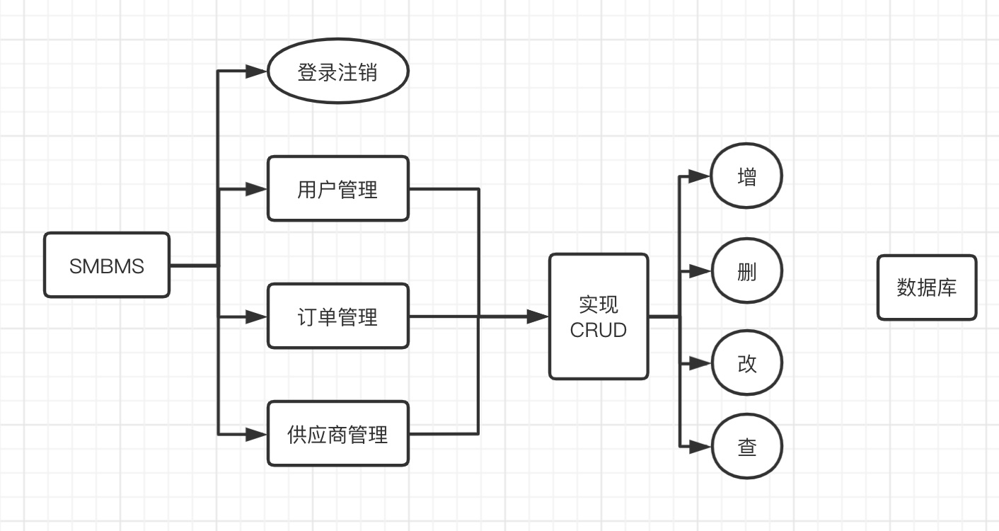
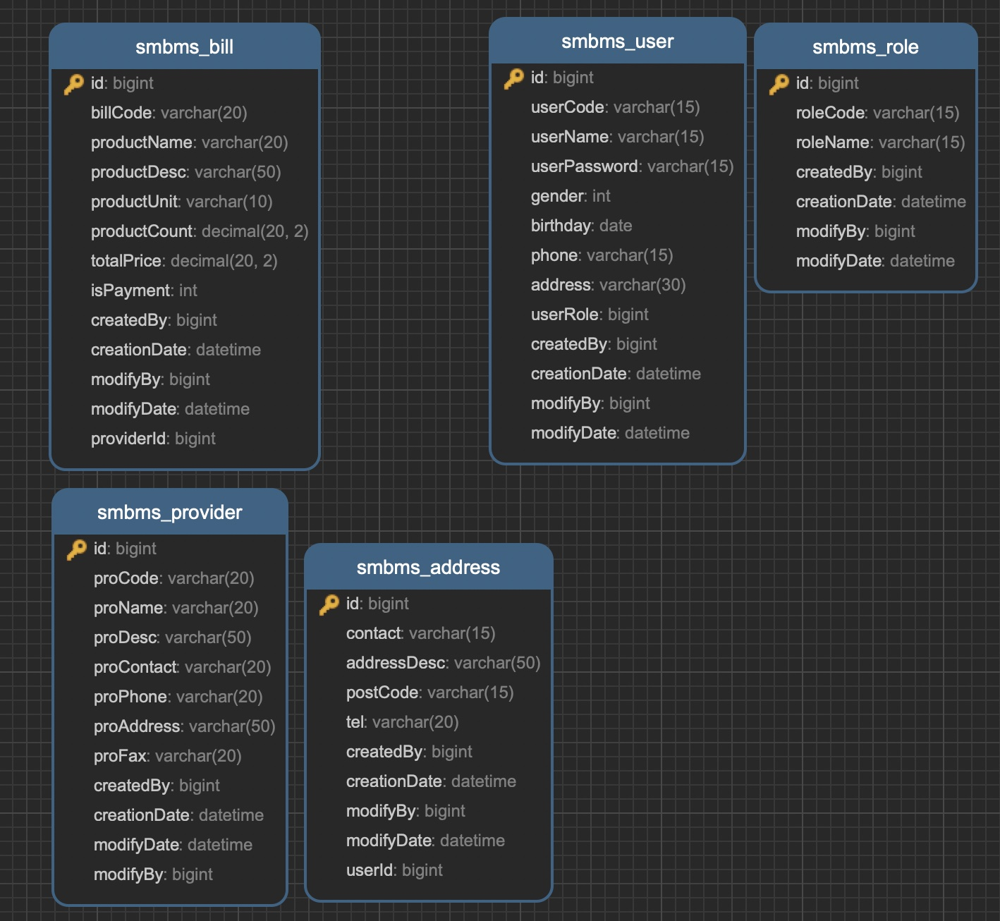
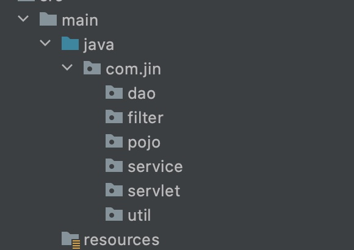
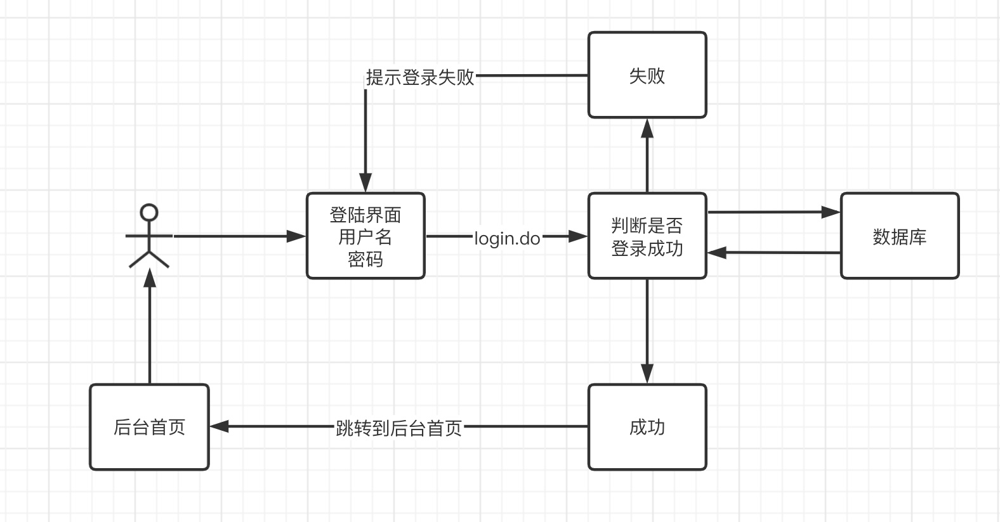

# SMBMS

Small/Mid-sized Business Management System 中小型交易管理系统（超市管理系统）



数据库



**项目如何搭建?**

考虑使用不使用Maven? 依赖，jar

## 项目搭建准备工作

1. 搭建一个Maven Web项目

2. 配置Tomcat

3. 测试项目是否能够跑起来

4. 导入项目中会遇到的jar包

   * Jsp, Servlet, mysql驱动, jstl, standard...

5. 创建项目包结构

   

6. 连接数据库

7. 编写实体类

   * ORM映射：表-类映射

8. 编写基础公共类

   1. 数据库配置文件

   ```properties
   driver=com.mysql.cj.jdbc.Driver
   url=jdbc:mysql://localhost:3306/smbms?userUnicode=true&characterEncoding=utf-8&useSSL=true
   username=root
   password=123456
   ```

   2. 编写数据库的公共类

   ```java
   package com.jin.dao;
   
   import java.io.IOException;
   import java.io.InputStream;
   import java.sql.*;
   import java.util.Properties;
   
   //操作数据库的公共类
   public class BaseDao {
       private static String driver;
       private static String url;
       private static String username;
       private static String password;
   
       //静态代码块，类加载的时候就初始化了
       static {
           Properties properties = new Properties();
           //通过类加载器读取对应的资源
           InputStream is = BaseDao.class.getClassLoader().getResourceAsStream("db.properties");
   
           try {
               properties.load(is);
           } catch (IOException e) {
               e.printStackTrace();
           }
   
           driver = properties.getProperty("driver");
           url = properties.getProperty("url");
           username = properties.getProperty("username");
           password = properties.getProperty("password");
       }
       //获取数据库的连接
       public static Connection getConnection() {
           Connection connection = null;
           try {
               Class.forName(driver);
               connection = DriverManager.getConnection(url, username, password);
           } catch (Exception e) {
               e.printStackTrace();
           }
           return connection;
       }
   
       //编写查询公共方法, 提出所有参数方便统一初始化和关闭
       public static ResultSet execute(Connection connection, String sql, Object[] params, ResultSet resultSet, PreparedStatement preparedStatement) throws SQLException {
           //预编译的sql，在后面直接执行就可以了
           preparedStatement = connection.prepareStatement(sql);
   
           for (int i = 0; i < params.length; i++) {
               //setObject，占位符从1开始，但是数组从0开始！
               preparedStatement.setObject(i+1, params[i]);
           }
           resultSet = preparedStatement.executeQuery();
           return resultSet;
       }
   
       //编写增删改公共方法
       public static int execute(Connection connection, String sql, Object[] params, PreparedStatement preparedStatement) throws SQLException {
           preparedStatement = connection.prepareStatement(sql);
   
           for (int i = 0; i < params.length; i++) {
               //setObject，占位符从1开始，但是数组从0开始！
               preparedStatement.setObject(i+1, params[i]);
           }
           int updateRows = preparedStatement.executeUpdate();
           return updateRows;
       }
   
       //释放资源
       public static boolean closeResource(Connection connection, PreparedStatement preparedStatement, ResultSet resultSet) {
           boolean flag = true;
           if (resultSet != null) {
               try {
                   resultSet.close();
                   //GC回收
                   resultSet = null;
               } catch (SQLException e) {
                   e.printStackTrace();
                   flag = false;
               }
           }
           if (preparedStatement != null) {
               try {
                   preparedStatement.close();
                   //GC回收
                   preparedStatement = null;
               } catch (SQLException e) {
                   e.printStackTrace();
                   flag = false;
               }
           }
           if (connection != null) {
               try {
                   connection.close();
                   //GC回收
                   connection = null;
               } catch (SQLException e) {
                   e.printStackTrace();
                   flag = false;
               }
           }
   
           return flag;
       }
   }
   ```

   3. 编写字符编码过滤器

9. 导入静态资源（css, js, images, calendar)

## 登录功能实现



1. 编写前端页面

2. 设置首页

```xml
<!--设置欢迎界面-->
<welcome-file-list>
  <welcome-file>login.jsp</welcome-file>
</welcome-file-list>
```

3. 编写dao层登录用户登录的接口

```java
//得到登录的用户
    public User getLoginUser(Connection connection, String userCode) throws SQLException;
```

4. 编写dao接口的实现类

```java
public class UserDaoImpl implements UserDao {
    @Override
    public User getLoginUser(Connection connection, String userCode) throws SQLException {
        PreparedStatement pstm = null;
        ResultSet rs = null;
        User user = null;
        if (connection != null) {
            String sql = "select * from smbms_user where userCode=?";
            Object[] params = {userCode};

            rs = BaseDao.execute(connection, pstm, rs, sql, params);
            if (rs.next()) {
                user = new User();
                user.setId(rs.getInt("id"));
                user.setUserCode(rs.getString("userCode"));
                user.setUserName(rs.getString("userName"));
                user.setUserPassword(rs.getString("userPassword"));
                user.setGender(rs.getInt("gender"));
                user.setBirthday(rs.getDate("birthday"));
                user.setPhone(rs.getString("phone"));
                user.setAddress(rs.getString("address"));
                user.setUserRole(rs.getInt("userRole"));
                user.setCreatedBy(rs.getInt("createdBy"));
                user.setCreationDate(rs.getTimestamp("creationDate"));
                user.setModifyBy(rs.getInt("modifyBy"));
                user.setModifyDate(rs.getTimestamp("modifyDate"));
            }
            //连接可能存在事务，在业务层调事务时再处理
            BaseDao.closeResource(null, pstm, rs);

        }
        return user;
    }
}
```