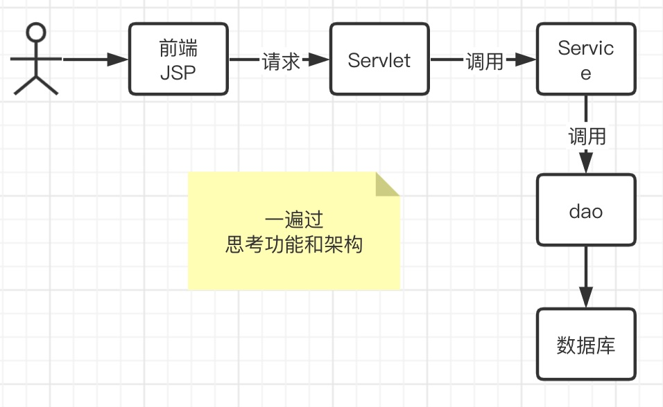
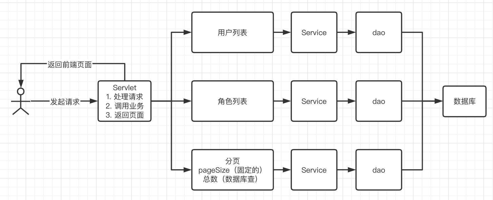

# SMBMS

Small/Mid-sized Business Management System 中小型交易管理系统（超市管理系统）


数据库


**项目如何搭建?**

考虑使用不使用Maven? 依赖，jar

**架构要先理清，MVC三层架构：**


**Filter的作用：**


**Servlet运行原理：**


**可用于存储的内置对象：**

```java
pageContext.setAttribute("name1","神州1号");  //保存的数据只在一个页面中有效
request.setAttribute("name2","神州2号");   //保存的数据只在一次请求中有效，请求转发会携带这个数据
session.setAttribute("name3","神州3号");   //保存的数据只在一个会话中有效，从打开浏览器到关闭浏览器
application.setAttribute("name4","神州4号"); //保存的数据在服务器中有效，从打开服务器到关闭服务器
//从底层到高层（作用域）：page-->request-->session-->application
```


## 项目搭建准备工作

1. 搭建一个Maven Web项目

2. 配置Tomcat

3. 测试项目是否能够跑起来

4. 导入项目中会遇到的jar包

   * Jsp, Servlet, mysql驱动, jstl, standard...

5. 创建项目包结构

   

6. 连接数据库

7. 编写实体类

   * ORM映射：表-类映射

8. 编写基础公共类

   1. 数据库配置文件

   ```properties
   driver=com.mysql.cj.jdbc.Driver
   url=jdbc:mysql://localhost:3306/smbms?userUnicode=true&characterEncoding=utf-8&useSSL=true
   username=root
   password=123456
   ```

   2. 编写数据库的公共类

   ```java
   package com.jin.dao;
   
   import java.io.IOException;
   import java.io.InputStream;
   import java.sql.*;
   import java.util.Properties;
   
   //操作数据库的公共类
   public class BaseDao {
     private static String driver;
     private static String url;
     private static String username;
     private static String password;
   
     //静态代码块，类加载的时候就初始化了
     static {
       Properties properties = new Properties();
       //通过类加载器读取对应的资源
       InputStream is = BaseDao.class.getClassLoader().getResourceAsStream("db.properties");
   
       try {
         properties.load(is);
       } catch (IOException e) {
         e.printStackTrace();
       }
   
       driver = properties.getProperty("driver");
       url = properties.getProperty("url");
       username = properties.getProperty("username");
       password = properties.getProperty("password");
     }
     //获取数据库的连接
     public static Connection getConnection() {
       Connection connection = null;
       try {
         Class.forName(driver);
         connection = DriverManager.getConnection(url, username, password);
       } catch (Exception e) {
         e.printStackTrace();
       }
       return connection;
     }
   
     //编写查询公共方法, 提出所有参数方便统一初始化和关闭
     public static ResultSet execute(Connection connection, String sql, Object[] params, ResultSet resultSet, PreparedStatement preparedStatement) throws SQLException {
       //预编译的sql，在后面直接执行就可以了
       preparedStatement = connection.prepareStatement(sql);
   
       for (int i = 0; i < params.length; i++) {
         //setObject，占位符从1开始，但是数组从0开始！
         preparedStatement.setObject(i+1, params[i]);
       }
       resultSet = preparedStatement.executeQuery();
       return resultSet;
     }
   
     //编写增删改公共方法
     public static int execute(Connection connection, String sql, Object[] params, PreparedStatement preparedStatement) throws SQLException {
       preparedStatement = connection.prepareStatement(sql);
   
       for (int i = 0; i < params.length; i++) {
         //setObject，占位符从1开始，但是数组从0开始！
         preparedStatement.setObject(i+1, params[i]);
       }
       int updateRows = preparedStatement.executeUpdate();
       return updateRows;
     }
   
     //释放资源
     public static boolean closeResource(Connection connection, PreparedStatement preparedStatement, ResultSet resultSet) {
       boolean flag = true;
       if (resultSet != null) {
         try {
           resultSet.close();
           //GC回收
           resultSet = null;
         } catch (SQLException e) {
           e.printStackTrace();
           flag = false;
         }
       }
       if (preparedStatement != null) {
         try {
           preparedStatement.close();
           //GC回收
           preparedStatement = null;
         } catch (SQLException e) {
           e.printStackTrace();
           flag = false;
         }
       }
       if (connection != null) {
         try {
           connection.close();
           //GC回收
           connection = null;
         } catch (SQLException e) {
           e.printStackTrace();
           flag = false;
         }
       }
   
       return flag;
     }
   }
   ```

   3. 编写字符编码过滤器

9. 导入静态资源（css, js, images, calendar)

## 登录功能实现


1. 编写前端页面

2. 设置首页

```xml
<!--设置欢迎界面-->
<welcome-file-list>
  <welcome-file>login.jsp</welcome-file>
</welcome-file-list>
```

3. 编写dao层登录用户登录的接口

```java
//得到登录的用户
    public User getLoginUser(Connection connection, String userCode) throws SQLException;
```

4. 编写dao接口的实现类

```java
public class UserDaoImpl implements UserDao {
  @Override
  public User getLoginUser(Connection connection, String userCode) throws SQLException {
    PreparedStatement pstm = null;
    ResultSet rs = null;
    User user = null;
    if (connection != null) {
      String sql = "select * from smbms_user where userCode=?";
      Object[] params = {userCode};

      rs = BaseDao.execute(connection, pstm, rs, sql, params);
      if (rs.next()) {
        user = new User();
        user.setId(rs.getInt("id"));
        user.setUserCode(rs.getString("userCode"));
        user.setUserName(rs.getString("userName"));
        user.setUserPassword(rs.getString("userPassword"));
        user.setGender(rs.getInt("gender"));
        user.setBirthday(rs.getDate("birthday"));
        user.setPhone(rs.getString("phone"));
        user.setAddress(rs.getString("address"));
        user.setUserRole(rs.getInt("userRole"));
        user.setCreatedBy(rs.getInt("createdBy"));
        user.setCreationDate(rs.getTimestamp("creationDate"));
        user.setModifyBy(rs.getInt("modifyBy"));
        user.setModifyDate(rs.getTimestamp("modifyDate"));
      }
      //连接可能存在事务，在业务层调事务时再处理
      BaseDao.closeResource(null, pstm, rs);

    }
    return user;
  }
}
```

5. 业务层接口

```java
   public interface UserService {
       //用户登录
       public User login(String userCode, String password);
   }
```

6. 业务层实现类

```java
   public class UserServiceImpl implements UserService{
       //业务层都会调dao层，所以我们要引入dao层；
       private UserDao userDao;
       public UserServiceImpl() {
           userDao = new UserDaoImpl();
       }
   
       @Override
       public User login(String userCode, String password) {
           Connection connection = null;
           User user = null;
   
           try {
               connection = BaseDao.getConnection();
               //通过业务层调用对应的具体的数据库操作
               user = userDao.getLoginUser(connection,userCode);
           } catch (SQLException throwables) {
               throwables.printStackTrace();
           } finally {
               BaseDao.closeResource(connection, null,null);
           }
           return user;
       }
   }
```

7. 编写Servlet

```java
public class LoginServlet extends HttpServlet {
    //Servlet: 控制层，调用业务层代码
    @Override
    protected void doGet(HttpServletRequest req, HttpServletResponse resp) throws ServletException, IOException {
        System.out.println("LoginServlet---start...");
        //获取用户名和密码，根据前端login.jsp编写
        String userCode = req.getParameter("userCode");
        String userPassword = req.getParameter("userPassword");

        //和数据库中的密码进行对比，调用业务层
        UserService userService = new UserServiceImpl();
        User user = userService.login(userCode, userPassword); //这里已经把登录的人给查出来了

        if (user != null) { //查有此人，可以登录
            //将用户的信息放到session中
            req.getSession().setAttribute(Constants.USER_SESSION, user);
            //跳转到主页
            resp.sendRedirect("jsp/frame.jsp");
        } else { //查无此人，无法登录
            //转发回登录页面，顺带提示它，用户名或者密码错误
            req.setAttribute("error", "用户名或者密码不正确");
            req.getRequestDispatcher("login.jsp").forward(req, resp);
        }
    }

    @Override
    protected void doPost(HttpServletRequest req, HttpServletResponse resp) throws ServletException, IOException {
        doGet(req, resp);
    }
}
```

8. 注册Servlet

```xml
<!--Servlet-->
<servlet>
  <servlet-name>loginServlet</servlet-name>
  <servlet-class>com.jin.servlet.user.LoginServlet</servlet-class>
</servlet>
<servlet-mapping>
  <servlet-name>loginServlet</servlet-name>
  <url-pattern>/login.do</url-pattern>
</servlet-mapping>
```

9. 测试访问，确保以上功能成功！

## 登录功能优化

1. 注销功能：

   思路：移除Session，返回登录页面

```java
public class LogoutServlet extends HttpServlet {
    @Override
    protected void doGet(HttpServletRequest req, HttpServletResponse resp) throws ServletException, IOException {
        //移除用户的Constants.USER_SESSION
        req.getSession().removeAttribute(Constants.USER_SESSION);
        resp.sendRedirect("/login.jsp"); //返回登录页面
    }

    @Override
    protected void doPost(HttpServletRequest req, HttpServletResponse resp) throws ServletException, IOException {
        doGet(req, resp);
    }
}
```

2. 注册xml

```xml
<servlet>
  <servlet-name>logoutServlet</servlet-name>
  <servlet-class>com.jin.servlet.user.LogoutServlet</servlet-class>
</servlet>
<servlet-mapping>
  <servlet-name>logoutServlet</servlet-name>
  <url-pattern>/jsp/logout.do</url-pattern>
</servlet-mapping>
```

3. **登录拦截优化**

编写一个过滤器，并注册

```java
public class SysFilter implements Filter {
    @Override
    public void init(FilterConfig filterConfig) throws ServletException {}
    @Override
    public void doFilter(ServletRequest req, ServletResponse resp, FilterChain chain) throws IOException, ServletException {
        HttpServletRequest request = (HttpServletRequest) req;
        HttpServletResponse response = (HttpServletResponse) resp;

        //过滤器，从session中获取用户
        User user = (User) request.getSession().getAttribute(Constants.USER_SESSION);
        if (user==null) { //已经被移除或者注销了，或者未登录
            response.sendRedirect("/smbms/error.jsp");
        } else {
            chain.doFilter(req, resp);
        }
    }
    @Override
    public void destroy() {}
}
```

```xml
<!--用户登录过滤器-->
<filter>
  <filter-name>sysFilter</filter-name>
  <filter-class>com.jin.filter.SysFilter</filter-class>
</filter>
<filter-mapping>
  <filter-name>sysFilter</filter-name>
  <url-pattern>/jsp/*</url-pattern>
</filter-mapping>
```

测试，登录，注销，权限，都要保证OK!

## 密码修改

1. 导入前端素材

```jsp
<li><a href="${pageContext.request.contextPath }/jsp/pwdmodify.jsp">密码修改</a></li>
```

2. 写项目，建议从底层向上写



3. UserDao接口

```java
//修改当前用户密码
    public int updatePwd(Connection connection, int id, int password) throws SQLException;
```

4. UserDao接口实现类

```java
//修改当前用户密码
@Override
public int updatePwd(Connection connection, int id, int password) throws SQLException {
  PreparedStatement pstm = null;
  int execute = 0;
  if (connection != null) {
    String sql = "update smbms_user set userPassword = ? where id = ?";
    Object params[] = {password, id};
    execute = BaseDao.execute(connection, pstm, sql, params);
    BaseDao.closeResource(null, pstm,null);
  }
  return execute;
}
```

5. UserService层

```java
//根据用户ID修改密码
public boolean updatePwd(int id, String pwd);
```

6. UserService实现类

```java
@Override
public boolean updatePwd(int id, String pwd) {
  Connection connection = null;
  boolean flag = false;
  //修改密码
  try {
    connection = BaseDao.getConnection();
    if (userDao.updatePwd(connection, id, pwd) > 0) {
      flag = true;
    }
  } catch (SQLException e) {
    e.printStackTrace();
  } finally {
    BaseDao.closeResource(connection, null, null);
  }
  return flag;
}
```

7. Servlet记得实现复用，需要提取出方法！

```java
@Override
protected void doGet(HttpServletRequest req, HttpServletResponse resp) throws ServletException, IOException {
  String method = req.getParameter("method");
  // "savepwd".equals(method)
  if (method != null && method.equals("savepwd")) {
    this.updatePwd(req,resp);
  }
}

public void updatePwd(HttpServletRequest req, HttpServletResponse resp) {
  //从Session里面拿id
  Object o = req.getSession().getAttribute(Constants.USER_SESSION);
  String newpassword = req.getParameter("newpassword");
  boolean flag = false;

  if (o != null && newpassword != null) {
    UserService userService = new UserServiceImpl();
    flag = userService.updatePwd(((User) o).getId(), newpassword);
    if (flag) {
      req.setAttribute("message", "修改密码成功，请退出，使用新密码登录");
      //密码修改成功，移除当前session
      req.getSession().removeAttribute(Constants.USER_SESSION);
    } else {
      //密码修改失败
      req.setAttribute("message", "密码修改失败");
    }
  } else {
    req.setAttribute("message", "新密码有问题");
  }

  try {
    req.getRequestDispatcher("pwdmodify.jsp").forward(req, resp);
  } catch (ServletException | IOException e) {
    e.printStackTrace();
  }
}
```

8. 注册servlet

```xml
<servlet>
  <servlet-name>userServlet</servlet-name>
  <servlet-class>com.jin.servlet.user.UserServlet</servlet-class>
</servlet>
<servlet-mapping>
  <servlet-name>userServlet</servlet-name>
  <url-pattern>/jsp/user.do</url-pattern>
</servlet-mapping>
```

9. 测试


**优化密码修改使用Ajax**

1. 阿里巴巴的fastjson

```xml
<!-- https://mvnrepository.com/artifact/com.alibaba/fastjson -->
<dependency>
    <groupId>com.alibaba</groupId>
    <artifactId>fastjson</artifactId>
    <version>1.2.61</version>
</dependency>
```

2. 后台代码修改

```java
 @Override
    protected void doGet(HttpServletRequest req, HttpServletResponse resp) throws ServletException, IOException {
        String method = req.getParameter("method");
        // "savepwd".equals(method)
        if (method != null && method.equals("savepwd")) {
            this.updatePwd(req, resp);
        } else if (method != null && method.equals("pwdmodify")) {
            this.pwdModify(req, resp);
        }
    }

//验证旧密码，session中有用户的密码
    public void pwdModify(HttpServletRequest req, HttpServletResponse resp) {
        //从Session里面拿id
        Object o = req.getSession().getAttribute(Constants.USER_SESSION);
        String oldpassword = req.getParameter("oldpassword");

        //万能的map
        HashMap<String, String> resultMap = new HashMap<>();
        if (o==null) { //Session失效或过期了
            resultMap.put("result","sessionerror");
        } else if (StringUtils.isNullOrEmpty(oldpassword)) { //输入的密码为空
            resultMap.put("result","error");
        } else {
            String userPassword = ((User) o).getUserPassword(); //session中用户的密码
            if (oldpassword.equals(userPassword)) {
                resultMap.put("result","true");
            } else {
                resultMap.put("result","false");
            }
        }

        try {
            resp.setContentType("application/json");
            PrintWriter writer = resp.getWriter();
            //JSONArray 阿里巴巴的JSON工具类，用来转换格式
            writer.write(JSONArray.toJSONString(resultMap));
            writer.flush();
            writer.close();
        } catch (IOException e) {
            e.printStackTrace();
        }
    }
```

3. 测试

## 用户管理实现

思路：



1. 导入分页的工具类
2. 用户列表页面导入
   * userlist.jsp
   * rollpage.jsp

### 1. 获取用户数量

1. UserDao

```java
//查询用户总数
    public int getUserCount(Connection connection, String username, int userRole) throws SQLException;
```

2. UserDaoImpl

```java
//根据用户名或者角色查询用户总数【最难】
@Override
public int getUserCount(Connection connection, String username, int userRole) throws SQLException {
    PreparedStatement pstm = null;
    ResultSet rs = null;
    int count = 0;

    if (connection != null) {
        StringBuffer sql = new StringBuffer();
        sql.append("select count(1) count from smbms_user u, smbms_role r where u.userRole = r.id");
        ArrayList<Object> list = new ArrayList<>(); //存放我们的参数

        if (!StringUtils.isNullOrEmpty(username)) {
            sql.append(" and u.userName like ?");
            list.add("%" + username + "%"); //index:0
        }
        if (userRole > 0) {
            sql.append(" and u.userRole = ?");
            list.add(userRole); //index:1
        }
        //怎么把list转换为数组
        Object[] params = list.toArray();

        System.out.println("UserDaoImpl->getUserCount:" + sql.toString()); //输出最后完整的SQL语句
        rs = BaseDao.execute(connection, pstm, rs, sql.toString(), params);

        if (rs.next()) {
            count = rs.getInt("count"); //从结果集中获取最终的数量
        }
        BaseDao.closeResource(null, pstm, rs);
    }
    return count;
}
```

3. UserService

```java
//查询记录数
public int getUserCount(String username, int userRole);
```

1. UserServiceImpl

```java
//查询记录数
@Override
public int getUserCount(String username, int userRole) {
    Connection connection = null;
    int count = 0;
    try {
        connection = BaseDao.getConnection();
        count = userDao.getUserCount(connection, username, userRole);
    } catch (SQLException e) {
        e.printStackTrace();
    } finally {
        BaseDao.closeResource(connection, null, null);
    }
    return count;
}
```

### 2. 获取用户列表

1. userDao

```java
//通过条件查询用户列表
public List<User> getUserList(Connection connection, String userName, int userRole, int currentPageNo, int pageSize) throws SQLException;
```

2. userDaoImpl

```java
//通过条件查询用户列表
@Override
public List<User> getUserList(Connection connection, String userName, int userRole, int currentPageNo, int pageSize) throws SQLException {
    PreparedStatement pstm = null;
    ResultSet rs = null;
    List<User> userList = new ArrayList<>();

    if (connection != null) {
        StringBuffer sql = new StringBuffer();
        sql.append("select u.*, r.roleName as userRoleName from smbms_user u, smbms_role r where u.userRole = r.id");
        List<Object> list = new ArrayList<>(); //存放我们的参数

        if (!StringUtils.isNullOrEmpty(userName)) {
            sql.append(" and u.userName like ?");
            list.add("%" + userName + "%"); //index:0
        }
        if (userRole > 0) {
            sql.append(" and u.userRole = ?");
            list.add(userRole); //index:1
        }
        sql.append(" order by creationDate DESC limit ?,?"); //按照创建时间降序排序
        currentPageNo = (currentPageNo - 1) * pageSize;
        list.add(currentPageNo);
        list.add(pageSize);

        //怎么把list转换为数组
        Object[] params = list.toArray();
        System.out.println("sql:" + sql.toString()); //输出最后完整的SQL语句
        rs = BaseDao.execute(connection, pstm, rs, sql.toString(), params);

        while (rs.next()) {
            User user = new User();
            user.setId(rs.getInt("id"));
            user.setUserCode(rs.getString("userCode"));
            user.setUserName(rs.getString("userName"));
            user.setGender(rs.getInt("gender"));
            user.setBirthday(rs.getDate("birthday"));
            user.setPhone(rs.getString("phone"));
            user.setUserRole(rs.getInt("userRole"));
            user.setUserRoleName(rs.getString("userRoleName"));
            userList.add(user);
        }
        BaseDao.closeResource(null, pstm, rs);
    }
    return userList;
}
```

3. userService

```java
//查询用户列表
public List<User> getUserList(String queryUsername, int queryUserRole, int currentPageNo, int pageSize);
```

4. userServiceImpl

```java
//查询用户列表
@Override
public List<User> getUserList(String queryUsername, int queryUserRole, int currentPageNo, int pageSize) {
    Connection connection = null;
    List<User> userList = null;
    try {
        connection = BaseDao.getConnection();
        userList = userDao.getUserList(connection, queryUsername, queryUserRole, currentPageNo, pageSize);
    } catch (SQLException e) {
        e.printStackTrace();
    } finally {
        BaseDao.closeResource(connection, null, null);
    }
    return userList;
}
```

### 3. 获取角色操作

==为了我们职责统一，可以把角色的操作单独放在一个包中，和POJO对应==

1. RoleDao

```java
//获取角色列表
public List<Role> getRoleList(Connection connection) throws SQLException;
```

2. RoleDaoImpl

```java
//获取角色列表
@Override
public List<Role> getRoleList(Connection connection) throws SQLException {
    PreparedStatement pstm = null;
    ResultSet rs = null;
    List<Role> roleList = new ArrayList<>();

    if (connection != null) {
        String sql = "select * from smbms_role";
        Object[] params = {}; //不可传null，会有空指针异常 nullPointerException
        rs = BaseDao.execute(connection, pstm, rs, sql, params);

        while (rs.next()) {
            Role role = new Role();
            role.setId(rs.getInt("id"));
            role.setRoleCode(rs.getString("roleCode"));
            role.setRoleName(rs.getString("roleName"));
            roleList.add(role);
        }
        BaseDao.closeResource(null, pstm, rs);
    }
    return roleList;
}
```

3. RoleService

```java
//获取角色列表
public List<Role> getRoleList();
```

4. RoleServiceImpl

```java
//获取角色列表
@Override
public List<Role> getRoleList() {
    Connection connection = null;
    List<Role> roleList = null;
    try {
        connection = BaseDao.getConnection();
        roleList = roleDao.getRoleList(connection);
    } catch (SQLException e) {
        e.printStackTrace();
    } finally {
        BaseDao.closeResource(connection, null, null);
    }
    return roleList;
}
```

### 4.  用户显示的Servlet

1. 获取用户前端的数据（查询）
2. 判断请求是否需要执行，看参数的值判断
3. 为了实现分页，需要计算出当前页面和总页面，页面的大小
4. 用户列表展示
5. 返回前端

```java
public void query(HttpServletRequest req, HttpServletResponse resp) {
    //查询用户列表
    //从前端获取数据
    String queryUsername = req.getParameter("queryname");
    String tempRole = req.getParameter("queryUserRole");
    String pageIndex = req.getParameter("pageIndex");
    int queryUserRole = 0;

    //获取用户列表
    UserServiceImpl userService = new UserServiceImpl();
    List<User> userList = null;

    //第一次走这个请求，一定是第一页，页面大小是固定的
    int pageSize = 5; //可以把这些写到配置文件中，方便后期修改
    int currentPageNo = 1;

    if (queryUsername == null) {
        queryUsername = "";
    }
    if (tempRole != null && !tempRole.equals("")) {
        queryUserRole = Integer.parseInt(tempRole); //给查询赋值！0，1，2，3
    }
    if (pageIndex != null) {
        currentPageNo = Integer.parseInt(pageIndex);
    }

    //获取用户的总数 (分页： 上一页，下一页的情况）
    int totalCount = userService.getUserCount(queryUsername, queryUserRole);
    //总页数支持
    PageSupport pageSupport = new PageSupport();
    pageSupport.setCurrentPageNo(currentPageNo);
    pageSupport.setPageSize(pageSize);
    pageSupport.setTotalCount(totalCount);

    int totalPageCount = pageSupport.getTotalPageCount();
    //控制首页和尾页
    //如果页面要小于1，就显示第一页的东西
    if (currentPageNo < 1) {
        currentPageNo = 1;
    } else if (currentPageNo > totalPageCount) { //当前页面大于
        currentPageNo = totalPageCount;
    }

    //获取用户列表提示
    userList = userService.getUserList(queryUsername, queryUserRole, currentPageNo, pageSize);
    req.setAttribute("userList", userList);
    RoleService roleService = new RoleServiceImpl();
    List<Role> roleList = roleService.getRoleList();
    req.setAttribute("roleList", roleList);
    req.setAttribute("totalCount", totalCount);
    req.setAttribute("currentPageNo", currentPageNo);
    req.setAttribute("totalPageCount", totalPageCount);
    req.setAttribute("queryUsrName", queryUsername);
    req.setAttribute("queryUserRole", queryUserRole);

    //返回前端
    try {
        req.getRequestDispatcher("userlist.jsp").forward(req, resp);
    } catch (ServletException | IOException e) {
        e.printStackTrace();
    }

}
```

小黄鸭调试法：自言自语（滑稽）

