# 4。4MyBatis

环境：

* JDK1.8
* MySQL5.7
* Maven 3.6.1
* IDEA

回顾

* JDBC
* MySQL
* Java基础
* Maven
* JUnit


SSM框架：配置文件的最好的方式：看官方文档；

## 1. 简介

### 1.1 什么是MyBatis


* MyBatis 是一款优秀的**持久层框架**
* 它支持自定义 SQL、存储过程以及高级映射
* MyBatis 免除了几乎所有的 JDBC 代码以及设置参数和获取结果集的工作
* MyBatis 可以通过简单的 XML 或注解来配置和映射原始类型、接口和 Java POJO（Plain Old Java Objects，普通老式 Java 对象）为数据库中的记录
* MyBatis 本是apache的一个开源项目iBatis, 2010年这个项目由apache software foundation 迁移到了google code，并且改名为MyBatis 
* 2013年11月迁移到Github


如何获得MyBatis？

* maven仓库

```xml
<!-- https://mvnrepository.com/artifact/org.mybatis/mybatis -->
<dependency>
    <groupId>org.mybatis</groupId>
    <artifactId>mybatis</artifactId>
    <version>3.5.6</version>
</dependency>

```

* GitHub: [Releases · mybatis/mybatis-3 (github.com)](https://github.com/mybatis/mybatis-3/releases)
* 中文文档：[mybatis – MyBatis 3 | 简介](https://mybatis.org/mybatis-3/zh/index.html)


### 1.2 持久化

数据持久化：

* 持久化就是将程序的数据在持久状态和瞬时状态转化的过程
* 内存：**断电即失**
* 数据库（jdbc），io文件持久化
* 生活：冷藏，罐头。

**为什么需要持久化？**

* 有一些对象，不能让它丢掉。

* 内存太贵了


### 1.3 持久层

dao层，service层，controller层...

* 完成持久化工作的代码块
* 层界限十分明显


### 1.4 为什么需要MyBatis

* 帮助程序员将数据存入到数据库中

* 方便
* 传统的JDBC代码太复杂了。简化，框架，自动化
* 不用Mybatis也可以。更容易上手。**技术没有高低之分**
* 优点：
  * 简单易学
  * 灵活
  * sql和代码分离，提高了可维护性
  * 提供映射标签，支持对象与数据库的orm字段关系映射
  * 提供对象关系映射标签，支持对象关系组件维护
  * 提供xml标签，支持编写动态sql
* **最重要的一点：使用的人多！**


## 2. 第一个MyBatis程序

思路：搭建环境-->导入MyBatis-->编写代码-->测试！

### 2.1 搭建环境

搭建数据库

```mysql
CREATE DATABASE `mybatis`;
USE `mybatis`;

CREATE TABLE `user`(
 `id` INT(20) not null PRIMARY KEY,
 `name` VARCHAR(30) DEFAULT null,
 `pwd` VARCHAR(30) DEFAULT null
);ENGINE=INNODB DEFAULT CHARSET=utf8 COLLATE=utf8_unicode_ci;

INSERT INTO `user` (`id`,`name`,`pwd`) VALUES
(1,'狂神','123456'),
(2,'张三','123456'),
(3,'李四','123890')
```

新建项目

1. 新建一个普通的Maven项目
2. 删除src目录
3. 导入maven依赖

```xml
<!--导入依赖-->
<dependencies>
    <!--mysql驱动-->
    <dependency>
        <groupId>mysql</groupId>
        <artifactId>mysql-connector-java</artifactId>
        <version>8.0.23</version>
    </dependency>
    <!--mybatis-->
    <!-- https://mvnrepository.com/artifact/org.mybatis/mybatis -->
    <dependency>
        <groupId>org.mybatis</groupId>
        <artifactId>mybatis</artifactId>
        <version>3.5.6</version>
    </dependency>
    <!--junit-->
    <dependency>
        <groupId>junit</groupId>
        <artifactId>junit</artifactId>
        <version>4.13</version>
    </dependency>
</dependencies>
```

### 2.2 创建一个模块

* <span id="mybatis-config">编写mybatis核心配置文件</span>

```xml
<?xml version="1.0" encoding="UTF-8" ?>
<!DOCTYPE configuration
        PUBLIC "-//mybatis.org//DTD Config 3.0//EN"
        "http://mybatis.org/dtd/mybatis-3-config.dtd">
<configuration>
    <environments default="development">
        <environment id="development">
            <transactionManager type="JDBC"/>
            <dataSource type="POOLED">
                <property name="driver" value="com.mysql.cj.jdbc.Driver"/>
                <property name="url" value="jdbc:mysql://localhost:3306/mybatis?useSSL=true&amp;useUnicode=true&amp;characterEncoding=UTF-8"/>
                <property name="username" value="root"/>
                <property name="password" value="123456"/>
            </dataSource>
        </environment>
    </environments>
    <!-- 每一个Mapper.xml都需要在Mybatis核心配置文件中注册！ -->
    <mappers>
        <mapper resource="org/mybatis/example/BlogMapper.xml"/>
    </mappers>
</configuration>
```

* 编写mybatis工具类

```java
//sqlSessionFactory --> sqlSession
public class MybatisUtils {
    private static SqlSessionFactory sqlSessionFactory;

    static {
        try {
            //使用Mybatis第一步：获取sqlSessionFactory对象
            String resource = "mybatis-config.xml";
            InputStream inputStream = Resources.getResourceAsStream(resource);
            sqlSessionFactory = new SqlSessionFactoryBuilder().build(inputStream);
        } catch (IOException e) {
            e.printStackTrace();
        }
    }

    //既然有了 SqlSessionFactory，顾名思义，我们可以从中获得 SqlSession 的实例。
    //SqlSession 提供了在数据库执行 SQL 命令所需的所有方法。
    //你可以通过 SqlSession 实例来直接执行已映射的 SQL 语句。
    public static SqlSession getSqlSession() {
        return sqlSessionFactory.openSession();
    }
}
```

### 2.3 编写代码

* 实体类

```java
//实体类
public class User {
    private int id;
    private String name;
    private String pwd;

    public User() {
    }

    public User(int id, String name, String pwd) {
        this.id = id;
        this.name = name;
        this.pwd = pwd;
    }

    public int getId() {
        return id;
    }

    public void setId(int id) {
        this.id = id;
    }

    public String getName() {
        return name;
    }

    public void setName(String name) {
        this.name = name;
    }

    public String getPwd() {
        return pwd;
    }

    public void setPwd(String pwd) {
        this.pwd = pwd;
    }

    @Override
    public String toString() {
        return "User{" +
                "id=" + id +
                ", name='" + name + '\'' +
                ", pwd='" + pwd + '\'' +
                '}';
    }
}
```

* dao接口

```java
public interface UserDao {
    List<User> getUserList();
}
```

* 接口实现类（由原来的UserDaoImpl转变为一个Mapper配置文件）

```xml
<?xml version="1.0" encoding="UTF-8" ?>
<!DOCTYPE mapper
        PUBLIC "-//mybatis.org//DTD Mapper 3.0//EN"
        "http://mybatis.org/dtd/mybatis-3-mapper.dtd">
<!--namespace=绑定一个对应的Dao/Mapper接口-->
<mapper namespace="com.jin.dao.UserDao">
    <!--select查询语句-->
    <select id="getUserList" resultType="com.jin.pojo.User">
        select * from mybatis.user
    </select>
</mapper>
```

### 2.4 测试

##### 注意点：

``org.apache.ibatis.binding.BindingException: Type interface com.jin.dao.UserDao is not known to the MapperRegistry.``

###### **MapperRegistry是什么？** [MapperRegistry](#mapperRegistry)

核心配置文件中[mybatis-config.xml](#mybatis-config)注册mappers 

```xml
<!-- 每一个Mapper.xml都需要在Mybatis核心配置文件中注册！ -->
<mappers>
    <mapper resource="com/jin/dao/UserMapper.xml"/>
</mappers>
```

``java.lang.ExceptionInInitializerError
at com.jin.dao.UserDaoTest.test(UserDaoTest.java:14)
Caused by: org.apache.ibatis.exceptions.PersistenceException:
###Error building SqlSession.
###The error may exist in com/jin/dao/UserMapper.xml``

######  maven约定大于配置

UserMapper.xml无法被导出或者生效的问题(out文件夹下xml文件不生成，由于没有放在resourses文件夹下，因此不会保留) pom.xml下添加如下代码[7.JavaWeb/Maven部分有提及(重点!)](7.JavaWeb.md/#ConvOverConf)

```xml
<!--在build中配置resources，来防止我们资源导出失败的问题-->
<build>
    <resources>
        <resource>
            <directory>src/main/resources</directory>
            <includes>
                <include>**/*.properties</include>
                <include>**/*.xml</include>
            </includes>
            <filtering>true</filtering>
        </resource>
        <resource>
            <directory>src/main/java</directory>
            <includes>
                <include>**/*.properties</include>
                <include>**/*.xml</include>
            </includes>
            <filtering>true</filtering>
        </resource>
    </resources>
</build>
```

* JUnit测试

```java
@Test
public void test(){
    //第一步：获得sqlSession对象
    SqlSession sqlSession = MybatisUtils.getSqlSession();
    //方式一：getMapper
    UserDao userDao = sqlSession.getMapper(UserDao.class);
    List<User> userList = userDao.getUserList();
    //方式二：不推荐使用
    //List<User> userList = sqlSession.selectList("com.jin.dao.UserDao.getUserList");

    for (User user : userList) {
        System.out.println(user);
    }
    //关闭SqlSession
    sqlSession.close();
}
```

可能遇到的问题：

1. 配置文件没有注册
2. 绑定接口错误
3. 方法名不对
4. 返回类型不对
5. Maven导出资源问题

##### SqlSession 线程安全问题：

SqlSession 的实例不是线程安全的，因此是不能被共享的，所以它的最佳的作用域是请求或方法作用域。 绝对不能将 SqlSession 实例的引用放在一个类的静态域，甚至一个类的实例变量也不行。 也绝不能将 SqlSession 实例的引用放在任何类型的托管作用域中，比如 Servlet 框架中的 HttpSession。 如果你现在正在使用一种 Web 框架，考虑将 SqlSession 放在一个和 HTTP 请求相似的作用域中。 换句话说，每次收到 HTTP 请求，就可以打开一个 SqlSession，返回一个响应后，就关闭它。 这个关闭操作很重要，为了确保每次都能执行关闭操作，你应该把这个关闭操作放到 finally 块中。下面的测试是用try with resources语法糖保证的关闭操作（是一种语法糖）。

```java
@Test
public void test(){
    //第一步：获得sqlSession对象
    try (SqlSession sqlSession = MybatisUtils.getSqlSession()) { //try with resources
        //方式一：getMapper
        UserDao userDao = sqlSession.getMapper(UserDao.class);
        List<User> userList = userDao.getUserList();

        //方式二：不推荐使用
        //        List<User> userList = sqlSession.selectList("com.jin.dao.UserDao.getUserList");

        for (User user : userList) {
            System.out.println(user);
        }
    } catch (Exception e) {
        e.printStackTrace();
    }
}
```


## 3. CRUD

### 1. Namespace

namespace中的包名要和Dao/Mapper接口的包名一致

### 2. Select

选择，查询语句：

* id: 就是对应的namespace中的方法名；
* resultType: sql语句执行的返回值！
* parameterType: 参数类型！

1. 编写接口

```java
//根据ID查询用户
User getUserById(int id);
```

2. 编写对应的mapper中的sql语句

```xml
<select id="getUserById" parameterType="int" resultType="com.jin.pojo.User">
    select * from mybatis.user where id = #{id}
</select>
```

3. 测试

```java
@Test
public void getUserByIdTest(){
    try (SqlSession sqlSession = MybatisUtils.getSqlSession()) {
        UserMapper mapper = sqlSession.getMapper(UserMapper.class);
        User user = mapper.getUserById(1);
        System.out.println(user);
    } catch (Exception e) {
        e.printStackTrace();
    }
}
```

### 3. Insert

```xml
<!--增删改默认返回类型为int表示影响行数-->
<!--对象中的属性可以直接取出来-->
<insert id="addUser" parameterType="com.jin.pojo.User">
    insert into mybatis.user (id, name, pwd) values (#{id},#{name},#{pwd})
</insert>
```

### 4. Update

```xml
<update id="updateUser" parameterType="com.jin.pojo.User">
    update mybatis.user set name = #{name}, pwd = #{pwd} where id = #{id}
</update>
```

### 5. Delete

```xml
<delete id="deleteUser" parameterType="int">
    delete from mybatis.user where id = #{id}
</delete>
```

注意点：

* 增删改需要提交事务！

### 6. 分析错误

* 标签不要匹配错
* resource绑定mapper，需要使用路径
* 程序配置文件必须符合规范！
* 空指针异常，没有注册到资源（声明域提取到try外但没有删内部声明）
* 输出的xml文件中存在中文乱码问题
* maven资源没有导出问题

### 7.  Map (万能)（但不建议使用）

注意⚠️：此方法会严重影响后期调试

假设，我们的实体类，或者数据库中的表，字段或者参数过多，我们应该多考虑map！

```java
//万能的Map
int addUser2(Map<String,Object> map);
```

```xml
<!--传递map的key-->
<insert id="addUser2" parameterType="map">
    insert into mybatis.user (id, name, pwd) values (#{userid},#{username},#{password})
</insert>
```

```java
@Test
public void addUser2Test(){
    try (SqlSession sqlSession = MybatisUtils.getSqlSession()) {
        UserMapper mapper = sqlSession.getMapper(UserMapper.class);
        Map<String, Object> map = new HashMap<>();
        map.put("userid", 5);
        map.put("username", "Hello");
        map.put("password", "223333");
        int rows = mapper.addUser2(map);
        if (rows > 0) {
            System.out.println("插入成功！");
        }
        //提交事务
        sqlSession.commit();
    } catch (Exception e) {
        e.printStackTrace();
    }
}
```

Map传递参数，直接在sql中取出key即可！【parameterType="map"】

对象传递参数，直接在sql中取对象的属性即可！【parameterType="Object"】

只有一个基本类型参数的情况下，可以直接在sql中取到！

多个参数用Map，或者[**注解!**](#annotation)

### 8. 思考题

##### 模糊查询怎么写？

1. java代码执行的时候，传递通配符%%

```java
List<User> userList = mapper.getUserLike("%李%");
```

2. 在sql拼接中使用通配符

```mysql
select * from mybatis.user where name like concat('%',#{value},'%')
```

优先使用 #{}。因为 ${} 会导致 sql 注入的问题 (#{}底层其实就是preparedStatement)


## 4. 配置解析

### 4.1 核心配置文件

* mybatis-config.xml
* Mybatis的配置文件报刊了会深深影响mybatis行为的设置和属性信息

```xml
configuration（配置）
properties（属性）
settings（设置）
typeAliases（类型别名）
typeHandlers（类型处理器）
objectFactory（对象工厂）
plugins（插件）
environments（环境配置）
environment（环境变量）
transactionManager（事务管理器）
dataSource（数据源）
databaseIdProvider（数据库厂商标识）
mappers（映射器）
```

### 4.2 环境配置（environments）

MyBatis 可以配置成适应多种环境。

**不过要记住：尽管可以配置多个环境，但每个 SqlSessionFactory 实例只能选择一种环境。**

学会使用配置多套运行环境！

Mybatsi默认的事务管理器：JDBC，默认的连接池：POOLED

### 4.3 属性（properties）

我们可以通过properties属性来实现饮用配置文件。

这些属性可以在外部进行配置，并可以进行动态替换。你既可以在典型的 Java 属性文件中配置这些属性，也可以通过 properties 元素的子元素来传递。【db.properties】

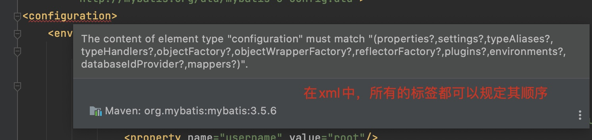

编写一个配置文件db.properties

```properties
driver=com.mysql.cj.jdbc.Driver
url=jdbc:mysql://localhost:3306/mybatis?useSSL=true&useUnicode=true&characterEncoding=UTF-8
username=root
password=123456
```

在核心配置文件中引入

```xml
<!--引入外部配置文件-->
<properties resource="db.properties" />
```

* 可以直接引入外部文件
* 可以在其中增加一些属性配置
* 如果两个文件有同一个字段，优先使用外部配置文件的！

### 4.4 类型别名（typeAliases）

* 类型别名可为 Java 类型设置一个缩写名字；
* 意在降低冗余的全限定类名书写；

```xml
<!--可以给实体类起别名-->
<typeAliases>
    <typeAlias type="com.jin.pojo.User" alias="User"/>
</typeAliases>
```

* 也可以指定一个包名，MyBatis 会在包名下面搜索需要的 Java Bean，比如：扫描实体类的包，它的默认别名就为这个类的类名首字母小写；

```xml
<!--可以给实体类起别名-->
<typeAliases>
    <package name="com.jin.pojo"/>  <!--user调用-->
</typeAliases>
```

* 在实体类较少时，可使用第一种方式；实体类较多时，可使用第二种方式；第一种可以DIY别名，第二种则不行；如果非要改，需要在实体上增加注解：

```java
@Alias("user")
public class User {
    ...
}
```

### 4.5 设置

这是MyBatis中极为重要的调整设置，它们会改变MyBatis的运行时行为。

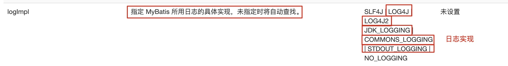

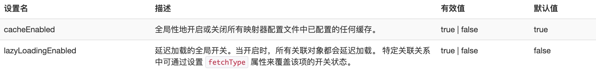

### 4.6 其他配置

- typeHandlers（类型处理器）
- objectFactory（对象工厂）
- plugins（插件）
  - mybatis-generator-core
  - mybatis-plus
  - 通用mapper（很精简的插件mybatis-plus）

### 4.7 映射器（mappers）

<span id="mapperRegistry">MapperRegistry: </span>注册绑定我们的Mapper文件；

方式一：使用相对于类路径的资源引用 (推荐使用)

```xml
<!-- 每一个Mapper.xml都需要在Mybatis核心配置文件中注册！ -->
<mappers>
    <mapper resource="com/jin/dao/UserMapper.xml"/>
</mappers>
```

方式二：使用class文件绑定注册

```xml
<mappers>
    <mapper class="com.jin.dao.UserMapper"/>
</mappers>
```

注意点：

* 接口和他的Mapper配置文件必须同名！
* 接口和他的Mapper配置文件必须在同一个包下！

方式三：使用扫描包进行注入绑定

```xml
<mappers>
    <mapper name="com.jin.dao.UserMapper"/>
</mappers>
```

注意点：

* 接口和他的Mapper配置文件必须同名！
* 接口和他的Mapper配置文件必须在同一个包下！


练习时间：

* 将数据库配置文件外部引入
* 实体类别名
* 保证UserMapper接口和UserMapper.xml改为一致！并且在同一个包下。

### 4.8 生命周期和作用域

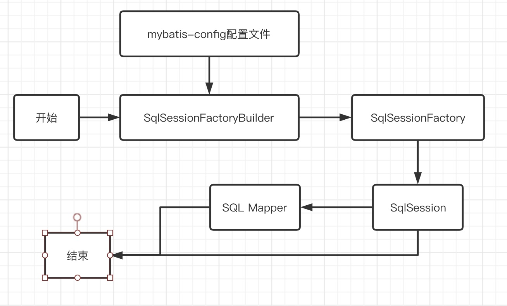

生命周期和作用域是至关重要的，因为错误的使用会导致非常严重的**并发问题**。

**SqlSessionFactoryBuilder：**

* 一旦创建了 SqlSessionFactory，就不再需要它了
* 局部变量

**SqlSessionFactory：**

* 说白了就是可以想象为：数据库连接池
* 一旦被创建就应该在应用的运行期间一直存在，**没有任何理由丢弃它或重新创建另一个实例**
* 因此 SqlSessionFactory 的最佳作用域是应用作用域
* 最简单的就是使用单例模式或者静态单例模式。

**SqlSession**

* 连接到连接池的一个请求！
* SqlSession 的实例不是线程安全的，因此是不能被共享的，所以它的最佳的作用域是请求或方法作用域。
* 用完之后需要赶紧关闭，否则资源会被占用！

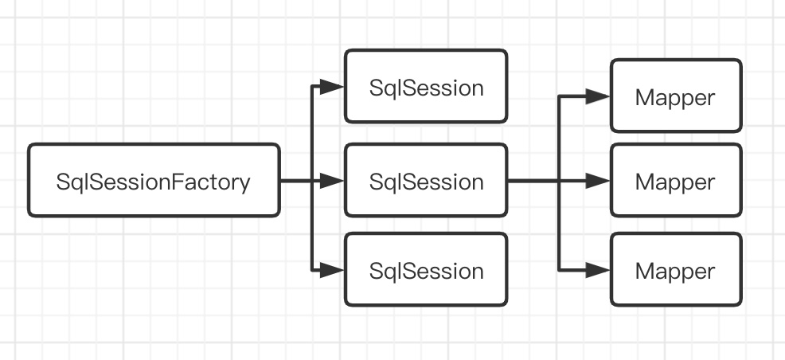

这里面的每一个Mapper，代表一个具体的业务！

## 5. 解决属性名和字段名不一致的问题（resultMap）

### 5.1 问题

数据库中的字段

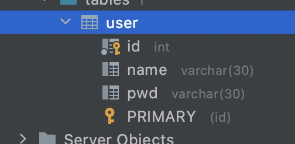

新建一个项目，拷贝之前的，测试实体类字段不一致的情况

```java
public class User {
    private int id;
    private String name;
    private String password; //password与pwd不一致
}
```

测试出现问题

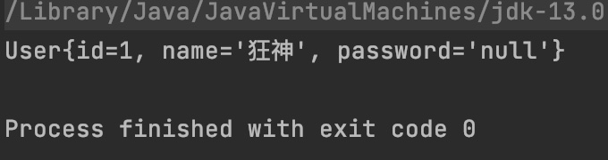

```mysql
 select * from mybatis.user where id = #{id}
 -- 类型处理器 
 select id,name,pwd * from mybatis.user where id = #{id}
```

解决方法：

* 起别名

```xml
<select id="getUserById" resultType="user">
    select id,name,pwd as password * from mybatis.user where id = #{id}
</select>
```

### 5.2 resultMap

结果集映射

```mysql
id name pwd -- 数据库
id name password -- pojo对象属性
```

```xml
<!--结果集映射-->
<resultMap id="UserMap" type="User">
    <!--column数据库中的字段，property实体类中的属性-->
    <result column="id" property="id"/>
    <result column="name" property="name"/>
    <result column="pwd" property="password"/>
</resultMap>

<select id="getUserById" resultMap="UserMap">
    select * from mybatis.user where id = #{id}
</select>
```

* `resultMap` 元素是 MyBatis 中最重要最强大的元素
* ResultMap 的设计思想是，对简单的语句做到零配置，对于复杂一点的语句，只需要描述语句之间的关系就行了。
*  `ResultMap`最优秀的地方在于，虽然你已经对它相当了解了，但是根本不需要显式地用到他们。
* 如果世界总是这么简单就好了


## 6. 日志

### 6.1 日志工厂

如果一个数据库操作，出现了异常，我们需要排错。日志就是最好的助手！

曾经：sout，debug

现在：日志工厂！


* SLF4J
* **LOG4J** 【掌握】
* LOG4J2 
* JDK_LOGGING
* COMMONS_LOGGING 
* **STDOUT_LOGGING** 【掌握】
* NO_LOGGING

在Mybatis中具体使用那一个日志实现，在设置中决定！

**STDOUT_LOGGING标准日志输出** 

在mybatis核心配置文件中，配置我们的日志！

```xml
<settings>
    <setting name="logImpl" value="STDOUT_LOGGING"/>
</settings>
```

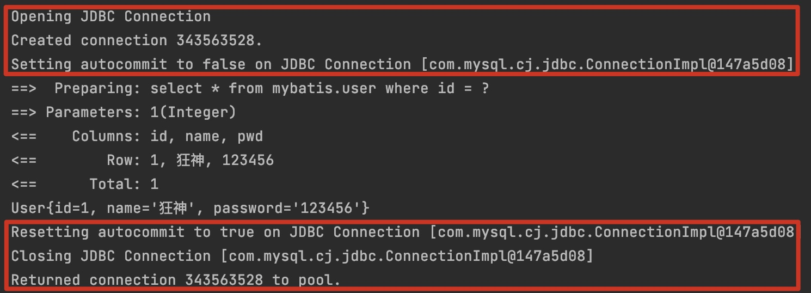

### 6.2 Log4j

什么是log4j？

* Log4j 是Apache的一个开源项目，通过使用Log4j，我们可以控制日志信息输送的目的地是控制台，文件，GUI组件；
* 我们也可以控制每一条日志的输出格式；
* 通过定义每一条日志信息的级别，我们能够更加细致地控制日志的生成过程；
* 通过一个配置文件来灵活地进行配置，而不需要修改应用的代码

1. 先导入log4j的包

```xml
<!-- https://mvnrepository.com/artifact/log4j/log4j -->
<dependency>
    <groupId>log4j</groupId>
    <artifactId>log4j</artifactId>
    <version>1.2.17</version>
</dependency>
```

2. log4j.properties

```properties
#将等级为DEBUG的日志信息输出到console和file这两个目的地，console和file的定义在下面的代码
log4j.rootLogger=DEBUG,console,file

#控制台输出的相关设置
log4j.appender.console=org.apache.log4j.ConsoleAppender
log4j.appender.console.Target=System.out
log4j.appender.console.Threshold=DEBUG
log4j.appender.console.layout=org.apache.log4j.PatternLayout
log4j.appender.console.layout.ConversionPattern=[%c]-%m%n

#文件输出的相关配置
log4j.appender.file=org.apache.log4j.RollingFileAppender
log4j.appender.file.File=./log/jin.log
log4j.appender.file.MaxFileSize=10mb
log4j.appender.file.Threshold=DEBUG
log4j.appender.file.layout=org.apache.log4j.PatternLayout
log4j.appender.file.layout.ConversionPattern=[%p][%d{yy-MM-dd}][%c]%m%n

#日志输出级别
log4j.logger.org.mybatis=DEBUG
log4j.logger.java.sql=DEBUG
log4j.logger.java.sql.Statement=DEBUG
log4j.logger.java.sql.ResultSet=DEBUG
log4j.logger.java.sql.PreparedStatement=DEBUG
```

3. 配置log4j为日志的实现

```xml
<settings>
    <setting name="logImpl" value="LOG4J"/>
</settings>
```

4. Log4j的使用！直接测试运行刚才的查询

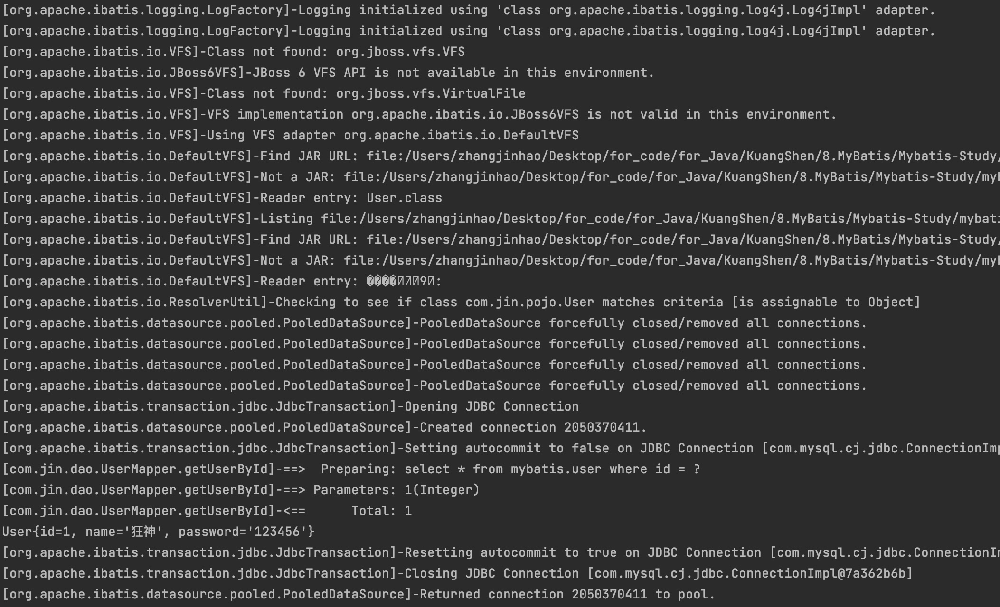

**简单实用**

1. 在要使用Log4j的类中，导入包 import org.apache.log4j.Logger;
2. 日志对象，参数为当前类的class

```java
static Logger logger = Logger.getLogger(UserMapperTest.class);
```

3. 日志级别

```java
logger.info("info:进入了testLog4j");
logger.debug("debug:进入了testLog4j");
logger.error("error:进入了testLog4j");
```

## 7. 分页

**思考：为什么要分页？**

* 减少数据的处理量

  

### 7.1 使用limit分页

```mysql
语法: SELECT * from user limit startIndex,pageSize;
SELECT * from user limit 3; #[0,n]
```

使用Mybatis实现分页，核心SQL

1. 接口

   ```java
   //分页
   List<User> getUserByLimit(Map<String,Integer> map);
   ```

2. Mapper.xml

   ```xml
   <!--分页-->
   <select id="getUserByLimit" parameterType="map" resultMap="UserMap">
       select * from mybatis.user limit #{startIndex},#{pageSize}
   </select>
   ```

3. 测试

   ```java
   @Test
   public void getUserByLimit() {
       try (SqlSession sqlSession = MybatisUtils.getSqlSession()) {
           UserMapper userMapper = sqlSession.getMapper(UserMapper.class);
   
           HashMap<String,Integer> map = new HashMap<>();
           map.put("startIndex",0);
           map.put("pageSize",2);
           List<User> userList = userMapper.getUserByLimit(map);
           for (User user : userList) {
               System.out.println(user);
           }
       } catch (Exception e) {
           e.printStackTrace();
       }
   }
   ```


### 7.2 RowBounds分页（不建议使用）

是一种逻辑分页，区别于之前的物理分页。

不再使用SQL实现分页

1. 接口

```java
//分页2
List<User> getUserByRowBounds();
```

2. Mapper.xml

```xml
<!--分页2-->
<select id="getUserByRowBounds" resultMap="UserMap">
    select * from mybatis.user
</select>
```

3. 测试

```java
@Test
public void getUserByRowBounds() {
    try (SqlSession sqlSession = MybatisUtils.getSqlSession()) {
        //RowBounds实现
        RowBounds rowBounds = new RowBounds(1,2);

        //通过Java代码层面而实现分页
        List<User> userList = sqlSession.selectList("com.jin.dao.UserMapper.getUserByRowBounds",null,rowBounds);

        for (User user : userList) {
            System.out.println(user);
        }
    } catch (Exception e) {
        e.printStackTrace();
    }
}
```

### 7.3 分页插件


了解即可，万一以后公司的架构师，说要使用，你需要知道它是什么东西！


## 8. 使用注解开发

### 8.1 面向接口编程

* 大家之前都学过面向对象编程，也学习过接口，但在真正的开发中，很多时候我们会选择面向接口编程；
* **根本原因：==解耦==，可拓展，提高复用，分层开发中，上层不用管具体的实现，大家都遵守共同的标准，使得开发变得容易，规范性更好；**
* 在一个面向对象的系统中，系统的各种功能是由许许多多的不同对象协作完成的。在这种情况下，各个对象内部是如何实现自己的，对系统设计人员来讲就不那么重要了；
* 而各个对象之间的协作关系则成为系统设计的关键，小到不同类之间的通信，大到各模块之间的交互，在系统设计之初都是要着重考虑的，这也是系统设计的主要工作内容。面向接口编程就是指按照这种思想来编程。

##### **关于接口的理解**

* 接口从更深层次的理解，应是定义（规范，约束）与实现（名实分离的原则）的分离；
* 接口的本身反映了系统设计人员对系统的抽象理解；
* 接口应有两类：
  * 第一类是对一个个体的抽象，他可对应为一个抽象体（abstract class）；
  * 对二类是对一个个体某一方面的抽象，即形成一个抽象面（inteface）；
* 一个个体有可能有多个抽象面，抽象体和抽象面是有区别的

##### 三个面向区别

* 面向对象是指，我们考虑问题时，以对象为单位，考虑它的属性及方法；
* 面向过程是指，我们考虑问题时，以一个具体的流程（事务流程）为单位，考虑它的实现；
* 接口设计与非接口设计时针对复用技术而言的，与面向对象（过程）不是同一个问题，更多的体现就是对系统整体的架构

### 8.2 使用接口开发

1. 注解在接口上的实现

```java
@Select("select * from user")
List<User> getUsers();
```

2. 需要在核心配置文件中绑定接口！

```xml
<!--绑定接口-->
<mappers>
    <mapper class="com.jin.dao.UserMapper"/>
</mappers>
```

3. 测试


本质：反射机制实现

底层：动态代理！

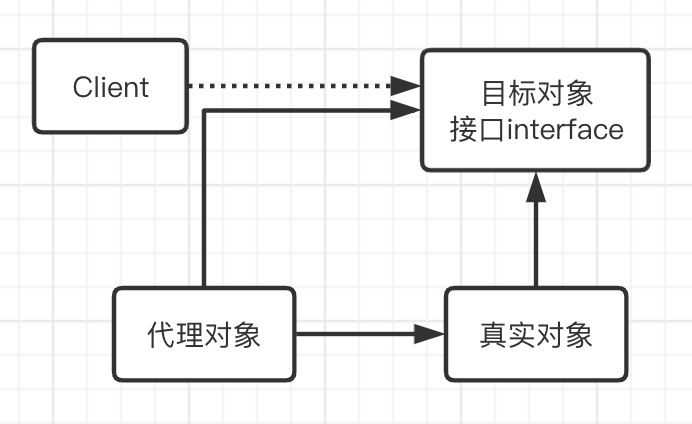

**Mybatis详细的执行流程！**

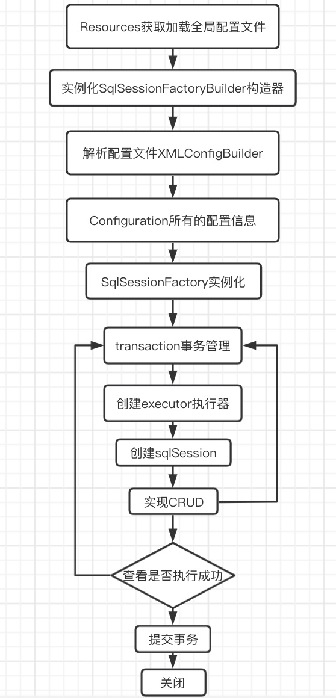

### 8.3 CRUD

我们可以子啊工具类创建的时候实现自动提交事务！

```java
public static SqlSession getSqlSession() {
    return sqlSessionFactory.openSession(true);
}
```

编写接口，增加注解

```java
@Select("select * from user")
List<User> getUsers();

//方法存在多个参数，所有的参数前面必须加上@Param("")注解
@Select("select * from user where id = #{id}")
User getUserById(@Param("id") int id);

@Insert("insert into user(id,name,pwd) values (#{id},#{name},#{password})")
int addUser(User user);

@Update("update user set name=#{name},pwd=#{password} where id=#{id}")
int updateUser(User user);

@Delete("delete from user where id = #{uid}")
int deleteUser(@Param("uid") int id);
```

测试类

【注意：我们必须要将接口注册绑定到我们的核心配置文件中！】

##### 关于@Param()注解

* 基本类型的参数或者String类型，需要加上；
* 引用类型不需要加；
* 如果只有一个基本类型的话，可以忽略，但是建议大家都加上；
* 我们在SQL中引用的就是我们这里的@Param("uid")中设定的属性名！

**#{} ${}的区别** PreparedStatement & Statement


## 9. Lombok

```tex
Project Lombok is a java library that automatically plugs into your editor and build tools, spicing up your java.
Never write another getter or equals method again, with one annotation your class has a fully featured builder, Automate your logging variables, and much more.
```

使用步骤：

1. 在IDEA中安装Lombok插件！
2. 在项目中导入Lombok的jar包

```xml
<!-- https://mvnrepository.com/artifact/org.projectlombok/lombok -->
        <dependency>
            <groupId>org.projectlombok</groupId>
            <artifactId>lombok</artifactId>
            <version>1.18.10</version>
        </dependency>
```

3. 在实体类上加注解即可！

```java
@Data: get, set, toString, hashcode, equals
@AllArgsConstructor
@NoArgsConstructor
```

```java
@Getter and @Setter
@FieldNameConstants
@ToString
@EqualsAndHashCode
@AllArgsConstructor, @RequiredArgsConstructor and @NoArgsConstructor
@Log, @Log4j, @Log4j2, @Slf4j, @XSlf4j, @CommonsLog, @JBossLog, @Flogger, @CustomLog
@Data
@Builder
@SuperBuilder
@Singular
@Delegate
@Value
@Accessors
@Wither
@With
@SneakyThrows
```

说明：

```java
@Data: get, set, toString, hashcode, equals
@AllArgsConstructor
@NoArgsConstructor
@EqualsAndHashCode
@ToString
@Getter and @Setter
```

