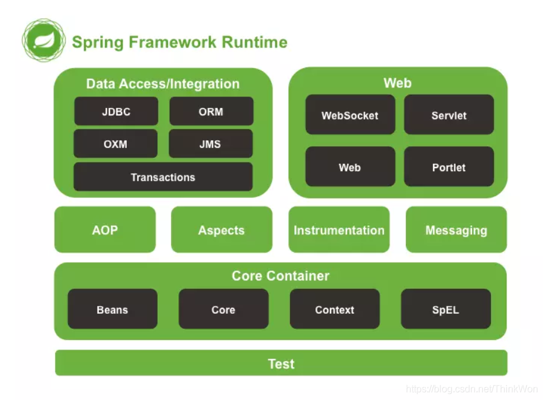
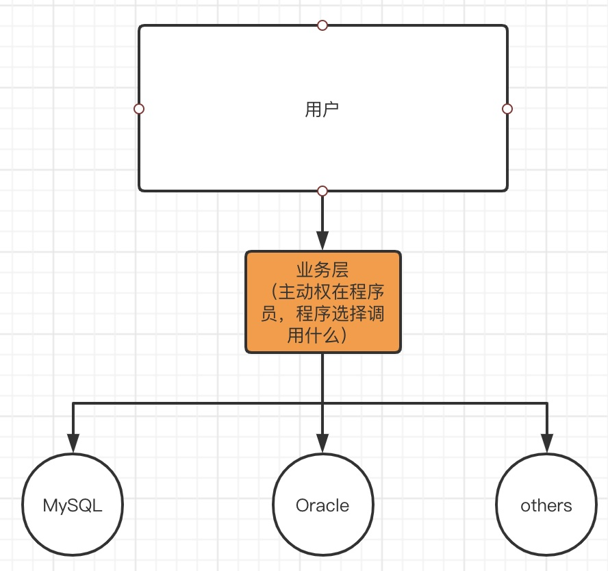
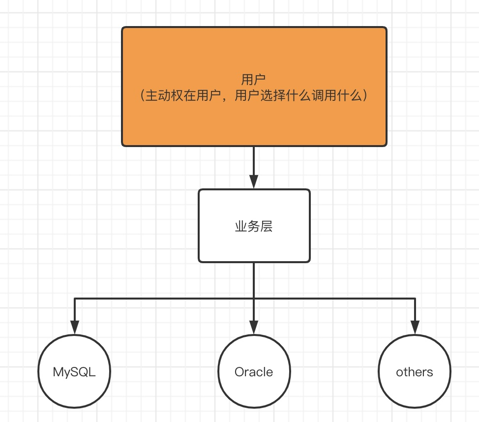
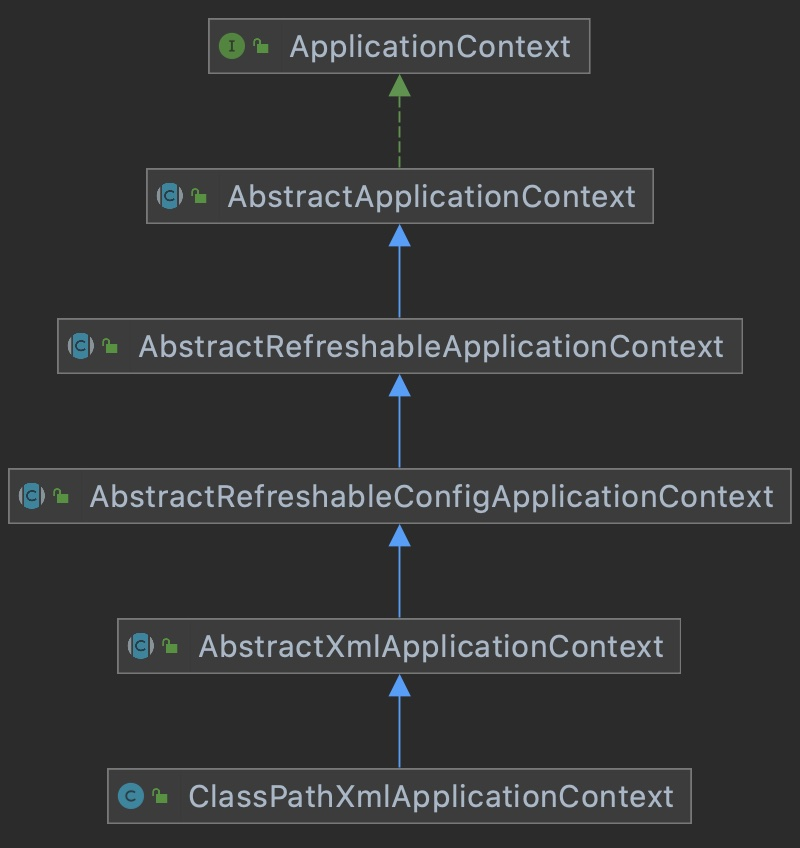
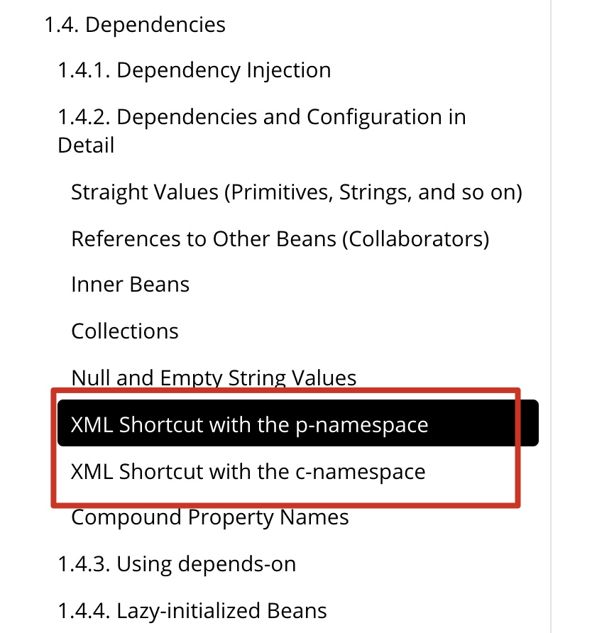
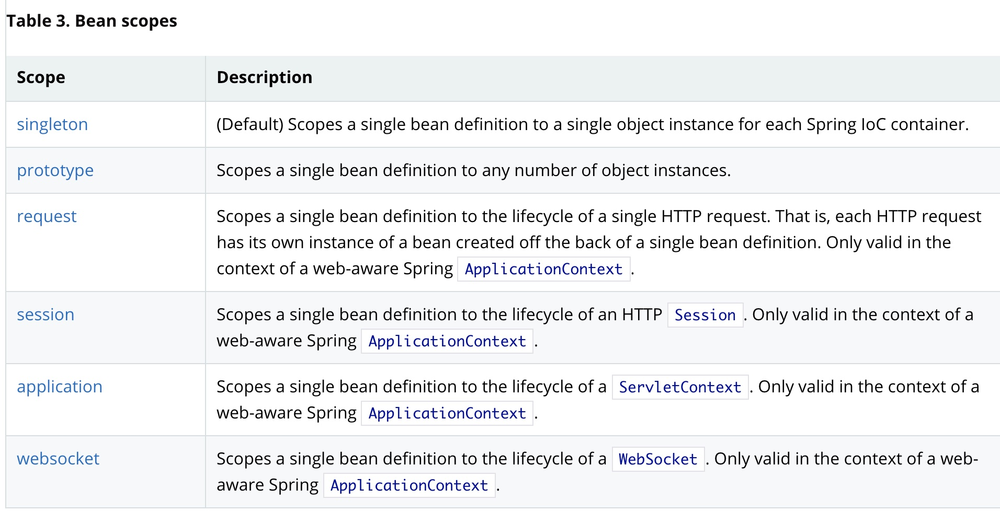
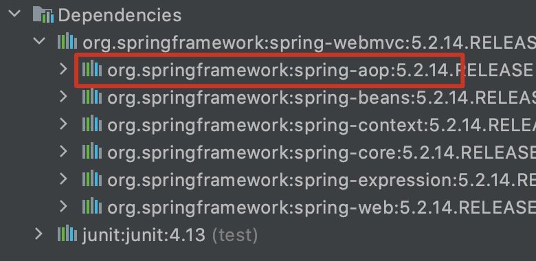
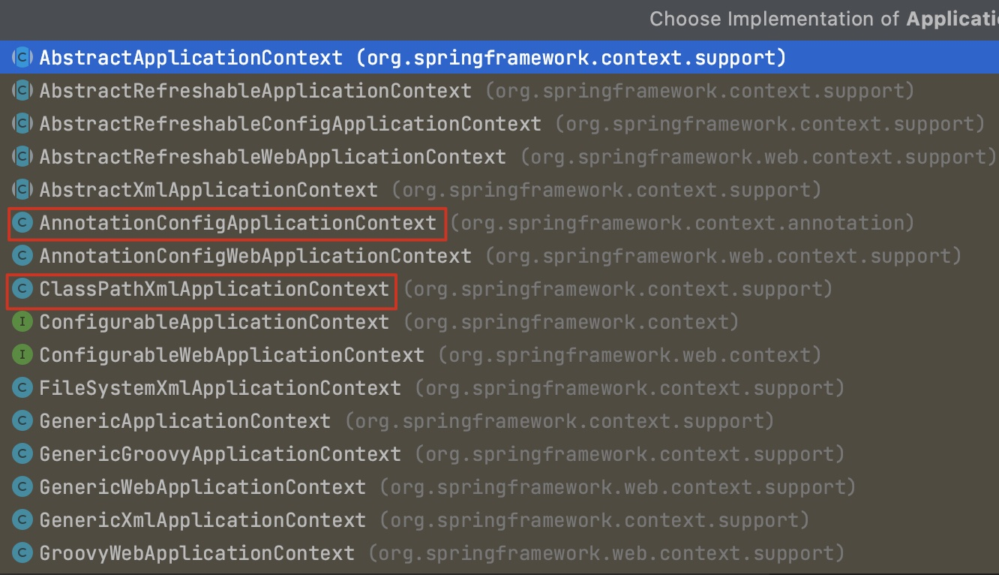
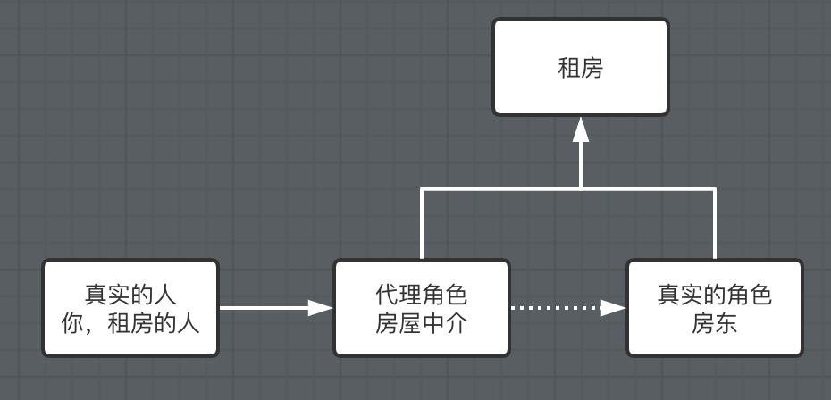
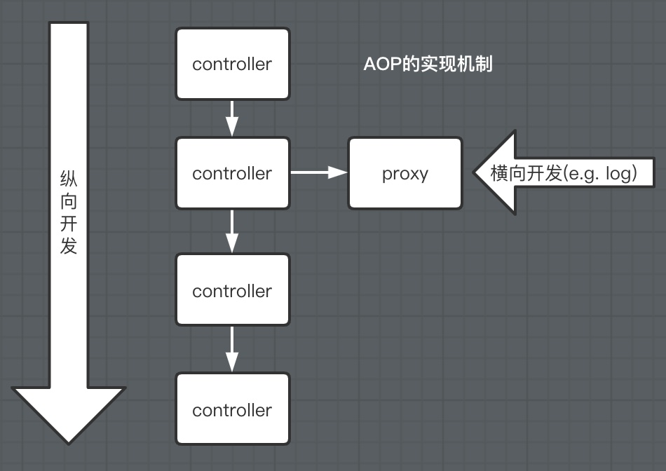

# Spring

## 1. Spring

### 1.1 简介

* Spring：春天---> 给软件行业带来春天！
* 2002，首次推出了Spring框架的雏形：interface21框架
* Spring框架即以interface21框架为基础，经过重新设计，并不断丰富其内涵，于2004年3月24日，发布了1.0正式版
* Rod Johnson，创始人
* Spring理念：使现有的技术更加容易使用，本身是一个大杂烩，整合了现有的技术框架!


* SSH:  Struct2 + Spring + Hibernate
* **SSM: SpringMVC + Spring + Mybatis!**

官网：[Spring Framework](https://spring.io/projects/spring-framework)

官方下载地址：[Index of release/org/springframework/spring](https://repo.spring.io/release/org/springframework/spring/)

官方说明：[Core Technologies (spring.io)](https://docs.spring.io/spring-framework/docs/5.2.9.RELEASE/spring-framework-reference/core.html#spring-core)

GitHub：[spring-projects/spring-framework: Spring Framework (github.com)](https://github.com/spring-projects/spring-framework)


Maven:

```xml
<!-- https://mvnrepository.com/artifact/org.springframework/spring-webmvc -->
<dependency>
    <groupId>org.springframework</groupId>
    <artifactId>spring-webmvc</artifactId>
    <version>5.2.14.RELEASE</version>
</dependency>
<!-- https://mvnrepository.com/artifact/org.springframework/spring-jdbc -->
<dependency>
    <groupId>org.springframework</groupId>
    <artifactId>spring-jdbc</artifactId>
    <version>5.3.5</version>
</dependency>
```

### 1.2 优点

* Spring是一个开源的免费的框架（容器）！
* Spring是一个轻量级的，非侵入式的框架！
* 控制反转（IOC，Inversion of Control），面向切面编程（AOP，Aspect-Oriented Programming）
* 支持事务的处理，对框架整合的支持！

==总结一句话：Spring就是一个轻量级的控制反转（IOC）和面向切面编程（AOP）的框架！==

### 1.3 组成




### 1.4 拓展

Spring Boot: Build anything

Spring Cloud: Coodinate anything

Spring Cloud Data Flow: Connect everything

现代化的Java开发，就是基于Spring开发

* Spring Boot:
  * 一个快速开发的脚手架
  * 基于Spring Boot可以快速开发单个微服务
  * 约定大于配置
* Spring Cloud
  * 基于Spring Cloud是基于Spring Boot实现的

因为现在大多数公司都在使用SpringBoot进行快速开发，学习SpringBoot的前提，需要完全掌握Spring及SpringMVC！承上启下的作用！

**弊端：发展了太久以后，违背了原来的概念！配置十分繁琐，人称“配置地狱”！**


## 2.  IOC理论推导

### 2.1 推导

1. UserDao 接口

   ```java
   public interface UserDao {
       void getUser();
   }
   ```

2. UserDaoImpl 实现类

   ```java
   public class UserDaoImpl implements UserDao{
       @Override
       public void getUser() {
           System.out.println("默认获取用户的数据");
       }
   }
   public class UserDaoMysqlImpl implements UserDao{
       @Override
       public void getUser() {
           System.out.println("Mysql获取用户数据");
       }
   }
   //多个实现类
   ```

3. UserService 业务接口

   ```java
   public interface UserService {
       void getUser();
   	
       //业务接口注入
       void setUserDao(UserDao userDao);
   }
   ```

4. UserServiceImpl 业务实现类

   ```java
   public class UserServiceImpl implements UserService{
   
       private UserDao userDao;
   
       //利用set进行动态实现值的注入
       public void setUserDao(UserDao userDao) {
           this.userDao = userDao;
       }
       
       @Override
       public void getUser() {
           userDao.getUser();
       }
   }
   ```

在我们之前的业务中，用户的需求可能会影响我们原来的代码，我们需要根据用户的需求去修改源代码！如果程序代码量十分大，修改一次的成本代价十分昂贵！



我们使用了一个set接口实现

```java
//利用set进行动态实现值的注入
public void setUserDao(UserDao userDao) {
    this.userDao = userDao;
}
```

* 之前，程序是主动创建对象！控制权在程序员手上！
* 使用了set注入后，程序不再具备主动性，而是变成了被动的接受对象！

这种思想，从本质上解决了问题，我们程序员不用去管理对象的创建了。系统的耦合性大大降低，可以更加专注在业务的实现上！这是IOC的原型。



### 2.2 本质

**控制反转IoC (Inversion of Control)，是一种设计思想，DI (依赖注入) 是实现IoC的一种方法**，也有人认为DI只是IoC的另一种说法。没有IoC的程序中，我们使用面向对象编程，对象的创建与对象间的依赖关系完全硬编码在程序中，对象的创建由程序自己控制，控制反转后将对象的创建转移给第三方，个人认为所谓控制反转就是：获得依赖对象的方式反转了。


采用XML方式配置Bean的时候，Bean的定义信息是和实现分离的，而采用注解的方式可以把两者合为一体，Bean的定义信息直接以注解的形式定义在实现类中，从而达到了零配置的目的。

**控制反转是一种通过描述 (XML或注解) 并通过第三方去生产或获取特定对象的方式。在Spring中实现控制反转的是IoC容器，其实现方法是依赖注入 (Dependency Injection, DI)。**


**打比方：**

* 原来这套程序是：你写好菜单买好菜，客人来了自己把菜炒好招待
* 现在这套程序是：你告诉楼下餐厅，你要哪些菜，客人来的时候，餐厅把做好的需要的菜送上来
* 此时的区别是：如果我还需要做其他的菜，我不需要自己搞菜谱买材料再做好，而是告诉餐厅，我要什么菜，什么时候要，你做好送来

## 3. HelloSpring

**Hello.java**

```java
public class Hello {
    private String str;

    public String getStr() {
        return str;
    }

    public void setStr(String str) {
        this.str = str;
    }

    @Override
    public String toString() {
        return "Hello{" +
                "str='" + str + '\'' +
                '}';
    }
}

```

**Beans.xml**

```xml
<?xml version="1.0" encoding="UTF-8"?>
<beans xmlns="http://www.springframework.org/schema/beans"
    xmlns:xsi="http://www.w3.org/2001/XMLSchema-instance"
    xsi:schemaLocation="http://www.springframework.org/schema/beans
        https://www.springframework.org/schema/beans/spring-beans.xsd">

    <!--使用Spring来创建对象，在Spring中这些都称为Bean
        类型 变量名 = new 类型();
        Hello hello = new Hello();

        id = 变量名
        class = new 的对象
        property 相当于给对象中的属性设置一个值！
    -->
    <bean id="hello" class="com.jin.pojo.Hello">
        <property name="str" value="Spring"/>
    </bean>

</beans>
```

```java
//Test
public class MyTest {
    public static void main(String[] args) {
        //获取Spring的上下文对象
        ApplicationContext context = new ClassPathXmlApplicationContext("beans.xml");
        //我们的对象现在都在Spring中管理了，我们要使用，直接去里面取出来就可以！
       	//Hello hello = (Hello) context.getBean("hello");
        //在第二参数中设置类属性，则不用强转
        Hello hello = context.getBean("user", Hello.class);
        System.out.println(hello);
    }
}
```

#### 思考问题：

* hello对象是谁创建的？

  hello对象是有Spring创建的

* hello对象的属性是怎么设置的？

  hello对象的属性是由Spring容器设置的，这个过程就叫控制反转。

控制：谁来控制对象的创建，传统应用程序的对象是由程序本身控制创建的，使用Spring后，对象是由Spring来创建的。

反转：程序本身不创建对象，而变成被动的就收对象。

依赖注入：就是利用set方法来进行注入的。

IOC是一种编程思想，由主动的编程变成被动的接收。

可以通过newClassPathXmlApplicationContext去浏览一下底层源码。



按照对JavaBean的理解，我们可以修改之前的UserService项目，先创建beans.xml

```xml
<?xml version="1.0" encoding="UTF-8"?>
<beans xmlns="http://www.springframework.org/schema/beans"
       xmlns:xsi="http://www.w3.org/2001/XMLSchema-instance"
       xsi:schemaLocation="http://www.springframework.org/schema/beans
       http://www.springframework.org/schema/beans/spring-beans.xsd">

    <bean id="mysqlImpl" class="com.jin.dao.UserDaoMysqlImpl"/>
    <bean id="oracleImpl" class="com.jin.dao.UserDaoOracleImpl"/>

    <bean id="userServiceImpl" class="com.jin.service.UserServiceImpl">
        <!--
        ref : 引用Spring容器中创建好的对象
        value : 具体的值，基本数据类型
        -->
        <property name="userDao" ref="mysqlImpl"/>
    </bean>
</beans>
```

```java
//test代码修改如下
public static void main(String[] args) {
    //        //用户实际调用的是业务层，dao层他们不需要接触！
    //        UserService userService = new UserServiceImpl();
    //        userService.setUserDao(new UserDaoOracleImpl());
    //        userService.getUser();

    //获取ApplicationContext；拿到Spring容器
    ApplicationContext context = new ClassPathXmlApplicationContext("beans.xml");

    //容器在手，天下我有，需要什么，就直接get什么！
    UserService userService = (UserService) context.getBean("userServiceImpl");
    userService.getUser();
}
```

OK，到了现在，我们彻底不用在程序中去改动了，要实现不同的操作，只需要在xml配置文件中进行修改，所谓的IoC，一句话搞定：对象由Spring来创建，管理，装配。

## 4. <span id="constructorInjection">IOC创建对象的方式</span>

1. 使用无参构造创建对象，默认！

2. 假设我们要使用有参构造创建对象

   1. 下标赋值

      ```xml
      <!--第一种下标赋值-->
      <bean id="user" class="com.jin.pojo.User">
          <constructor-arg index="0" value="狂神说Java"/>
      </bean>
      ```

   2. 类型

      ```xml
      <!--第二种方式：通过类型创建，不建议使用-->
      <bean id="user" class="com.jin.pojo.User">
          <constructor-arg type="java.lang.String" value="秦疆"/>
      </bean>
      ```

   3. 参数名

      ```xml
      <!--第三种：直接通过参数名来设置-->
      <bean id="user" class="com.jin.pojo.User">
          <constructor-arg name="name" value="秦疆"/>
      </bean>
      ```

总结：在配置文件加载的时候，容器中管理的对象就已经初始化了！


## 5. Spring 配置

### 5.1 别名

```xml
<!--别名，如果添加了别名，我们也可以使用别名获取到这个对象-->
<alias name="user" alias="userNew"/>
```

别名主要用在繁杂的全限定名（这里的情况）或者同个类多个场景的时候用（下面的情况）。
java无法多继承因而有了接口；同个类无法多个id所以有了别名。

### 5.2 Bean的配置

```xml
<!--
    id : bean 的唯一标识符，也就是相当于我们学的对象名
    class : bean 对象所对应的全限定名：包名 + 类型
    name : 也是别名，而且name可以取多个别名
    -->
<bean id="userT" class="com.jin.pojo.UserT" name="user2 u2,u3">
    <property name="name" value="悟空"/>
</bean>
```

还有scope：其中有singleton，不过beans默认单例

### 5.3 import

这个import，一般用于团队开发使用，他可以将多个配置文件，导入合并为一个

假设，现在项目中有多个人开发，这三个人复制不同的类的开发，不同的类需要注册在不同的bean中，我们可以利用import将所有人的beans.xml合并为一个总的！

* 张三
* 李四
* 王五
* applicationContext.xml

```xml
<import resource="bean.xml"/>
<import resource="bean2.xml"/>
<import resource="bean3.xml"/>
```

使用的时候，直接使用总的配置就可以了


## 6. 依赖注入

```javascript
为何官方推荐构造器？ 构造器注入和属性注入的循环依赖的报错提示也有点不同，前者编译时就报错，后者使用时报错
```

### 6.1 构造器注入

```xml
<constructor-arg index="0" value="狂神说Java"/>
<constructor-arg type="java.lang.String" value="秦疆"/>
<constructor-arg name="name" value="秦疆"/>
```

[前面](#constructorInjection)已经说过了，有参构造三种方式：

1. 下标赋值
2. 类型
3. 参数名

### 6.2 set方式注入【重点】

* 依赖注入： set注入！
  * 依赖：bean对象的创建依赖于容器
  * 注入：bean对象中的所有属性，由容器来注入！

【环境搭建】

1. 复杂类型

   ```java
   public class Address {
       private String address;
   
       public String getAddress() {
           return address;
       }
   
       public void setAddress(String address) {
           this.address = address;
       }
   }
   ```

2. 真实测试对象

   ```java
   public class Student {
       private String name;
       private Address address;
       private String[] books;
       private List<String> hobbies;
       private Map<String,String> card;
       private Set<String> games;
       private String wife;
       private Properties info;
   }
   ```

3. Beans.xml

   ```xml
   <?xml version="1.0" encoding="UTF-8"?>
   <beans xmlns="http://www.springframework.org/schema/beans"
          xmlns:xsi="http://www.w3.org/2001/XMLSchema-instance"
          xsi:schemaLocation="http://www.springframework.org/schema/beans http://www.springframework.org/schema/beans/spring-beans.xsd">
   
       <bean id="address" class="com.jin.pojo.Address">
           <property name="address" value="西安"/>
       </bean>
   
       <bean id="student" class="com.jin.pojo.Student">
           <!--普通值注入，value-->
           <property name="name" value="秦疆"/>
           <!--bean注入，ref-->
           <property name="address" ref="address"/>
           <!--数组-->
           <property name="books">
               <array>
                   <value>红楼梦</value>
                   <value>水浒传</value>
                   <value>西游记</value>
                   <value>三国演义</value>
               </array>
           </property>
           <!--list-->
           <property name="hobbies">
               <list>
                   <value>听歌</value>
                   <value>敲代码</value>
                   <value>看电影</value>
               </list>
           </property>
           <!--map-->
           <property name="card">
               <map>
                   <entry key="身份证" value="111111222222223333"/>
                   <entry key="银行卡" value="12321312313"/>
               </map>
           </property>
           <!--set-->
           <property name="games">
               <set>
                   <value>LOL</value>
                   <value>COC</value>
                   <value>BOB</value>
               </set>
           </property>
           <!--null-->
           <property name="wife">
               <null/>
           </property>
           <!--properties-->
           <property name="info">
               <props>
                   <prop key="driver">ere</prop>
                   <prop key="url">e</prop>
                   <prop key="username">root</prop>
                   <prop key="password">123456</prop>
               </props>
           </property>
       </bean>
   
   </beans>
   ```

4. 测试类

   ```java
   public class MyTest {
       public static void main(String[] args) {
           ApplicationContext context = new ClassPathXmlApplicationContext("beans.xml");
           Student student = (Student) context.getBean("student");
           System.out.println(student);
           /**
            * Student{
            * name='秦疆',
            * address=Address{address='西安'},
            * books=[红楼梦, 水浒传, 西游记, 三国演义],
            * hobbies=[听歌, 敲代码, 看电影],
            * card={身份证=111111222222223333, 银行卡=12321312313},
            * games=[LOL, COC, BOB],
            * wife='null',
            * info={password=123456, driver=ere, url=e, username=root}}
            */
       }
   }
   ```

### 6.3 拓展方式注入

我们可以使用p命名空间和c命名空间进行注入。

官方解释：



使用：

```xml
<?xml version="1.0" encoding="UTF-8"?>
<beans xmlns="http://www.springframework.org/schema/beans"
       xmlns:xsi="http://www.w3.org/2001/XMLSchema-instance"
       xmlns:p="http://www.springframework.org/schema/p"	p命名空间注入
       xmlns:c="http://www.springframework.org/schema/c"	c命名空间注入	
       xsi:schemaLocation="http://www.springframework.org/schema/beans
       http://www.springframework.org/schema/beans/spring-beans.xsd">

    <!--p命名空间注入，可以直接注入属性的值：properties-->
    <bean id="user" class="com.jin.pojo.User" p:name="秦疆" p:age="18"/>

    <!--c命名空间注入，通过构造器注入：constructor-->
    <bean id="user2" class="com.jin.pojo.User" c:name="18" c:age="狂神"/>
</beans>
```

测试：

```java
@Test
public void test2(){
    ApplicationContext context = new ClassPathXmlApplicationContext("userbeans.xml");
    //在第二参数中设置类属性，则不用强转
    User user = context.getBean("user", User.class);
    System.out.println(user);
}
```

注意点：p命名空间和c命名空间不能直接使用，要导入xml约束！

```xml
xmlns:p="http://www.springframework.org/schema/p"	
xmlns:c="http://www.springframework.org/schema/c"
```

### 6.4 bean的作用域



1. 单例模式：（Spring默认机制）

```xml
<bean id="user2" class="com.jin.pojo.User" c:name="18" c:age="狂神" scope="singleton"/>
```

2. 原型模式：每次从容器中get的时候，都会产生一个新对象

```xml
<bean id="user2" class="com.jin.pojo.User" c:name="18" c:age="狂神" scope="prototype"/>
```

3. 其余的request, session, application, websocket，只能在web开发中才会使用到。


## 7. Bean的自动装配

* 自动装配是Spring满足bean依赖的一种方式！
* Spring会在上下文中自动寻找，并自动给bean装配属性！

在Spring中有三种自动装配的方式

1. 在xml中显示的配置
2. 在java中显示的配置
3. 隐式的自动装配bean

### 7.1 测试

环境搭建：一个人有两个宠物

```java
public class Person {
    private Cat cat;
    private Dog dog;
    private String name;
}
public class Cat {
    public void shout() {
        System.out.println("miao~");
    }
}
public class Dog {
    public void shout() {
        System.out.println("wang~");
    }
}
```

```xml
<bean id="cat" class="com.jin.pojo.Cat"/>
<bean id="dog" class="com.jin.pojo.Dog"/>
<bean id="person" class="com.jin.pojo.Person">
    <property name="name" value="小狂神呀"/>
    <property name="dog" ref="dog"/>
    <property name="cat" ref="cat"/>
</bean>
```

### 7.2 ByName自动装配

```xml
<!--
    byName: 会自动在容器上下文中查找，和自己对象set方法后面值对应的beanid!
    -->
<bean id="person" class="com.jin.pojo.Person" autowire="byName">
    <property name="name" value="小狂神呀"/>
</bean>
```

### 7.3 ByType自动装配

```xml
<bean class="com.jin.pojo.Cat"/>
<bean  class="com.jin.pojo.Dog"/>
<!--
byType: 会自动在容器上下文中查找，和自己对象属性类型相同的bean! 可以省略beanid，然而类型必须全局唯一。
 -->
<bean id="person" class="com.jin.pojo.Person" autowire="byType">
    <property name="name" value="小狂神呀"/>
</bean>
```

小结：

* byname的时候，需要保证所有bean的id唯一，并且这个bean需要和自动注入的属性的set方法的值一致！
* bytype的时候，需要保证所有bean的class唯一，并且这个bean需要和自动注入的属性的类型一致！

### 7.4 使用注解实现自动装配

Jdk1.5支持的注解，Spring2.5就支持注解了！

**官网对注解和xml的评价：**

The introduction of annotation-based configuration raised the question of whether this approach is “better” than XML. The short answer is “**it depends**.” The long answer is that each approach has its pros and cons, and, usually, it is up to the developer to decide which strategy suits them better. Due to the way they are defined, **annotations** provide a lot of context in their declaration, **leading to shorter and more concise configuration**. However, **XML excels at wiring up components without touching their source code or recompiling them.** Some developers prefer having the wiring close to the source while others argue that annotated classes are no longer POJOs and, furthermore, that the **configuration becomes decentralized and harder to control**.

**要使用注解须知：**

1. 导入约束 (context约束)
2. ==配置注解的支持 ``<context:annotation-config/>``==

```xml
<?xml version="1.0" encoding="UTF-8"?>
<beans xmlns="http://www.springframework.org/schema/beans"
    xmlns:xsi="http://www.w3.org/2001/XMLSchema-instance"
    xmlns:context="http://www.springframework.org/schema/context"
    xsi:schemaLocation="http://www.springframework.org/schema/beans
        https://www.springframework.org/schema/beans/spring-beans.xsd
        http://www.springframework.org/schema/context
        https://www.springframework.org/schema/context/spring-context.xsd">

    <context:annotation-config/>

</beans>
```

**@Autowired**

直接在属性上使用即可！也可以在set方法上使用！

使用Autowired我们可以不用编写set方法了，前提是你这个自动装配的属性在IOC (Spring) 容器中存在，且符合byType！(会先根据byType进行注入，如果容器中有多个满足类型的实例，就会根据byName进行注入)

科普：

```java
@Nullable 字段标记了这个注解，说明这个注解可以为null
```

```java
public @interface Autowired {
    boolean required() default true;
}

@Autowired(require=false)
//当require=false代表如果找不到可装配的bean，可以不抛出异常
```

```java
@Qualifier("dog")
//可以用这个注解辅助@Autowired进行匹配，byName
@Resource //似乎后期被淘汰了
```

小结：

* @Autowired：自动装配，顺序：类型-->名字
  * 如果不能唯一自动装配上属性，则需要通过@Qualifier(value="xxx")
* @Resource：自动装配，顺序：顺序-->类型


## 8. 使用注解开发

在Spring4之后，要使用注解开发，必须要保证aop包导入了



使用注解需要导入context约束，增加注解的支持

```xml
<?xml version="1.0" encoding="UTF-8"?>
<beans xmlns="http://www.springframework.org/schema/beans"
    xmlns:xsi="http://www.w3.org/2001/XMLSchema-instance"
    xmlns:context="http://www.springframework.org/schema/context"
    xsi:schemaLocation="http://www.springframework.org/schema/beans
        https://www.springframework.org/schema/beans/spring-beans.xsd
        http://www.springframework.org/schema/context
        https://www.springframework.org/schema/context/spring-context.xsd">

    <context:annotation-config/>

</beans>
```
1. bean
```java
//@Component : 组件，放在pojo类上，说明这个类被Spring管理了，就是bean!
//等价于 <bean id="user" class="com.jin.pojo.User"/>
@Component
public class User {
    public String name = "秦疆";
}
```

2. 属性如何注入

```java
@Component
public class User {

    public String name;

    //相当于 <property name="name" value="kuangshen"/>
    @Value("kuangshen")
    public void setName(String name) {
        this.name = name;
    }
}
```

3. 衍生的注解

   @Component 有几个衍生注解，我们在web开发中，会按照mvc三层架构分层！

   * dao 【@Repository】

   * service 【@Service】

   * controller 【@Controller】

     这四个注解功能都是一样的，都是代表将某个类注册到Spring中，装配Bean

4. 自动装配

```java
@Autowired：自动装配，顺序：类型-->名字
  如果不能唯一自动装配上属性，则需要通过@Qualifier(value="xxx")
@Nullable 字段标注了这个注解，若bean不存在也不会报异常
@Resource：自动装配，顺序：顺序-->类型
```

5. 作用域

```java
@Component
@Scope("prototype")
public class User {
    public String name;
	...
}
```

6. 小结

* xml与注解：
  * xml 更加万能，适用于任何场合！维护简单方便
  * 注解 不是自己的类使用不了，维护相对复杂！

* xml与注解的最佳实践：
  * Xml 用来管理 bean
  * 注解只负责完成属性的注入
  * 我们在使用的过程中，只需要注意一个问题：必须让注解生效，就需要开启注解的支持

  ```java
      <!--指定要扫描的包，这个包下的注解就会生效，第一行包含第二行信息，因此只需第一行即可-->
      <context:component-scan base-package="com.jin"/>
  <!--    <context:annotation-config/>-->
  ```


## 9. 使用Java的方式配置Spring

我们现在要完全不使用Spring的xml配置了，全权交给Java来做！

JavaConfig 是 Spring 的一个子项目，在Spring4之后，它成为了一个核心功能！



Configuration官方解释：　

* 用@Configuration注释类表明其主要目的是作为bean定义的源
* @Configuration类允许通过调用同一类中的其他@Bean方法来定义bean之间的依赖关系

配置@Configuration和不配置的区别？[spring中@Configuration注解的作用 - wl_王麟 - 博客园 (cnblogs.com)](https://www.cnblogs.com/wl20200316/p/12579982.html)

* 使用@Configuration注解后，在调用方法 fox()创建 fox实例的时候，需要参数 cat，调用方法cat()生成cat实例，此时会去spring的单例bean工厂获取cat的单例bean的实例；
* 不使用@Configuration注解，实例化fox的时候，每次都会创建一个新的 cat对象，供实例化fox使用；

实体类

```java
//这里这个注解的意思，就是说明这个类被Spring接管了，注册到了容器中
@Component
public class User {
    private String name;

    public String getName() {
        return name;
    }

    @Value("qinjiang")
    public void setName(String name) {
        this.name = name;
    }

    @Override
    public String toString() {
        return "User{" +
            "name='" + name + '\'' +
            '}';
    }
}
```
配置文件
```java
@Configuration
@ComponentScan("com.jin.pojo")
@Import(MyConfig2.class)
public class MyConfig {
    //注册一个bean，就相当于我们之前写的一个bean标签
    //这个方法的名字，就相当于bean标签中的id属性
    //这个方法的返回值，就相当于bean标签中的id属性
    @Bean
    public User user() {
        return new User();  //就是返回要注入到bean的对象！
    }
}
```
测试类
```java
public class MyTest {
    public static void main(String[] args) {
        //如果完全使用了配置类方式去做，我们就只能通过AnnotationConfig 上下文来获取容器，通过配置类的class对象加载
        ApplicationContext context = new AnnotationConfigApplicationContext(MyConfig.class);
        User user = context.getBean("user", User.class);
        System.out.println(user.getName());
        User user2 = context.getBean("user", User.class);
        System.out.println(user==user2);
    }
}
```

这种纯Java的配置方式，在SpringBoot中随处可见！

##### ==问题：弹幕里说：==

```tex
就是说，@Bean是相当于<bean>标签创建的对象，二我们之前学的@Component是通过spring自动创建的这个被注解的对象；
所以这里相当于有两个User对象被创建了，一个是bean标签创建的(@Bean)，一个是通过扫描然后使用的@Component，spring自动创建的User对象
所以这里去掉@Bean这些东西，然后开启扫描。之后在User头上用@Component即可达到spring自动创建的User对象
```


## 10.代理模式

为什么要学习代理模式？因为这就是SpringAOP的底层！【SpringAOP 和 SpringMVC】

代理模式的分类：

* 静态代理
* 动态代理



### 10.1 静态代理

角色分析：

* 抽象角色：一般会使用接口或者抽象类来解决
* 真实角色：被代理的角色
* 代理角色：代理真实角色，代理真实角色后，我们一般会进行一些附属操作
* 客户：访问代理对象的人！

代理步骤：

1. 接口

   ```java
   //租房
   public interface Rent {
       public void rent();
   }
   ```

2. 真实角色

   ```java
   public class Host implements Rent{
       @Override
       public void rent() {
           System.out.println("房东要出租房子！");
       }
   }
   ```

3. 代理角色

   ```java
   public class Proxy implements Rent{
       private Host host;
   
       public Proxy() {
       }
   
       public Proxy(Host host) {
           this.host = host;
       }
   
       //看房
       public void seeHouse() {
           System.out.println("中介带你看房");
       }
   
       //收中介费
       public void fare() {
           System.out.println("收中介费");
       }
   
       //签合同
       public void hetong() {
           System.out.println("签合同");
       }
   
       @Override
       public void rent() {
           seeHouse();
           host.rent();
           hetong();
           fare();
       }
   }
   ```

4. 客户端访问代理角色

   ```java
   public class Client {
       public static void main(String[] args) {
           //房东要租房子了
           Host host = new Host();
           //代理，中介帮房东出租房子，但是呢？代理一般会有一些附加操作！
           Proxy proxy = new Proxy(host);
           //你不用面对房东，直接找中介租房即可！
           proxy.rent();
       }
   }
   ```

代理模式的好处：

* 可以使真实角色的操作更加纯粹！不用去关注一些公共的业务
* 公共业务就交给代理角色，实现类业务的分工
* 公共业务发生扩展时，方便集中管理！

缺点：

* 一个真实角色就会产生一个代理角色；代码量会翻倍！开发效率变低！

### 10.2 加深理解

聊聊AOP



```java
//真实对象
public class UserServiceImpl implements UserService{
    @Override
    public void add() {
        System.out.println("增加了一个用户");
    }

    @Override
    public void delete() {
        System.out.println("删除了一个用户");
    }

    @Override
    public void update() {
        System.out.println("修改了一个用户");
    }

    @Override
    public void query() {
        System.out.println("查询了一个用户");
    }
    //改动原有的业务代码，在公司中是大忌！
}
```

```java
public class UserServiceProxy implements UserService{
    private UserService userService;

    public void setUserService(UserService userService) {
        this.userService = userService;
    }

    @Override
    public void add() {
        log("add");
        userService.add();
    }

    @Override
    public void delete() {
        log("delete");
        userService.delete();
    }

    @Override
    public void update() {
        log("update");
        userService.update();
    }

    @Override
    public void query() {
        log("query");
        userService.query();
    }

    //日志方法
    public void log(String msg) {
        System.out.println("使用了"+msg+"方法");
    }
}
```

```java
public class Client {
    public static void main(String[] args) {
        UserService userService = new UserServiceImpl();
        UserServiceProxy proxy = new UserServiceProxy();
        proxy.setUserService(userService);
        proxy.add();
    }
}
```

### 10.3 动态代理

* 动态代理和静态代理角色一样
* 动态代理的代理类是动态生成的，不是我们直接写好的！
* 动态代理分为两大类：基于接口的动态代理，基于类的动态代理
  * 基于接口：JDK动态代理【我们在这里使用】
  * 基于类：cglib
  * java字节码实现：JAVAssist

需要了解两个类：

* Proxy：代理
* InvocationHandler：调用处理程序

**InvocationHandler接口**

