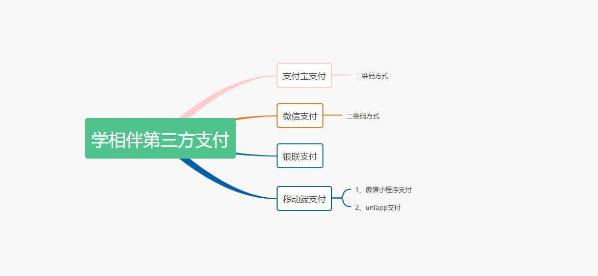
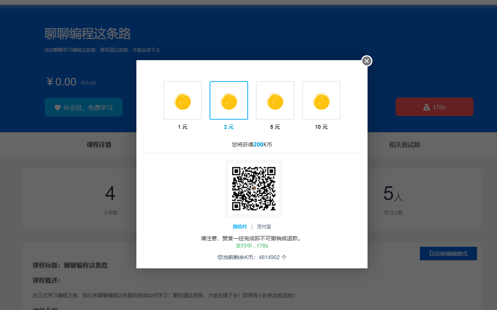
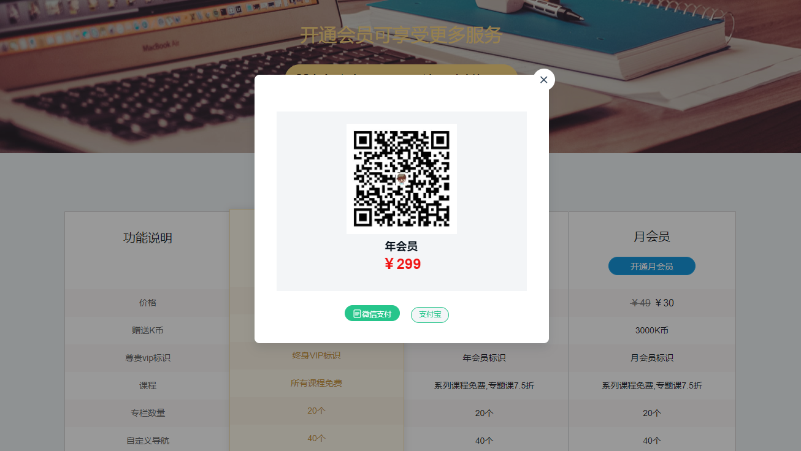
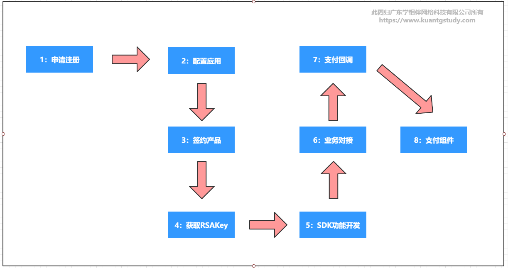

# 支付宝支付对接课程

## 1. 课程概要

### 1.1 课程目标

- 快速简洁，能够在1小时之内完成支付的对接
- 抓住核心步骤，去掉繁复的概念和操作步骤
- 与实战结合，通过项目实战完成企业级的支付。达到如下的支付场景：

### 1.2 学相伴赞赏支付演示

演示地址：https://www.kuangstudy.com/course/detail/1317500148100386817

### 1.3 学相伴会员升级演示

演示地址：https://www.kuangstudy.com/vip/pay

## 2. 支付宝整体开发的流程

### 2.1 整体开放流程

此次课程的整体开发流程步骤如下：

### 2.2 核心所需的参数

- APPID

- 商家私钥

- 支付宝公钥

- 支付回调地址

- 网关地址

- 加密签名算法RSA2

  

## 3. 支付的概述&支付入驻

### 3.1 支付宝开放平台

官网：https://open.alipay.com/platform/home.htm
文档：https://openhome.alipay.com/docCenter/docCenter.htm?from=openhomemenu

### 3.2 支付应用场景

使用第三方支付宝支付，解决了商家，消费者之间的交易瓶颈，提升商家的服务效率和营收，也可以让消费者在消费产品的时候更加快捷和便捷。使用的场景如下：

- 互联网产品在线支付
- 金融
- 电商
- 卡券
- 红包
- 线下门店扫码
- 分销分账
- 提现
- 等等…..

### 3.3 支付宝入驻

为提升入驻开放平台时的效率和体验，开发者在入驻前，需要注册支付宝账号并完成实名认证。
注册支付宝账号：https://memberprod.alipay.com/account/reg/index.htm
企业支付宝账号实名认证指南：https://opendocs.alipay.com/open/200/qyzfbsmrz

